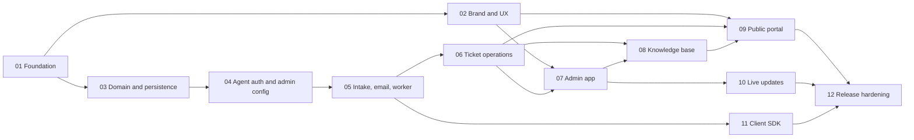

# TechStrap: Discovery Index

**Project:** TechStrap, "Support for Technical Support". A lightweight, open-source (MIT), self-hosted helpdesk for one company with many products.
**Status:** Discovery complete. Awaiting owner review of the artifact set.
**Discovery date:** 2026-10-02
**Process:** `_template` docs/ARCHITECTURE_DISCOVERY.md
**Historical input:** [superpowers core design spec](../superpowers/specs/2026-10-02-techstrap-core-design.md) (superseded by this set, see [D-015](04-DECISION-LOG.md))

## Artifacts

| Artifact | Purpose |
| --- | --- |
| [01-REQUIREMENTS.md](01-REQUIREMENTS.md) | Problem, goals, personas, scope, functional and non-functional requirements |
| [02-ARCHITECTURE.md](02-ARCHITECTURE.md) | Topology, data model, flows, application and presentation boundary tables |
| [03-PACKAGE-MAP.md](03-PACKAGE-MAP.md) | SyntaxCircus and third-party packages with exact versions |
| [04-DECISION-LOG.md](04-DECISION-LOG.md) | Material decisions D-001 to D-041 |
| [UX-BRIEF-admin.md](UX-BRIEF-admin.md) | Designer handoff: agent/admin app |
| [UX-BRIEF-portal.md](UX-BRIEF-portal.md) | Designer handoff: public portal and customer emails |
| [99-IMPLEMENTATION-ROADMAP.md](99-IMPLEMENTATION-ROADMAP.md) | Phase order, task index, validation commands |

## Phase order

| # | Phase | Depends on | Unblocks | Status |
| --- | --- | --- | --- | --- |
| 01 | [Foundation](PHASE-01-foundation.md) | — | all | Complete (CI/release verification pending) |
| 02 | [Brand & UX](PHASE-02-brand-and-ux.md) | 01 | 07, 09 | Complete |
| 03 | [Domain & persistence](PHASE-03-domain-and-persistence.md) | 01 | 04 | Complete |
| 04 | [Agent auth & admin config](PHASE-04-agent-auth-and-admin-config.md) | 03 | 05 | Complete |
| 05 | [Intake, email & worker](PHASE-05-intake-email-worker.md) | 04 | 06, 11 | Complete (PR #5 merged) |
| 06 | [Ticket operations](PHASE-06-ticket-operations.md) | 05 | 07, 08, 09 | Complete |
| 07 | [Admin app](PHASE-07-admin-app.md) | 02, 06 | 08 (editor UI), 10 | Complete: 07a merged (PR #9), 07b merged (PR #10), 07c merged (PR #11); owner action 7 (Authentik) still open, so P07-T02 stays unticked |
| 08 | [Knowledge base](PHASE-08-knowledge-base.md) | 06 (07 for the editor UI) | 09 | PHASE-08 merged (PR #13): the API (Tasks 1-8) and the Admin (editor, categories, article picker); the owner's manual checks are open |
| 09 | [Public portal](PHASE-09-public-portal.md) | 02, 06, 08 | 12 | 09a merged (PR #14); 09b merged (PR #15); 09c merged (PR #16); 09d merged (PR #17); PHASE-09 complete: the owner evidence for P09-T16 (axe, Lighthouse, the JavaScript-off walk, screenshots) and the compose run of P09-T18 are open, P09-T20 is deferred |
| 10 | [Live updates](PHASE-10-live-updates.md) | 07 | 12 | 10a merged (PR #18); 10b merged (PR #19); PHASE-10 complete: the owner's manual checks with a real identity provider (two browsers, a worker auto-close, the kill switch) are open |
| 11 | [Client SDK](PHASE-11-client-sdk.md) | 05 | 12 | 11a merged (PR #20); 11b merged (PR #21); 11c merged (PR #22); v0.1.0 published 2026-10-08 (PHASE-11 complete); T05 (attachments) deferred to 11d, which first needs multipart intake |
| 11e | [Product hosts](PHASE-11e-product-hosts.md) | 09, 05, 04, 07 | 12 | 11e merged (PR #25): T01 to T07 |
| 11f | [Landing page and product logos](PHASE-11f-landing-and-logos.md) | 09, 11e, 08, 04, 07 | 12c | D-052 recorded; 11f in progress (one PR, Contracts 0.3.0) |
| 12 | [Release hardening](PHASE-12-release-hardening.md) | all | v1.0.0 (v0.3.0 per D-051; 1.0.0 is a later API-lock decision) | 12a merged (PR #28); 12b merged (PR #29); v0.2.1 (PR #30, PR #31); 12c waits for 11f |

Phases that can run in parallel: 02 alongside 03–06; 11 alongside 07–10.

Edges: 01 to 02 and 03; 03 to 04 to 05 to 06; 05 to 11; 02 and 06 to 07; 06 and 07 to 08 (the 08 API work needs only 06, the editor UI needs 07); 02, 06 and 08 to 09; 07 to 10; everything to 12 (the diagram shows the terminal edges only). Details and parallelism: [99-IMPLEMENTATION-ROADMAP.md](99-IMPLEMENTATION-ROADMAP.md).

## Later sub-projects (outside the core, each with its own discovery cycle)

Inbound email (IMAP, threading) · Extras (custom fields, saved replies, folders, reports) · Workflows (rules engine over `TicketEvent`) · Passkeys for agents.

## Open decisions

See the "Open questions" sections in [01-REQUIREMENTS.md](01-REQUIREMENTS.md) and the decisions in [04-DECISION-LOG.md](04-DECISION-LOG.md). All decisions D-001 to D-041 are approved.

## Approval

- [ ] Owner has reviewed the artifact set.
- [ ] Owner has selected a phase for implementation (expected: PHASE-01).

## Completion checklist

- [x] Goals and measurable success criteria are explicit.
- [x] Personas, applications, workers, and explicit non-scope are identified.
- [x] Security, data, scale, availability, and deployment constraints are resolved or marked unknown.
- [x] Auth, authorization, persistence, migrations, retention, and operations are addressed.
- [x] Relevant cross-cutting concerns were reviewed against the package catalog.
- [x] Every selected package has an exact version and versioned source/release verification link; every material exclusion is explained.
- [x] The foundation phase creates `Directory.Packages.props` and locks selected package versions centrally.
- [x] Material decisions are recorded and approved in the decision log. *(All approved 2026-10-02.)*
- [x] Every application use-case entry point maps to one named use-case handler.
- [x] Every exempt operational or static endpoint executes no application workflow.
- [x] Handler dependencies were reviewed for HTTP, EF, concrete infrastructure, SDK, and transport leaks.
- [x] Result/exception semantics and transport mapping are explicit for each use case.
- [x] Every boundary deviation has an approved decision-log entry. *(There are no deviations.)*
- [x] Every Razor feature/page records its inline-or-paired component decision.
- [x] Every Razor feature/page records its ViewModel or direct-model decision; factory use is justified.
- [x] Razor loading, error, empty, and mutable state ownership is explicit; API contracts are DTOs.
- [x] Repeated or business-meaningful literals are named constants at the right scope.
- [x] Duplicated-looking logic across flows was evaluated for genuine divergence.
- [x] Phase dependencies are acyclic and each phase has testable criteria.
- [x] Every user-facing application has a UX brief.
- [x] .NET MAUI app: **Not applicable.** TechStrap ships no MAUI app; `TechStrap.Client.Maui` is a library used inside other apps, which own their own release runbooks.
- [x] MAUI runtime environment switching: **Not applicable** (same reason).
- [x] Client IP and public API rate limiting pattern considered for the reverse proxy and anonymous intake (see [02-ARCHITECTURE.md](02-ARCHITECTURE.md), deployment section).
- [x] No implementation artifacts were created before architecture approval.
