# 05 - Database Schema

Status: PHASE-03 (2026-10-02). The tables, their relationships and the rules the database enforces. Source of truth for the shape is the EF model snapshot (`src/TechStrap.Infrastructure/Migrations/TechStrapDbContextModelSnapshot.cs`); this page explains it. The columns are listed in [02-ARCHITECTURE.md](02-ARCHITECTURE.md) section 5. Decisions: D-009 (numbers), D-010 (outbox), D-011 and D-027 (search), D-026 (persistence records).

## Entity-relationship diagram

Every table in the migrations appears below (checked by `scripts/tests/SchemaDocs.Tests.ps1`). Only keys and the columns that matter for a relationship are drawn.

```mermaid
erDiagram
    products ||--o{ product_api_keys : "has"
    products ||--o| product_ticket_sequences : "numbers tickets"
    products ||--o{ tickets : "receives"
    products ||--o{ kb_categories : "scopes (nullable)"
    products ||--o{ kb_articles : "scopes (nullable)"
    products ||--o{ agent_notification_preferences : "alerts"
    agents ||--o{ agent_notification_preferences : "opts in"
    agents ||--o{ tickets : "assigned"
    agents ||--o{ kb_articles : "authors"
    requesters ||--o{ tickets : "opens"
    requesters ||--o{ ticket_access_tokens : "holds"
    tickets ||--o{ tickets : "parent_ticket_id (follow-up)"
    tickets ||--o{ messages : "cascade"
    tickets ||--o{ ticket_events : "cascade, append-only"
    tickets ||--o{ ticket_access_tokens : "cascade"
    tickets ||--o{ ticket_tags : "cascade"
    tickets ||--o{ ticket_articles : "cascade"
    tickets ||--o{ intake_idempotency_keys : "cascade"
    tickets ||--o{ attachments : "cascade"
    messages ||--o{ attachments : "cascade"
    messages ||--o{ ticket_articles : "cascade"
    tags ||--o{ ticket_tags : "restrict"
    kb_categories ||--o{ kb_articles : "restrict"
    kb_articles ||--o{ ticket_articles : "restrict"
    product_api_keys ||--o{ intake_idempotency_keys : "cascade"

    products {
        uuid id PK
        text key UK
        text number_prefix UK
        xid xmin "concurrency token"
    }
    product_ticket_sequences {
        uuid product_id PK
        bigint next_number "advanced per ticket"
    }
    product_api_keys {
        uuid id PK
        uuid product_id FK
        text kind "Trusted or Public"
        text key_hash UK
    }
    agents {
        uuid id PK
        text oidc_subject UK
        text public_display_name "nullable, max 60"
    }
    agent_notification_preferences {
        uuid agent_id PK
        uuid product_id PK
        bool notify_new_ticket
    }
    requesters {
        xid xmin "concurrency token"
        uuid id PK
        citext email UK
    }
    tickets {
        uuid id PK
        text number UK "e.g. ACME-142, immutable"
        uuid product_id FK
        uuid requester_id FK
        uuid assignee_id FK
        uuid parent_ticket_id FK
        text status
        bool is_spam
        tsvector search_vector "generated, GIN"
        xid xmin "concurrency token"
    }
    messages {
        uuid id PK
        uuid ticket_id FK
        text visibility "Public or Internal"
        tsvector search_vector "generated, GIN"
    }
    attachments {
        uuid id PK
        uuid ticket_id FK
        uuid message_id FK
    }
    ticket_events {
        uuid id PK
        uuid ticket_id FK
        text type
        jsonb payload "ids only"
    }
    tags {
        uuid id PK
        text slug UK
    }
    ticket_tags {
        uuid ticket_id PK
        uuid tag_id PK
    }
    ticket_access_tokens {
        uuid id PK
        uuid ticket_id FK
        text token_hash UK
    }
    kb_categories {
        uuid id PK
        uuid product_id FK "nullable"
        text slug "unique with product, nulls equal"
        text description "nullable"
        xid xmin "concurrency token"
    }
    kb_articles {
        uuid id PK
        uuid product_id FK "nullable"
        text slug "unique with product, nulls equal"
        tsvector search_vector "generated, GIN"
        xid xmin "concurrency token"
    }
    ticket_articles {
        uuid message_id PK
        uuid article_id PK
        uuid ticket_id FK
    }
    admin_events {
        uuid id PK
        text type
        jsonb payload "no PII, no secrets"
    }
    email_outbox {
        uuid id PK
        text status
        timestamptz next_attempt_at
    }
    intake_idempotency_keys {
        uuid id PK
        uuid api_key_id FK
        text key_hash "unique with api_key_id"
    }
```

## Rules the database enforces

- **snake_case everywhere.** Tables, columns, keys, foreign keys and indexes (checked by `SchemaConventionTests`, including join tables).
- **Ticket numbers** (`tickets.number`, D-009) are unique across all products. The per-product counter is `product_ticket_sequences.next_number`, created on the product's first ticket and advanced by one `INSERT ... ON CONFLICT DO UPDATE ... RETURNING` inside the creating transaction, so a rollback gives the number back and concurrent creators queue on the row lock.
- **Optimistic concurrency** uses the Postgres `xmin` system column on `products`, `requesters`, `tickets` and `kb_articles`. The ticket number counter is a separate row (`product_ticket_sequences`), so taking a number never changes the product row's `xmin` and a product edit in flight is not disturbed by ticket creation.
- **`ticket_events` is append-only.** The application has no update or delete path, an EF interceptor refuses to save a modified or singly deleted event, and the only removal is the database cascade when a ticket is hard-deleted (Admin only, D-006). Event payloads hold ids, enum names and the ticket number, never text a requester wrote, so erasing a requester (D-006) never touches an event.
- **Erasure.** Anonymising a requester updates `requesters` and `messages`, deletes attachments and revokes tokens; no foreign key or event blocks it.
- **Full-text search** (D-011, D-027): `tickets.search_vector` (subject, weight A), `messages.search_vector` (body, weight B) and `kb_articles.search_vector` (title A, summary B, body C) are `GENERATED ALWAYS ... STORED` columns with GIN indexes. There are no triggers and the application never writes them.
- **Enums are text.** Status, priority, kinds and visibility are stored by name.
- **Case-insensitive email.** `requesters.email` is `citext` with a unique index.
- **Partial indexes.** Solved tickets by `solved_at` (auto-close), spam tickets by `last_activity_at` (Spam view), and three on `email_outbox`: due Pending rows by `next_attempt_at` (worker poll), Sending rows by `locked_until` (expired-lease reclaim) and DeadLettered rows by `created_at` (admin list). `AddOutboxClaimIndexes` added the last two and dropped the plain `ix_email_outbox_status` index they replace.

## Where the tables are created

| Migration | Tables |
| --- | --- |
| `AddCoreSchema` | `products`, `product_ticket_sequences`, `product_api_keys`, `agents`, `agent_notification_preferences`, `requesters`, `tags` (and the `citext` extension) |
| `AddTicketSchema` | `tickets`, `messages`, `attachments`, `ticket_events`, `ticket_tags`, `ticket_access_tokens` |
| `AddKnowledgeAdminAndOutboxSchema` | `kb_categories`, `kb_articles`, `ticket_articles`, `admin_events`, `email_outbox`, `intake_idempotency_keys` |
| `AddSearchVectors` | the three generated `search_vector` columns and their GIN indexes |
| `AddRequesterConcurrencyToken` | no DDL (Npgsql treats `xmin` as a system column); records the `requesters` concurrency token in the model |
| `AddOutboxClaimIndexes` | two partial indexes on `email_outbox` (Sending by `locked_until`, DeadLettered by `created_at`); drops `ix_email_outbox_status` |
| `AddKbCategoryVersionAndDescription` | `kb_categories.description` (nullable, 300 characters) and the `kb_categories` `xmin` concurrency token (the token is model-only in a fresh database, as for `requesters`) |

All migrations are generated by `dotnet ef migrations add`; none is edited by hand.
