# PHASE-03 Domain and Persistence Implementation Plan

> **For agentic workers:** REQUIRED SUB-SKILL: Use superpowers:subagent-driven-development (recommended) or superpowers:executing-plans to implement this plan task-by-task. Steps use checkbox (`- [ ]`) syntax for tracking.

**Goal:** Build the complete TechStrap domain model and its Postgres persistence, proven by tests: entities and invariants in `TechStrap.Domain`, repository, unit-of-work, numbering and outbox abstractions in `TechStrap.Application`, and EF Core persistence records, tool-generated migrations, per-product ticket numbering, same-transaction `TicketEvent` writing, optimistic concurrency and full-text search in `TechStrap.Infrastructure`. No HTTP surface is added.

**Architecture:** Domain is BCL-only (pure entities, value objects, status rules, `DomainResult`). Infrastructure owns internal `*Record` classes mapped by fluent configuration (snake_case, string enums, `xmin` token) and repositories that map records to Domain objects, so no record, `IQueryable` or `DbSet` ever crosses a boundary (D-026). One `IUnitOfWork` scope opens one transaction; repositories and the outbox only stage; commit writes ticket, messages, events, tokens and outbox rows together and turns concurrency, unique and foreign-key failures into Conflict results. Ticket numbers come from a per-product counter row locked inside the creating transaction. Search vectors are stored generated columns with GIN indexes (D-027).

**Tech Stack:** .NET 10, EF Core 10.0.12 with Npgsql.EntityFrameworkCore.PostgreSQL 10.0.3, Postgres 17 (Testcontainers.PostgreSql 4.15.0), xUnit v3 4.0.0 with Shouldly 4.3.0, NSubstitute 6.2.0 and Microsoft.Extensions.TimeProvider.Testing 10.10.0, `SyntaxCircus.Common` 0.1.3, `SyntaxCircus.EntityFrameworkCore.Postgres` 0.1.3, `dotnet-ef` 10.0.12 (local tool), Pester 6.2.0 for the script tests.

**Spec:** `docs/architecture/PHASE-03-domain-and-persistence.md` (tasks P03-T01 to P03-T17, success criteria, risks). Read with `docs/architecture/02-ARCHITECTURE.md` (sections 2, 3.1, 5), `01-REQUIREMENTS.md`, `04-DECISION-LOG.md` (D-008, D-009, D-010, D-011, D-016, D-022, D-024, D-025 and the new D-026 to D-028 this plan adds), and `99-IMPLEMENTATION-ROADMAP.md` section 9 (items carried forward from PHASE-01). Template rules: `_template/docs/APPLICATION_ARCHITECTURE.md` and `_template/AGENT_GUIDE.md`.

## Global Constraints

- Work on branch `feat/phase-03-domain-and-persistence` (identical to `main` d81d07c at the start). One commit per task, Conventional Commits (`feat:`, `test:`, `docs:`, `fix:` with an optional scope).
- Every commit message ends with exactly these two lines (a blank line before them):
  `Co-Authored-By: Claude Opus 5.5 <noreply@anthropic.com>`
  `Claude-Session: https://claude.ai/code/session_01ReiWu2p7mSuArnHAMeBiMi`
- Build settings: `TreatWarningsAsErrors=true`, `EnforceCodeStyleInBuild=true`, nullable on. Private fields are `_camelCase`, constants are PascalCase, file-scoped namespaces. All package versions are central in `Directory.Packages.props`; never put a `Version` in a project file.
- Migrations come only from `dotnet ef migrations add`. Never write or edit a migration or the model snapshot by hand (`EF migrations are generated by the dotnet ef tool` in `.editorconfig`). If a migration is wrong, remove it with `dotnet ef migrations remove`, fix the model and generate it again.
- `TechStrap.Domain` references no project, package or framework. `TechStrap.Application` references only Domain, Contracts and `SyntaxCircus.Common`. EF, Npgsql and HTTP types never appear in Domain or Application (enforced by `TechStrap.Architecture.Tests`).
- Persistence records (`*Record`, namespace `TechStrap.Infrastructure.Persistence.Records`) are `internal sealed` and never leave Infrastructure. Repositories never return or accept `IQueryable`, `DbSet`, `DbContext` or a record (D-026).
- Timestamps are UTC `timestamptz` taken from the injected `TimeProvider`, never `DateTime.UtcNow`. Primary keys are v7 GUIDs from `EntityId.New(clock)`.
- Every table, column, key, foreign key and index name is snake_case, join tables included. Enums are stored as text. Concurrency tokens are the Postgres `xmin` column.
- Every asynchronous method on an Application abstraction takes a `CancellationToken` as its last parameter.
- Ticket status transitions (verbatim): `New -> Open | Pending | Solved`, `Open <-> Pending`, `Open | Pending -> Solved`, `Solved -> Open`, `Solved -> Closed`, nothing leaves `Closed`. `is_spam` is a flag, not a status. The ticket number (`ACME-142`) is immutable (D-009).
- Suite baseline on `main` d81d07c: 386 .NET tests (Admin 225, Portal 61, Api 59, Architecture 30, Infrastructure 9, Domain 1, Application 1) and 103 Pester tests. All must stay green; the placeholders in `TechStrap.Domain.Tests` and `TechStrap.Application.Tests` are replaced by real tests.
- Test commands use the repository's runner: `dotnet test --project tests/<Project>` for one project, `dotnet test --solution TechStrap.CI.slnf` for the CI set. Docker must be running for the integration tests.
- Run every shell command from the repository root. Commands are Bash (Git Bash on Windows).

## Review Focus

The five failure modes that most threaten a person using this software, most likely first. Each is pinned by a named test in the task that owns the code.

1. **Concurrent ticket creation must never produce a duplicate number or a gap, including after a rollback.** Two customers submitting at once, or a failed submission, must leave numbers 1..N exactly once each. Pinned in Task 11 by `TicketNumberAllocatorTests.Fifty_concurrent_creators_for_one_product_get_one_to_fifty_with_no_gaps_or_duplicates`, `A_rolled_back_transaction_gives_its_number_back_so_the_next_creator_gets_the_same_one` and `A_rollback_in_the_middle_leaves_no_gap`.
2. **Two agents editing the same ticket must get a clear conflict, never a lost update and never a raw exception at the application edge.** The stale writer receives a Conflict `Result` with code `concurrency-conflict`, and its events are not written. Pinned in Task 9 by `UnitOfWorkTests.Two_stale_updates_give_one_success_and_one_conflict_result_never_an_exception` and in Task 13 by `TicketRepositoryTests.Two_stale_ticket_updates_give_one_success_and_one_conflict_and_the_loser_writes_no_events`.
3. **A `TicketEvent` can never be changed or removed.** The audit trail is the source of truth for who did what. There is no repository method, and EF refuses to save a modified or singly deleted event; only a whole-ticket hard delete removes events. Pinned in Task 8 by `TicketSchemaTests.Modifying_a_ticket_event_through_ef_is_refused`, `Deleting_a_single_ticket_event_through_ef_is_refused` and `Deleting_the_whole_ticket_through_ef_may_remove_its_events`, and in Task 4 by `TicketCreationTests.A_ticket_event_exposes_no_way_to_change_it`.
4. **Erasing a requester must be possible without rewriting history.** Event payloads hold ids, enum names and the ticket number only, never the subject, a message body or an email address, so anonymising the requester and their messages leaves every event untouched. Pinned in Task 4 by `TicketCreationTests.Event_payloads_hold_ids_and_enum_names_only_never_subject_or_message_text`, in Task 8 by `TicketSchemaTests.Erasing_a_requester_anonymises_rows_without_touching_a_single_event` and in Task 13 by `TicketRepositoryTests.Persisted_event_payloads_never_contain_the_subject_or_the_message_text`.
5. **Search must put the best match first: a subject match above a message-body match, and a KB title above its summary above its body.** An agent typing "billing" expects the ticket about billing, not a ticket that mentioned it in passing. Pinned in Task 13 by `TicketSearchTests.A_subject_match_outranks_a_body_match_even_when_the_body_match_is_newer` and in Task 14 by `KbSearchTests.A_title_match_ranks_above_a_summary_match_above_a_body_match`.

Two further guards are listed here because they are enforced by tests rather than by a Review Focus line: every table and column is snake_case (`SchemaConventionTests`, Task 7, which checks the model and the migrated database including join tables) and every migration is tool-generated (`scripts/tests/SchemaDocs.Tests.ps1`, Task 16, which requires each migration to have the generated designer file and the migration attribute, and the search migration to use generated columns rather than triggers).

---

## File Structure

New or changed files, by responsibility. Paths are relative to the repository root.

```text
src/TechStrap.Domain/                      pure model, BCL only
  DomainResult.cs                          DomainError, DomainErrors, DomainResult, DomainResult<T>  (D-028)
  EntityId.cs                              v7 GUIDs from the clock
  Rules/DomainLimits.cs                    named field limits
  Rules/Guard.cs                           validation helpers (internal)
  Products/Product.cs                      Product, ProductBranding
  Products/ProductApiKey.cs                ProductApiKey, ApiKeyKind
  Agents/Agent.cs                          Agent, AgentRole (incl. public display name, D-024)
  Agents/AgentPublicIdentity.cs            "Sam from Orbitly Support" resolver
  Agents/AgentNotificationPreference.cs
  Requesters/Requester.cs
  Tickets/TicketStatus.cs                  TicketStatus, TicketStatusRules
  Tickets/TicketNumber.cs                  immutable ACME-142 value
  Tickets/Ticket.cs                        the aggregate, TicketPriority, TicketChannel
  Tickets/TicketEvent.cs                   append-only event, Actor, ActorType, TicketEventType
  Tickets/Message.cs                       Message, AuthorType, MessageVisibility
  Tickets/Attachment.cs
  Tickets/TicketAccessToken.cs
  Tickets/Tag.cs
  Knowledge/KbCategory.cs, KbArticle.cs    KbArticleStatus, TicketArticle
  Admin/AdminEvent.cs                      audit entry, AdminEventType, AdminSubjectType
  Outbox/EmailOutboxItem.cs                OutboxStatus, OutboxRetryPolicy

src/TechStrap.Application/
  Results/DomainResultExtensions.cs        DomainResult -> SyntaxCircus.Common Result
  Persistence/                             IUnitOfWork (+ scope, error codes), ITicketNumberAllocator, Paging,
                                           ITicketRepository, IRequesterRepository, IProductRepository, IAgentRepository,
                                           ITagRepository, IKbRepository, IAdminEventRepository, IEmailOutbox, IEmailOutboxStore
  Tickets/TicketQuery.cs                   TicketView, TicketQuery, TicketSummary
  Knowledge/KbArticleQuery.cs, KbSearchQuery.cs

src/TechStrap.Infrastructure/Persistence/
  Records/*.cs                             internal persistence records (one per table)
  Configurations/*.cs                      IEntityTypeConfiguration per record, ConfigurationExtensions
  Mapping/*.cs                             record <-> Domain mapping
  Repositories/*.cs                        repository implementations, EmailOutboxStore, TrackedRecords
  UnitOfWork.cs, TicketNumberAllocator.cs, AppendOnlyTicketEventInterceptor.cs, FullTextSearch.cs
  TechStrapDbContext.cs                    applies the configurations (edited), PersistenceServiceCollectionExtensions.cs (edited)
src/TechStrap.Infrastructure/Migrations/   generated by dotnet ef only (five migrations after this phase)
src/TechStrap.Infrastructure/Seeding/DevelopmentDataSeeder.cs   real demo data

tests/TechStrap.Domain.Tests/              entity, rule and status tests
tests/TechStrap.Application.Tests/         DomainResult conversion tests
tests/TechStrap.Architecture.Tests/        AbstractionRules, PersistenceRecordRules and their tests; handler rule extended
tests/TechStrap.Infrastructure.IntegrationTests/   schema, unit of work, repositories, allocator, search, outbox, seeder tests
tests/TechStrap.Api.Tests/                 ExpectedMigrations helper, seed-on-startup test
scripts/tests/SchemaDocs.Tests.ps1         diagram and migration checks
docs/architecture/05-SCHEMA.md             ER diagram and database rules
```

## Task to P03 id mapping

| Task | Title | Covers |
| --- | --- | --- |
| 1 | Domain foundation: results, status rules, ticket number | P03-T01 (enum, transition table, Closed read-only) |
| 2 | Configuration entities: Product, ProductApiKey, Tag, Agent | P03-T02, P03-T17 (Domain part: `PublicDisplayName`, `AgentPublicIdentity`) |
| 3 | Conversation entities: Requester, Message, Attachment, TicketAccessToken | P03-T03 |
| 4 | Ticket aggregate and TicketEvent | P03-T04, P03-T01 (spam flag) |
| 5 | Knowledge base, AdminEvent and EmailOutboxItem domain | P03-T05, P03-T06 |
| 6 | Application abstractions, architecture rules, decisions D-026 to D-028 | P03-T07, carried forward: `*Record` rule in `HandlerConstructorDependencyTests`, replace Application placeholder |
| 7 | Persistence core: records, mapping rules, migration `AddCoreSchema` | P03-T08, P03-T09 (core), P03-T17 (column and migration), carried forward: `DisposeAsync` null-deref |
| 8 | Persistence: tickets, knowledge base, audit, outbox, append-only guard | P03-T08, P03-T09 (migrations `AddTicketSchema`, `AddKnowledgeAdminAndOutboxSchema`) |
| 9 | Unit of work, ProductRepository, AdminEventRepository | P03-T12, P03-T13 (products, admin events) |
| 10 | Agent, Requester and Tag repositories | P03-T13 |
| 11 | Ticket number allocator | P03-T10 |
| 12 | Full-text search schema (D-027) | P03-T11 (generated columns, GIN, migration `AddSearchVectors`) |
| 13 | TicketRepository: events in the commit, queue views, ticket search | P03-T13, P03-T11 (ticket search), P03-T12 (ticket concurrency) |
| 14 | KbRepository and KB search | P03-T13, P03-T11 (KB search) |
| 15 | Email outbox and store | P03-T14 |
| 16 | Dev seeder, schema documentation, final verification | P03-T15, P03-T16 |

The phase document lists P03-T09 as one migration step; this plan generates four migrations by area (`AddCoreSchema`, `AddTicketSchema`, `AddKnowledgeAdminAndOutboxSchema`, `AddSearchVectors`) as the phase document's own Assumption suggests. P03-T17 is folded into the entities and the core migration (the column is born with the table, so no follow-up migration is needed).

---

### Task 1: Domain foundation: results, status rules, ticket number

**Files:**
- Create: `src/TechStrap.Domain/DomainResult.cs`, `src/TechStrap.Domain/EntityId.cs`, `src/TechStrap.Domain/Tickets/TicketStatus.cs`, `src/TechStrap.Domain/Tickets/TicketNumber.cs`
- Create (tests): `tests/TechStrap.Domain.Tests/DomainResultTests.cs`, `tests/TechStrap.Domain.Tests/Tickets/TicketStatusTransitionTests.cs`, `tests/TechStrap.Domain.Tests/Tickets/TicketNumberTests.cs`
- Delete: `tests/TechStrap.Domain.Tests/PlaceholderTests.cs` (roadmap section 9 carry-forward)

**Interfaces:**
- Consumes: nothing.
- Produces: `DomainErrorKind { Validation, NotFound, Conflict }`; `DomainError(Kind, Code, Message, Target?)`; `DomainErrors.Validation/NotFound/Conflict(...)`; `DomainResult` (`IsSuccess`, `IsFailure`, `Error`, `Ok()`, `Fail(DomainError)`) and `DomainResult<T>` (`Value`, `Ok(value)`, `Fail(error)`), both implicitly convertible from a `DomainError`; `EntityId.New(TimeProvider)`; `TicketStatus { New, Open, Pending, Solved, Closed }`; `TicketStatusRules.CanTransition(from, to)`, `AllowedFrom(status)`, `IsReadOnly(status)`; `TicketNumber` (`Prefix`, `Sequence`, `Create(prefix, sequence)`, `TryParse(text, out number)`, `IsValidPrefix`, `PrefixPattern`, `ToString()` = `ACME-142`).

Why a Domain result type: Domain may not reference `SyntaxCircus.Common` (architecture rule), so it has its own small result and Application converts it (D-028, recorded in Task 6).

- [ ] **Step 1: Write the failing tests**

Remove the placeholder, then create the three test files.

```bash
git rm tests/TechStrap.Domain.Tests/PlaceholderTests.cs
```

**`tests/TechStrap.Domain.Tests/Tickets/TicketStatusTransitionTests.cs`**

```csharp
using TechStrap.Domain.Tickets;

namespace TechStrap.Domain.Tests.Tickets;

public sealed class TicketStatusTransitionTests
{
    private static readonly HashSet<(TicketStatus From, TicketStatus To)> AllowedPairs =
    [
        (TicketStatus.New, TicketStatus.Open),
        (TicketStatus.New, TicketStatus.Pending),
        (TicketStatus.New, TicketStatus.Solved),
        (TicketStatus.Open, TicketStatus.Pending),
        (TicketStatus.Open, TicketStatus.Solved),
        (TicketStatus.Pending, TicketStatus.Open),
        (TicketStatus.Pending, TicketStatus.Solved),
        (TicketStatus.Solved, TicketStatus.Open),
        (TicketStatus.Solved, TicketStatus.Closed),
    ];

    public static TheoryData<TicketStatus, TicketStatus, bool> AllPairs()
    {
        var data = new TheoryData<TicketStatus, TicketStatus, bool>();
        foreach (var from in Enum.GetValues<TicketStatus>())
        {
            foreach (var to in Enum.GetValues<TicketStatus>())
            {
                data.Add(from, to, AllowedPairs.Contains((from, to)));
            }
        }

        return data;
    }

    [Theory]
    [MemberData(nameof(AllPairs))]
    public void Every_status_pair_follows_the_transition_table(TicketStatus from, TicketStatus to, bool expected)
    {
        TicketStatusRules.CanTransition(from, to).ShouldBe(expected);
    }

    [Fact]
    public void Nothing_leaves_Closed_and_Closed_is_read_only()
    {
        TicketStatusRules.AllowedFrom(TicketStatus.Closed).ShouldBeEmpty();
        TicketStatusRules.IsReadOnly(TicketStatus.Closed).ShouldBeTrue();
        TicketStatusRules.IsReadOnly(TicketStatus.Solved).ShouldBeFalse();
    }

    [Fact]
    public void The_status_enum_has_exactly_the_five_documented_values()
    {
        Enum.GetNames<TicketStatus>().ShouldBe(["New", "Open", "Pending", "Solved", "Closed"]);
    }
}
```

**`tests/TechStrap.Domain.Tests/Tickets/TicketNumberTests.cs`**

```csharp
using TechStrap.Domain.Tickets;

namespace TechStrap.Domain.Tests.Tickets;

public sealed class TicketNumberTests
{
    [Fact]
    public void A_number_formats_as_prefix_dash_sequence()
    {
        TicketNumber.Create("ACME", 142).Value.ToString().ShouldBe("ACME-142");
    }

    [Theory]
    [InlineData("acme")]
    [InlineData("A")]
    [InlineData("1ACME")]
    [InlineData("ACME-X")]
    [InlineData("ABCDEFGHIJK")]
    [InlineData("")]
    public void An_invalid_prefix_is_a_validation_error(string prefix)
    {
        var result = TicketNumber.Create(prefix, 1);

        result.IsFailure.ShouldBeTrue();
        result.Error!.Kind.ShouldBe(DomainErrorKind.Validation);
    }

    [Theory]
    [InlineData(0)]
    [InlineData(-5)]
    public void A_sequence_below_one_is_a_validation_error(long sequence)
    {
        TicketNumber.Create("ACME", sequence).Error!.Code.ShouldBe("ticket-number-sequence-invalid");
    }

    [Theory]
    [InlineData("ACME-142", "ACME", 142)]
    [InlineData("  acme-7 ", "ACME", 7)]
    [InlineData("A1B2-100000", "A1B2", 100000)]
    public void TryParse_reads_the_documented_format_case_insensitively(string text, string prefix, long sequence)
    {
        TicketNumber.TryParse(text, out var number).ShouldBeTrue();

        number.Prefix.ShouldBe(prefix);
        number.Sequence.ShouldBe(sequence);
    }

    [Theory]
    [InlineData("")]
    [InlineData("ACME")]
    [InlineData("-142")]
    [InlineData("ACME-0")]
    [InlineData("ACME-abc")]
    [InlineData(null)]
    public void TryParse_rejects_malformed_numbers(string? text)
    {
        TicketNumber.TryParse(text, out _).ShouldBeFalse();
    }

    [Fact]
    public void Two_numbers_with_the_same_prefix_and_sequence_are_equal()
    {
        TicketNumber.Create("ACME", 5).Value.ShouldBe(TicketNumber.Create("ACME", 5).Value);
    }
}
```

**`tests/TechStrap.Domain.Tests/DomainResultTests.cs`**

```csharp
namespace TechStrap.Domain.Tests;

public sealed class DomainResultTests
{
    [Fact]
    public void Ok_has_no_error()
    {
        var result = DomainResult.Ok();

        result.IsSuccess.ShouldBeTrue();
        result.Error.ShouldBeNull();
    }

    [Fact]
    public void A_failed_generic_result_carries_the_error_and_refuses_to_give_a_value()
    {
        DomainResult<int> result = DomainErrors.Conflict("c", "m");

        result.IsFailure.ShouldBeTrue();
        result.Error!.Kind.ShouldBe(DomainErrorKind.Conflict);
        Should.Throw<InvalidOperationException>(() => result.Value);
    }

    [Fact]
    public void A_successful_generic_result_carries_the_value()
    {
        DomainResult<int>.Ok(7).Value.ShouldBe(7);
    }
}
```

- [ ] **Step 2: Run the tests to verify they fail**

Run: `dotnet test --project tests/TechStrap.Domain.Tests`
Expected: the build FAILS with `error CS0234: The type or namespace name 'Tickets' does not exist in the namespace 'TechStrap.Domain'` (and `CS0103`/`CS0246` for `DomainResult`, `DomainErrors`), because none of the types exist yet.

- [ ] **Step 3: Implement the Domain foundation**

**`src/TechStrap.Domain/DomainResult.cs`**

```csharp
namespace TechStrap.Domain;

/// <summary>The kind of a domain failure. Application maps these onto the transport-neutral result kinds.</summary>
public enum DomainErrorKind
{
    Validation,
    NotFound,
    Conflict,
}

/// <summary>A domain failure: a stable code, a client-safe message and an optional field the failure is about.</summary>
public sealed record DomainError(DomainErrorKind Kind, string Code, string Message, string? Target = null);

/// <summary>Factory helpers so domain code reads <c>return DomainErrors.Conflict("code", "message");</c>.</summary>
public static class DomainErrors
{
    public static DomainError Validation(string code, string message, string? target = null) =>
        new(DomainErrorKind.Validation, code, message, target);

    public static DomainError NotFound(string code, string message) =>
        new(DomainErrorKind.NotFound, code, message);

    public static DomainError Conflict(string code, string message) =>
        new(DomainErrorKind.Conflict, code, message);
}

/// <summary>
/// Outcome of a domain operation. Domain is BCL-only (no packages), so it cannot use the SyntaxCircus.Common result type;
/// Application converts with <c>ToResult()</c> (D-028).
/// </summary>
public class DomainResult
{
    private static readonly DomainResult Succeeded = new(null);

    protected DomainResult(DomainError? error) => Error = error;

    public DomainError? Error { get; }

    public bool IsSuccess => Error is null;

    public bool IsFailure => Error is not null;

    public static DomainResult Ok() => Succeeded;

    public static DomainResult Fail(DomainError error) => new(error);

    public static implicit operator DomainResult(DomainError error) => Fail(error);
}

/// <summary>A domain outcome that carries a value on success.</summary>
public sealed class DomainResult<T> : DomainResult
{
    private readonly T? _value;

    private DomainResult(T? value, DomainError? error)
        : base(error) => _value = value;

    public T Value => IsSuccess ? _value! : throw new InvalidOperationException("A failed result has no value.");

    public static DomainResult<T> Ok(T value) => new(value, null);

    public static new DomainResult<T> Fail(DomainError error) => new(default, error);

    public static implicit operator DomainResult<T>(DomainError error) => Fail(error);
}
```

**`src/TechStrap.Domain/EntityId.cs`**

```csharp
namespace TechStrap.Domain;

/// <summary>Primary keys are version 7 GUIDs (time-ordered), generated from the injected clock, never from the system clock.</summary>
public static class EntityId
{
    public static Guid New(TimeProvider clock) => Guid.CreateVersion7(clock.GetUtcNow());
}
```

**`src/TechStrap.Domain/Tickets/TicketStatus.cs`**

```csharp
namespace TechStrap.Domain.Tickets;

public enum TicketStatus
{
    New,
    Open,
    Pending,
    Solved,
    Closed,
}

/// <summary>The status transition table (02-ARCHITECTURE section 5). <c>is_spam</c> is orthogonal and not a status.</summary>
public static class TicketStatusRules
{
    private static readonly Dictionary<TicketStatus, TicketStatus[]> Allowed = new()
    {
        [TicketStatus.New] = [TicketStatus.Open, TicketStatus.Pending, TicketStatus.Solved],
        [TicketStatus.Open] = [TicketStatus.Pending, TicketStatus.Solved],
        [TicketStatus.Pending] = [TicketStatus.Open, TicketStatus.Solved],
        [TicketStatus.Solved] = [TicketStatus.Open, TicketStatus.Closed],
        [TicketStatus.Closed] = [],
    };

    public static IReadOnlyList<TicketStatus> AllowedFrom(TicketStatus from) => Allowed[from];

    public static bool CanTransition(TicketStatus from, TicketStatus to) => Allowed[from].Contains(to);

    /// <summary>Closed is read-only: the only way to continue a closed conversation is a follow-up ticket.</summary>
    public static bool IsReadOnly(TicketStatus status) => status == TicketStatus.Closed;
}
```

**`src/TechStrap.Domain/Tickets/TicketNumber.cs`**

```csharp
using System.Text.RegularExpressions;

namespace TechStrap.Domain.Tickets;

/// <summary>
/// The immutable, human-facing ticket number, e.g. <c>ACME-142</c> (D-009): the product's number prefix at creation time
/// plus that product's sequence. It keeps its original prefix when the ticket moves to another product.
/// </summary>
public readonly partial record struct TicketNumber
{
    public const string PrefixPattern = "^[A-Z][A-Z0-9]{1,9}$";
    private const char Separator = '-';

    private TicketNumber(string prefix, long sequence)
    {
        Prefix = prefix;
        Sequence = sequence;
    }

    public string Prefix { get; }

    public long Sequence { get; }

    public static bool IsValidPrefix(string? prefix) => prefix is not null && PrefixRegex().IsMatch(prefix);

    public static DomainResult<TicketNumber> Create(string prefix, long sequence)
    {
        if (!IsValidPrefix(prefix))
        {
            return DomainErrors.Validation("ticket-number-prefix-invalid", "A number prefix is 2 to 10 upper-case letters or digits and starts with a letter.", "prefix");
        }

        if (sequence < 1)
        {
            return DomainErrors.Validation("ticket-number-sequence-invalid", "A ticket sequence starts at 1.", "sequence");
        }

        return DomainResult<TicketNumber>.Ok(new TicketNumber(prefix, sequence));
    }

    /// <summary>Parses "ACME-142" (case-insensitive, as customers type it into a search box).</summary>
    public static bool TryParse(string? value, out TicketNumber number)
    {
        number = default;
        if (string.IsNullOrWhiteSpace(value))
        {
            return false;
        }

        var text = value.Trim();
        var split = text.LastIndexOf(Separator);
        if (split <= 0 || !long.TryParse(text.AsSpan(split + 1), out var sequence))
        {
            return false;
        }

        var result = Create(text[..split].ToUpperInvariant(), sequence);
        if (result.IsFailure)
        {
            return false;
        }

        number = result.Value;
        return true;
    }

    public override string ToString() => $"{Prefix}{Separator}{Sequence}";

    [GeneratedRegex(PrefixPattern, RegexOptions.CultureInvariant)]
    private static partial Regex PrefixRegex();
}
```

- [ ] **Step 4: Run the tests to verify they pass**

Run: `dotnet test --project tests/TechStrap.Domain.Tests`
Expected: `Test run summary: Passed!`, `total: 49`, `failed: 0` (the transition table is covered pair by pair: 25 theory rows plus the Closed and enum tests).

- [ ] **Step 5: Commit**

```bash
git add src/TechStrap.Domain tests/TechStrap.Domain.Tests
git commit -m "feat(domain): ticket status rules, ticket number and domain result" -m "Co-Authored-By: Claude Opus 5.5 <noreply@anthropic.com>
Claude-Session: https://claude.ai/code/session_01ReiWu2p7mSuArnHAMeBiMi"
```

---

### Task 2: Configuration entities: Product, ProductApiKey, Tag, Agent

**Files:**
- Create: `src/TechStrap.Domain/Rules/DomainLimits.cs`, `src/TechStrap.Domain/Rules/Guard.cs`, `src/TechStrap.Domain/Products/Product.cs`, `src/TechStrap.Domain/Products/ProductApiKey.cs`, `src/TechStrap.Domain/Tickets/Tag.cs`, `src/TechStrap.Domain/Agents/Agent.cs`, `src/TechStrap.Domain/Agents/AgentPublicIdentity.cs`, `src/TechStrap.Domain/Agents/AgentNotificationPreference.cs`
- Modify: `tests/TechStrap.Domain.Tests/TechStrap.Domain.Tests.csproj` (add the fake clock package)
- Create (tests): `tests/TechStrap.Domain.Tests/Products/ProductTests.cs`, `.../Products/ProductApiKeyTests.cs`, `.../Tickets/TagTests.cs`, `.../Agents/AgentTests.cs`, `.../Agents/AgentPublicIdentityTests.cs`

**Interfaces:**
- Consumes: `DomainResult`, `DomainErrors`, `EntityId`, `TicketNumber.IsValidPrefix` (Task 1).
- Produces: `DomainLimits` constants; internal `Guard` helpers (`RequiredText`, `OptionalText`, `Slug`, `Colour`, `Email`, `OptionalEmail`, `FirstError`); `ProductBranding.Create(displayName, logoPath, accentColour, fromAddress, replyTo)` and `ProductBranding.DefaultAccentColour`; `Product.Create(key, name, numberPrefix, branding?, clock)`, `Product.Restore(...)`, `UpdateDetails(name, branding)`, `SetActive(bool)`; `ApiKeyKind { Trusted, Public }`; `ProductApiKey.Create(productId, kind, keyPrefix, keyHash, label, clock)`, `Restore(...)`, `Revoke(clock)`, `RecordUse(clock)`, `IsRevoked`, `TrustsMetadata`; `Tag.Create(slug, name, colour, clock)`, `Restore`, `Update(name, colour)`; `AgentRole { Agent, Admin }`; `Agent.Create(oidcSubject, name, email, role, clock)`, `Restore(...)`, `ChangeRole`, `SetActive`, `RecordSeen(clock)`, `UpdateIdentity`, `SetPublicDisplayName(string?)`; `AgentPublicIdentity.Resolve(agent, productDisplayName)`; `AgentNotificationPreference(AgentId, ProductId, NotifyNewTicket)`.

Every entity exposes a static `Restore(...)` that rebuilds it from stored values without validation; repositories (Tasks 9 to 15) use it.

- [ ] **Step 1: Write the failing tests**

Add the fake-clock package to the Domain test project:

**`tests/TechStrap.Domain.Tests/TechStrap.Domain.Tests.csproj`**

```xml
<Project Sdk="Microsoft.NET.Sdk">

  <ItemGroup>
    <ProjectReference Include="../../src/TechStrap.Domain/TechStrap.Domain.csproj" />
  </ItemGroup>

  <ItemGroup>
    <PackageReference Include="Microsoft.Extensions.TimeProvider.Testing" />
  </ItemGroup>

</Project>
```

**`tests/TechStrap.Domain.Tests/Products/ProductTests.cs`**

```csharp
using Microsoft.Extensions.Time.Testing;
using TechStrap.Domain.Products;

namespace TechStrap.Domain.Tests.Products;

public sealed class ProductTests
{
    private readonly FakeTimeProvider _clock = new(new DateTimeOffset(2026, 10, 2, 9, 0, 0, TimeSpan.Zero));

    [Fact]
    public void A_new_product_is_active_and_defaults_its_branding_from_its_name()
    {
        var product = Product.Create("orbitly", "Orbitly", "ORB", null, _clock).Value;

        product.IsActive.ShouldBeTrue();
        product.Key.ShouldBe("orbitly");
        product.NumberPrefix.ShouldBe("ORB");
        product.Branding.DisplayName.ShouldBe("Orbitly");
        product.Branding.AccentColour.ShouldBe(ProductBranding.DefaultAccentColour);
        product.Id.ShouldNotBe(Guid.Empty);
    }

    [Theory]
    [InlineData("Orbitly")]
    [InlineData("orb itly")]
    [InlineData("-orbitly")]
    [InlineData("orbitly-")]
    [InlineData("orb--itly")]
    [InlineData("")]
    [InlineData("   ")]
    public void A_key_that_is_not_a_slug_is_rejected(string key)
    {
        var result = Product.Create(key, "Orbitly", "ORB", null, _clock);

        result.Error!.Kind.ShouldBe(DomainErrorKind.Validation);
        result.Error.Code.ShouldBe("key-invalid");
    }

    [Fact]
    public void A_key_longer_than_the_limit_is_rejected()
    {
        Product.Create(new string('a', 41), "Orbitly", "ORB", null, _clock).Error!.Code.ShouldBe("key-invalid");
    }

    [Theory]
    [InlineData("orb")]
    [InlineData("O")]
    [InlineData("1ORB")]
    [InlineData("")]
    public void An_invalid_number_prefix_is_rejected(string prefix)
    {
        Product.Create("orbitly", "Orbitly", prefix, null, _clock).Error!.Code.ShouldBe("number-prefix-invalid");
    }

    [Theory]
    [InlineData("#1f6feb", "#1F6FEB")]
    [InlineData(" #AbCdEf ", "#ABCDEF")]
    public void An_accent_colour_is_normalised_to_upper_case_hex(string accent, string expected)
    {
        ProductBranding.Create("Orbitly", null, accent, null, null).Value.AccentColour.ShouldBe(expected);
    }

    [Theory]
    [InlineData("red")]
    [InlineData("#12345")]
    [InlineData("#1234567")]
    [InlineData("1F6FEB")]
    [InlineData("#GGGGGG")]
    public void A_malformed_accent_colour_is_rejected(string accent)
    {
        ProductBranding.Create("Orbitly", null, accent, null, null).Error!.Code.ShouldBe("accent-colour-invalid");
    }

    [Fact]
    public void Branding_addresses_are_validated_and_lower_cased()
    {
        var branding = ProductBranding.Create("Orbitly", null, null, "Support@Orbitly.example", "  ").Value;

        branding.FromAddress.ShouldBe("support@orbitly.example");
        branding.ReplyTo.ShouldBeNull();
        ProductBranding.Create("Orbitly", null, null, "not-an-address", null).Error!.Code.ShouldBe("from-address-invalid");
    }

    [Fact]
    public void Updating_details_changes_name_and_branding_but_never_the_key_or_prefix()
    {
        var product = Product.Create("orbitly", "Orbitly", "ORB", null, _clock).Value;
        var branding = ProductBranding.Create("Orbitly Cloud", "/logo.svg", "#112233", null, null).Value;

        product.UpdateDetails("Orbitly Cloud", branding).IsSuccess.ShouldBeTrue();

        product.Name.ShouldBe("Orbitly Cloud");
        product.Branding.ShouldBe(branding);
        product.Key.ShouldBe("orbitly");
        product.NumberPrefix.ShouldBe("ORB");
    }

    [Fact]
    public void A_product_can_be_deactivated_and_reactivated()
    {
        var product = Product.Create("orbitly", "Orbitly", "ORB", null, _clock).Value;

        product.SetActive(false);
        product.IsActive.ShouldBeFalse();
        product.SetActive(true);
        product.IsActive.ShouldBeTrue();
    }
}
```

**`tests/TechStrap.Domain.Tests/Products/ProductApiKeyTests.cs`**

```csharp
using Microsoft.Extensions.Time.Testing;
using TechStrap.Domain.Products;

namespace TechStrap.Domain.Tests.Products;

public sealed class ProductApiKeyTests
{
    private readonly FakeTimeProvider _clock = new(new DateTimeOffset(2026, 10, 2, 9, 0, 0, TimeSpan.Zero));
    private readonly Guid _productId = Guid.NewGuid();

    private ProductApiKey NewKey(ApiKeyKind kind = ApiKeyKind.Trusted) =>
        ProductApiKey.Create(_productId, kind, "tsk_abcd", "hash-1", "Production", _clock).Value;

    [Fact]
    public void A_new_key_is_active_and_keeps_only_prefix_and_hash()
    {
        var key = NewKey();

        key.IsRevoked.ShouldBeFalse();
        key.KeyPrefix.ShouldBe("tsk_abcd");
        key.KeyHash.ShouldBe("hash-1");
        key.CreatedAt.ShouldBe(_clock.GetUtcNow());
        key.ProductId.ShouldBe(_productId);
    }

    [Theory]
    [InlineData(ApiKeyKind.Trusted, true)]
    [InlineData(ApiKeyKind.Public, false)]
    public void Only_a_trusted_key_trusts_metadata(ApiKeyKind kind, bool trusts)
    {
        NewKey(kind).TrustsMetadata.ShouldBe(trusts);
    }

    [Theory]
    [InlineData("", "hash", "key-prefix-required")]
    [InlineData("abc", "hash", "key-prefix-too-short")]
    [InlineData("tsk_abcd", "", "key-hash-required")]
    public void A_missing_or_short_prefix_or_hash_is_rejected(string prefix, string hash, string code)
    {
        ProductApiKey.Create(_productId, ApiKeyKind.Public, prefix, hash, null, _clock).Error!.Code.ShouldBe(code);
    }

    [Fact]
    public void Revoking_sets_the_time_once_and_a_second_revoke_keeps_the_first_time()
    {
        var key = NewKey();
        var firstRevocation = _clock.GetUtcNow();
        key.Revoke(_clock);

        _clock.Advance(TimeSpan.FromHours(1));
        key.Revoke(_clock);

        key.IsRevoked.ShouldBeTrue();
        key.RevokedAt.ShouldBe(firstRevocation);
    }

    [Fact]
    public void A_revoked_key_cannot_record_use()
    {
        var key = NewKey();
        key.Revoke(_clock);

        var result = key.RecordUse(_clock);

        result.Error!.Kind.ShouldBe(DomainErrorKind.Conflict);
        key.LastUsedAt.ShouldBeNull();
    }

    [Fact]
    public void An_active_key_records_its_last_use()
    {
        var key = NewKey();
        _clock.Advance(TimeSpan.FromMinutes(5));

        key.RecordUse(_clock).IsSuccess.ShouldBeTrue();

        key.LastUsedAt.ShouldBe(_clock.GetUtcNow());
    }
}
```

**`tests/TechStrap.Domain.Tests/Tickets/TagTests.cs`**

```csharp
using Microsoft.Extensions.Time.Testing;
using TechStrap.Domain.Tickets;

namespace TechStrap.Domain.Tests.Tickets;

public sealed class TagTests
{
    private readonly FakeTimeProvider _clock = new(new DateTimeOffset(2026, 10, 2, 9, 0, 0, TimeSpan.Zero));

    [Fact]
    public void A_tag_normalises_its_colour()
    {
        var tag = Tag.Create("billing", "Billing", "#aa00ff", _clock).Value;

        tag.Colour.ShouldBe("#AA00FF");
        tag.Slug.ShouldBe("billing");
    }

    [Theory]
    [InlineData("Billing")]
    [InlineData("bill ing")]
    [InlineData("")]
    public void A_non_slug_is_rejected(string slug)
    {
        Tag.Create(slug, "Billing", "#AA00FF", _clock).Error!.Code.ShouldBe("slug-invalid");
    }

    [Fact]
    public void A_bad_colour_is_rejected()
    {
        Tag.Create("billing", "Billing", "purple", _clock).Error!.Code.ShouldBe("colour-invalid");
    }

    [Fact]
    public void Updating_changes_name_and_colour_but_never_the_slug()
    {
        var tag = Tag.Create("billing", "Billing", "#AA00FF", _clock).Value;

        tag.Update("Payments", "#00AA00").IsSuccess.ShouldBeTrue();

        tag.Name.ShouldBe("Payments");
        tag.Colour.ShouldBe("#00AA00");
        tag.Slug.ShouldBe("billing");
    }
}
```

**`tests/TechStrap.Domain.Tests/Agents/AgentTests.cs`**

```csharp
using Microsoft.Extensions.Time.Testing;
using TechStrap.Domain.Agents;

namespace TechStrap.Domain.Tests.Agents;

public sealed class AgentTests
{
    private readonly FakeTimeProvider _clock = new(new DateTimeOffset(2026, 10, 2, 9, 0, 0, TimeSpan.Zero));

    private Agent NewAgent(AgentRole role = AgentRole.Agent) =>
        Agent.Create("oidc|sam", "Sam Whitfield", "Sam@Example.com", role, _clock).Value;

    [Fact]
    public void A_new_agent_is_active_with_a_lower_cased_email()
    {
        var agent = NewAgent();

        agent.IsActive.ShouldBeTrue();
        agent.Email.ShouldBe("sam@example.com");
        agent.Role.ShouldBe(AgentRole.Agent);
        agent.PublicDisplayName.ShouldBeNull();
    }

    [Fact]
    public void A_subject_and_a_valid_email_are_required()
    {
        Agent.Create("", "Sam", "sam@example.com", AgentRole.Agent, _clock).Error!.Code.ShouldBe("oidc-subject-required");
        Agent.Create("s", "Sam", "nope", AgentRole.Agent, _clock).Error!.Code.ShouldBe("email-invalid");
    }

    [Fact]
    public void The_role_and_the_active_flag_can_change()
    {
        var agent = NewAgent();

        agent.ChangeRole(AgentRole.Admin);
        agent.SetActive(false);

        agent.Role.ShouldBe(AgentRole.Admin);
        agent.IsActive.ShouldBeFalse();
    }

    [Fact]
    public void Recording_a_sighting_stamps_last_seen_from_the_clock()
    {
        var agent = NewAgent();
        _clock.Advance(TimeSpan.FromMinutes(3));

        agent.RecordSeen(_clock);

        agent.LastSeenAt.ShouldBe(_clock.GetUtcNow());
    }

    [Fact]
    public void Refreshing_the_identity_updates_name_and_email()
    {
        var agent = NewAgent();

        agent.UpdateIdentity("Samantha Whitfield", "samantha@example.com").IsSuccess.ShouldBeTrue();

        agent.Name.ShouldBe("Samantha Whitfield");
        agent.Email.ShouldBe("samantha@example.com");
    }
}
```

**`tests/TechStrap.Domain.Tests/Agents/AgentPublicIdentityTests.cs`**

```csharp
using Microsoft.Extensions.Time.Testing;
using TechStrap.Domain.Agents;

namespace TechStrap.Domain.Tests.Agents;

/// <summary>D-024: what a customer sees for an agent.</summary>
public sealed class AgentPublicIdentityTests
{
    private readonly FakeTimeProvider _clock = new(new DateTimeOffset(2026, 10, 2, 9, 0, 0, TimeSpan.Zero));

    private Agent AgentNamed(string? name) => Agent.Create("oidc|a", name, "a@example.com", AgentRole.Agent, _clock).Value;

    [Fact]
    public void Without_an_override_the_first_word_of_the_name_is_used()
    {
        AgentPublicIdentity.Resolve(AgentNamed("Sam W."), "Orbitly").ShouldBe("Sam from Orbitly Support");
    }

    [Fact]
    public void An_override_replaces_the_first_name_and_keeps_the_suffix()
    {
        var agent = AgentNamed("Sam W.");
        agent.SetPublicDisplayName("Samantha").IsSuccess.ShouldBeTrue();

        AgentPublicIdentity.Resolve(agent, "Orbitly").ShouldBe("Samantha from Orbitly Support");
    }

    [Fact]
    public void A_whitespace_override_clears_it_and_falls_back_to_the_default()
    {
        var agent = AgentNamed("Sam W.");
        agent.SetPublicDisplayName("Samantha");

        agent.SetPublicDisplayName("   ").IsSuccess.ShouldBeTrue();

        agent.PublicDisplayName.ShouldBeNull();
        AgentPublicIdentity.Resolve(agent, "Orbitly").ShouldBe("Sam from Orbitly Support");
    }

    [Fact]
    public void An_agent_with_no_name_and_no_override_is_just_the_product_support()
    {
        AgentPublicIdentity.Resolve(AgentNamed(null), "Orbitly").ShouldBe("Orbitly Support");
    }

    [Fact]
    public void The_override_is_trimmed()
    {
        var agent = AgentNamed("Sam W.");
        agent.SetPublicDisplayName("  Sam W.  ");

        agent.PublicDisplayName.ShouldBe("Sam W.");
    }

    [Theory]
    [InlineData("sam@example.com")]
    [InlineData("Sam\tW")]
    [InlineData("Sam\nW")]
    public void An_email_like_or_control_character_override_is_rejected(string value)
    {
        var agent = AgentNamed("Sam W.");

        var result = agent.SetPublicDisplayName(value);

        result.Error!.Code.ShouldBe("public-display-name-invalid");
        agent.PublicDisplayName.ShouldBeNull();
    }

    [Fact]
    public void An_override_over_sixty_characters_is_rejected_and_sixty_is_accepted()
    {
        var agent = AgentNamed("Sam W.");

        agent.SetPublicDisplayName(new string('a', 61)).Error!.Code.ShouldBe("public-display-name-too-long");
        agent.SetPublicDisplayName(new string('a', 60)).IsSuccess.ShouldBeTrue();
    }

    [Fact]
    public void The_resolved_name_never_contains_the_agent_email()
    {
        var agent = AgentNamed("Sam W.");

        AgentPublicIdentity.Resolve(agent, "Orbitly").ShouldNotContain("@");
    }
}
```

- [ ] **Step 2: Run the tests to verify they fail**

Run: `dotnet test --project tests/TechStrap.Domain.Tests`
Expected: the build FAILS with `error CS0234`/`CS0246` for `TechStrap.Domain.Products`, `TechStrap.Domain.Agents` and `Tag`.

- [ ] **Step 3: Implement the entities**

**`src/TechStrap.Domain/Rules/DomainLimits.cs`**

```csharp
namespace TechStrap.Domain.Rules;

/// <summary>Named field limits shared by Domain validation and (through the EF mapping) the column lengths.</summary>
public static class DomainLimits
{
    public const int NameMaxLength = 100;
    public const int LabelMaxLength = 100;
    public const int EmailMaxLength = 320;
    public const int SlugMaxLength = 40;
    public const int KbSlugMaxLength = 80;
    public const int UrlMaxLength = 500;
    public const int TagNameMaxLength = 50;
    public const int PublicDisplayNameMaxLength = 60;
    public const int SubjectMaxLength = 200;
    public const int MessageBodyMaxLength = 100_000;
    public const int MessageIdMaxLength = 998;
    public const int FileNameMaxLength = 255;
    public const int ContentTypeMaxLength = 127;
    public const int StorageKeyMaxLength = 500;
    public const long AttachmentMaxBytes = 10L * 1024 * 1024;
    public const int KbTitleMaxLength = 200;
    public const int KbSummaryMaxLength = 500;
    public const int KbBodyMaxLength = 200_000;
    public const int KeyPrefixMinLength = 4;
    public const int KeyPrefixMaxLength = 16;
    public const int HashMaxLength = 200;
    public const int MetadataMaxLength = 16_000;
    public const int ErrorMaxLength = 2_000;
    public const int KindMaxLength = 64;
}
```

**`src/TechStrap.Domain/Rules/Guard.cs`**

```csharp
using System.Text.RegularExpressions;

namespace TechStrap.Domain.Rules;

/// <summary>Small validation helpers. Every failure is a Validation <see cref="DomainError"/> whose code is "{target}-..." .</summary>
internal static partial class Guard
{
    private const string SlugPattern = "^[a-z0-9]+(?:-[a-z0-9]+)*$";
    private const string ColourPattern = "^#[0-9A-Fa-f]{6}$";
    private const string EmailPattern = @"^[^@\s]+@[^@\s]+\.[^@\s]+$";

    /// <summary>The first failure among the given results, or null when all succeeded.</summary>
    public static DomainError? FirstError(params DomainResult[] results) =>
        results.FirstOrDefault(result => result.IsFailure)?.Error;

    public static DomainResult<string> RequiredText(string? value, int maxLength, string target)
    {
        var text = value?.Trim();
        if (string.IsNullOrEmpty(text))
        {
            return DomainErrors.Validation($"{target}-required", $"{target} is required.", target);
        }

        return text.Length > maxLength
            ? DomainErrors.Validation($"{target}-too-long", $"{target} must be at most {maxLength} characters.", target)
            : DomainResult<string>.Ok(text);
    }

    /// <summary>Blank becomes null; a non-blank value is trimmed and length-checked.</summary>
    public static DomainResult<string?> OptionalText(string? value, int maxLength, string target)
    {
        var text = value?.Trim();
        if (string.IsNullOrEmpty(text))
        {
            return DomainResult<string?>.Ok(null);
        }

        return text.Length > maxLength
            ? DomainErrors.Validation($"{target}-too-long", $"{target} must be at most {maxLength} characters.", target)
            : DomainResult<string?>.Ok(text);
    }

    public static DomainResult<string> Slug(string? value, int maxLength, string target)
    {
        var text = value?.Trim();
        if (string.IsNullOrEmpty(text) || text.Length > maxLength || !SlugRegex().IsMatch(text))
        {
            return DomainErrors.Validation($"{target}-invalid", $"{target} must be lower-case letters, digits and single hyphens, at most {maxLength} characters.", target);
        }

        return DomainResult<string>.Ok(text);
    }

    /// <summary>Normalises "#aabbcc" to "#AABBCC".</summary>
    public static DomainResult<string> Colour(string? value, string target)
    {
        var text = value?.Trim();
        return text is not null && ColourRegex().IsMatch(text)
            ? DomainResult<string>.Ok(text.ToUpperInvariant())
            : DomainErrors.Validation($"{target}-invalid", $"{target} must be a #RRGGBB colour.", target);
    }

    /// <summary>Trims and lower-cases an address (case-insensitive identity, FR requester email).</summary>
    public static DomainResult<string> Email(string? value, string target)
    {
        var text = value?.Trim().ToLowerInvariant();
        if (string.IsNullOrEmpty(text) || text.Length > DomainLimits.EmailMaxLength || !EmailRegex().IsMatch(text))
        {
            return DomainErrors.Validation($"{target}-invalid", $"{target} must be a valid email address.", target);
        }

        return DomainResult<string>.Ok(text);
    }

    public static DomainResult<string?> OptionalEmail(string? value, string target)
    {
        if (string.IsNullOrWhiteSpace(value))
        {
            return DomainResult<string?>.Ok(null);
        }

        var email = Email(value, target);
        return email.IsSuccess ? DomainResult<string?>.Ok(email.Value) : DomainResult<string?>.Fail(email.Error!);
    }

    [GeneratedRegex(SlugPattern, RegexOptions.CultureInvariant)]
    private static partial Regex SlugRegex();

    [GeneratedRegex(ColourPattern, RegexOptions.CultureInvariant)]
    private static partial Regex ColourRegex();

    [GeneratedRegex(EmailPattern, RegexOptions.CultureInvariant)]
    private static partial Regex EmailRegex();
}
```

**`src/TechStrap.Domain/Products/Product.cs`**

```csharp
using TechStrap.Domain.Rules;
using TechStrap.Domain.Tickets;

namespace TechStrap.Domain.Products;

/// <summary>Customer-facing branding of a product (D-002). The accent is a stored <c>#RRGGBB</c>; derivation is in Contracts (D-025).</summary>
public sealed record ProductBranding(string DisplayName, string? LogoPath, string AccentColour, string? FromAddress, string? ReplyTo)
{
    public const string DefaultAccentColour = "#1F6FEB";

    public static DomainResult<ProductBranding> Create(
        string? displayName,
        string? logoPath,
        string? accentColour,
        string? fromAddress,
        string? replyTo)
    {
        var name = Guard.RequiredText(displayName, DomainLimits.NameMaxLength, "display-name");
        var logo = Guard.OptionalText(logoPath, DomainLimits.UrlMaxLength, "logo-path");
        var accent = Guard.Colour(accentColour ?? DefaultAccentColour, "accent-colour");
        var from = Guard.OptionalEmail(fromAddress, "from-address");
        var reply = Guard.OptionalEmail(replyTo, "reply-to");

        return Guard.FirstError(name, logo, accent, from, reply) is { } error
            ? error
            : DomainResult<ProductBranding>.Ok(new ProductBranding(name.Value, logo.Value, accent.Value, from.Value, reply.Value));
    }
}

/// <summary>A product (a customer application) that receives tickets. The number prefix is fixed at creation (D-009).</summary>
public sealed class Product
{
    private Product(Guid id, string key, string name, string numberPrefix, ProductBranding branding, bool isActive)
    {
        Id = id;
        Key = key;
        Name = name;
        NumberPrefix = numberPrefix;
        Branding = branding;
        IsActive = isActive;
    }

    public Guid Id { get; }

    /// <summary>URL slug, unique (used in public routes).</summary>
    public string Key { get; }

    public string Name { get; private set; }

    /// <summary>Upper-case prefix of the ticket numbers this product issues, unique.</summary>
    public string NumberPrefix { get; }

    public ProductBranding Branding { get; private set; }

    public bool IsActive { get; private set; }

    public static DomainResult<Product> Create(string? key, string? name, string? numberPrefix, ProductBranding? branding, TimeProvider clock)
    {
        var slug = Guard.Slug(key, DomainLimits.SlugMaxLength, "key");
        var productName = Guard.RequiredText(name, DomainLimits.NameMaxLength, "name");
        if (Guard.FirstError(slug, productName) is { } error)
        {
            return error;
        }

        var prefix = numberPrefix?.Trim();
        if (!TicketNumber.IsValidPrefix(prefix))
        {
            return DomainErrors.Validation("number-prefix-invalid", "A number prefix is 2 to 10 upper-case letters or digits and starts with a letter.", "number-prefix");
        }

        var defaultBranding = ProductBranding.Create(productName.Value, null, null, null, null).Value;
        return DomainResult<Product>.Ok(new Product(EntityId.New(clock), slug.Value, productName.Value, prefix!, branding ?? defaultBranding, isActive: true));
    }

    public static Product Restore(Guid id, string key, string name, string numberPrefix, ProductBranding branding, bool isActive) =>
        new(id, key, name, numberPrefix, branding, isActive);

    public DomainResult UpdateDetails(string? name, ProductBranding branding)
    {
        var productName = Guard.RequiredText(name, DomainLimits.NameMaxLength, "name");
        if (productName.IsFailure)
        {
            return productName.Error!;
        }

        Name = productName.Value;
        Branding = branding;
        return DomainResult.Ok();
    }

    public void SetActive(bool isActive) => IsActive = isActive;
}
```

**`src/TechStrap.Domain/Products/ProductApiKey.cs`**

```csharp
using TechStrap.Domain.Rules;

namespace TechStrap.Domain.Products;

/// <summary>Trusted keys are server-side and may set trusted metadata; Public keys are create-only and untrusted (D-001).</summary>
public enum ApiKeyKind
{
    Trusted,
    Public,
}

/// <summary>A product API key. Only the prefix and the opaque hash are stored; the hash algorithm belongs to PHASE-04.</summary>
public sealed class ProductApiKey
{
    private ProductApiKey(
        Guid id,
        Guid productId,
        ApiKeyKind kind,
        string keyPrefix,
        string keyHash,
        string? label,
        DateTimeOffset createdAt,
        DateTimeOffset? revokedAt,
        DateTimeOffset? lastUsedAt)
    {
        Id = id;
        ProductId = productId;
        Kind = kind;
        KeyPrefix = keyPrefix;
        KeyHash = keyHash;
        Label = label;
        CreatedAt = createdAt;
        RevokedAt = revokedAt;
        LastUsedAt = lastUsedAt;
    }

    public Guid Id { get; }

    public Guid ProductId { get; }

    public ApiKeyKind Kind { get; }

    public string KeyPrefix { get; }

    public string KeyHash { get; }

    public string? Label { get; }

    public DateTimeOffset CreatedAt { get; }

    public DateTimeOffset? RevokedAt { get; private set; }

    public DateTimeOffset? LastUsedAt { get; private set; }

    public bool IsRevoked => RevokedAt is not null;

    /// <summary>Only a Trusted key may set trusted metadata and an external user reference.</summary>
    public bool TrustsMetadata => Kind == ApiKeyKind.Trusted;

    public static DomainResult<ProductApiKey> Create(
        Guid productId,
        ApiKeyKind kind,
        string? keyPrefix,
        string? keyHash,
        string? label,
        TimeProvider clock)
    {
        var prefix = Guard.RequiredText(keyPrefix, DomainLimits.KeyPrefixMaxLength, "key-prefix");
        var hash = Guard.RequiredText(keyHash, DomainLimits.HashMaxLength, "key-hash");
        var keyLabel = Guard.OptionalText(label, DomainLimits.LabelMaxLength, "label");
        if (Guard.FirstError(prefix, hash, keyLabel) is { } error)
        {
            return error;
        }

        if (prefix.Value.Length < DomainLimits.KeyPrefixMinLength)
        {
            return DomainErrors.Validation("key-prefix-too-short", $"A key prefix has at least {DomainLimits.KeyPrefixMinLength} characters.", "key-prefix");
        }

        return DomainResult<ProductApiKey>.Ok(new ProductApiKey(
            EntityId.New(clock), productId, kind, prefix.Value, hash.Value, keyLabel.Value, clock.GetUtcNow(), null, null));
    }

    public static ProductApiKey Restore(
        Guid id,
        Guid productId,
        ApiKeyKind kind,
        string keyPrefix,
        string keyHash,
        string? label,
        DateTimeOffset createdAt,
        DateTimeOffset? revokedAt,
        DateTimeOffset? lastUsedAt) =>
        new(id, productId, kind, keyPrefix, keyHash, label, createdAt, revokedAt, lastUsedAt);

    /// <summary>Revoking twice keeps the first revocation time.</summary>
    public void Revoke(TimeProvider clock) => RevokedAt ??= clock.GetUtcNow();

    /// <summary>A revoked key can never authenticate again, so recording its use is a conflict.</summary>
    public DomainResult RecordUse(TimeProvider clock)
    {
        if (IsRevoked)
        {
            return DomainErrors.Conflict("api-key-revoked", "The API key has been revoked.");
        }

        LastUsedAt = clock.GetUtcNow();
        return DomainResult.Ok();
    }
}
```

**`src/TechStrap.Domain/Tickets/Tag.cs`**

```csharp
using TechStrap.Domain.Rules;

namespace TechStrap.Domain.Tickets;

/// <summary>A label agents put on tickets. The slug is unique and never changes.</summary>
public sealed class Tag
{
    private Tag(Guid id, string slug, string name, string colour)
    {
        Id = id;
        Slug = slug;
        Name = name;
        Colour = colour;
    }

    public Guid Id { get; }

    public string Slug { get; }

    public string Name { get; private set; }

    /// <summary>Stored as upper-case <c>#RRGGBB</c>.</summary>
    public string Colour { get; private set; }

    public static DomainResult<Tag> Create(string? slug, string? name, string? colour, TimeProvider clock)
    {
        var tagSlug = Guard.Slug(slug, DomainLimits.SlugMaxLength, "slug");
        var tagName = Guard.RequiredText(name, DomainLimits.TagNameMaxLength, "name");
        var tagColour = Guard.Colour(colour, "colour");

        return Guard.FirstError(tagSlug, tagName, tagColour) is { } error
            ? error
            : DomainResult<Tag>.Ok(new Tag(EntityId.New(clock), tagSlug.Value, tagName.Value, tagColour.Value));
    }

    public static Tag Restore(Guid id, string slug, string name, string colour) => new(id, slug, name, colour);

    public DomainResult Update(string? name, string? colour)
    {
        var tagName = Guard.RequiredText(name, DomainLimits.TagNameMaxLength, "name");
        var tagColour = Guard.Colour(colour, "colour");
        if (Guard.FirstError(tagName, tagColour) is { } error)
        {
            return error;
        }

        Name = tagName.Value;
        Colour = tagColour.Value;
        return DomainResult.Ok();
    }
}
```

**`src/TechStrap.Domain/Agents/Agent.cs`**

```csharp
using TechStrap.Domain.Rules;

namespace TechStrap.Domain.Agents;

public enum AgentRole
{
    Agent,
    Admin,
}

/// <summary>A support agent, provisioned from the OIDC subject on first sign-in (D-004).</summary>
public sealed class Agent
{
    private Agent(
        Guid id,
        string oidcSubject,
        string? name,
        string email,
        AgentRole role,
        bool isActive,
        DateTimeOffset? lastSeenAt,
        string? publicDisplayName)
    {
        Id = id;
        OidcSubject = oidcSubject;
        Name = name;
        Email = email;
        Role = role;
        IsActive = isActive;
        LastSeenAt = lastSeenAt;
        PublicDisplayName = publicDisplayName;
    }

    public Guid Id { get; }

    public string OidcSubject { get; }

    /// <summary>Full name from the identity provider; may be unknown.</summary>
    public string? Name { get; private set; }

    public string Email { get; private set; }

    public AgentRole Role { get; private set; }

    public bool IsActive { get; private set; }

    public DateTimeOffset? LastSeenAt { get; private set; }

    /// <summary>Optional customer-facing name override (D-024). Null means "use the first name".</summary>
    public string? PublicDisplayName { get; private set; }

    public static DomainResult<Agent> Create(string? oidcSubject, string? name, string? email, AgentRole role, TimeProvider clock)
    {
        var subject = Guard.RequiredText(oidcSubject, DomainLimits.NameMaxLength * 2, "oidc-subject");
        var agentName = Guard.OptionalText(name, DomainLimits.NameMaxLength, "name");
        var agentEmail = Guard.Email(email, "email");

        return Guard.FirstError(subject, agentName, agentEmail) is { } error
            ? error
            : DomainResult<Agent>.Ok(new Agent(EntityId.New(clock), subject.Value, agentName.Value, agentEmail.Value, role, true, null, null));
    }

    public static Agent Restore(
        Guid id,
        string oidcSubject,
        string? name,
        string email,
        AgentRole role,
        bool isActive,
        DateTimeOffset? lastSeenAt,
        string? publicDisplayName) =>
        new(id, oidcSubject, name, email, role, isActive, lastSeenAt, publicDisplayName);

    public void ChangeRole(AgentRole role) => Role = role;

    public void SetActive(bool isActive) => IsActive = isActive;

    public void RecordSeen(TimeProvider clock) => LastSeenAt = clock.GetUtcNow();

    /// <summary>Refreshes name and email from the identity provider's claims.</summary>
    public DomainResult UpdateIdentity(string? name, string? email)
    {
        var agentName = Guard.OptionalText(name, DomainLimits.NameMaxLength, "name");
        var agentEmail = Guard.Email(email, "email");
        if (Guard.FirstError(agentName, agentEmail) is { } error)
        {
            return error;
        }

        Name = agentName.Value;
        Email = agentEmail.Value;
        return DomainResult.Ok();
    }

    /// <summary>Trimmed; blank clears the override; rejects over-long text, '@' and control characters (D-024).</summary>
    public DomainResult SetPublicDisplayName(string? value)
    {
        var text = value?.Trim();
        if (string.IsNullOrEmpty(text))
        {
            PublicDisplayName = null;
            return DomainResult.Ok();
        }

        if (text.Length > DomainLimits.PublicDisplayNameMaxLength)
        {
            return DomainErrors.Validation("public-display-name-too-long", $"A public display name is at most {DomainLimits.PublicDisplayNameMaxLength} characters.", "public-display-name");
        }

        if (text.Contains('@') || text.Any(char.IsControl))
        {
            return DomainErrors.Validation("public-display-name-invalid", "A public display name is plain text without '@'.", "public-display-name");
        }

        PublicDisplayName = text;
        return DomainResult.Ok();
    }
}
```

**`src/TechStrap.Domain/Agents/AgentPublicIdentity.cs`**

```csharp
namespace TechStrap.Domain.Agents;

/// <summary>
/// The name a customer sees for an agent (D-024): "{first name} from {Product} Support". An override replaces the first name
/// and keeps the suffix (Assumption in D-024). An agent without a name is shown as "{Product} Support". Never exposes an
/// email address or surname.
/// </summary>
public static class AgentPublicIdentity
{
    private const string SupportSuffix = "Support";

    public static string Resolve(Agent agent, string productDisplayName)
    {
        var supportName = $"{productDisplayName} {SupportSuffix}";
        var given = !string.IsNullOrWhiteSpace(agent.PublicDisplayName)
            ? agent.PublicDisplayName.Trim()
            : FirstWord(agent.Name);

        return given is null ? supportName : $"{given} from {supportName}";
    }

    private static string? FirstWord(string? fullName) =>
        fullName?.Split((char[]?)null, StringSplitOptions.RemoveEmptyEntries | StringSplitOptions.TrimEntries).FirstOrDefault();
}
```

**`src/TechStrap.Domain/Agents/AgentNotificationPreference.cs`**

```csharp
namespace TechStrap.Domain.Agents;

/// <summary>Whether an agent wants an alert when a new ticket arrives for a product (PK: agent and product).</summary>
public sealed record AgentNotificationPreference(Guid AgentId, Guid ProductId, bool NotifyNewTicket);
```

- [ ] **Step 4: Run the tests to verify they pass**

Run: `dotnet test --project tests/TechStrap.Domain.Tests`
Expected: `Test run summary: Passed!`, `total: 102`, `failed: 0`.

- [ ] **Step 5: Commit**

```bash
git add src/TechStrap.Domain tests/TechStrap.Domain.Tests
git commit -m "feat(domain): product, api key, tag and agent entities with public identity" -m "Co-Authored-By: Claude Opus 5.5 <noreply@anthropic.com>
Claude-Session: https://claude.ai/code/session_01ReiWu2p7mSuArnHAMeBiMi"
```

---

### Task 3: Conversation entities: Requester, Message, Attachment, TicketAccessToken

**Files:**
- Create: `src/TechStrap.Domain/Requesters/Requester.cs`, `src/TechStrap.Domain/Tickets/Message.cs`, `src/TechStrap.Domain/Tickets/Attachment.cs`, `src/TechStrap.Domain/Tickets/TicketAccessToken.cs`
- Create (tests): `tests/TechStrap.Domain.Tests/Requesters/RequesterTests.cs`, `.../Tickets/MessageTests.cs`, `.../Tickets/TicketAccessTokenTests.cs`

**Interfaces:**
- Consumes: Task 1 and 2 types (`Guard`, `DomainLimits`, `EntityId`).
- Produces: `Requester.Create(email, name, externalUserRef, clock)`, `Restore(...)`, `UpdateProfile(name, externalUserRef)`, `Erase(clock)`, `IsErased`, `ErasedEmailDomain`; `AuthorType { Requester, Agent, System }`, `MessageVisibility { Public, Internal }`; `Message.Create(ticketId, authorType, authorId, visibility, body, clock)`, internal `CreateAt(..., createdAt, clock)` (used by the ticket in Task 4), `Restore(...)`, `AddAttachment(fileName, contentType, size, storageKey, clock)`, `NewAttachments`, `SetEmailIdentifiers(messageId, inReplyTo)`, `IsVisibleToCustomer`; `Attachment.Create(...)`, `Restore(...)`; `TicketAccessToken.Issue(ticketId, requesterId, tokenHash, clock)`, `Restore(...)`, `IsValid(clock)`, `IsExpired(clock)`, `Revoke(clock)`, `RecordUse(clock)` (slides the expiry), `Lifetime` (90 days).

- [ ] **Step 1: Write the failing tests**

**`tests/TechStrap.Domain.Tests/Requesters/RequesterTests.cs`**

```csharp
using Microsoft.Extensions.Time.Testing;
using TechStrap.Domain.Requesters;

namespace TechStrap.Domain.Tests.Requesters;

public sealed class RequesterTests
{
    private readonly FakeTimeProvider _clock = new(new DateTimeOffset(2026, 10, 2, 9, 0, 0, TimeSpan.Zero));

    [Theory]
    [InlineData("Ann@Example.COM", "ann@example.com")]
    [InlineData("  ann@example.com  ", "ann@example.com")]
    public void Email_is_trimmed_and_lower_cased(string input, string expected)
    {
        Requester.Create(input, "Ann", null, _clock).Value.Email.ShouldBe(expected);
    }

    [Theory]
    [InlineData("")]
    [InlineData("ann")]
    [InlineData("ann@")]
    [InlineData("@example.com")]
    [InlineData("ann smith@example.com")]
    [InlineData("ann@example")]
    public void An_invalid_email_is_rejected(string input)
    {
        Requester.Create(input, "Ann", null, _clock).Error!.Code.ShouldBe("email-invalid");
    }

    [Fact]
    public void Name_and_external_ref_are_optional_and_blank_becomes_null()
    {
        var requester = Requester.Create("ann@example.com", "  ", " ", _clock).Value;

        requester.Name.ShouldBeNull();
        requester.ExternalUserRef.ShouldBeNull();
        requester.IsErased.ShouldBeFalse();
    }

    [Fact]
    public void Erasing_anonymises_the_requester_and_is_idempotent()
    {
        var requester = Requester.Create("ann@example.com", "Ann", "user-7", _clock).Value;
        var erasedAt = _clock.GetUtcNow();

        requester.Erase(_clock);
        _clock.Advance(TimeSpan.FromDays(1));
        requester.Erase(_clock);

        requester.Email.ShouldBe($"erased-{requester.Id}@invalid");
        requester.Name.ShouldBeNull();
        requester.ExternalUserRef.ShouldBeNull();
        requester.ErasedAt.ShouldBe(erasedAt);
        requester.IsErased.ShouldBeTrue();
    }

    [Fact]
    public void An_erased_requester_cannot_be_edited()
    {
        var requester = Requester.Create("ann@example.com", "Ann", null, _clock).Value;
        requester.Erase(_clock);

        requester.UpdateProfile("Ann", null).Error!.Kind.ShouldBe(DomainErrorKind.Conflict);
    }

    [Fact]
    public void The_profile_can_change_before_erasure()
    {
        var requester = Requester.Create("ann@example.com", null, null, _clock).Value;

        requester.UpdateProfile("Ann Lee", "user-9").IsSuccess.ShouldBeTrue();

        requester.Name.ShouldBe("Ann Lee");
        requester.ExternalUserRef.ShouldBe("user-9");
    }
}
```

**`tests/TechStrap.Domain.Tests/Tickets/MessageTests.cs`**

```csharp
using Microsoft.Extensions.Time.Testing;
using TechStrap.Domain.Rules;
using TechStrap.Domain.Tickets;

namespace TechStrap.Domain.Tests.Tickets;

public sealed class MessageTests
{
    private readonly FakeTimeProvider _clock = new(new DateTimeOffset(2026, 10, 2, 9, 0, 0, TimeSpan.Zero));
    private readonly Guid _ticketId = Guid.NewGuid();
    private readonly Guid _authorId = Guid.NewGuid();

    [Fact]
    public void A_public_agent_message_is_visible_to_the_customer()
    {
        var message = Message.Create(_ticketId, AuthorType.Agent, _authorId, MessageVisibility.Public, "<p>Hi</p>", _clock).Value;

        message.IsVisibleToCustomer.ShouldBeTrue();
        message.CreatedAt.ShouldBe(_clock.GetUtcNow());
        message.TicketId.ShouldBe(_ticketId);
    }

    [Fact]
    public void An_internal_note_is_never_visible_to_the_customer()
    {
        Message.Create(_ticketId, AuthorType.Agent, _authorId, MessageVisibility.Internal, "note", _clock).Value
            .IsVisibleToCustomer.ShouldBeFalse();
    }

    [Fact]
    public void A_requester_cannot_write_an_internal_message()
    {
        var result = Message.Create(_ticketId, AuthorType.Requester, _authorId, MessageVisibility.Internal, "x", _clock);

        result.Error!.Code.ShouldBe("internal-message-by-requester");
    }

    [Theory]
    [InlineData(AuthorType.Agent)]
    [InlineData(AuthorType.Requester)]
    public void Agent_and_requester_messages_need_an_author(AuthorType type)
    {
        Message.Create(_ticketId, type, null, MessageVisibility.Public, "x", _clock).Error!.Code.ShouldBe("author-required");
    }

    [Fact]
    public void A_system_message_has_no_author_even_when_one_is_given()
    {
        Message.Create(_ticketId, AuthorType.System, _authorId, MessageVisibility.Internal, "x", _clock).Value
            .AuthorId.ShouldBeNull();
    }

    [Fact]
    public void A_blank_or_oversized_body_is_rejected()
    {
        Message.Create(_ticketId, AuthorType.Agent, _authorId, MessageVisibility.Public, "  ", _clock).Error!.Code.ShouldBe("body-required");
        Message.Create(_ticketId, AuthorType.Agent, _authorId, MessageVisibility.Public, new string('a', DomainLimits.MessageBodyMaxLength + 1), _clock)
            .Error!.Code.ShouldBe("body-too-long");
    }

    [Fact]
    public void The_reserved_email_identifiers_start_empty_and_can_be_stored()
    {
        var message = Message.Create(_ticketId, AuthorType.Requester, _authorId, MessageVisibility.Public, "x", _clock).Value;
        message.MessageId.ShouldBeNull();
        message.InReplyTo.ShouldBeNull();

        message.SetEmailIdentifiers("<abc@mail.example>", "<prev@mail.example>").IsSuccess.ShouldBeTrue();

        message.MessageId.ShouldBe("<abc@mail.example>");
        message.InReplyTo.ShouldBe("<prev@mail.example>");
    }

    [Fact]
    public void An_attachment_added_to_a_message_is_tracked_as_new_and_linked_to_it()
    {
        var message = Message.Create(_ticketId, AuthorType.Agent, _authorId, MessageVisibility.Public, "x", _clock).Value;

        var attachment = message.AddAttachment("log.txt", "text/plain", 120, "tickets/1/log.txt", _clock).Value;

        message.NewAttachments.ShouldHaveSingleItem().ShouldBe(attachment);
        attachment.MessageId.ShouldBe(message.Id);
        attachment.TicketId.ShouldBe(_ticketId);
    }

    [Theory]
    [InlineData("../etc/passwd", "text/plain", 10, "file-name-invalid")]
    [InlineData("a\\b.txt", "text/plain", 10, "file-name-invalid")]
    [InlineData("a.txt", "plain", 10, "content-type-invalid")]
    [InlineData("a.txt", "text/plain", 0, "size-invalid")]
    [InlineData("a.txt", "text/plain", DomainLimits.AttachmentMaxBytes + 1, "size-invalid")]
    public void An_invalid_attachment_is_rejected_and_not_tracked(string name, string type, long size, string code)
    {
        var message = Message.Create(_ticketId, AuthorType.Agent, _authorId, MessageVisibility.Public, "x", _clock).Value;

        message.AddAttachment(name, type, size, "key", _clock).Error!.Code.ShouldBe(code);

        message.NewAttachments.ShouldBeEmpty();
    }
}
```

**`tests/TechStrap.Domain.Tests/Tickets/TicketAccessTokenTests.cs`**

```csharp
using Microsoft.Extensions.Time.Testing;
using TechStrap.Domain.Tickets;

namespace TechStrap.Domain.Tests.Tickets;

public sealed class TicketAccessTokenTests
{
    private readonly FakeTimeProvider _clock = new(new DateTimeOffset(2026, 10, 2, 9, 0, 0, TimeSpan.Zero));

    private TicketAccessToken NewToken() => TicketAccessToken.Issue(Guid.NewGuid(), Guid.NewGuid(), "hash-1", _clock).Value;

    [Fact]
    public void A_new_token_expires_ninety_days_from_issue()
    {
        var token = NewToken();

        token.ExpiresAt.ShouldBe(_clock.GetUtcNow().AddDays(90));
        token.IsValid(_clock).ShouldBeTrue();
        token.TokenHash.ShouldBe("hash-1");
    }

    [Fact]
    public void Using_a_valid_token_slides_the_expiry_from_now()
    {
        var token = NewToken();
        _clock.Advance(TimeSpan.FromDays(40));

        token.RecordUse(_clock).IsSuccess.ShouldBeTrue();

        token.LastUsedAt.ShouldBe(_clock.GetUtcNow());
        token.ExpiresAt.ShouldBe(_clock.GetUtcNow().AddDays(90));
    }

    [Fact]
    public void A_token_expires_exactly_at_its_expiry_instant()
    {
        var token = NewToken();

        _clock.Advance(TimeSpan.FromDays(90) - TimeSpan.FromTicks(1));
        token.IsExpired(_clock).ShouldBeFalse();
        _clock.Advance(TimeSpan.FromTicks(1));
        token.IsExpired(_clock).ShouldBeTrue();
    }

    [Fact]
    public void An_expired_token_cannot_be_used_and_does_not_slide()
    {
        var token = NewToken();
        var expiry = token.ExpiresAt;
        _clock.Advance(TimeSpan.FromDays(91));

        var result = token.RecordUse(_clock);

        result.Error!.Kind.ShouldBe(DomainErrorKind.NotFound);
        token.ExpiresAt.ShouldBe(expiry);
        token.LastUsedAt.ShouldBeNull();
    }

    [Fact]
    public void A_revoked_token_is_invalid_and_cannot_be_used()
    {
        var token = NewToken();

        token.Revoke(_clock);

        token.IsValid(_clock).ShouldBeFalse();
        token.RecordUse(_clock).IsFailure.ShouldBeTrue();
    }

    [Fact]
    public void Revoking_twice_keeps_the_first_revocation_time()
    {
        var token = NewToken();
        var first = _clock.GetUtcNow();
        token.Revoke(_clock);
        _clock.Advance(TimeSpan.FromHours(2));

        token.Revoke(_clock);

        token.RevokedAt.ShouldBe(first);
    }

    [Fact]
    public void A_token_needs_a_hash()
    {
        TicketAccessToken.Issue(Guid.NewGuid(), Guid.NewGuid(), " ", _clock).Error!.Code.ShouldBe("token-hash-required");
    }
}
```

- [ ] **Step 2: Run the tests to verify they fail**

Run: `dotnet test --project tests/TechStrap.Domain.Tests`
Expected: the build FAILS with `error CS0234: The type or namespace name 'Requesters' does not exist` and `CS0103` for `Message`, `AuthorType`, `TicketAccessToken`.

- [ ] **Step 3: Implement the entities**

**`src/TechStrap.Domain/Requesters/Requester.cs`**

```csharp
using TechStrap.Domain.Rules;

namespace TechStrap.Domain.Requesters;

/// <summary>A customer. No account: identified by a case-insensitive email, optionally linked to the product app's user id.</summary>
public sealed class Requester
{
    public const string ErasedEmailDomain = "invalid";

    private Requester(Guid id, string email, string? name, string? externalUserRef, DateTimeOffset? erasedAt)
    {
        Id = id;
        Email = email;
        Name = name;
        ExternalUserRef = externalUserRef;
        ErasedAt = erasedAt;
    }

    public Guid Id { get; }

    /// <summary>Lower-cased. After erasure it is <c>erased-{id}@invalid</c>.</summary>
    public string Email { get; private set; }

    public string? Name { get; private set; }

    /// <summary>The product app's own user id, set only by Trusted keys.</summary>
    public string? ExternalUserRef { get; private set; }

    public DateTimeOffset? ErasedAt { get; private set; }

    public bool IsErased => ErasedAt is not null;

    public static DomainResult<Requester> Create(string? email, string? name, string? externalUserRef, TimeProvider clock)
    {
        var address = Guard.Email(email, "email");
        var requesterName = Guard.OptionalText(name, DomainLimits.NameMaxLength, "name");
        var reference = Guard.OptionalText(externalUserRef, DomainLimits.NameMaxLength * 2, "external-user-ref");

        return Guard.FirstError(address, requesterName, reference) is { } error
            ? error
            : DomainResult<Requester>.Ok(new Requester(EntityId.New(clock), address.Value, requesterName.Value, reference.Value, null));
    }

    public static Requester Restore(Guid id, string email, string? name, string? externalUserRef, DateTimeOffset? erasedAt) =>
        new(id, email, name, externalUserRef, erasedAt);

    public DomainResult UpdateProfile(string? name, string? externalUserRef)
    {
        if (IsErased)
        {
            return DomainErrors.Conflict("requester-erased", "An erased requester cannot be changed.");
        }

        var requesterName = Guard.OptionalText(name, DomainLimits.NameMaxLength, "name");
        var reference = Guard.OptionalText(externalUserRef, DomainLimits.NameMaxLength * 2, "external-user-ref");
        if (Guard.FirstError(requesterName, reference) is { } error)
        {
            return error;
        }

        Name = requesterName.Value;
        ExternalUserRef = reference.Value;
        return DomainResult.Ok();
    }

    /// <summary>Anonymises the requester (D-006). Idempotent: a second call keeps the first erasure time.</summary>
    public void Erase(TimeProvider clock)
    {
        Email = $"erased-{Id}@{ErasedEmailDomain}";
        Name = null;
        ExternalUserRef = null;
        ErasedAt ??= clock.GetUtcNow();
    }
}
```

**`src/TechStrap.Domain/Tickets/Message.cs`**

```csharp
using TechStrap.Domain.Rules;

namespace TechStrap.Domain.Tickets;

public enum AuthorType
{
    Requester,
    Agent,
    System,
}

public enum MessageVisibility
{
    Public,
    Internal,
}

/// <summary>A message on a ticket. The body is already sanitized (PHASE-05); this type never sanitizes.</summary>
public sealed class Message
{
    private readonly List<Attachment> _newAttachments = [];

    private Message(
        Guid id,
        Guid ticketId,
        AuthorType authorType,
        Guid? authorId,
        MessageVisibility visibility,
        string body,
        string? messageId,
        string? inReplyTo,
        DateTimeOffset createdAt)
    {
        Id = id;
        TicketId = ticketId;
        AuthorType = authorType;
        AuthorId = authorId;
        Visibility = visibility;
        Body = body;
        MessageId = messageId;
        InReplyTo = inReplyTo;
        CreatedAt = createdAt;
    }

    public Guid Id { get; }

    public Guid TicketId { get; }

    public AuthorType AuthorType { get; }

    /// <summary>The agent or requester id; null for System.</summary>
    public Guid? AuthorId { get; }

    public MessageVisibility Visibility { get; }

    public string Body { get; }

    /// <summary>Reserved for inbound email (RFC 5322 Message-ID). Unused until a later phase.</summary>
    public string? MessageId { get; private set; }

    /// <summary>Reserved for inbound email (In-Reply-To). Unused until a later phase.</summary>
    public string? InReplyTo { get; private set; }

    public DateTimeOffset CreatedAt { get; }

    public bool IsVisibleToCustomer => Visibility == MessageVisibility.Public;

    /// <summary>Attachments added in this session and not yet persisted.</summary>
    public IReadOnlyList<Attachment> NewAttachments => _newAttachments;

    public static DomainResult<Message> Create(
        Guid ticketId,
        AuthorType authorType,
        Guid? authorId,
        MessageVisibility visibility,
        string? body,
        TimeProvider clock) =>
        CreateAt(ticketId, authorType, authorId, visibility, body, clock.GetUtcNow(), clock);

    /// <summary>Like <see cref="Create"/> with an explicit creation time; the ticket uses it to keep message times strictly increasing.</summary>
    internal static DomainResult<Message> CreateAt(
        Guid ticketId,
        AuthorType authorType,
        Guid? authorId,
        MessageVisibility visibility,
        string? body,
        DateTimeOffset createdAt,
        TimeProvider clock)
    {
        var text = Guard.RequiredText(body, DomainLimits.MessageBodyMaxLength, "body");
        if (text.IsFailure)
        {
            return text.Error!;
        }

        if (authorType == AuthorType.Requester && visibility == MessageVisibility.Internal)
        {
            return DomainErrors.Validation("internal-message-by-requester", "A requester cannot write an internal message.", "visibility");
        }

        if (authorType != AuthorType.System && authorId is null)
        {
            return DomainErrors.Validation("author-required", "An agent or requester message needs an author id.", "author-id");
        }

        var author = authorType == AuthorType.System ? null : authorId;
        return DomainResult<Message>.Ok(new Message(EntityId.New(clock), ticketId, authorType, author, visibility, text.Value, null, null, createdAt));
    }

    public static Message Restore(
        Guid id,
        Guid ticketId,
        AuthorType authorType,
        Guid? authorId,
        MessageVisibility visibility,
        string body,
        string? messageId,
        string? inReplyTo,
        DateTimeOffset createdAt) =>
        new(id, ticketId, authorType, authorId, visibility, body, messageId, inReplyTo, createdAt);

    public DomainResult<Attachment> AddAttachment(string? fileName, string? contentType, long size, string? storageKey, TimeProvider clock)
    {
        var attachment = Attachment.Create(TicketId, Id, fileName, contentType, size, storageKey, clock);
        if (attachment.IsSuccess)
        {
            _newAttachments.Add(attachment.Value);
        }

        return attachment;
    }

    /// <summary>Records the reserved email identifiers (stored, not used yet).</summary>
    public DomainResult SetEmailIdentifiers(string? messageId, string? inReplyTo)
    {
        var id = Guard.OptionalText(messageId, DomainLimits.MessageIdMaxLength, "message-id");
        var reply = Guard.OptionalText(inReplyTo, DomainLimits.MessageIdMaxLength, "in-reply-to");
        if (Guard.FirstError(id, reply) is { } error)
        {
            return error;
        }

        MessageId = id.Value;
        InReplyTo = reply.Value;
        return DomainResult.Ok();
    }

    internal void AcceptChanges() => _newAttachments.Clear();
}
```

**`src/TechStrap.Domain/Tickets/Attachment.cs`**

```csharp
using TechStrap.Domain.Rules;

namespace TechStrap.Domain.Tickets;

/// <summary>Metadata of a stored file on a message. The bytes live behind <c>IAttachmentStore</c> under <see cref="StorageKey"/>.</summary>
public sealed class Attachment
{
    private Attachment(Guid id, Guid ticketId, Guid messageId, string fileName, string contentType, long size, string storageKey, DateTimeOffset createdAt)
    {
        Id = id;
        TicketId = ticketId;
        MessageId = messageId;
        FileName = fileName;
        ContentType = contentType;
        Size = size;
        StorageKey = storageKey;
        CreatedAt = createdAt;
    }

    public Guid Id { get; }

    public Guid TicketId { get; }

    public Guid MessageId { get; }

    public string FileName { get; }

    public string ContentType { get; }

    public long Size { get; }

    public string StorageKey { get; }

    public DateTimeOffset CreatedAt { get; }

    public static DomainResult<Attachment> Create(
        Guid ticketId,
        Guid messageId,
        string? fileName,
        string? contentType,
        long size,
        string? storageKey,
        TimeProvider clock)
    {
        var name = Guard.RequiredText(fileName, DomainLimits.FileNameMaxLength, "file-name");
        var type = Guard.RequiredText(contentType, DomainLimits.ContentTypeMaxLength, "content-type");
        var key = Guard.RequiredText(storageKey, DomainLimits.StorageKeyMaxLength, "storage-key");
        if (Guard.FirstError(name, type, key) is { } error)
        {
            return error;
        }

        if (name.Value.IndexOfAny(['/', '\\']) >= 0 || name.Value.Any(char.IsControl))
        {
            return DomainErrors.Validation("file-name-invalid", "A file name has no path separators or control characters.", "file-name");
        }

        if (!type.Value.Contains('/'))
        {
            return DomainErrors.Validation("content-type-invalid", "A content type looks like type/subtype.", "content-type");
        }

        if (size is < 1 or > DomainLimits.AttachmentMaxBytes)
        {
            return DomainErrors.Validation("size-invalid", $"An attachment is 1 byte to {DomainLimits.AttachmentMaxBytes} bytes.", "size");
        }

        return DomainResult<Attachment>.Ok(new Attachment(EntityId.New(clock), ticketId, messageId, name.Value, type.Value, size, key.Value, clock.GetUtcNow()));
    }

    public static Attachment Restore(Guid id, Guid ticketId, Guid messageId, string fileName, string contentType, long size, string storageKey, DateTimeOffset createdAt) =>
        new(id, ticketId, messageId, fileName, contentType, size, storageKey, createdAt);
}
```

**`src/TechStrap.Domain/Tickets/TicketAccessToken.cs`**

```csharp
using TechStrap.Domain.Rules;

namespace TechStrap.Domain.Tickets;

/// <summary>
/// The customer's per-ticket access credential. Only a hash is stored (D-001 token scheme). Expiry slides: every valid use
/// moves it to now plus <see cref="Lifetime"/> (90 days, Assumption from the spec).
/// </summary>
public sealed class TicketAccessToken
{
    public static readonly TimeSpan Lifetime = TimeSpan.FromDays(90);

    private TicketAccessToken(Guid id, Guid ticketId, Guid requesterId, string tokenHash, DateTimeOffset expiresAt, DateTimeOffset? revokedAt, DateTimeOffset? lastUsedAt)
    {
        Id = id;
        TicketId = ticketId;
        RequesterId = requesterId;
        TokenHash = tokenHash;
        ExpiresAt = expiresAt;
        RevokedAt = revokedAt;
        LastUsedAt = lastUsedAt;
    }

    public Guid Id { get; }

    public Guid TicketId { get; }

    public Guid RequesterId { get; }

    public string TokenHash { get; }

    public DateTimeOffset ExpiresAt { get; private set; }

    public DateTimeOffset? RevokedAt { get; private set; }

    public DateTimeOffset? LastUsedAt { get; private set; }

    public static DomainResult<TicketAccessToken> Issue(Guid ticketId, Guid requesterId, string? tokenHash, TimeProvider clock)
    {
        var hash = Guard.RequiredText(tokenHash, DomainLimits.HashMaxLength, "token-hash");
        return hash.IsFailure
            ? hash.Error!
            : DomainResult<TicketAccessToken>.Ok(new TicketAccessToken(EntityId.New(clock), ticketId, requesterId, hash.Value, clock.GetUtcNow() + Lifetime, null, null));
    }

    public static TicketAccessToken Restore(Guid id, Guid ticketId, Guid requesterId, string tokenHash, DateTimeOffset expiresAt, DateTimeOffset? revokedAt, DateTimeOffset? lastUsedAt) =>
        new(id, ticketId, requesterId, tokenHash, expiresAt, revokedAt, lastUsedAt);

    public bool IsRevoked => RevokedAt is not null;

    public bool IsExpired(TimeProvider clock) => clock.GetUtcNow() >= ExpiresAt;

    public bool IsValid(TimeProvider clock) => !IsRevoked && !IsExpired(clock);

    public void Revoke(TimeProvider clock) => RevokedAt ??= clock.GetUtcNow();

    /// <summary>A valid use slides the expiry; a revoked or expired token cannot be used (callers answer with a uniform not-found).</summary>
    public DomainResult RecordUse(TimeProvider clock)
    {
        if (!IsValid(clock))
        {
            return DomainErrors.NotFound("access-token-invalid", "The access token is not valid.");
        }

        var now = clock.GetUtcNow();
        LastUsedAt = now;
        ExpiresAt = now + Lifetime;
        return DomainResult.Ok();
    }
}
```

- [ ] **Step 4: Run the tests to verify they pass**

Run: `dotnet test --project tests/TechStrap.Domain.Tests`
Expected: `Test run summary: Passed!`, `total: 135`, `failed: 0`.

- [ ] **Step 5: Commit**

```bash
git add src/TechStrap.Domain tests/TechStrap.Domain.Tests
git commit -m "feat(domain): requester, message, attachment and ticket access token" -m "Co-Authored-By: Claude Opus 5.5 <noreply@anthropic.com>
Claude-Session: https://claude.ai/code/session_01ReiWu2p7mSuArnHAMeBiMi"
```

---

### Task 4: Ticket aggregate and TicketEvent

**Files:**
- Create: `src/TechStrap.Domain/Tickets/TicketEvent.cs`, `src/TechStrap.Domain/Tickets/Ticket.cs`
- Create (tests): `tests/TechStrap.Domain.Tests/Tickets/TicketFactory.cs`, `.../Tickets/TicketCreationTests.cs`, `.../Tickets/TicketMutationTests.cs`

**Interfaces:**
- Consumes: `TicketStatusRules`, `TicketNumber`, `Message`, `Guard`, `EntityId` (Tasks 1 to 3).
- Produces: `ActorType { Agent, Requester, System }`; `Actor` (`ForAgent(id)`, `ForRequester(id)`, `System`); `TicketEventType { Created, MessageAdded, StatusChanged, Assigned, ProductChanged, PriorityChanged, TagAdded, TagRemoved, MarkedSpam, FollowUpCreated }`; `TicketEvent` (immutable: `Id`, `TicketId`, `Type`, `ActorType`, `ActorId`, `PayloadJson`, `OccurredAt`, `Restore(...)`); `TicketPriority { Low, Normal, High, Urgent }`; `TicketChannel { Web, Api }`; `Ticket` with `Create(number, productId, requesterId, subject, channel, metadataJson, metadataTrusted, clock)`, `Restore(...)`, `ChangeStatus(to, actor, clock)`, `AddAgentReply(agentId, body, clock)`, `AddInternalNote(agentId, body, clock)`, `AddCustomerReply(requesterId, body, clock)`, `Assign(agentId?, actor, clock)`, `ChangePriority`, `MoveToProduct`, `AddTag`, `RemoveTag`, `MarkSpam(bool, actor, clock)`, `CreateFollowUp(number, clock)`, `AcceptChanges()`, `PendingEvents`, `PendingMessages`, `TagIds`, `Version` (opaque `xmin`), and the read-only state (`Status`, `Priority`, `AssigneeId`, `IsSpam`, `ParentTicketId`, `Number`, timestamps).

Behaviour pinned by the tests: every mutation raises exactly one event (a reply also raises a status event when it moves the status); a no-op (same assignee, same tag again) raises none; every mutation on a Closed ticket is a Conflict `ticket-closed` and changes nothing; the number never changes; a follow-up links to its Closed parent, which gains only a `FollowUpCreated` event; event payloads hold ids and enum names only; the events and messages of one ticket get strictly increasing timestamps even if the clock stands still, so a timeline sorted by time keeps its order.

- [ ] **Step 1: Write the failing tests**

**`tests/TechStrap.Domain.Tests/Tickets/TicketFactory.cs`**

```csharp
using Microsoft.Extensions.Time.Testing;
using TechStrap.Domain.Tickets;

namespace TechStrap.Domain.Tests.Tickets;

/// <summary>Builds tickets in a known state for the ticket tests.</summary>
internal sealed class TicketFactory
{
    public FakeTimeProvider Clock { get; } = new(new DateTimeOffset(2026, 10, 2, 9, 0, 0, TimeSpan.Zero));

    public Guid ProductId { get; } = Guid.NewGuid();

    public Guid RequesterId { get; } = Guid.NewGuid();

    public Guid AgentId { get; } = Guid.NewGuid();

    public Actor Agent => Actor.ForAgent(AgentId);

    public TicketNumber Number(long sequence = 142) => TicketNumber.Create("ACME", sequence).Value;

    public Ticket New(string subject = "Cannot sign in") =>
        Ticket.Create(Number(), ProductId, RequesterId, subject, TicketChannel.Web, null, false, Clock).Value;

    /// <summary>A ticket whose creation event has been persisted, so tests only see events of the mutation under test.</summary>
    public Ticket Saved(string subject = "Cannot sign in")
    {
        var ticket = New(subject);
        ticket.AcceptChanges();
        return ticket;
    }

    public Ticket InStatus(TicketStatus status)
    {
        var ticket = Saved();
        foreach (var step in PathTo(status))
        {
            ticket.ChangeStatus(step, Actor.System, Clock).IsSuccess.ShouldBeTrue();
        }

        ticket.AcceptChanges();
        return ticket;
    }

    private static TicketStatus[] PathTo(TicketStatus status) => status switch
    {
        TicketStatus.New => [],
        TicketStatus.Open => [TicketStatus.Open],
        TicketStatus.Pending => [TicketStatus.Pending],
        TicketStatus.Solved => [TicketStatus.Solved],
        TicketStatus.Closed => [TicketStatus.Solved, TicketStatus.Closed],
        _ => throw new ArgumentOutOfRangeException(nameof(status)),
    };
}
```

**`tests/TechStrap.Domain.Tests/Tickets/TicketCreationTests.cs`**

```csharp
using System.Text.Json;
using TechStrap.Domain.Rules;
using TechStrap.Domain.Tickets;

namespace TechStrap.Domain.Tests.Tickets;

public sealed class TicketCreationTests
{
    private readonly TicketFactory _factory = new();

    [Fact]
    public void A_new_ticket_is_New_with_normal_priority_and_one_Created_event()
    {
        var ticket = _factory.New();

        ticket.Status.ShouldBe(TicketStatus.New);
        ticket.Priority.ShouldBe(TicketPriority.Normal);
        ticket.IsSpam.ShouldBeFalse();
        ticket.AssigneeId.ShouldBeNull();
        ticket.ParentTicketId.ShouldBeNull();
        ticket.Number.ToString().ShouldBe("ACME-142");
        ticket.CreatedAt.ShouldBe(_factory.Clock.GetUtcNow());
        ticket.LastActivityAt.ShouldBe(ticket.CreatedAt);

        var created = ticket.PendingEvents.ShouldHaveSingleItem();
        created.Type.ShouldBe(TicketEventType.Created);
        created.ActorType.ShouldBe(ActorType.Requester);
        created.ActorId.ShouldBe(_factory.RequesterId);
        created.TicketId.ShouldBe(ticket.Id);
    }

    [Fact]
    public void The_subject_is_trimmed_required_and_length_limited()
    {
        _factory.New("  Help  ").Subject.ShouldBe("Help");
        Ticket.Create(_factory.Number(), _factory.ProductId, _factory.RequesterId, " ", TicketChannel.Web, null, false, _factory.Clock)
            .Error!.Code.ShouldBe("subject-required");
        Ticket.Create(_factory.Number(), _factory.ProductId, _factory.RequesterId, new string('a', DomainLimits.SubjectMaxLength + 1), TicketChannel.Web, null, false, _factory.Clock)
            .Error!.Code.ShouldBe("subject-too-long");
    }

    [Theory]
    [InlineData("not json")]
    [InlineData("[1,2]")]
    [InlineData("\"text\"")]
    public void Metadata_that_is_not_a_json_object_is_rejected(string metadata)
    {
        Ticket.Create(_factory.Number(), _factory.ProductId, _factory.RequesterId, "S", TicketChannel.Api, metadata, true, _factory.Clock)
            .Error!.Code.ShouldBe("metadata-invalid");
    }

    [Fact]
    public void Metadata_and_its_trust_flag_are_kept()
    {
        var ticket = Ticket.Create(_factory.Number(), _factory.ProductId, _factory.RequesterId, "S", TicketChannel.Api, "{\"os\":\"iOS 19\"}", false, _factory.Clock).Value;

        ticket.MetadataJson.ShouldBe("{\"os\":\"iOS 19\"}");
        ticket.MetadataTrusted.ShouldBeFalse();
        ticket.Channel.ShouldBe(TicketChannel.Api);
    }

    [Fact]
    public void Event_payloads_hold_ids_and_enum_names_only_never_subject_or_message_text()
    {
        var ticket = _factory.New("Secret subject for ann@example.com");
        ticket.AddAgentReply(_factory.AgentId, "Body with ann@example.com inside", _factory.Clock);
        ticket.AddCustomerReply(_factory.RequesterId, "Another body with ann@example.com", _factory.Clock);
        ticket.AddTag(Guid.NewGuid(), _factory.Agent, _factory.Clock);
        ticket.Assign(_factory.AgentId, _factory.Agent, _factory.Clock);

        var payloads = string.Join(' ', ticket.PendingEvents.Select(e => e.PayloadJson));

        payloads.ShouldNotContain("Secret");
        payloads.ShouldNotContain("ann@example.com");
        payloads.ShouldNotContain("Body");
        foreach (var ticketEvent in ticket.PendingEvents)
        {
            JsonDocument.Parse(ticketEvent.PayloadJson).RootElement.ValueKind.ShouldBe(JsonValueKind.Object);
        }
    }

    [Fact]
    public void A_ticket_event_exposes_no_way_to_change_it()
    {
        typeof(TicketEvent).GetProperties().ShouldAllBe(property => property.SetMethod == null || !property.SetMethod.IsPublic);
        typeof(TicketEvent).GetMethods().Where(m => m.DeclaringType == typeof(TicketEvent) && m.IsPublic && !m.IsSpecialName && m.IsStatic == false)
            .Select(m => m.Name).ShouldBeEmpty();
    }

    [Fact]
    public void A_follow_up_of_a_closed_ticket_links_to_it_and_leaves_it_unchanged()
    {
        var closed = _factory.InStatus(TicketStatus.Closed);
        var closedAt = closed.ClosedAt;
        var lastActivity = closed.LastActivityAt;

        var followUp = closed.CreateFollowUp(_factory.Number(143), _factory.Clock).Value;

        followUp.ParentTicketId.ShouldBe(closed.Id);
        followUp.Number.ToString().ShouldBe("ACME-143");
        followUp.Subject.ShouldBe(closed.Subject);
        followUp.ProductId.ShouldBe(closed.ProductId);
        followUp.RequesterId.ShouldBe(closed.RequesterId);
        followUp.Status.ShouldBe(TicketStatus.New);
        followUp.PendingEvents.ShouldHaveSingleItem().Type.ShouldBe(TicketEventType.Created);
        followUp.PendingEvents[0].PayloadJson.ShouldContain(closed.Id.ToString());
        closed.Status.ShouldBe(TicketStatus.Closed);
        closed.ClosedAt.ShouldBe(closedAt);
        closed.LastActivityAt.ShouldBe(lastActivity);
        var parentEvent = closed.PendingEvents.ShouldHaveSingleItem();
        parentEvent.Type.ShouldBe(TicketEventType.FollowUpCreated);
        parentEvent.PayloadJson.ShouldContain(followUp.Id.ToString());
    }

    [Theory]
    [InlineData(TicketStatus.New)]
    [InlineData(TicketStatus.Open)]
    [InlineData(TicketStatus.Pending)]
    [InlineData(TicketStatus.Solved)]
    public void Only_a_closed_ticket_can_have_a_follow_up(TicketStatus status)
    {
        var result = _factory.InStatus(status).CreateFollowUp(_factory.Number(143), _factory.Clock);

        result.Error!.Code.ShouldBe("ticket-not-closed");
        result.Error.Kind.ShouldBe(DomainErrorKind.Conflict);
    }
}
```

**`tests/TechStrap.Domain.Tests/Tickets/TicketMutationTests.cs`**

```csharp
using TechStrap.Domain.Tickets;

namespace TechStrap.Domain.Tests.Tickets;

public sealed class TicketMutationTests
{
    private readonly TicketFactory _factory = new();

    private static TicketEventType[] Types(Ticket ticket) => [.. ticket.PendingEvents.Select(e => e.Type)];

    [Fact]
    public void An_agent_reply_adds_a_public_message_sets_Pending_and_the_first_response_time()
    {
        var ticket = _factory.Saved();
        _factory.Clock.Advance(TimeSpan.FromMinutes(12));

        var message = ticket.AddAgentReply(_factory.AgentId, "<p>On it</p>", _factory.Clock).Value;

        ticket.Status.ShouldBe(TicketStatus.Pending);
        ticket.FirstResponseAt.ShouldBe(_factory.Clock.GetUtcNow());
        ticket.LastActivityAt.ShouldBe(_factory.Clock.GetUtcNow());
        ticket.PendingMessages.ShouldHaveSingleItem().ShouldBe(message);
        message.IsVisibleToCustomer.ShouldBeTrue();
        Types(ticket).ShouldBe([TicketEventType.MessageAdded, TicketEventType.StatusChanged]);
    }

    [Fact]
    public void A_second_agent_reply_does_not_move_the_first_response_time()
    {
        var ticket = _factory.Saved();
        ticket.AddAgentReply(_factory.AgentId, "one", _factory.Clock);
        var first = ticket.FirstResponseAt;
        _factory.Clock.Advance(TimeSpan.FromHours(1));

        ticket.AddAgentReply(_factory.AgentId, "two", _factory.Clock);

        ticket.FirstResponseAt.ShouldBe(first);
    }

    [Fact]
    public void An_agent_reply_on_a_Solved_ticket_keeps_it_Solved()
    {
        var ticket = _factory.InStatus(TicketStatus.Solved);

        ticket.AddAgentReply(_factory.AgentId, "ps", _factory.Clock);

        ticket.Status.ShouldBe(TicketStatus.Solved);
        Types(ticket).ShouldBe([TicketEventType.MessageAdded]);
    }

    [Fact]
    public void An_internal_note_changes_no_status_and_is_hidden_from_the_customer()
    {
        var ticket = _factory.Saved();

        var note = ticket.AddInternalNote(_factory.AgentId, "check logs", _factory.Clock).Value;

        ticket.Status.ShouldBe(TicketStatus.New);
        note.IsVisibleToCustomer.ShouldBeFalse();
        ticket.FirstResponseAt.ShouldBeNull();
        Types(ticket).ShouldBe([TicketEventType.MessageAdded]);
    }

    [Theory]
    [InlineData(TicketStatus.Pending, TicketStatus.Open, 2)]
    [InlineData(TicketStatus.Solved, TicketStatus.Open, 2)]
    [InlineData(TicketStatus.New, TicketStatus.New, 1)]
    [InlineData(TicketStatus.Open, TicketStatus.Open, 1)]
    public void A_customer_reply_reopens_Pending_and_Solved_tickets(TicketStatus start, TicketStatus expected, int events)
    {
        var ticket = _factory.InStatus(start);

        ticket.AddCustomerReply(_factory.RequesterId, "still broken", _factory.Clock).IsSuccess.ShouldBeTrue();

        ticket.Status.ShouldBe(expected);
        ticket.PendingEvents.Count.ShouldBe(events);
        ticket.PendingEvents[0].ActorType.ShouldBe(ActorType.Requester);
    }

    [Fact]
    public void Reopening_a_Solved_ticket_clears_solved_at()
    {
        var ticket = _factory.InStatus(TicketStatus.Solved);
        ticket.SolvedAt.ShouldNotBeNull();

        ticket.AddCustomerReply(_factory.RequesterId, "no it is not", _factory.Clock);

        ticket.SolvedAt.ShouldBeNull();
    }

    [Fact]
    public void Solving_sets_solved_at_and_closing_sets_closed_at()
    {
        var ticket = _factory.Saved();
        _factory.Clock.Advance(TimeSpan.FromHours(2));
        ticket.ChangeStatus(TicketStatus.Solved, _factory.Agent, _factory.Clock);
        var solvedAt = _factory.Clock.GetUtcNow();
        _factory.Clock.Advance(TimeSpan.FromDays(7));
        ticket.ChangeStatus(TicketStatus.Closed, Actor.System, _factory.Clock);

        ticket.SolvedAt.ShouldBe(solvedAt);
        ticket.ClosedAt.ShouldBe(_factory.Clock.GetUtcNow());
        ticket.PendingEvents.Select(e => e.ActorType).ShouldBe([ActorType.Agent, ActorType.System]);
    }

    [Fact]
    public void An_invalid_transition_is_a_conflict_and_changes_nothing()
    {
        var ticket = _factory.InStatus(TicketStatus.Open);

        var result = ticket.ChangeStatus(TicketStatus.New, _factory.Agent, _factory.Clock);

        result.Error!.Code.ShouldBe("invalid-status-transition");
        result.Error.Kind.ShouldBe(DomainErrorKind.Conflict);
        ticket.Status.ShouldBe(TicketStatus.Open);
        ticket.PendingEvents.ShouldBeEmpty();
    }

    [Fact]
    public void Assigning_raises_one_event_and_assigning_the_same_agent_again_raises_none()
    {
        var ticket = _factory.Saved();

        ticket.Assign(_factory.AgentId, _factory.Agent, _factory.Clock);
        ticket.Assign(_factory.AgentId, _factory.Agent, _factory.Clock);

        ticket.AssigneeId.ShouldBe(_factory.AgentId);
        Types(ticket).ShouldBe([TicketEventType.Assigned]);
        ticket.PendingEvents[0].PayloadJson.ShouldContain(_factory.AgentId.ToString());
    }

    [Fact]
    public void Unassigning_clears_the_assignee_with_one_event()
    {
        var ticket = _factory.Saved();
        ticket.Assign(_factory.AgentId, _factory.Agent, _factory.Clock);
        ticket.AcceptChanges();

        ticket.Assign(null, _factory.Agent, _factory.Clock);

        ticket.AssigneeId.ShouldBeNull();
        Types(ticket).ShouldBe([TicketEventType.Assigned]);
    }

    [Fact]
    public void Changing_priority_raises_one_event_and_the_same_priority_raises_none()
    {
        var ticket = _factory.Saved();

        ticket.ChangePriority(TicketPriority.Urgent, _factory.Agent, _factory.Clock);
        ticket.ChangePriority(TicketPriority.Urgent, _factory.Agent, _factory.Clock);

        ticket.Priority.ShouldBe(TicketPriority.Urgent);
        Types(ticket).ShouldBe([TicketEventType.PriorityChanged]);
        ticket.PendingEvents[0].PayloadJson.ShouldContain("Urgent");
    }

    [Fact]
    public void Moving_to_another_product_keeps_the_number_and_raises_one_event()
    {
        var ticket = _factory.Saved();
        var number = ticket.Number;
        var other = Guid.NewGuid();

        ticket.MoveToProduct(other, _factory.Agent, _factory.Clock);

        ticket.ProductId.ShouldBe(other);
        ticket.Number.ShouldBe(number);
        ticket.Number.ToString().ShouldBe("ACME-142");
        Types(ticket).ShouldBe([TicketEventType.ProductChanged]);
    }

    [Fact]
    public void Moving_to_the_same_product_raises_nothing()
    {
        var ticket = _factory.Saved();

        ticket.MoveToProduct(_factory.ProductId, _factory.Agent, _factory.Clock);

        ticket.PendingEvents.ShouldBeEmpty();
    }

    [Fact]
    public void Adding_and_removing_a_tag_each_raise_one_event_and_repeats_are_idempotent()
    {
        var ticket = _factory.Saved();
        var tag = Guid.NewGuid();

        ticket.AddTag(tag, _factory.Agent, _factory.Clock);
        ticket.AddTag(tag, _factory.Agent, _factory.Clock);
        ticket.TagIds.ShouldBe([tag]);
        ticket.RemoveTag(tag, _factory.Agent, _factory.Clock);
        ticket.RemoveTag(tag, _factory.Agent, _factory.Clock);

        ticket.TagIds.ShouldBeEmpty();
        Types(ticket).ShouldBe([TicketEventType.TagAdded, TicketEventType.TagRemoved]);
    }

    [Fact]
    public void Marking_spam_and_clearing_it_leave_the_status_alone()
    {
        var ticket = _factory.InStatus(TicketStatus.Open);

        ticket.MarkSpam(true, _factory.Agent, _factory.Clock);
        ticket.MarkSpam(true, _factory.Agent, _factory.Clock);
        ticket.MarkSpam(false, _factory.Agent, _factory.Clock);

        ticket.IsSpam.ShouldBeFalse();
        ticket.Status.ShouldBe(TicketStatus.Open);
        Types(ticket).ShouldBe([TicketEventType.MarkedSpam, TicketEventType.MarkedSpam]);
    }

    [Fact]
    public void Every_mutation_on_a_Closed_ticket_is_a_conflict_with_no_event_and_no_change()
    {
        var ticket = _factory.InStatus(TicketStatus.Closed);
        var activity = ticket.LastActivityAt;
        _factory.Clock.Advance(TimeSpan.FromDays(1));

        DomainResult[] attempts =
        [
            ticket.ChangeStatus(TicketStatus.Open, _factory.Agent, _factory.Clock),
            ticket.AddAgentReply(_factory.AgentId, "x", _factory.Clock),
            ticket.AddInternalNote(_factory.AgentId, "x", _factory.Clock),
            ticket.AddCustomerReply(_factory.RequesterId, "x", _factory.Clock),
            ticket.Assign(_factory.AgentId, _factory.Agent, _factory.Clock),
            ticket.ChangePriority(TicketPriority.High, _factory.Agent, _factory.Clock),
            ticket.MoveToProduct(Guid.NewGuid(), _factory.Agent, _factory.Clock),
            ticket.AddTag(Guid.NewGuid(), _factory.Agent, _factory.Clock),
            ticket.RemoveTag(Guid.NewGuid(), _factory.Agent, _factory.Clock),
            ticket.MarkSpam(true, _factory.Agent, _factory.Clock),
        ];

        attempts.ShouldAllBe(result => result.IsFailure && result.Error!.Code == "ticket-closed" && result.Error.Kind == DomainErrorKind.Conflict);
        ticket.PendingEvents.ShouldBeEmpty();
        ticket.PendingMessages.ShouldBeEmpty();
        ticket.LastActivityAt.ShouldBe(activity);
        ticket.Status.ShouldBe(TicketStatus.Closed);
    }

    [Fact]
    public void Events_and_messages_of_one_ticket_get_strictly_increasing_times_even_when_the_clock_stands_still()
    {
        var ticket = _factory.New();
        ticket.AddCustomerReply(_factory.RequesterId, "one", _factory.Clock);
        ticket.AddAgentReply(_factory.AgentId, "two", _factory.Clock);
        ticket.Assign(_factory.AgentId, _factory.Agent, _factory.Clock);
        ticket.ChangePriority(TicketPriority.High, _factory.Agent, _factory.Clock);

        var eventTimes = ticket.PendingEvents.Select(e => e.OccurredAt).ToList();
        var messageTimes = ticket.PendingMessages.Select(m => m.CreatedAt).ToList();

        eventTimes.ShouldBe(eventTimes.Order());
        eventTimes.Distinct().Count().ShouldBe(eventTimes.Count);
        messageTimes[0].ShouldBeLessThan(messageTimes[1]);
        eventTimes[0].ShouldBe(ticket.CreatedAt);
    }

    [Fact]
    public void A_restored_ticket_stamps_new_events_after_its_last_activity_even_if_the_clock_has_not_moved()
    {
        var ticket = _factory.Saved();
        var restored = Ticket.Restore(
            ticket.Id, ticket.Number, ticket.ProductId, ticket.RequesterId, ticket.Subject, ticket.Status, ticket.Priority, ticket.AssigneeId, ticket.Channel,
            ticket.IsSpam, ticket.ParentTicketId, ticket.MetadataJson, ticket.MetadataTrusted, ticket.CustomFieldsJson, ticket.CreatedAt, ticket.FirstResponseAt,
            ticket.SolvedAt, ticket.ClosedAt, ticket.LastActivityAt, ticket.TagIds, 1);

        restored.ChangePriority(TicketPriority.High, _factory.Agent, _factory.Clock);

        restored.PendingEvents[0].OccurredAt.ShouldBeGreaterThan(ticket.LastActivityAt);
    }

    [Fact]
    public void Accepting_changes_clears_pending_events_and_messages()
    {
        var ticket = _factory.New();
        ticket.AddAgentReply(_factory.AgentId, "x", _factory.Clock);

        ticket.AcceptChanges();

        ticket.PendingEvents.ShouldBeEmpty();
        ticket.PendingMessages.ShouldBeEmpty();
    }

    [Fact]
    public void A_restored_ticket_round_trips_its_fields_and_has_nothing_pending()
    {
        var ticket = _factory.Saved();
        var tag = Guid.NewGuid();
        ticket.AddTag(tag, _factory.Agent, _factory.Clock);

        var restored = Ticket.Restore(
            ticket.Id, ticket.Number, ticket.ProductId, ticket.RequesterId, ticket.Subject, ticket.Status, ticket.Priority, ticket.AssigneeId, ticket.Channel,
            ticket.IsSpam, ticket.ParentTicketId, ticket.MetadataJson, ticket.MetadataTrusted, ticket.CustomFieldsJson, ticket.CreatedAt, ticket.FirstResponseAt,
            ticket.SolvedAt, ticket.ClosedAt, ticket.LastActivityAt, ticket.TagIds, 42);

        restored.TagIds.ShouldBe([tag]);
        restored.Version.ShouldBe(42u);
        restored.PendingEvents.ShouldBeEmpty();
    }
}
```

- [ ] **Step 2: Run the tests to verify they fail**

Run: `dotnet test --project tests/TechStrap.Domain.Tests`
Expected: the build FAILS with `error CS0103: The name 'Ticket' does not exist in the current context` and `CS0246` for `TicketEvent`, `Actor`, `TicketPriority`.

- [ ] **Step 3: Implement the aggregate**

**`src/TechStrap.Domain/Tickets/TicketEvent.cs`**

```csharp
namespace TechStrap.Domain.Tickets;

public enum ActorType
{
    Agent,
    Requester,
    System,
}

/// <summary>Who caused a change: an agent, a requester or the system (workers, auto-close).</summary>
public readonly record struct Actor(ActorType Type, Guid? Id)
{
    public static Actor System => new(ActorType.System, null);

    public static Actor ForAgent(Guid agentId) => new(ActorType.Agent, agentId);

    public static Actor ForRequester(Guid requesterId) => new(ActorType.Requester, requesterId);
}

public enum TicketEventType
{
    Created,
    MessageAdded,
    StatusChanged,
    Assigned,
    ProductChanged,
    PriorityChanged,
    TagAdded,
    TagRemoved,
    MarkedSpam,
    FollowUpCreated,
}

/// <summary>
/// One immutable entry in a ticket's audit trail. There is no way to change or remove one. The payload holds ids, enum names and
/// the ticket number only, never free text, so erasing a requester never needs to rewrite events (D-006).
/// </summary>
public sealed class TicketEvent
{
    private TicketEvent(Guid id, Guid ticketId, TicketEventType type, ActorType actorType, Guid? actorId, string payloadJson, DateTimeOffset occurredAt)
    {
        Id = id;
        TicketId = ticketId;
        Type = type;
        ActorType = actorType;
        ActorId = actorId;
        PayloadJson = payloadJson;
        OccurredAt = occurredAt;
    }

    public Guid Id { get; }

    public Guid TicketId { get; }

    public TicketEventType Type { get; }

    public ActorType ActorType { get; }

    public Guid? ActorId { get; }

    /// <summary>A JSON object (stored as jsonb).</summary>
    public string PayloadJson { get; }

    public DateTimeOffset OccurredAt { get; }

    internal static TicketEvent Raise(Guid ticketId, TicketEventType type, Actor actor, string payloadJson, DateTimeOffset occurredAt, TimeProvider clock) =>
        new(EntityId.New(clock), ticketId, type, actor.Type, actor.Id, payloadJson, occurredAt);

    public static TicketEvent Restore(Guid id, Guid ticketId, TicketEventType type, ActorType actorType, Guid? actorId, string payloadJson, DateTimeOffset occurredAt) =>
        new(id, ticketId, type, actorType, actorId, payloadJson, occurredAt);
}
```

**`src/TechStrap.Domain/Tickets/Ticket.cs`**

```csharp
using System.Text.Json;
using TechStrap.Domain.Rules;

namespace TechStrap.Domain.Tickets;

public enum TicketPriority
{
    Low,
    Normal,
    High,
    Urgent,
}

public enum TicketChannel
{
    Web,
    Api,
}

/// <summary>
/// The ticket aggregate. Every mutation checks the invariants (Closed is read-only, the transition table), changes state and
/// raises exactly one <see cref="TicketEvent"/> (a reply also raises a status event when it moves the status). Events and new
/// messages wait in <see cref="PendingEvents"/> / <see cref="PendingMessages"/> until a repository persists them in the same
/// transaction as the state change.
/// </summary>
public sealed class Ticket
{
    private const long MicrosecondTicks = 10;

    private readonly HashSet<Guid> _tagIds;
    private readonly List<TicketEvent> _pendingEvents = [];
    private readonly List<Message> _pendingMessages = [];
    private DateTimeOffset _lastStamp = DateTimeOffset.MinValue;

    private Ticket(
        Guid id,
        TicketNumber number,
        Guid productId,
        Guid requesterId,
        string subject,
        TicketStatus status,
        TicketPriority priority,
        Guid? assigneeId,
        TicketChannel channel,
        bool isSpam,
        Guid? parentTicketId,
        string? metadataJson,
        bool metadataTrusted,
        string? customFieldsJson,
        DateTimeOffset createdAt,
        DateTimeOffset? firstResponseAt,
        DateTimeOffset? solvedAt,
        DateTimeOffset? closedAt,
        DateTimeOffset lastActivityAt,
        IEnumerable<Guid> tagIds,
        uint version)
    {
        Id = id;
        Number = number;
        ProductId = productId;
        RequesterId = requesterId;
        Subject = subject;
        Status = status;
        Priority = priority;
        AssigneeId = assigneeId;
        Channel = channel;
        IsSpam = isSpam;
        ParentTicketId = parentTicketId;
        MetadataJson = metadataJson;
        MetadataTrusted = metadataTrusted;
        CustomFieldsJson = customFieldsJson;
        CreatedAt = createdAt;
        FirstResponseAt = firstResponseAt;
        SolvedAt = solvedAt;
        ClosedAt = closedAt;
        LastActivityAt = lastActivityAt;
        _tagIds = [.. tagIds];
        Version = version;
    }

    public Guid Id { get; }

    /// <summary>Immutable (D-009): never changes, not even when the ticket moves to another product.</summary>
    public TicketNumber Number { get; }

    public Guid ProductId { get; private set; }

    public Guid RequesterId { get; }

    public string Subject { get; }

    public TicketStatus Status { get; private set; }

    public TicketPriority Priority { get; private set; }

    public Guid? AssigneeId { get; private set; }

    public TicketChannel Channel { get; }

    public bool IsSpam { get; private set; }

    /// <summary>Set on a follow-up ticket: the Closed ticket the customer replied to (D-008).</summary>
    public Guid? ParentTicketId { get; }

    /// <summary>Device and app metadata as a JSON object, or null.</summary>
    public string? MetadataJson { get; }

    /// <summary>False when the metadata arrived through a Public key.</summary>
    public bool MetadataTrusted { get; }

    /// <summary>Reserved (jsonb) for later phases.</summary>
    public string? CustomFieldsJson { get; }

    public DateTimeOffset CreatedAt { get; }

    public DateTimeOffset? FirstResponseAt { get; private set; }

    public DateTimeOffset? SolvedAt { get; private set; }

    public DateTimeOffset? ClosedAt { get; private set; }

    public DateTimeOffset LastActivityAt { get; private set; }

    public IReadOnlyCollection<Guid> TagIds => _tagIds;

    /// <summary>
    /// Opaque optimistic-concurrency token as loaded (Postgres <c>xmin</c>). Handlers that accept a client-supplied token compare
    /// it with this value; the persistence layer enforces it on save.
    /// </summary>
    public uint Version { get; }

    public IReadOnlyList<TicketEvent> PendingEvents => _pendingEvents;

    public IReadOnlyList<Message> PendingMessages => _pendingMessages;

    public static DomainResult<Ticket> Create(
        TicketNumber number,
        Guid productId,
        Guid requesterId,
        string? subject,
        TicketChannel channel,
        string? metadataJson,
        bool metadataTrusted,
        TimeProvider clock) =>
        CreateCore(number, productId, requesterId, subject, channel, metadataJson, metadataTrusted, null, clock);

    public static Ticket Restore(
        Guid id,
        TicketNumber number,
        Guid productId,
        Guid requesterId,
        string subject,
        TicketStatus status,
        TicketPriority priority,
        Guid? assigneeId,
        TicketChannel channel,
        bool isSpam,
        Guid? parentTicketId,
        string? metadataJson,
        bool metadataTrusted,
        string? customFieldsJson,
        DateTimeOffset createdAt,
        DateTimeOffset? firstResponseAt,
        DateTimeOffset? solvedAt,
        DateTimeOffset? closedAt,
        DateTimeOffset lastActivityAt,
        IEnumerable<Guid> tagIds,
        uint version)
    {
        var ticket = new Ticket(
            id, number, productId, requesterId, subject, status, priority, assigneeId, channel, isSpam, parentTicketId, metadataJson, metadataTrusted,
            customFieldsJson, createdAt, firstResponseAt, solvedAt, closedAt, lastActivityAt, tagIds, version);

        // New events and messages must sort after everything already stored, even when the clock reads the same instant.
        ticket._lastStamp = lastActivityAt;
        return ticket;
    }

    public DomainResult ChangeStatus(TicketStatus to, Actor actor, TimeProvider clock)
    {
        if (EnsureWritable() is { } closed)
        {
            return closed;
        }

        if (!TicketStatusRules.CanTransition(Status, to))
        {
            return DomainErrors.Conflict("invalid-status-transition", $"A {Status} ticket cannot become {to}.");
        }

        ApplyStatus(to, actor, clock.GetUtcNow(), clock);
        return DomainResult.Ok();
    }

    /// <summary>A public agent reply: first response time, a Pending status when New or Open (A-13), one message event.</summary>
    public DomainResult<Message> AddAgentReply(Guid agentId, string? body, TimeProvider clock)
    {
        var added = AddMessage(AuthorType.Agent, agentId, MessageVisibility.Public, body, Actor.ForAgent(agentId), clock);
        if (added.IsFailure)
        {
            return added;
        }

        var now = clock.GetUtcNow();
        FirstResponseAt ??= now;
        if (Status is TicketStatus.New or TicketStatus.Open)
        {
            ApplyStatus(TicketStatus.Pending, Actor.ForAgent(agentId), now, clock);
        }

        return added;
    }

    /// <summary>An internal note: no status change, never visible to the customer.</summary>
    public DomainResult<Message> AddInternalNote(Guid agentId, string? body, TimeProvider clock) =>
        AddMessage(AuthorType.Agent, agentId, MessageVisibility.Internal, body, Actor.ForAgent(agentId), clock);

    /// <summary>A customer reply: a Pending or Solved ticket becomes Open (FR-TKT-12).</summary>
    public DomainResult<Message> AddCustomerReply(Guid requesterId, string? body, TimeProvider clock)
    {
        var added = AddMessage(AuthorType.Requester, requesterId, MessageVisibility.Public, body, Actor.ForRequester(requesterId), clock);
        if (added.IsFailure)
        {
            return added;
        }

        if (Status is TicketStatus.Pending or TicketStatus.Solved)
        {
            ApplyStatus(TicketStatus.Open, Actor.ForRequester(requesterId), clock.GetUtcNow(), clock);
        }

        return added;
    }

    public DomainResult Assign(Guid? agentId, Actor actor, TimeProvider clock)
    {
        if (EnsureWritable() is { } closed)
        {
            return closed;
        }

        if (AssigneeId == agentId)
        {
            return DomainResult.Ok();
        }

        var from = AssigneeId;
        AssigneeId = agentId;
        Touch(clock);
        Raise(TicketEventType.Assigned, actor, Payload(("from", from), ("to", agentId)), clock);
        return DomainResult.Ok();
    }

    public DomainResult ChangePriority(TicketPriority priority, Actor actor, TimeProvider clock)
    {
        if (EnsureWritable() is { } closed)
        {
            return closed;
        }

        if (Priority == priority)
        {
            return DomainResult.Ok();
        }

        var from = Priority;
        Priority = priority;
        Touch(clock);
        Raise(TicketEventType.PriorityChanged, actor, Payload(("from", from.ToString()), ("to", priority.ToString())), clock);
        return DomainResult.Ok();
    }

    /// <summary>Moves the ticket to another product. The number is unchanged (D-009).</summary>
    public DomainResult MoveToProduct(Guid productId, Actor actor, TimeProvider clock)
    {
        if (EnsureWritable() is { } closed)
        {
            return closed;
        }

        if (ProductId == productId)
        {
            return DomainResult.Ok();
        }

        var from = ProductId;
        ProductId = productId;
        Touch(clock);
        Raise(TicketEventType.ProductChanged, actor, Payload(("from", from), ("to", productId)), clock);
        return DomainResult.Ok();
    }

    public DomainResult AddTag(Guid tagId, Actor actor, TimeProvider clock)
    {
        if (EnsureWritable() is { } closed)
        {
            return closed;
        }

        if (_tagIds.Add(tagId))
        {
            Touch(clock);
            Raise(TicketEventType.TagAdded, actor, Payload(("tagId", tagId)), clock);
        }

        return DomainResult.Ok();
    }

    public DomainResult RemoveTag(Guid tagId, Actor actor, TimeProvider clock)
    {
        if (EnsureWritable() is { } closed)
        {
            return closed;
        }

        if (_tagIds.Remove(tagId))
        {
            Touch(clock);
            Raise(TicketEventType.TagRemoved, actor, Payload(("tagId", tagId)), clock);
        }

        return DomainResult.Ok();
    }

    /// <summary>Sets or clears the spam flag (D-024). The status is untouched.</summary>
    public DomainResult MarkSpam(bool isSpam, Actor actor, TimeProvider clock)
    {
        if (EnsureWritable() is { } closed)
        {
            return closed;
        }

        if (IsSpam == isSpam)
        {
            return DomainResult.Ok();
        }

        IsSpam = isSpam;
        Touch(clock);
        Raise(TicketEventType.MarkedSpam, actor, Payload(("isSpam", isSpam)), clock);
        return DomainResult.Ok();
    }

    /// <summary>
    /// The only way to continue a Closed ticket (D-008): a new ticket in the same product for the same requester, linked by
    /// <see cref="ParentTicketId"/>. This ticket's state is unchanged; it only gains a <c>FollowUpCreated</c> event.
    /// </summary>
    public DomainResult<Ticket> CreateFollowUp(TicketNumber number, TimeProvider clock)
    {
        if (Status != TicketStatus.Closed)
        {
            return DomainErrors.Conflict("ticket-not-closed", "Only a Closed ticket can have a follow-up.");
        }

        var followUp = CreateCore(number, ProductId, RequesterId, Subject, Channel, null, false, Id, clock);
        if (followUp.IsFailure)
        {
            return followUp;
        }

        Raise(TicketEventType.FollowUpCreated, Actor.ForRequester(RequesterId), Payload(("followUpTicketId", followUp.Value.Id)), clock);
        return followUp;
    }

    /// <summary>Called by the repository after it has staged the pending events and messages for persistence.</summary>
    public void AcceptChanges()
    {
        foreach (var message in _pendingMessages)
        {
            message.AcceptChanges();
        }

        _pendingEvents.Clear();
        _pendingMessages.Clear();
    }

    private static DomainResult<Ticket> CreateCore(
        TicketNumber number,
        Guid productId,
        Guid requesterId,
        string? subject,
        TicketChannel channel,
        string? metadataJson,
        bool metadataTrusted,
        Guid? parentTicketId,
        TimeProvider clock)
    {
        var title = Guard.RequiredText(subject, DomainLimits.SubjectMaxLength, "subject");
        if (title.IsFailure)
        {
            return title.Error!;
        }

        if (!IsValidJsonObject(metadataJson))
        {
            return DomainErrors.Validation("metadata-invalid", "Metadata must be a JSON object of at most 16000 characters.", "metadata");
        }

        var now = clock.GetUtcNow();
        var ticket = new Ticket(
            EntityId.New(clock), number, productId, requesterId, title.Value, TicketStatus.New, TicketPriority.Normal, null, channel, false,
            parentTicketId, string.IsNullOrWhiteSpace(metadataJson) ? null : metadataJson, metadataTrusted, null, now, null, null, null, now, [], 0);

        ticket.Raise(
            TicketEventType.Created,
            Actor.ForRequester(requesterId),
            Payload(("number", number.ToString()), ("productId", productId), ("channel", channel.ToString()), ("parentTicketId", parentTicketId)),
            clock);
        return DomainResult<Ticket>.Ok(ticket);
    }

    private static bool IsValidJsonObject(string? json)
    {
        if (string.IsNullOrWhiteSpace(json))
        {
            return true;
        }

        if (json.Length > DomainLimits.MetadataMaxLength)
        {
            return false;
        }

        try
        {
            using var document = JsonDocument.Parse(json);
            return document.RootElement.ValueKind == JsonValueKind.Object;
        }
        catch (JsonException)
        {
            return false;
        }
    }

    private static string Payload(params (string Key, object? Value)[] items) =>
        JsonSerializer.Serialize(items.Where(item => item.Value is not null).ToDictionary(item => item.Key, item => item.Value));

    private DomainError? EnsureWritable() =>
        TicketStatusRules.IsReadOnly(Status)
            ? DomainErrors.Conflict("ticket-closed", "A Closed ticket is read-only; continue it with a follow-up ticket.")
            : null;

    private DomainResult<Message> AddMessage(AuthorType authorType, Guid authorId, MessageVisibility visibility, string? body, Actor actor, TimeProvider clock)
    {
        if (EnsureWritable() is { } closed)
        {
            return closed;
        }

        var message = Message.CreateAt(Id, authorType, authorId, visibility, body, Stamp(clock), clock);
        if (message.IsFailure)
        {
            return message;
        }

        _pendingMessages.Add(message.Value);
        Touch(clock);
        Raise(TicketEventType.MessageAdded, actor, Payload(("messageId", message.Value.Id), ("visibility", visibility.ToString())), clock);
        return message;
    }

    private void ApplyStatus(TicketStatus to, Actor actor, DateTimeOffset now, TimeProvider clock)
    {
        var from = Status;
        Status = to;
        if (to == TicketStatus.Solved)
        {
            SolvedAt = now;
        }
        else if (from == TicketStatus.Solved && to == TicketStatus.Open)
        {
            SolvedAt = null;
        }

        if (to == TicketStatus.Closed)
        {
            ClosedAt = now;
        }

        LastActivityAt = now;
        Raise(TicketEventType.StatusChanged, actor, Payload(("from", from.ToString()), ("to", to.ToString())), clock);
    }

    private void Touch(TimeProvider clock) => LastActivityAt = clock.GetUtcNow();

    private void Raise(TicketEventType type, Actor actor, string payloadJson, TimeProvider clock) =>
        _pendingEvents.Add(TicketEvent.Raise(Id, type, actor, payloadJson, Stamp(clock), clock));

    /// <summary>
    /// A timestamp for the next event or message of this ticket, strictly later than the previous one (by one microsecond, the
    /// resolution of timestamptz) even when the clock has not moved, so a timeline sorted by time keeps the order things happened in.
    /// </summary>
    private DateTimeOffset Stamp(TimeProvider clock)
    {
        var now = clock.GetUtcNow();
        _lastStamp = now > _lastStamp ? now : _lastStamp.AddTicks(MicrosecondTicks);
        return _lastStamp;
    }
}
```

- [ ] **Step 4: Run the tests to verify they pass**

Run: `dotnet test --project tests/TechStrap.Domain.Tests`
Expected: `Test run summary: Passed!`, `total: 171`, `failed: 0`.

- [ ] **Step 5: Commit**

```bash
git add src/TechStrap.Domain tests/TechStrap.Domain.Tests
git commit -m "feat(domain): ticket aggregate with same-transaction events and follow-ups" -m "Co-Authored-By: Claude Opus 5.5 <noreply@anthropic.com>
Claude-Session: https://claude.ai/code/session_01ReiWu2p7mSuArnHAMeBiMi"
```

---

### Task 5: Knowledge base, AdminEvent and EmailOutboxItem domain

**Files:**
- Create: `src/TechStrap.Domain/Knowledge/KbCategory.cs`, `src/TechStrap.Domain/Knowledge/KbArticle.cs`, `src/TechStrap.Domain/Admin/AdminEvent.cs`, `src/TechStrap.Domain/Outbox/EmailOutboxItem.cs`
- Create (tests): `tests/TechStrap.Domain.Tests/Knowledge/KbArticleTests.cs`, `.../Admin/AdminEventTests.cs`, `.../Outbox/EmailOutboxItemTests.cs`

**Interfaces:**
- Consumes: `Guard`, `DomainLimits`, `EntityId`.
- Produces: `KbCategory.Create(productId?, slug, name, sortOrder, clock)`, `Restore`, `Update(name, sortOrder)`; `KbArticleStatus { Draft, Published, Archived }`; `KbArticle.Create(productId?, categoryId?, slug, title, summary?, bodyMarkdown, authorId, clock)`, `Restore(...)`, `Update(categoryId?, title, summary?, body, clock)`, `Publish(clock)`, `Archive(clock)`, `IsShared`, `Version`; `TicketArticle(TicketId, MessageId, ArticleId)`; `AdminEventType`, `AdminSubjectType`, `AdminEvent.Record(type, actorId, subjectType, subjectId, payloadJson?, clock)` (rejects payload property names such as `email`, `name`, `token`, `secret`), `Restore`; `OutboxStatus { Pending, Sending, Sent, DeadLettered, Discarded }`, `OutboxRetryPolicy` (`MaxAttempts` 5, `BaseDelay` 1 minute, `MaxDelay` 1 hour, `DelayAfter(attempts)`), `EmailOutboxItem.Enqueue(kind, toAddress, payloadJson?, productId?, ticketId?, clock)`, `Restore(...)`, `IsClaimable(clock)`, `Claim(workerId, lease, clock)`, `MarkSent(clock)`, `MarkFailed(error, clock)`, `Retry(clock)`, `Discard()`.

`Attempts` counts delivery attempts started, so an expired claim (a crashed worker) still counts toward the dead-letter threshold. KB transitions: Draft to Published or Archived, Published to Archived, Archived back to Published; an Archived article cannot be edited.

- [ ] **Step 1: Write the failing tests**

**`tests/TechStrap.Domain.Tests/Knowledge/KbArticleTests.cs`**

```csharp
using Microsoft.Extensions.Time.Testing;
using TechStrap.Domain.Knowledge;

namespace TechStrap.Domain.Tests.Knowledge;

public sealed class KbArticleTests
{
    private readonly FakeTimeProvider _clock = new(new DateTimeOffset(2026, 10, 2, 9, 0, 0, TimeSpan.Zero));
    private readonly Guid _author = Guid.NewGuid();

    private KbArticle Draft(Guid? productId = null) =>
        KbArticle.Create(productId, null, "reset-password", "Reset your password", "Short summary", "# Steps\n1. Click reset", _author, _clock).Value;

    [Fact]
    public void A_new_article_is_a_draft_with_no_publish_time()
    {
        var article = Draft();

        article.Status.ShouldBe(KbArticleStatus.Draft);
        article.PublishedAt.ShouldBeNull();
        article.CreatedAt.ShouldBe(_clock.GetUtcNow());
        article.UpdatedAt.ShouldBe(article.CreatedAt);
        article.AuthorId.ShouldBe(_author);
    }

    [Fact]
    public void An_article_without_a_product_is_shared()
    {
        Draft().IsShared.ShouldBeTrue();
        Draft(Guid.NewGuid()).IsShared.ShouldBeFalse();
    }

    [Theory]
    [InlineData("Reset Password")]
    [InlineData("reset_password")]
    [InlineData("")]
    public void A_slug_must_be_lower_case_words_joined_by_hyphens(string slug)
    {
        KbArticle.Create(null, null, slug, "T", null, "b", _author, _clock).Error!.Code.ShouldBe("slug-invalid");
    }

    [Fact]
    public void Title_and_body_are_required_and_the_summary_is_optional()
    {
        KbArticle.Create(null, null, "a-b", " ", null, "b", _author, _clock).Error!.Code.ShouldBe("title-required");
        KbArticle.Create(null, null, "a-b", "T", null, " ", _author, _clock).Error!.Code.ShouldBe("body-required");
        KbArticle.Create(null, null, "a-b", "T", "  ", "b", _author, _clock).Value.Summary.ShouldBeNull();
    }

    [Fact]
    public void Publishing_a_draft_sets_the_publish_time()
    {
        var article = Draft();
        _clock.Advance(TimeSpan.FromHours(1));

        article.Publish(_clock).IsSuccess.ShouldBeTrue();

        article.Status.ShouldBe(KbArticleStatus.Published);
        article.PublishedAt.ShouldBe(_clock.GetUtcNow());
    }

    [Fact]
    public void Publishing_twice_is_a_conflict()
    {
        var article = Draft();
        article.Publish(_clock);

        article.Publish(_clock).Error!.Code.ShouldBe("article-already-published");
    }

    [Theory]
    [InlineData(false)]
    [InlineData(true)]
    public void A_draft_or_published_article_can_be_archived_once(bool publishFirst)
    {
        var article = Draft();
        if (publishFirst)
        {
            article.Publish(_clock);
        }

        article.Archive(_clock).IsSuccess.ShouldBeTrue();

        article.Status.ShouldBe(KbArticleStatus.Archived);
        article.Archive(_clock).Error!.Code.ShouldBe("article-already-archived");
    }

    [Fact]
    public void An_archived_article_can_be_published_again_but_not_edited()
    {
        var article = Draft();
        article.Archive(_clock);

        article.Update(null, "New", null, "body", _clock).Error!.Code.ShouldBe("article-archived");
        article.Publish(_clock).IsSuccess.ShouldBeTrue();
        article.Status.ShouldBe(KbArticleStatus.Published);
    }

    [Fact]
    public void Editing_changes_content_and_stamps_updated_at_but_never_the_slug()
    {
        var article = Draft();
        _clock.Advance(TimeSpan.FromMinutes(30));
        var category = Guid.NewGuid();

        article.Update(category, "Better title", "New summary", "new body", _clock).IsSuccess.ShouldBeTrue();

        article.Title.ShouldBe("Better title");
        article.CategoryId.ShouldBe(category);
        article.UpdatedAt.ShouldBe(_clock.GetUtcNow());
        article.Slug.ShouldBe("reset-password");
    }

    [Fact]
    public void A_category_validates_slug_and_name_and_can_be_shared()
    {
        var category = KbCategory.Create(null, "getting-started", "Getting started", 10, _clock).Value;

        category.IsShared.ShouldBeTrue();
        category.SortOrder.ShouldBe(10);
        KbCategory.Create(null, "Getting Started", "x", 0, _clock).Error!.Code.ShouldBe("slug-invalid");
        category.Update("Start here", 5).IsSuccess.ShouldBeTrue();
        category.Name.ShouldBe("Start here");
        category.Slug.ShouldBe("getting-started");
    }

    [Fact]
    public void A_ticket_article_link_is_a_value_of_ticket_message_and_article()
    {
        var link = new TicketArticle(Guid.NewGuid(), Guid.NewGuid(), Guid.NewGuid());

        link.ShouldBe(link with { });
    }
}
```

**`tests/TechStrap.Domain.Tests/Admin/AdminEventTests.cs`**

```csharp
using Microsoft.Extensions.Time.Testing;
using TechStrap.Domain.Admin;

namespace TechStrap.Domain.Tests.Admin;

public sealed class AdminEventTests
{
    private readonly FakeTimeProvider _clock = new(new DateTimeOffset(2026, 10, 2, 9, 0, 0, TimeSpan.Zero));

    [Fact]
    public void An_event_records_actor_subject_and_time()
    {
        var actor = Guid.NewGuid();
        var subject = Guid.NewGuid();

        var admin = AdminEvent.Record(AdminEventType.RequesterErased, actor, AdminSubjectType.Requester, subject, null, _clock).Value;

        admin.ActorId.ShouldBe(actor);
        admin.SubjectId.ShouldBe(subject);
        admin.OccurredAt.ShouldBe(_clock.GetUtcNow());
        admin.PayloadJson.ShouldBe("{}");
    }

    [Fact]
    public void A_payload_of_ids_and_enum_names_is_accepted()
    {
        AdminEvent.Record(AdminEventType.ApiKeyCreated, Guid.NewGuid(), AdminSubjectType.ApiKey, Guid.NewGuid(), "{\"productId\":\"1\",\"kind\":\"Public\"}", _clock)
            .IsSuccess.ShouldBeTrue();
    }

    [Theory]
    [InlineData("{\"email\":\"ann@example.com\"}")]
    [InlineData("{\"Name\":\"Ann\"}")]
    [InlineData("{\"nested\":{\"token\":\"abc\"}}")]
    [InlineData("{\"items\":[{\"secret\":\"x\"}]}")]
    [InlineData("{\"key\":\"tsk_live\"}")]
    [InlineData("[1]")]
    [InlineData("not json")]
    public void A_payload_with_personal_data_secrets_or_a_wrong_shape_is_rejected(string payload)
    {
        AdminEvent.Record(AdminEventType.ProductUpdated, Guid.NewGuid(), AdminSubjectType.Product, Guid.NewGuid(), payload, _clock)
            .Error!.Code.ShouldBe("admin-event-payload-invalid");
    }
}
```

**`tests/TechStrap.Domain.Tests/Outbox/EmailOutboxItemTests.cs`**

```csharp
using Microsoft.Extensions.Time.Testing;
using TechStrap.Domain.Outbox;

namespace TechStrap.Domain.Tests.Outbox;

public sealed class EmailOutboxItemTests
{
    private static readonly TimeSpan Lease = TimeSpan.FromMinutes(5);
    private readonly FakeTimeProvider _clock = new(new DateTimeOffset(2026, 10, 2, 9, 0, 0, TimeSpan.Zero));

    private EmailOutboxItem Queued() =>
        EmailOutboxItem.Enqueue("TicketConfirmation", "Ann@Example.com", "{\"ticket\":\"ACME-1\"}", Guid.NewGuid(), Guid.NewGuid(), _clock).Value;

    private EmailOutboxItem Claimed()
    {
        var item = Queued();
        item.Claim("worker-1", Lease, _clock).IsSuccess.ShouldBeTrue();
        return item;
    }

    [Fact]
    public void A_queued_email_is_pending_and_due_immediately()
    {
        var item = Queued();

        item.Status.ShouldBe(OutboxStatus.Pending);
        item.Attempts.ShouldBe(0);
        item.ToAddress.ShouldBe("ann@example.com");
        item.IsClaimable(_clock).ShouldBeTrue();
    }

    [Fact]
    public void The_kind_the_address_and_the_payload_are_validated()
    {
        EmailOutboxItem.Enqueue("", "a@example.com", null, null, null, _clock).Error!.Code.ShouldBe("kind-required");
        EmailOutboxItem.Enqueue("K", "nope", null, null, null, _clock).Error!.Code.ShouldBe("to-address-invalid");
        EmailOutboxItem.Enqueue("K", "a@example.com", "[1]", null, null, _clock).Error!.Code.ShouldBe("payload-invalid");
        EmailOutboxItem.Enqueue("K", "a@example.com", null, null, null, _clock).Value.PayloadJson.ShouldBe("{}");
    }

    [Fact]
    public void Claiming_marks_it_Sending_counts_an_attempt_and_sets_the_lease()
    {
        var item = Claimed();

        item.Status.ShouldBe(OutboxStatus.Sending);
        item.Attempts.ShouldBe(1);
        item.ClaimedBy.ShouldBe("worker-1");
        item.LockedUntil.ShouldBe(_clock.GetUtcNow() + Lease);
    }

    [Fact]
    public void A_claimed_email_cannot_be_claimed_again_until_the_lease_expires()
    {
        var item = Claimed();

        item.Claim("worker-2", Lease, _clock).Error!.Code.ShouldBe("outbox-not-claimable");
        _clock.Advance(Lease);
        item.IsClaimable(_clock).ShouldBeTrue();
        item.Claim("worker-2", Lease, _clock).IsSuccess.ShouldBeTrue();
        item.Attempts.ShouldBe(2);
        item.ClaimedBy.ShouldBe("worker-2");
    }

    [Fact]
    public void A_future_next_attempt_is_not_claimable()
    {
        var item = Claimed();
        item.MarkFailed("smtp down", _clock);

        item.IsClaimable(_clock).ShouldBeFalse();
        _clock.Advance(OutboxRetryPolicy.BaseDelay);
        item.IsClaimable(_clock).ShouldBeTrue();
    }

    [Fact]
    public void Marking_sent_records_the_time_and_releases_the_claim()
    {
        var item = Claimed();
        _clock.Advance(TimeSpan.FromSeconds(2));

        item.MarkSent(_clock).IsSuccess.ShouldBeTrue();

        item.Status.ShouldBe(OutboxStatus.Sent);
        item.SentAt.ShouldBe(_clock.GetUtcNow());
        item.ClaimedBy.ShouldBeNull();
        item.LockedUntil.ShouldBeNull();
    }

    [Fact]
    public void Only_a_claimed_email_can_be_marked_sent_or_failed()
    {
        Queued().MarkSent(_clock).Error!.Code.ShouldBe("outbox-not-sending");
        Queued().MarkFailed("x", _clock).Error!.Code.ShouldBe("outbox-not-sending");
    }

    [Fact]
    public void Backoff_doubles_from_one_minute_and_the_fifth_failure_dead_letters()
    {
        var item = Queued();
        var expectedDelays = new[] { 1, 2, 4, 8 };

        foreach (var minutes in expectedDelays)
        {
            item.Claim("w", Lease, _clock).IsSuccess.ShouldBeTrue();
            var failedAt = _clock.GetUtcNow();
            item.MarkFailed("boom", _clock);

            item.Status.ShouldBe(OutboxStatus.Pending);
            item.NextAttemptAt.ShouldBe(failedAt.AddMinutes(minutes));
            _clock.Advance(TimeSpan.FromMinutes(minutes));
        }

        item.Claim("w", Lease, _clock);
        item.MarkFailed("final failure", _clock);

        item.Attempts.ShouldBe(OutboxRetryPolicy.MaxAttempts);
        item.Status.ShouldBe(OutboxStatus.DeadLettered);
        item.LastError.ShouldBe("final failure");
    }

    [Theory]
    [InlineData(1, 1)]
    [InlineData(4, 8)]
    [InlineData(7, 60)]
    [InlineData(40, 60)]
    public void The_delay_is_capped_at_one_hour(int attempts, int expectedMinutes)
    {
        OutboxRetryPolicy.DelayAfter(attempts).ShouldBe(TimeSpan.FromMinutes(expectedMinutes));
    }

    [Fact]
    public void A_long_error_is_truncated_to_the_column_limit()
    {
        var item = Claimed();

        item.MarkFailed(new string('x', 5000), _clock);

        item.LastError!.Length.ShouldBe(2000);
    }

    [Fact]
    public void A_dead_letter_can_be_retried_with_a_fresh_attempt_count()
    {
        var item = DeadLetter();

        item.Retry(_clock).IsSuccess.ShouldBeTrue();

        item.Status.ShouldBe(OutboxStatus.Pending);
        item.Attempts.ShouldBe(0);
        item.IsClaimable(_clock).ShouldBeTrue();
    }

    [Fact]
    public void A_dead_letter_can_be_discarded_and_nothing_else_can()
    {
        var item = DeadLetter();

        item.Discard().IsSuccess.ShouldBeTrue();

        item.Status.ShouldBe(OutboxStatus.Discarded);
        Queued().Discard().Error!.Code.ShouldBe("outbox-not-dead-lettered");
        Queued().Retry(_clock).Error!.Code.ShouldBe("outbox-not-dead-lettered");
    }

    private EmailOutboxItem DeadLetter()
    {
        var item = Queued();
        for (var attempt = 0; attempt < OutboxRetryPolicy.MaxAttempts; attempt++)
        {
            _clock.Advance(OutboxRetryPolicy.MaxDelay);
            item.Claim("w", Lease, _clock).IsSuccess.ShouldBeTrue();
            item.MarkFailed("boom", _clock);
        }

        item.Status.ShouldBe(OutboxStatus.DeadLettered);
        return item;
    }
}
```

- [ ] **Step 2: Run the tests to verify they fail**

Run: `dotnet test --project tests/TechStrap.Domain.Tests`
Expected: the build FAILS with `error CS0234: The type or namespace name 'Knowledge' does not exist in the namespace 'TechStrap.Domain'` (and `Admin`, `Outbox`).

- [ ] **Step 3: Implement the entities**

**`src/TechStrap.Domain/Knowledge/KbCategory.cs`**

```csharp
using TechStrap.Domain.Rules;

namespace TechStrap.Domain.Knowledge;

/// <summary>A single-level knowledge-base category, product-scoped or shared (null product).</summary>
public sealed class KbCategory
{
    private KbCategory(Guid id, Guid? productId, string name, string slug, int sortOrder)
    {
        Id = id;
        ProductId = productId;
        Name = name;
        Slug = slug;
        SortOrder = sortOrder;
    }

    public Guid Id { get; }

    /// <summary>Null means shared across all products.</summary>
    public Guid? ProductId { get; }

    public string Name { get; private set; }

    public string Slug { get; }

    public int SortOrder { get; private set; }

    public bool IsShared => ProductId is null;

    public static DomainResult<KbCategory> Create(Guid? productId, string? slug, string? name, int sortOrder, TimeProvider clock)
    {
        var categorySlug = Guard.Slug(slug, DomainLimits.KbSlugMaxLength, "slug");
        var categoryName = Guard.RequiredText(name, DomainLimits.NameMaxLength, "name");

        return Guard.FirstError(categorySlug, categoryName) is { } error
            ? error
            : DomainResult<KbCategory>.Ok(new KbCategory(EntityId.New(clock), productId, categoryName.Value, categorySlug.Value, sortOrder));
    }

    public static KbCategory Restore(Guid id, Guid? productId, string name, string slug, int sortOrder) =>
        new(id, productId, name, slug, sortOrder);

    public DomainResult Update(string? name, int sortOrder)
    {
        var categoryName = Guard.RequiredText(name, DomainLimits.NameMaxLength, "name");
        if (categoryName.IsFailure)
        {
            return categoryName.Error!;
        }

        Name = categoryName.Value;
        SortOrder = sortOrder;
        return DomainResult.Ok();
    }
}
```

**`src/TechStrap.Domain/Knowledge/KbArticle.cs`**

```csharp
using TechStrap.Domain.Rules;

namespace TechStrap.Domain.Knowledge;

public enum KbArticleStatus
{
    Draft,
    Published,
    Archived,
}

/// <summary>
/// A knowledge-base article written in Markdown. Draft goes to Published (or Archived); Published goes to Archived; Archived
/// can be published again. An Archived article cannot be edited. The slug is unique within its product (shared articles have a
/// null product and their own slug space).
/// </summary>
public sealed class KbArticle
{
    private KbArticle(
        Guid id,
        Guid? productId,
        Guid? categoryId,
        string slug,
        string title,
        string? summary,
        string bodyMarkdown,
        KbArticleStatus status,
        Guid authorId,
        DateTimeOffset createdAt,
        DateTimeOffset updatedAt,
        DateTimeOffset? publishedAt,
        uint version)
    {
        Id = id;
        ProductId = productId;
        CategoryId = categoryId;
        Slug = slug;
        Title = title;
        Summary = summary;
        BodyMarkdown = bodyMarkdown;
        Status = status;
        AuthorId = authorId;
        CreatedAt = createdAt;
        UpdatedAt = updatedAt;
        PublishedAt = publishedAt;
        Version = version;
    }

    public Guid Id { get; }

    /// <summary>Null means shared across all products.</summary>
    public Guid? ProductId { get; }

    public Guid? CategoryId { get; private set; }

    public string Slug { get; }

    public string Title { get; private set; }

    public string? Summary { get; private set; }

    public string BodyMarkdown { get; private set; }

    public KbArticleStatus Status { get; private set; }

    public Guid AuthorId { get; }

    public DateTimeOffset CreatedAt { get; }

    public DateTimeOffset UpdatedAt { get; private set; }

    public DateTimeOffset? PublishedAt { get; private set; }

    /// <summary>Opaque optimistic-concurrency token as loaded (Postgres <c>xmin</c>).</summary>
    public uint Version { get; }

    public bool IsShared => ProductId is null;

    public static DomainResult<KbArticle> Create(
        Guid? productId,
        Guid? categoryId,
        string? slug,
        string? title,
        string? summary,
        string? bodyMarkdown,
        Guid authorId,
        TimeProvider clock)
    {
        var articleSlug = Guard.Slug(slug, DomainLimits.KbSlugMaxLength, "slug");
        var articleTitle = Guard.RequiredText(title, DomainLimits.KbTitleMaxLength, "title");
        var articleSummary = Guard.OptionalText(summary, DomainLimits.KbSummaryMaxLength, "summary");
        var body = Guard.RequiredText(bodyMarkdown, DomainLimits.KbBodyMaxLength, "body");
        if (Guard.FirstError(articleSlug, articleTitle, articleSummary, body) is { } error)
        {
            return error;
        }

        var now = clock.GetUtcNow();
        return DomainResult<KbArticle>.Ok(new KbArticle(
            EntityId.New(clock), productId, categoryId, articleSlug.Value, articleTitle.Value, articleSummary.Value, body.Value,
            KbArticleStatus.Draft, authorId, now, now, null, 0));
    }

    public static KbArticle Restore(
        Guid id,
        Guid? productId,
        Guid? categoryId,
        string slug,
        string title,
        string? summary,
        string bodyMarkdown,
        KbArticleStatus status,
        Guid authorId,
        DateTimeOffset createdAt,
        DateTimeOffset updatedAt,
        DateTimeOffset? publishedAt,
        uint version) =>
        new(id, productId, categoryId, slug, title, summary, bodyMarkdown, status, authorId, createdAt, updatedAt, publishedAt, version);

    public DomainResult Update(Guid? categoryId, string? title, string? summary, string? bodyMarkdown, TimeProvider clock)
    {
        if (Status == KbArticleStatus.Archived)
        {
            return DomainErrors.Conflict("article-archived", "An archived article cannot be edited.");
        }

        var articleTitle = Guard.RequiredText(title, DomainLimits.KbTitleMaxLength, "title");
        var articleSummary = Guard.OptionalText(summary, DomainLimits.KbSummaryMaxLength, "summary");
        var body = Guard.RequiredText(bodyMarkdown, DomainLimits.KbBodyMaxLength, "body");
        if (Guard.FirstError(articleTitle, articleSummary, body) is { } error)
        {
            return error;
        }

        CategoryId = categoryId;
        Title = articleTitle.Value;
        Summary = articleSummary.Value;
        BodyMarkdown = body.Value;
        UpdatedAt = clock.GetUtcNow();
        return DomainResult.Ok();
    }

    public DomainResult Publish(TimeProvider clock)
    {
        if (Status == KbArticleStatus.Published)
        {
            return DomainErrors.Conflict("article-already-published", "The article is already published.");
        }

        var now = clock.GetUtcNow();
        Status = KbArticleStatus.Published;
        PublishedAt = now;
        UpdatedAt = now;
        return DomainResult.Ok();
    }

    public DomainResult Archive(TimeProvider clock)
    {
        if (Status == KbArticleStatus.Archived)
        {
            return DomainErrors.Conflict("article-already-archived", "The article is already archived.");
        }

        Status = KbArticleStatus.Archived;
        UpdatedAt = clock.GetUtcNow();
        return DomainResult.Ok();
    }
}

/// <summary>Records that an agent reply (message) linked a knowledge-base article (FR-KB-08).</summary>
public sealed record TicketArticle(Guid TicketId, Guid MessageId, Guid ArticleId);
```

**`src/TechStrap.Domain/Admin/AdminEvent.cs`**

```csharp
using System.Text.Json;
using TechStrap.Domain.Rules;

namespace TechStrap.Domain.Admin;

public enum AdminEventType
{
    ProductCreated,
    ProductUpdated,
    ApiKeyCreated,
    ApiKeyRevoked,
    AgentUpdated,
    TagCreated,
    TagUpdated,
    TagDeleted,
    RequesterErased,
    TicketDeleted,
    DeadLetterRetried,
    DeadLetterDiscarded,
}

public enum AdminSubjectType
{
    Product,
    ApiKey,
    Agent,
    Tag,
    Requester,
    Ticket,
    EmailOutbox,
}

/// <summary>
/// An audit entry for administrative actions (D-006, D-022). Separate from <c>TicketEvent</c>: different audience and retention.
/// The payload may hold ids and enum names but never erased values or secrets, so property names that suggest personal data or
/// secrets are refused.
/// </summary>
public sealed class AdminEvent
{
    private static readonly HashSet<string> ForbiddenPayloadNames = new(StringComparer.OrdinalIgnoreCase)
    {
        "email", "name", "body", "subject", "token", "secret", "key", "apikey", "hash", "password", "address",
    };

    private AdminEvent(Guid id, AdminEventType type, Guid actorId, AdminSubjectType subjectType, Guid subjectId, string payloadJson, DateTimeOffset occurredAt)
    {
        Id = id;
        Type = type;
        ActorId = actorId;
        SubjectType = subjectType;
        SubjectId = subjectId;
        PayloadJson = payloadJson;
        OccurredAt = occurredAt;
    }

    public Guid Id { get; }

    public AdminEventType Type { get; }

    public Guid ActorId { get; }

    public AdminSubjectType SubjectType { get; }

    public Guid SubjectId { get; }

    public string PayloadJson { get; }

    public DateTimeOffset OccurredAt { get; }

    public static DomainResult<AdminEvent> Record(AdminEventType type, Guid actorId, AdminSubjectType subjectType, Guid subjectId, string? payloadJson, TimeProvider clock)
    {
        var payload = string.IsNullOrWhiteSpace(payloadJson) ? "{}" : payloadJson;
        if (!IsSafePayload(payload))
        {
            return DomainErrors.Validation("admin-event-payload-invalid", "An admin event payload is a JSON object of ids and enum names with no personal data or secrets.", "payload");
        }

        return DomainResult<AdminEvent>.Ok(new AdminEvent(EntityId.New(clock), type, actorId, subjectType, subjectId, payload, clock.GetUtcNow()));
    }

    public static AdminEvent Restore(Guid id, AdminEventType type, Guid actorId, AdminSubjectType subjectType, Guid subjectId, string payloadJson, DateTimeOffset occurredAt) =>
        new(id, type, actorId, subjectType, subjectId, payloadJson, occurredAt);

    private static bool IsSafePayload(string payload)
    {
        if (payload.Length > DomainLimits.MetadataMaxLength)
        {
            return false;
        }

        try
        {
            using var document = JsonDocument.Parse(payload);
            return document.RootElement.ValueKind == JsonValueKind.Object && !HasForbiddenName(document.RootElement);
        }
        catch (JsonException)
        {
            return false;
        }
    }

    private static bool HasForbiddenName(JsonElement element) => element.ValueKind switch
    {
        JsonValueKind.Object => element.EnumerateObject().Any(p => ForbiddenPayloadNames.Contains(p.Name) || HasForbiddenName(p.Value)),
        JsonValueKind.Array => element.EnumerateArray().Any(HasForbiddenName),
        _ => false,
    };
}
```

**`src/TechStrap.Domain/Outbox/EmailOutboxItem.cs`**

```csharp
using System.Text.Json;
using TechStrap.Domain.Rules;

namespace TechStrap.Domain.Outbox;

public enum OutboxStatus
{
    Pending,
    Sending,
    Sent,
    DeadLettered,
    Discarded,
}

/// <summary>The retry schedule: exponential backoff from one minute, capped, and a dead letter after the fifth failed attempt.</summary>
public static class OutboxRetryPolicy
{
    public const int MaxAttempts = 5;
    public static readonly TimeSpan BaseDelay = TimeSpan.FromMinutes(1);
    public static readonly TimeSpan MaxDelay = TimeSpan.FromHours(1);

    /// <summary>The wait after the given (1-based) failed attempt: 1, 2, 4, 8 minutes, then the cap.</summary>
    public static TimeSpan DelayAfter(int attempts)
    {
        var factor = Math.Pow(2, Math.Max(attempts, 1) - 1);
        var delay = TimeSpan.FromTicks((long)Math.Min(BaseDelay.Ticks * factor, MaxDelay.Ticks));
        return delay > MaxDelay ? MaxDelay : delay;
    }
}

/// <summary>
/// A queued outbound email (transactional outbox, D-010). <see cref="Attempts"/> counts delivery attempts started, so a claim
/// that expires (a crashed worker) still counts toward the dead-letter threshold. Delivery is at-least-once.
/// </summary>
public sealed class EmailOutboxItem
{
    private EmailOutboxItem(
        Guid id,
        string kind,
        string toAddress,
        string payloadJson,
        Guid? productId,
        Guid? ticketId,
        OutboxStatus status,
        int attempts,
        DateTimeOffset nextAttemptAt,
        string? claimedBy,
        DateTimeOffset? lockedUntil,
        string? lastError,
        DateTimeOffset createdAt,
        DateTimeOffset? sentAt)
    {
        Id = id;
        Kind = kind;
        ToAddress = toAddress;
        PayloadJson = payloadJson;
        ProductId = productId;
        TicketId = ticketId;
        Status = status;
        Attempts = attempts;
        NextAttemptAt = nextAttemptAt;
        ClaimedBy = claimedBy;
        LockedUntil = lockedUntil;
        LastError = lastError;
        CreatedAt = createdAt;
        SentAt = sentAt;
    }

    public Guid Id { get; }

    public string Kind { get; }

    public string ToAddress { get; }

    public string PayloadJson { get; }

    public Guid? ProductId { get; }

    public Guid? TicketId { get; }

    public OutboxStatus Status { get; private set; }

    public int Attempts { get; private set; }

    public DateTimeOffset NextAttemptAt { get; private set; }

    public string? ClaimedBy { get; private set; }

    public DateTimeOffset? LockedUntil { get; private set; }

    public string? LastError { get; private set; }

    public DateTimeOffset CreatedAt { get; }

    public DateTimeOffset? SentAt { get; private set; }

    public static DomainResult<EmailOutboxItem> Enqueue(string? kind, string? toAddress, string? payloadJson, Guid? productId, Guid? ticketId, TimeProvider clock)
    {
        var itemKind = Guard.RequiredText(kind, DomainLimits.KindMaxLength, "kind");
        var address = Guard.Email(toAddress, "to-address");
        if (Guard.FirstError(itemKind, address) is { } error)
        {
            return error;
        }

        var payload = string.IsNullOrWhiteSpace(payloadJson) ? "{}" : payloadJson;
        if (!IsJsonObject(payload))
        {
            return DomainErrors.Validation("payload-invalid", "The payload must be a JSON object.", "payload");
        }

        var now = clock.GetUtcNow();
        return DomainResult<EmailOutboxItem>.Ok(new EmailOutboxItem(
            EntityId.New(clock), itemKind.Value, address.Value, payload, productId, ticketId, OutboxStatus.Pending, 0, now, null, null, null, now, null));
    }

    public static EmailOutboxItem Restore(
        Guid id,
        string kind,
        string toAddress,
        string payloadJson,
        Guid? productId,
        Guid? ticketId,
        OutboxStatus status,
        int attempts,
        DateTimeOffset nextAttemptAt,
        string? claimedBy,
        DateTimeOffset? lockedUntil,
        string? lastError,
        DateTimeOffset createdAt,
        DateTimeOffset? sentAt) =>
        new(id, kind, toAddress, payloadJson, productId, ticketId, status, attempts, nextAttemptAt, claimedBy, lockedUntil, lastError, createdAt, sentAt);

    /// <summary>Pending and due, or Sending with an expired claim.</summary>
    public bool IsClaimable(TimeProvider clock)
    {
        var now = clock.GetUtcNow();
        return (Status == OutboxStatus.Pending && NextAttemptAt <= now)
            || (Status == OutboxStatus.Sending && LockedUntil <= now);
    }

    public DomainResult Claim(string? workerId, TimeSpan lease, TimeProvider clock)
    {
        var worker = Guard.RequiredText(workerId, DomainLimits.NameMaxLength, "worker-id");
        if (worker.IsFailure)
        {
            return worker.Error!;
        }

        if (!IsClaimable(clock))
        {
            return DomainErrors.Conflict("outbox-not-claimable", "The email is not due or is claimed by another worker.");
        }

        Status = OutboxStatus.Sending;
        Attempts++;
        ClaimedBy = worker.Value;
        LockedUntil = clock.GetUtcNow() + lease;
        return DomainResult.Ok();
    }

    public DomainResult MarkSent(TimeProvider clock)
    {
        if (Status != OutboxStatus.Sending)
        {
            return DomainErrors.Conflict("outbox-not-sending", "Only a claimed email can be marked sent.");
        }

        Status = OutboxStatus.Sent;
        SentAt = clock.GetUtcNow();
        ReleaseClaim();
        return DomainResult.Ok();
    }

    /// <summary>Back to Pending with the next backoff delay, or DeadLettered once <see cref="OutboxRetryPolicy.MaxAttempts"/> is reached.</summary>
    public DomainResult MarkFailed(string? error, TimeProvider clock)
    {
        if (Status != OutboxStatus.Sending)
        {
            return DomainErrors.Conflict("outbox-not-sending", "Only a claimed email can fail.");
        }

        var text = error?.Trim() ?? string.Empty;
        LastError = text.Length > DomainLimits.ErrorMaxLength ? text[..DomainLimits.ErrorMaxLength] : text;
        ReleaseClaim();
        if (Attempts >= OutboxRetryPolicy.MaxAttempts)
        {
            Status = OutboxStatus.DeadLettered;
        }
        else
        {
            Status = OutboxStatus.Pending;
            NextAttemptAt = clock.GetUtcNow() + OutboxRetryPolicy.DelayAfter(Attempts);
        }

        return DomainResult.Ok();
    }

    /// <summary>An admin puts a dead letter back in the queue with a fresh attempt count (D-022).</summary>
    public DomainResult Retry(TimeProvider clock)
    {
        if (Status != OutboxStatus.DeadLettered)
        {
            return DomainErrors.Conflict("outbox-not-dead-lettered", "Only a dead-lettered email can be retried.");
        }

        Status = OutboxStatus.Pending;
        Attempts = 0;
        NextAttemptAt = clock.GetUtcNow();
        return DomainResult.Ok();
    }

    public DomainResult Discard()
    {
        if (Status != OutboxStatus.DeadLettered)
        {
            return DomainErrors.Conflict("outbox-not-dead-lettered", "Only a dead-lettered email can be discarded.");
        }

        Status = OutboxStatus.Discarded;
        return DomainResult.Ok();
    }

    private static bool IsJsonObject(string json)
    {
        try
        {
            using var document = JsonDocument.Parse(json);
            return document.RootElement.ValueKind == JsonValueKind.Object;
        }
        catch (JsonException)
        {
            return false;
        }
    }

    private void ReleaseClaim()
    {
        ClaimedBy = null;
        LockedUntil = null;
    }
}
```

- [ ] **Step 4: Run the tests to verify they pass**

Run: `dotnet test --project tests/TechStrap.Domain.Tests`
Expected: `Test run summary: Passed!`, `total: 209`, `failed: 0`.

- [ ] **Step 5: Commit**

```bash
git add src/TechStrap.Domain tests/TechStrap.Domain.Tests
git commit -m "feat(domain): knowledge base, admin event and email outbox item" -m "Co-Authored-By: Claude Opus 5.5 <noreply@anthropic.com>
Claude-Session: https://claude.ai/code/session_01ReiWu2p7mSuArnHAMeBiMi"
```

---

### Task 6: Application abstractions, architecture rules and decisions D-026 to D-028

**Files:**
- Create: `src/TechStrap.Application/Results/DomainResultExtensions.cs`
- Create: `src/TechStrap.Application/Persistence/IUnitOfWork.cs`, `ITicketNumberAllocator.cs`, `Paging.cs`, `ITicketRepository.cs`, `IRequesterRepository.cs`, `IProductRepository.cs`, `IAgentRepository.cs`, `ITagRepository.cs`, `IKbRepository.cs`, `IAdminEventRepository.cs`, `IEmailOutbox.cs` (also holds `IEmailOutboxStore`)
- Create: `src/TechStrap.Application/Tickets/TicketQuery.cs`, `src/TechStrap.Application/Knowledge/KbArticleQuery.cs`, `src/TechStrap.Application/Knowledge/KbSearchQuery.cs`
- Delete: `tests/TechStrap.Application.Tests/PlaceholderTests.cs`
- Create (tests): `tests/TechStrap.Application.Tests/Results/DomainResultExtensionsTests.cs`
- Create (architecture tests): `tests/TechStrap.Architecture.Tests/AbstractionRules.cs`, `PersistenceRecordRules.cs`, `AbstractionFixtures.cs`, `AbstractionShapeTests.cs`, `PersistenceRecordBoundaryTests.cs`
- Modify: `tests/TechStrap.Architecture.Tests/HandlerRules.cs`, `HandlerFixtures.cs`, `HandlerConstructorDependencyTests.cs`
- Modify (docs): `docs/architecture/04-DECISION-LOG.md`, `docs/architecture/PHASE-03-domain-and-persistence.md`

**Interfaces:**
- Consumes: all Domain types (Tasks 1 to 5); `SyntaxCircus.Common` (`Result`, `Result<T>`, `ResultError`, `ResultErrorKind`, `PagedResult<T>`).
- Produces (these are the abstractions every later phase builds handlers on; once merged, changing them needs a decision-log note):
  - `DomainResultExtensions.ToResult(this DomainResult)`, `ToResult<T>(this DomainResult<T>)`, `ToError(this DomainError)`.
  - `IUnitOfWork.BeginAsync(ct) : Task<IUnitOfWorkScope>`; `IUnitOfWorkScope : IAsyncDisposable` with `CommitAsync(ct) : Task<Result>`; `PersistenceErrorCodes` (`ConcurrencyConflict`, `Duplicate`, `ReferenceViolation`, `OutboxClaimLost`, `OutboxNotFound`).
  - `ITicketNumberAllocator.AllocateAsync(productId, ct) : Task<Result<TicketNumber>>`.
  - `ITicketRepository`, `IRequesterRepository`, `IProductRepository`, `IAgentRepository`, `ITagRepository`, `IKbRepository`, `IAdminEventRepository`, `IEmailOutbox`, `IEmailOutboxStore` (signatures in the files below; reads are `Task<T?>`, writes only stage and are written by `IUnitOfWorkScope.CommitAsync`).
  - `Paging` (`DefaultPageSize` 25, `MaxPageSize` 100); `TicketView { Unassigned, Mine, Open, Pending, All, Spam }`; `TicketQuery`; `TicketSummary`; `KbArticleQuery`; `KbSearchQuery`.
  - Architecture helpers: `AbstractionRules.FindShapeViolations(types)`, `PersistenceRecordRules.FindReferencesFromDomainOrApplication(types)` and `FindRecordDeclarationViolations(assembly)`.

This task also records the three new decisions in the decision log: **D-026** separate persistence records (naming convention: a `Record` suffix, namespace `TechStrap.Infrastructure.Persistence.Records`, `internal sealed`), **D-027** stored generated tsvector columns (approved by the owner on 2026-10-02) and **D-028** the Domain result type (proposed, owner to confirm).

- [ ] **Step 1: Write the failing Application tests**

```bash
git rm tests/TechStrap.Application.Tests/PlaceholderTests.cs
```

**`tests/TechStrap.Application.Tests/Results/DomainResultExtensionsTests.cs`**

```csharp
using SyntaxCircus.Common;
using TechStrap.Application.Results;
using TechStrap.Domain;

namespace TechStrap.Application.Tests.Results;

public sealed class DomainResultExtensionsTests
{
    [Fact]
    public void A_successful_domain_result_becomes_a_successful_result()
    {
        DomainResult.Ok().ToResult().IsSuccess.ShouldBeTrue();
        DomainResult<int>.Ok(5).ToResult().Value.ShouldBe(5);
    }

    [Theory]
    [InlineData(DomainErrorKind.Validation, ResultErrorKind.Validation)]
    [InlineData(DomainErrorKind.NotFound, ResultErrorKind.NotFound)]
    [InlineData(DomainErrorKind.Conflict, ResultErrorKind.Conflict)]
    public void A_failed_domain_result_keeps_code_and_message_maps_the_kind_and_keeps_a_target_only_for_validation(DomainErrorKind domainKind, ResultErrorKind expected)
    {
        var failure = DomainResult.Fail(new DomainError(domainKind, "the-code", "The message.", "field"));

        var result = failure.ToResult();

        result.IsSuccess.ShouldBeFalse();
        var error = result.Errors.ShouldHaveSingleItem();
        error.Code.ShouldBe("the-code");
        error.Message.ShouldBe("The message.");
        error.Kind.ShouldBe(expected);
        error.Target.ShouldBe(domainKind == DomainErrorKind.Validation ? "field" : null);
    }

    [Fact]
    public void A_failed_generic_domain_result_becomes_a_failed_generic_result()
    {
        DomainResult<string> failure = DomainErrors.Conflict("c", "m");

        var result = failure.ToResult();

        result.IsSuccess.ShouldBeFalse();
        result.Errors.ShouldHaveSingleItem().Kind.ShouldBe(ResultErrorKind.Conflict);
    }
}
```

- [ ] **Step 2: Run the tests to verify they fail**

Run: `dotnet test --project tests/TechStrap.Application.Tests`
Expected: the build FAILS with `error CS0234: The type or namespace name 'Results' does not exist in the namespace 'TechStrap.Application'`.

- [ ] **Step 3: Implement the conversion**

The result type in `SyntaxCircus.Common` allows a `Target` only on validation errors (it throws `ArgumentException: Only validation errors may specify a target` otherwise), so the conversion drops the target for the other kinds.

**`src/TechStrap.Application/Results/DomainResultExtensions.cs`**

```csharp
using SyntaxCircus.Common;
using TechStrap.Domain;

namespace TechStrap.Application.Results;

/// <summary>Converts the BCL-only <see cref="DomainResult"/> into the transport-neutral <see cref="Result"/> (D-028).</summary>
public static class DomainResultExtensions
{
    public static Result ToResult(this DomainResult result) =>
        result.IsSuccess ? Result.Success() : Result.Failure(ToError(result.Error!));

    public static Result<T> ToResult<T>(this DomainResult<T> result) =>
        result.IsSuccess ? Result<T>.Success(result.Value) : Result<T>.Failure(ToError(result.Error!));

    /// <summary>The result type allows a target only on validation errors, so other kinds drop it.</summary>
    public static ResultError ToError(this DomainError error) =>
        new(error.Code, error.Message, ToKind(error.Kind), error.Kind == DomainErrorKind.Validation ? error.Target : null);

    private static ResultErrorKind ToKind(DomainErrorKind kind) => kind switch
    {
        DomainErrorKind.Validation => ResultErrorKind.Validation,
        DomainErrorKind.NotFound => ResultErrorKind.NotFound,
        DomainErrorKind.Conflict => ResultErrorKind.Conflict,
        _ => throw new ArgumentOutOfRangeException(nameof(kind), kind, "Unmapped domain error kind."),
    };
}
```

- [ ] **Step 4: Run the tests to verify they pass**

Run: `dotnet test --project tests/TechStrap.Application.Tests`
Expected: `Test run summary: Passed!`, `total: 5`, `failed: 0`.

- [ ] **Step 5: Write the failing architecture tests**

`AbstractionRules` checks Application interfaces (no EF, HTTP, Infrastructure or `*Record` types anywhere in a signature, no `IQueryable`, every async method ends with a `CancellationToken`). `PersistenceRecordRules` keeps `*Record` types out of Domain and Application and checks the declaration convention in Infrastructure. The fixtures are deliberately bad types that prove each rule can fail.

**`tests/TechStrap.Architecture.Tests/AbstractionRules.cs`**

```csharp
using System.Reflection;

namespace TechStrap.Architecture.Tests;

/// <summary>
/// Rules for the Application abstractions that handlers depend on (P03-T07, D-026): no EF, HTTP or Infrastructure types,
/// no IQueryable, no persistence records in any signature, and every asynchronous method ends with a CancellationToken.
/// Pure functions over types, so the tests can run them on deliberately bad fixtures.
/// </summary>
public static class AbstractionRules
{
    public const string RecordSuffix = "Record";

    private static readonly string[] ForbiddenNamespacePrefixes =
    [
        "Microsoft.EntityFrameworkCore",
        "Microsoft.AspNetCore",
        "Npgsql",
        "TechStrap.Infrastructure",
    ];

    public static bool IsAbstraction(Type type) =>
        type is { IsInterface: true } && (type.IsPublic || type.IsNestedPublic) && type.Name.StartsWith('I') && !type.IsGenericTypeDefinition;

    public static IReadOnlyList<string> FindShapeViolations(IEnumerable<Type> types)
    {
        var violations = new List<string>();

        foreach (var type in types.Where(IsAbstraction).OrderBy(t => t.FullName, StringComparer.Ordinal))
        {
            foreach (var member in type.GetMembers(BindingFlags.Public | BindingFlags.Instance | BindingFlags.DeclaredOnly))
            {
                foreach (var used in SignatureTypes(member).SelectMany(Flatten))
                {
                    if (IsForbidden(used))
                    {
                        violations.Add($"{type.Name}.{member.Name} must not expose {used.FullName}.");
                    }
                }

                if (member is MethodInfo method && IsAsync(method) && !EndsWithCancellationToken(method))
                {
                    violations.Add($"{type.Name}.{method.Name} must take a CancellationToken as its last parameter.");
                }
            }
        }

        return violations;
    }

    private static bool IsAsync(MethodInfo method)
    {
        var returnType = method.ReturnType;
        return returnType == typeof(Task) || returnType == typeof(ValueTask)
            || (returnType.IsGenericType && (returnType.GetGenericTypeDefinition() == typeof(Task<>) || returnType.GetGenericTypeDefinition() == typeof(ValueTask<>)));
    }

    private static bool EndsWithCancellationToken(MethodInfo method)
    {
        var parameters = method.GetParameters();
        return parameters.Length > 0 && parameters[^1].ParameterType == typeof(CancellationToken);
    }

    private static IEnumerable<Type> SignatureTypes(MemberInfo member)
    {
        switch (member)
        {
            case MethodInfo method:
                yield return method.ReturnType;
                foreach (var parameter in method.GetParameters())
                {
                    yield return parameter.ParameterType;
                }

                break;
            case PropertyInfo property:
                yield return property.PropertyType;
                break;
            case EventInfo { EventHandlerType: { } handler }:
                yield return handler;
                break;
        }
    }

    internal static IEnumerable<Type> Flatten(Type type)
    {
        yield return type;

        if (type.IsGenericType)
        {
            foreach (var argument in type.GetGenericArguments().SelectMany(Flatten))
            {
                yield return argument;
            }
        }

        if (type.HasElementType && type.GetElementType() is { } element)
        {
            foreach (var inner in Flatten(element))
            {
                yield return inner;
            }
        }
    }

    internal static bool IsForbidden(Type type)
    {
        if (type.IsGenericParameter)
        {
            return false;
        }

        var definition = type.IsGenericType ? type.GetGenericTypeDefinition() : type;
        if (definition == typeof(IQueryable) || definition == typeof(IQueryable<>) || definition == typeof(IOrderedQueryable<>))
        {
            return true;
        }

        if (type.Name.EndsWith(RecordSuffix, StringComparison.Ordinal))
        {
            return true;
        }

        var ns = type.Namespace ?? string.Empty;
        return ForbiddenNamespacePrefixes.Any(prefix =>
            ns.Equals(prefix, StringComparison.Ordinal) || ns.StartsWith(prefix + ".", StringComparison.Ordinal));
    }
}
```

**`tests/TechStrap.Architecture.Tests/PersistenceRecordRules.cs`**

```csharp
using System.Reflection;

namespace TechStrap.Architecture.Tests;

/// <summary>
/// D-026: persistence records (<c>*Record</c>, namespace TechStrap.Infrastructure.Persistence.Records) are Infrastructure-internal.
/// Domain and Application must neither declare a type named *Record nor mention one anywhere in a signature or base type, and
/// the record classes themselves must not be public.
/// </summary>
public static class PersistenceRecordRules
{
    public const string RecordNamespace = "TechStrap.Infrastructure.Persistence.Records";

    private const BindingFlags AllDeclared =
        BindingFlags.Public | BindingFlags.NonPublic | BindingFlags.Instance | BindingFlags.Static | BindingFlags.DeclaredOnly;

    public static IReadOnlyList<string> FindReferencesFromDomainOrApplication(IEnumerable<Type> types)
    {
        var violations = new List<string>();

        foreach (var type in types.OrderBy(t => t.FullName, StringComparer.Ordinal))
        {
            if (IsRecord(type))
            {
                violations.Add($"{type.FullName} is named like a persistence record; records belong in Infrastructure.");
            }

            foreach (var used in TypesMentionedBy(type).SelectMany(AbstractionRules.Flatten).Where(IsRecord).Distinct())
            {
                violations.Add($"{type.FullName} must not reference persistence record {used.FullName}.");
            }
        }

        return violations;
    }

    public static IReadOnlyList<string> FindRecordDeclarationViolations(Assembly infrastructure)
    {
        var violations = new List<string>();

        foreach (var type in infrastructure.GetTypes().Where(t => t.Namespace == RecordNamespace && !t.IsNested))
        {
            if (!type.Name.EndsWith(AbstractionRules.RecordSuffix, StringComparison.Ordinal))
            {
                violations.Add($"{type.Name} lives in the records namespace and must be named *Record.");
            }

            if (type.IsPublic)
            {
                violations.Add($"{type.Name} must not be public.");
            }
        }

        foreach (var type in infrastructure.GetTypes().Where(t => t.Name.EndsWith(AbstractionRules.RecordSuffix, StringComparison.Ordinal) && !t.IsNested))
        {
            if (type.Namespace != RecordNamespace)
            {
                violations.Add($"{type.FullName} is named *Record and must live in {RecordNamespace}.");
            }
        }

        return violations;
    }

    private static bool IsRecord(Type type) =>
        !type.IsGenericParameter
        && (type.Name.EndsWith(AbstractionRules.RecordSuffix, StringComparison.Ordinal)
            || string.Equals(type.Namespace, RecordNamespace, StringComparison.Ordinal));

    private static IEnumerable<Type> TypesMentionedBy(Type type)
    {
        if (type.BaseType is { } baseType)
        {
            yield return baseType;
        }

        foreach (var contract in type.GetInterfaces())
        {
            yield return contract;
        }

        foreach (var field in type.GetFields(AllDeclared))
        {
            yield return field.FieldType;
        }

        foreach (var property in type.GetProperties(AllDeclared))
        {
            yield return property.PropertyType;
        }

        foreach (var constructor in type.GetConstructors(AllDeclared))
        {
            foreach (var parameter in constructor.GetParameters())
            {
                yield return parameter.ParameterType;
            }
        }

        foreach (var method in type.GetMethods(AllDeclared))
        {
            yield return method.ReturnType;
            foreach (var parameter in method.GetParameters())
            {
                yield return parameter.ParameterType;
            }
        }
    }
}
```

**`tests/TechStrap.Architecture.Tests/AbstractionFixtures.cs`**

```csharp
using Microsoft.AspNetCore.Http;
using Microsoft.EntityFrameworkCore;
using TechStrap.Infrastructure;

namespace TechStrap.Architecture.Tests;

/// <summary>Deliberately bad (and one good) abstractions and persistence-record look-alikes, used only to prove the rules can fail.</summary>
public static class AbstractionFixtures
{
    public sealed class FixtureRow
    {
        public int Id { get; set; }
    }

    /// <summary>Named like a persistence record; as a type it is what the rules must keep out of Domain and Application.</summary>
    public sealed class WidgetRecord
    {
        public int Id { get; set; }
    }

    public interface IGoodStore
    {
        Task<IReadOnlyList<string>> ListAsync(Guid id, CancellationToken cancellationToken);

        void Add(string item);
    }

    public interface IExposesDbContext
    {
        DbContext Context { get; }
    }

    public interface IExposesDbSet
    {
        Task<DbSet<FixtureRow>> LoadAsync(CancellationToken cancellationToken);
    }

    public interface IExposesQueryable
    {
        IQueryable<string> Query();
    }

    public interface IExposesNestedQueryable
    {
        Task<List<IQueryable<string>>> LoadAsync(CancellationToken cancellationToken);
    }

    public interface IExposesHttpContext
    {
        void Use(HttpContext context);
    }

    public interface IExposesInfrastructure
    {
        InfrastructureAssemblyMarker Marker { get; }
    }

    public interface IExposesRecord
    {
        Task<WidgetRecord?> FindAsync(Guid id, CancellationToken cancellationToken);
    }

    public interface IMissingCancellationToken
    {
        Task LoadAsync(Guid id);
    }

    public interface ICancellationTokenNotLast
    {
        Task LoadAsync(CancellationToken cancellationToken, Guid id);
    }

    // Domain/Application look-alikes for the record rule.

    public sealed class HoldsRecordInField
    {
#pragma warning disable CS0169
        private WidgetRecord? _record;
#pragma warning restore CS0169
    }

    public sealed class ReturnsRecord
    {
        public WidgetRecord Get() => new();
    }

    public sealed class TakesRecordInConstructor(WidgetRecord record)
    {
        public int Id { get; } = record.Id;
    }

    public sealed class HoldsRecordsInGenericProperty
    {
        public IReadOnlyList<WidgetRecord> Items { get; } = [];
    }

    public sealed class Innocent
    {
        public string Name { get; } = string.Empty;
    }
}
```

**`tests/TechStrap.Architecture.Tests/AbstractionShapeTests.cs`**

```csharp
using TechStrap.Application;

namespace TechStrap.Architecture.Tests;

public sealed class AbstractionShapeTests
{
    private static readonly Type[] ApplicationTypes = typeof(ApplicationAssemblyMarker).Assembly.GetTypes();

    [Fact]
    public void Application_abstractions_expose_no_persistence_http_or_infrastructure_types_and_take_cancellation_tokens()
    {
        AbstractionRules.FindShapeViolations(ApplicationTypes).ShouldBeEmpty();
    }

    [Fact]
    public void The_scan_is_not_vacuous_it_sees_the_persistence_abstractions()
    {
        var names = ApplicationTypes.Where(AbstractionRules.IsAbstraction).Select(t => t.Name).ToList();

        names.ShouldContain("IUnitOfWork");
        names.ShouldContain("ITicketRepository");
        names.ShouldContain("IEmailOutboxStore");
        names.Count.ShouldBeGreaterThanOrEqualTo(13);
    }

    [Fact]
    public void A_clean_abstraction_passes()
    {
        AbstractionRules.FindShapeViolations([typeof(AbstractionFixtures.IGoodStore)]).ShouldBeEmpty();
    }

    [Theory]
    [InlineData(typeof(AbstractionFixtures.IExposesDbContext), "Microsoft.EntityFrameworkCore.DbContext")]
    [InlineData(typeof(AbstractionFixtures.IExposesDbSet), "Microsoft.EntityFrameworkCore.DbSet")]
    [InlineData(typeof(AbstractionFixtures.IExposesQueryable), "System.Linq.IQueryable")]
    [InlineData(typeof(AbstractionFixtures.IExposesNestedQueryable), "System.Linq.IQueryable")]
    [InlineData(typeof(AbstractionFixtures.IExposesHttpContext), "Microsoft.AspNetCore.Http.HttpContext")]
    [InlineData(typeof(AbstractionFixtures.IExposesInfrastructure), "TechStrap.Infrastructure.InfrastructureAssemblyMarker")]
    [InlineData(typeof(AbstractionFixtures.IExposesRecord), "WidgetRecord")]
    public void An_abstraction_exposing_a_forbidden_type_is_flagged(Type bad, string forbiddenFragment)
    {
        AbstractionRules.FindShapeViolations([bad]).ShouldContain(violation => violation.Contains(forbiddenFragment, StringComparison.Ordinal));
    }

    [Theory]
    [InlineData(typeof(AbstractionFixtures.IMissingCancellationToken))]
    [InlineData(typeof(AbstractionFixtures.ICancellationTokenNotLast))]
    public void An_async_method_without_a_trailing_cancellation_token_is_flagged(Type bad)
    {
        AbstractionRules.FindShapeViolations([bad]).ShouldContain(violation => violation.Contains("must take a CancellationToken", StringComparison.Ordinal));
    }
}
```

**`tests/TechStrap.Architecture.Tests/PersistenceRecordBoundaryTests.cs`**

```csharp
using TechStrap.Application;
using TechStrap.Domain;
using TechStrap.Infrastructure;

namespace TechStrap.Architecture.Tests;

/// <summary>D-026: persistence records never leave Infrastructure.</summary>
public sealed class PersistenceRecordBoundaryTests
{
    private static readonly Type[] DomainTypes = typeof(EntityId).Assembly.GetTypes();
    private static readonly Type[] ApplicationTypes = typeof(ApplicationAssemblyMarker).Assembly.GetTypes();

    [Fact]
    public void No_Domain_type_declares_or_references_a_persistence_record()
    {
        PersistenceRecordRules.FindReferencesFromDomainOrApplication(DomainTypes).ShouldBeEmpty();
    }

    [Fact]
    public void No_Application_type_declares_or_references_a_persistence_record()
    {
        PersistenceRecordRules.FindReferencesFromDomainOrApplication(ApplicationTypes).ShouldBeEmpty();
    }

    [Fact]
    public void Infrastructure_records_follow_the_naming_and_visibility_convention()
    {
        PersistenceRecordRules.FindRecordDeclarationViolations(typeof(InfrastructureAssemblyMarker).Assembly).ShouldBeEmpty();
    }

    [Fact]
    public void A_type_that_does_not_mention_records_passes()
    {
        PersistenceRecordRules.FindReferencesFromDomainOrApplication([typeof(AbstractionFixtures.Innocent)]).ShouldBeEmpty();
    }

    [Fact]
    public void A_type_named_like_a_record_is_flagged()
    {
        PersistenceRecordRules.FindReferencesFromDomainOrApplication([typeof(AbstractionFixtures.WidgetRecord)])
            .ShouldContain(violation => violation.Contains("named like a persistence record", StringComparison.Ordinal));
    }

    [Theory]
    [InlineData(typeof(AbstractionFixtures.HoldsRecordInField))]
    [InlineData(typeof(AbstractionFixtures.ReturnsRecord))]
    [InlineData(typeof(AbstractionFixtures.TakesRecordInConstructor))]
    [InlineData(typeof(AbstractionFixtures.HoldsRecordsInGenericProperty))]
    public void A_type_that_mentions_a_record_is_flagged(Type bad)
    {
        PersistenceRecordRules.FindReferencesFromDomainOrApplication([bad])
            .ShouldContain(violation => violation.Contains("must not reference persistence record", StringComparison.Ordinal));
    }
}
```

Extend the handler fixtures and the handler constructor rule test (the rule carried forward from PHASE-01: a handler must never take a persistence record). In `tests/TechStrap.Architecture.Tests/HandlerFixtures.cs`, add before the line `// ---- controller fixtures ----`:

```csharp
    /// <summary>Stands in for a persistence record such as TicketRecord (the real ones are internal to Infrastructure).</summary>
    public sealed class TicketRecord
    {
        public int Id { get; set; }
    }

    public sealed class RecordHandler(TicketRecord record)
    {
        public TicketRecord Record { get; } = record;
    }

    public sealed class NestedRecordHandler(IReadOnlyList<TicketRecord> records)
    {
        public IReadOnlyList<TicketRecord> Records { get; } = records;
    }
```

In `tests/TechStrap.Architecture.Tests/HandlerConstructorDependencyTests.cs`, add two rows to the `A_handler_with_a_forbidden_dependency_is_flagged` theory, after the `NestedGenericDependencyHandler` row:

```csharp
    [InlineData(typeof(HandlerFixtures.RecordHandler), "TicketRecord")]
    [InlineData(typeof(HandlerFixtures.NestedRecordHandler), "TicketRecord")]
```

- [ ] **Step 6: Run the architecture tests to verify they fail**

Run: `dotnet test --project tests/TechStrap.Architecture.Tests`
Expected: FAIL with exactly three failures: `AbstractionShapeTests.The_scan_is_not_vacuous_it_sees_the_persistence_abstractions` (no `IUnitOfWork` yet) and the two `A_handler_with_a_forbidden_dependency_is_flagged` rows for `RecordHandler` and `NestedRecordHandler` (the handler rule does not know records yet). Everything else passes.

- [ ] **Step 7: Implement the abstractions and the handler rule**

In `tests/TechStrap.Architecture.Tests/HandlerRules.cs`, in `IsForbidden`, after the `dependency.Assembly == infrastructureAssembly` block, add:

```csharp
        // D-026: a persistence record (*Record) is Infrastructure-internal and never a handler dependency.
        if (dependency.Name.EndsWith(AbstractionRules.RecordSuffix, StringComparison.Ordinal))
        {
            return true;
        }
```

Create the Application abstractions:

**`src/TechStrap.Application/Persistence/IUnitOfWork.cs`**

```csharp
using SyntaxCircus.Common;

namespace TechStrap.Application.Persistence;

/// <summary>
/// Atomic multi-write. <see cref="BeginAsync"/> opens one database transaction; repositories and the outbox only stage changes;
/// <see cref="IUnitOfWorkScope.CommitAsync"/> writes everything (ticket, messages, events, tokens, outbox rows) in that one
/// transaction. Disposing a scope that was not committed rolls everything back, including a ticket number that was allocated.
/// </summary>
public interface IUnitOfWork
{
    /// <summary>Starts the transaction. Scopes do not nest: beginning a second one on the same unit of work is a programming error.</summary>
    Task<IUnitOfWorkScope> BeginAsync(CancellationToken cancellationToken);
}

public interface IUnitOfWorkScope : IAsyncDisposable
{
    /// <summary>
    /// Saves and commits. Failures that a caller can act on come back as a Conflict result and the transaction is rolled back:
    /// a stale concurrency token ("concurrency-conflict"), a unique violation ("duplicate"), a foreign-key violation
    /// ("reference-violation"). Any other exception propagates.
    /// </summary>
    Task<Result> CommitAsync(CancellationToken cancellationToken);
}

/// <summary>Persistence error codes, named once for handlers and tests (commit conflicts and outbox outcomes).</summary>
public static class PersistenceErrorCodes
{
    public const string ConcurrencyConflict = "concurrency-conflict";
    public const string Duplicate = "duplicate";
    public const string ReferenceViolation = "reference-violation";
    public const string OutboxClaimLost = "outbox-claim-lost";
    public const string OutboxNotFound = "outbox-not-found";
}
```

**`src/TechStrap.Application/Persistence/ITicketNumberAllocator.cs`**

```csharp
using SyntaxCircus.Common;
using TechStrap.Domain.Tickets;

namespace TechStrap.Application.Persistence;

public interface ITicketNumberAllocator
{
    /// <summary>
    /// Takes the next number for the product (D-009). Must run inside an <see cref="IUnitOfWorkScope"/>: the counter row is locked
    /// until that transaction ends, so concurrent creators queue up, and a rollback gives the number back (no gaps).
    /// Returns NotFound when the product does not exist.
    /// </summary>
    Task<Result<TicketNumber>> AllocateAsync(Guid productId, CancellationToken cancellationToken);
}
```

**`src/TechStrap.Application/Persistence/Paging.cs`**

```csharp
namespace TechStrap.Application.Persistence;

/// <summary>Paging constants shared by every list query. Page numbers start at 1.</summary>
public static class Paging
{
    public const int DefaultPageSize = 25;
    public const int MaxPageSize = 100;

    public static int NormalizePage(int page) => Math.Max(page, 1);

    public static int NormalizePageSize(int pageSize) =>
        pageSize < 1 ? DefaultPageSize : Math.Min(pageSize, MaxPageSize);
}
```

**`src/TechStrap.Application/Tickets/TicketQuery.cs`**

```csharp
using TechStrap.Application.Persistence;
using TechStrap.Domain.Tickets;

namespace TechStrap.Application.Tickets;

/// <summary>
/// The agent queue views (FR-TKT-01, D-024). All but <see cref="Spam"/> exclude spam. "Active" below means New, Open or Pending.
/// Assumption (confirm in PHASE-06): Open shows New and Open tickets, since a New ticket still needs an agent.
/// </summary>
public enum TicketView
{
    /// <summary>Active, not spam, no assignee.</summary>
    Unassigned,

    /// <summary>Active, not spam, assigned to <see cref="TicketQuery.AgentId"/>.</summary>
    Mine,

    /// <summary>Status New or Open, not spam.</summary>
    Open,

    /// <summary>Status Pending, not spam.</summary>
    Pending,

    /// <summary>Every status, not spam.</summary>
    All,

    /// <summary>Every status, spam only.</summary>
    Spam,
}

/// <summary>
/// Filters for a ticket list. Optional filters narrow the view further. Sorted by last activity, newest first, unless
/// <see cref="SearchText"/> is set: then tickets are full-text matched (subject, message bodies, exact ticket number) and sorted by
/// relevance, a subject match above a body match, ties by last activity (D-011, D-027). The text uses web-search syntax
/// (quotes, <c>or</c>, <c>-exclude</c>); blank text means no search.
/// </summary>
public sealed record TicketQuery(
    TicketView View,
    Guid? AgentId = null,
    Guid? ProductId = null,
    TicketStatus? Status = null,
    TicketPriority? Priority = null,
    Guid? AssigneeId = null,
    Guid? TagId = null,
    Guid? RequesterId = null,
    string? SearchText = null,
    int Page = 1,
    int PageSize = Paging.DefaultPageSize);

/// <summary>One row of a ticket list.</summary>
public sealed record TicketSummary(
    Guid Id,
    string Number,
    string Subject,
    TicketStatus Status,
    TicketPriority Priority,
    Guid ProductId,
    Guid RequesterId,
    string RequesterEmail,
    Guid? AssigneeId,
    bool IsSpam,
    DateTimeOffset CreatedAt,
    DateTimeOffset LastActivityAt);
```

**`src/TechStrap.Application/Knowledge/KbArticleQuery.cs`**

```csharp
using TechStrap.Application.Persistence;
using TechStrap.Domain.Knowledge;

namespace TechStrap.Application.Knowledge;

/// <summary>Filters for a KB article list, newest update first. With a product, <see cref="IncludeShared"/> also returns shared articles.</summary>
public sealed record KbArticleQuery(
    Guid? ProductId = null,
    bool IncludeShared = true,
    KbArticleStatus? Status = null,
    Guid? CategoryId = null,
    int Page = 1,
    int PageSize = Paging.DefaultPageSize);
```

**`src/TechStrap.Application/Knowledge/KbSearchQuery.cs`**

```csharp
using TechStrap.Application.Persistence;
using TechStrap.Domain.Knowledge;

namespace TechStrap.Application.Knowledge;

/// <summary>
/// A knowledge-base full-text search (D-011, D-027): web-search syntax over title (weight A), summary (B) and body (C), best
/// match first. Public search passes <c>Status = Published</c>. With a product, <see cref="IncludeShared"/> also searches shared articles.
/// </summary>
public sealed record KbSearchQuery(
    string Text,
    Guid? ProductId = null,
    bool IncludeShared = true,
    KbArticleStatus? Status = null,
    Guid? CategoryId = null,
    int Page = 1,
    int PageSize = Paging.DefaultPageSize);
```

**`src/TechStrap.Application/Persistence/ITicketRepository.cs`**

```csharp
using SyntaxCircus.Common;
using TechStrap.Application.Tickets;
using TechStrap.Domain.Tickets;

namespace TechStrap.Application.Persistence;

/// <summary>
/// Persistence of the ticket aggregate. <c>Add</c> and <c>Update</c> only stage: the ticket, its pending messages (with their
/// attachments), its tags and its pending <see cref="TicketEvent"/>s are all written by <see cref="IUnitOfWorkScope.CommitAsync"/>
/// in one transaction. <c>Update</c> requires the ticket to have been loaded through this repository in the same scope.
/// Nothing here exposes a query object or a persistence type (D-026).
/// </summary>
public interface ITicketRepository
{
    Task<Ticket?> GetByIdAsync(Guid id, CancellationToken cancellationToken);

    /// <summary>Looks up by the stored full number, e.g. "ACME-142" (case-insensitive).</summary>
    Task<Ticket?> GetByNumberAsync(string number, CancellationToken cancellationToken);

    void Add(Ticket ticket);

    void Update(Ticket ticket);

    Task<PagedResult<TicketSummary>> ListAsync(TicketQuery query, CancellationToken cancellationToken);

    /// <summary>Oldest first. <paramref name="publicOnly"/> hides internal notes (customer view).</summary>
    Task<IReadOnlyList<Message>> GetMessagesAsync(Guid ticketId, bool publicOnly, CancellationToken cancellationToken);

    /// <summary>Oldest first.</summary>
    Task<IReadOnlyList<TicketEvent>> GetEventsAsync(Guid ticketId, CancellationToken cancellationToken);

    Task<Attachment?> GetAttachmentAsync(Guid id, CancellationToken cancellationToken);

    /// <summary>All attachments of the ticket, so a ticket view can list them under each message (match on message id).</summary>
    Task<IReadOnlyList<Attachment>> GetAttachmentsAsync(Guid ticketId, CancellationToken cancellationToken);

    /// <summary>Solved tickets whose <c>solved_at</c> is before the cutoff, oldest first (auto-close, D-008).</summary>
    Task<IReadOnlyList<Ticket>> ListSolvedBeforeAsync(DateTimeOffset solvedBefore, int limit, CancellationToken cancellationToken);

    void AddAccessToken(TicketAccessToken token);

    void UpdateAccessToken(TicketAccessToken token);

    Task<TicketAccessToken?> GetAccessTokenByHashAsync(string tokenHash, CancellationToken cancellationToken);
}
```

**`src/TechStrap.Application/Persistence/IRequesterRepository.cs`**

```csharp
using TechStrap.Domain.Requesters;

namespace TechStrap.Application.Persistence;

public interface IRequesterRepository
{
    Task<Requester?> GetByIdAsync(Guid id, CancellationToken cancellationToken);

    /// <summary>Case-insensitive.</summary>
    Task<Requester?> GetByEmailAsync(string email, CancellationToken cancellationToken);

    void Add(Requester requester);

    void Update(Requester requester);
}
```

**`src/TechStrap.Application/Persistence/IProductRepository.cs`**

```csharp
using TechStrap.Domain.Products;

namespace TechStrap.Application.Persistence;

/// <summary>Products and their API keys. <c>Update</c> methods require the item to have been loaded in the same scope.</summary>
public interface IProductRepository
{
    Task<Product?> GetByIdAsync(Guid id, CancellationToken cancellationToken);

    Task<Product?> GetByKeyAsync(string key, CancellationToken cancellationToken);

    /// <summary>Ordered by name.</summary>
    Task<IReadOnlyList<Product>> ListAsync(bool activeOnly, CancellationToken cancellationToken);

    void Add(Product product);

    void Update(Product product);

    Task<ProductApiKey?> GetApiKeyAsync(Guid id, CancellationToken cancellationToken);

    Task<ProductApiKey?> GetApiKeyByHashAsync(string keyHash, CancellationToken cancellationToken);

    /// <summary>Newest first, including revoked keys.</summary>
    Task<IReadOnlyList<ProductApiKey>> ListApiKeysAsync(Guid productId, CancellationToken cancellationToken);

    void AddApiKey(ProductApiKey key);

    void UpdateApiKey(ProductApiKey key);
}
```

**`src/TechStrap.Application/Persistence/IAgentRepository.cs`**

```csharp
using SyntaxCircus.Common;
using TechStrap.Domain.Agents;

namespace TechStrap.Application.Persistence;

public interface IAgentRepository
{
    Task<Agent?> GetByIdAsync(Guid id, CancellationToken cancellationToken);

    Task<Agent?> GetBySubjectAsync(string oidcSubject, CancellationToken cancellationToken);

    /// <summary>Ordered by name then email.</summary>
    Task<PagedResult<Agent>> ListAsync(bool activeOnly, int page, int pageSize, CancellationToken cancellationToken);

    Task<int> CountActiveAdminsAsync(CancellationToken cancellationToken);

    void Add(Agent agent);

    void Update(Agent agent);

    Task<IReadOnlyList<AgentNotificationPreference>> ListNotificationPreferencesAsync(Guid agentId, CancellationToken cancellationToken);

    /// <summary>Inserts or updates the (agent, product) preference. Staged, written on commit.</summary>
    Task SetNotificationPreferenceAsync(AgentNotificationPreference preference, CancellationToken cancellationToken);

    /// <summary>Active agents who opted in to new-ticket alerts for the product.</summary>
    Task<IReadOnlyList<Agent>> ListAgentsToAlertForProductAsync(Guid productId, CancellationToken cancellationToken);
}
```

**`src/TechStrap.Application/Persistence/ITagRepository.cs`**

```csharp
using TechStrap.Domain.Tickets;

namespace TechStrap.Application.Persistence;

public interface ITagRepository
{
    Task<Tag?> GetByIdAsync(Guid id, CancellationToken cancellationToken);

    Task<Tag?> GetBySlugAsync(string slug, CancellationToken cancellationToken);

    /// <summary>Ordered by name.</summary>
    Task<IReadOnlyList<Tag>> ListAsync(CancellationToken cancellationToken);

    void Add(Tag tag);

    void Update(Tag tag);

    /// <summary>Stages a delete. Commit returns a Conflict ("reference-violation") while tickets still carry the tag.</summary>
    void Remove(Tag tag);
}
```

**`src/TechStrap.Application/Persistence/IKbRepository.cs`**

```csharp
using SyntaxCircus.Common;
using TechStrap.Application.Knowledge;
using TechStrap.Domain.Knowledge;

namespace TechStrap.Application.Persistence;

public interface IKbRepository
{
    Task<KbArticle?> GetArticleAsync(Guid id, CancellationToken cancellationToken);

    /// <summary>A null product looks in the shared slug space.</summary>
    Task<KbArticle?> GetArticleBySlugAsync(Guid? productId, string slug, CancellationToken cancellationToken);

    Task<PagedResult<KbArticle>> ListArticlesAsync(KbArticleQuery query, CancellationToken cancellationToken);

    /// <summary>Full-text search ranked by relevance; blank text returns an empty page.</summary>
    Task<PagedResult<KbArticle>> SearchAsync(KbSearchQuery query, CancellationToken cancellationToken);

    void AddArticle(KbArticle article);

    void UpdateArticle(KbArticle article);

    Task<KbCategory?> GetCategoryAsync(Guid id, CancellationToken cancellationToken);

    /// <summary>Ordered by sort order then name. With a product, <paramref name="includeShared"/> adds the shared categories; without one, every category is returned.</summary>
    Task<IReadOnlyList<KbCategory>> ListCategoriesAsync(Guid? productId, bool includeShared, CancellationToken cancellationToken);

    void AddCategory(KbCategory category);

    void UpdateCategory(KbCategory category);

    void RemoveCategory(KbCategory category);

    void AddTicketArticle(TicketArticle link);

    Task<IReadOnlyList<KbArticle>> ListLinkedArticlesAsync(Guid ticketId, CancellationToken cancellationToken);
}
```

**`src/TechStrap.Application/Persistence/IAdminEventRepository.cs`**

```csharp
using SyntaxCircus.Common;
using TechStrap.Domain.Admin;

namespace TechStrap.Application.Persistence;

/// <summary>Append and read the admin audit log. There is no update or delete.</summary>
public interface IAdminEventRepository
{
    void Add(AdminEvent adminEvent);

    /// <summary>Newest first, optionally limited to one subject type.</summary>
    Task<PagedResult<AdminEvent>> ListAsync(AdminSubjectType? subjectType, int page, int pageSize, CancellationToken cancellationToken);
}
```

**`src/TechStrap.Application/Persistence/IEmailOutbox.cs`**

```csharp
using SyntaxCircus.Common;
using TechStrap.Domain.Outbox;

namespace TechStrap.Application.Persistence;

/// <summary>Handlers enqueue email here. The row is staged and written by the caller's <see cref="IUnitOfWorkScope"/> (D-010).</summary>
public interface IEmailOutbox
{
    void Enqueue(EmailOutboxItem item);
}

/// <summary>
/// The worker and admin side of the outbox. <c>ClaimBatchAsync</c>, <c>MarkSentAsync</c> and <c>MarkFailedAsync</c> run in their
/// own short transactions (the worker has no unit of work). <c>GetAsync</c> and <c>Update</c> are for admin retry and discard
/// and stage into the caller's scope together with an admin event.
/// </summary>
public interface IEmailOutboxStore
{
    /// <summary>Claims up to <paramref name="batchSize"/> due rows (<c>FOR UPDATE SKIP LOCKED</c>) and returns them as claimed.</summary>
    Task<IReadOnlyList<EmailOutboxItem>> ClaimBatchAsync(string workerId, int batchSize, TimeSpan lease, CancellationToken cancellationToken);

    /// <summary>Conflict "outbox-claim-lost" when another worker has taken the row since.</summary>
    Task<Result> MarkSentAsync(Guid id, string workerId, CancellationToken cancellationToken);

    /// <summary>Schedules the next attempt, or dead-letters the row after the last allowed attempt.</summary>
    Task<Result> MarkFailedAsync(Guid id, string workerId, string error, CancellationToken cancellationToken);

    /// <summary>Newest first.</summary>
    Task<PagedResult<EmailOutboxItem>> ListDeadLettersAsync(int page, int pageSize, CancellationToken cancellationToken);

    Task<EmailOutboxItem?> GetAsync(Guid id, CancellationToken cancellationToken);

    void Update(EmailOutboxItem item);
}
```

- [ ] **Step 8: Run the tests to verify they pass**

Run: `dotnet test --project tests/TechStrap.Architecture.Tests && dotnet test --project tests/TechStrap.Application.Tests && dotnet build TechStrap.CI.slnf`
Expected: both test runs `Passed!` with `failed: 0`; the build prints `Build succeeded.` with `0 Warning(s)` (warnings are errors here).

- [ ] **Step 9: Record decisions D-026, D-027 and D-028 and update the phase document**

Append this block to the end of `docs/architecture/04-DECISION-LOG.md`:

````markdown
---

## D-026: Separate persistence entities (records); Domain stays pure

- **Status:** Approved (owner decision 2026-10-02)
- **Date:** 2026-10-02
- **Owner:** Jon Seeley
- **Related artifacts:** PHASE-03, 02-ARCHITECTURE sections 2, 3 and 5, _template APPLICATION_ARCHITECTURE.md

### Context
PHASE-03 assumed EF Core would map the Domain types directly through fluent configuration. A domain with private setters, collections that raise events, a number that never changes and optimistic-concurrency tokens fits that badly: the entities would grow EF-shaped members (parameterless constructors, public setters, a `Version` property, a `SearchVector` property) that exist only for the database.

### Decision
- `TechStrap.Domain` stays pure: entities, value objects and invariants only, with no EF attributes and no EF-driven shapes.
- `TechStrap.Infrastructure` owns **persistence records**, one per table. **Naming convention:** a `Record` suffix on the singular name (`TicketRecord`, `MessageRecord`, `TicketTagRecord`), in the namespace `TechStrap.Infrastructure.Persistence.Records`, declared `internal sealed`. C# `record` types (such as the Contracts request records, D-016) are unrelated and never carry the suffix.
- Records are mapped with fluent `IEntityTypeConfiguration<T>` classes (`Persistence/Configurations`), snake_case names, string-backed enums and the Postgres `xmin` system column as the optimistic-concurrency token (`Version`).
- Repositories (interfaces in Application, implementations in Infrastructure) map between records and Domain or Application models. They never expose `IQueryable`, records or `DbSet`.
- Architecture tests enforce it: no type in Domain or Application is named `*Record` or references one (`PersistenceRecordBoundaryTests`); no Application abstraction exposes a record, EF, HTTP or Infrastructure type (`AbstractionShapeTests`); and no handler constructor takes a record (`HandlerConstructorDependencyTests`, the rule carried forward from PHASE-01).

### Alternatives Considered
- Map Domain types directly (the PHASE-03 assumption): less code, but the Domain would carry persistence concerns and the architecture rule "no EF-driven shapes in Domain" could not be kept.
- Attribute-based mapping on Domain types: forbidden, Domain references nothing.
- A shared "entity" base used by both: the same coupling under another name.

### Consequences
- A new field touches four places: the Domain type, the record, its configuration and the mapper. Integration tests that must seed or inspect rows directly see the records through `InternalsVisibleTo`.
- The concurrency token travels with the loaded Domain object (`Version`) and the repository enforces it by updating the record it loaded in the same scope.
- The PHASE-03 risk "Assumption: directly" is resolved by this decision.

### Approval
- **Approved by:** Jon Seeley (owner decision)
- **Approved on:** 2026-10-02

---

## D-027: Full-text search uses stored generated tsvector columns

- **Status:** Approved (owner 2026-10-02)
- **Mechanism note:** Npgsql's `HasGeneratedTsVectorColumn` takes only a configuration and a property list and cannot set a weight per column, so the vectors use `HasComputedColumnSql(setweight(...), stored: true)`: still a stored generated column with GIN indexes and no triggers.
- **Date:** 2026-10-02
- **Owner:** Jon Seeley
- **Related artifacts:** PHASE-03 (vectors and indexes), PHASE-06 (ticket search), PHASE-08 (KB search), D-011

### Context
Ticket search must cover the subject and the message bodies, which live in two tables, and KB search must weight title above summary above body. The PHASE-03 risk asked whether a trigger or an application-maintained column should keep the vectors current.

### Decision
- Search vectors are Postgres `GENERATED ALWAYS AS (...) STORED` columns with GIN indexes: `tickets.search_vector` (subject, weight A), `messages.search_vector` (sanitized body text, weight B) and `kb_articles.search_vector` (title A, summary B, body C). English configuration (A-07).
- There are no triggers and no application-maintained columns. The application never writes a vector.
- Ticket search joins the two: a ticket matches when its subject, one of its messages (public or internal; ticket search is agent-only) or its exact number matches, and the relevance is the subject rank plus the best message rank plus a boost for an exact number. KB search ranks the single article vector. Queries use `websearch_to_tsquery` and `ts_rank`.

### Implementation finding (verified on Npgsql.EntityFrameworkCore.PostgreSQL 10.0.3)
`HasGeneratedTsVectorColumn(vector, config, properties)` exists in the pinned version, but it takes only a configuration name and a list of properties: it cannot give each column its own weight, and the weights are what this decision is for. The vectors are therefore declared with `HasComputedColumnSql("setweight(to_tsvector('english', coalesce(col, '')), 'A') || ...", stored: true)`, which is the same STORED generated column, still generated into the migration by `dotnet ef` (`computedColumnSql` with `stored: true`, plus a GIN index) and not written by hand. A generated column can read only its own row, so the requester name and email from the PHASE-03 ticket-vector sketch are not in the vector; the exact ticket number is matched by equality instead.

### Alternatives Considered
- A trigger on messages that updates the ticket vector: hidden logic, hand-written SQL in a migration.
- An application-maintained column: every code path that adds a message must remember to update it.
- `HasGeneratedTsVectorColumn` without weights: simple, but a body match would rank like a subject match (ticket) and a body match like a title match (KB).

### Consequences
- Resolves the PHASE-03 full-text-search risk. Index maintenance cost is paid on every write to the three tables.
- Changing the search configuration or weights is a new migration that rebuilds the generated columns.
- `SearchSchemaTests` pin the generated columns, the absence of triggers, the GIN indexes and index usability; `TicketSearchTests` and `KbSearchTests` pin the ranking.

### Approval
- **Approved by:** Jon Seeley (owner, 2026-10-02)
- **Approved on:** 2026-10-02

---

## D-028: Domain returns its own result type; Application converts it

- **Status:** Approved (owner 2026-10-03)
- **Date:** 2026-10-02
- **Owner:** Jon Seeley
- **Related artifacts:** PHASE-03, 02-ARCHITECTURE section 2, `ProjectReferenceDirectionTests`

### Context
The PHASE-03 document says Domain methods return `Result` from `SyntaxCircus.Common`. But Domain references no project, package or framework (02-ARCHITECTURE section 2, enforced by `Domain_and_Contracts_reference_no_project_package_or_framework`), and `SyntaxCircus.Common` is referenced by Application only.

### Decision
Domain defines `DomainResult`, `DomainResult<T>` and `DomainError` (kinds Validation, NotFound, Conflict, with a stable code and message), using only the BCL. Application converts them with `ToResult()` to `SyntaxCircus.Common` results; the conversion keeps the code and message, maps the kind one to one, and keeps a validation target only for validation errors, as the Common type requires.

### Alternatives Considered
- Let Domain reference `SyntaxCircus.Common`: one result type, but it changes the reference rules, the "Domain references nothing" statement in 02-ARCHITECTURE and one architecture test.
- Throw exceptions from Domain: invalid transitions are expected outcomes, not exceptional.

### Consequences
- Two small result types and one conversion extension, covered by `DomainResultExtensionsTests`.
- If the owner prefers the first alternative, the change is local: delete `DomainResult.cs`, reference the package from Domain and relax the three rules named above.

### Approval
- **Approved by:** Jon Seeley (owner, 2026-10-03 plan review)
- **Approved on:** 2026-10-03
````

Then run these commands (they add the index rows and the approval-basis lines to the decision log and update the phase document where it carried the old assumptions):

```bash
cd docs/architecture
log=04-DECISION-LOG.md
sed -i 's#^| D-025 | The product-accent derivation helper lives in `TechStrap.Contracts` | Approved (owner 2026-10-02) | 2026-10-02 | PHASE-02, PHASE-04, PHASE-05, PHASE-09, BRAND.md |#&\n| D-026 | Separate persistence entities (records); Domain stays pure | Approved (owner 2026-10-02) | 2026-10-02 | PHASE-03, 02-ARCHITECTURE |\n| D-027 | Full-text search uses stored generated tsvector columns | Approved (owner 2026-10-02) | 2026-10-02 | PHASE-03, PHASE-06, PHASE-08 |\n| D-028 | Domain returns its own result type; Application converts it | Approved (owner 2026-10-03) | 2026-10-02 | PHASE-03, 02-ARCHITECTURE |#' $log
sed -i 's#^- \*\*Proposed:\*\* none. D-008.s default (N = 7 days) was confirmed by the owner on 2026-10-02.#- **Proposed:** none. D-008 default (N = 7 days) was confirmed by the owner on 2026-10-02.\n- **Owner decision (2026-10-02, PHASE-03 planning):** D-026 (separate persistence entities) and D-027 (stored generated search vectors); D-028 (Domain result type) approved 2026-10-03.#' $log
f=PHASE-03-domain-and-persistence.md
sed -i 's/returning `Result` from `SyntaxCircus.Common`\./returning `DomainResult` (BCL-only, D-028; Application converts it to the `Result` from `SyntaxCircus.Common`)./' $f
sed -i 's/Ticket vector covers subject, number and message bodies (messages update the ticket vector through a trigger or a maintained column; decision in P03-T11)/The ticket vector covers the subject (weight A) and the message vector the body (weight B); the search query joins them and matches an exact ticket number by equality (D-027: stored generated vectors, no trigger and no maintained column)/' $f
sed -i 's/^- Persistence entities are Infrastructure-internal where they differ from domain types; if EF configures Domain types directly (\*\*Assumption\*\*, simpler), Domain stays EF-agnostic through `IEntityTypeConfiguration<T>` classes in Infrastructure and no EF attributes in Domain\./- Persistence uses separate `*Record` classes (`TicketRecord`, `MessageRecord`, internal to `TechStrap.Infrastructure`) mapped by fluent configuration with snake_case names and an `xmin` token; repositories map between records and Domain types and never expose records, `IQueryable` or `DbSet` (D-026). Domain keeps no EF attributes or EF-driven shapes./' $f
sed -i 's/^- \[ \] Ticket FTS over message bodies needs a maintenance approach (trigger vs application-maintained column); decide in P03-T11 and record it in the decision log\./- [x] Ticket FTS over message bodies: resolved by D-027 (stored generated tsvector columns, no trigger, no application-maintained column)./' $f
sed -i 's/^- \[ \] Whether EF maps Domain types directly or through separate persistence entities (\*\*Assumption\*\*: directly, via fluent configuration); revisit if Domain purity suffers\./- [x] Whether EF maps Domain types directly or through separate persistence entities: resolved by D-026 (separate `*Record` persistence entities)./' $f
cd ../..
```

Verify the edits landed:

Run: `grep -n "D-026\|D-027\|D-028" docs/architecture/PHASE-03-domain-and-persistence.md | cut -c1-80 && grep -c "^## D-02[678]" docs/architecture/04-DECISION-LOG.md`
Expected: five numbered lines (17, 21, 25, 163, 164) and then `3`.

- [ ] **Step 10: Commit**

```bash
git add src/TechStrap.Application tests/TechStrap.Application.Tests tests/TechStrap.Architecture.Tests docs/architecture
git commit -m "feat(application): persistence abstractions, record boundary rules and decisions D-026 to D-028" -m "Co-Authored-By: Claude Opus 5.5 <noreply@anthropic.com>
Claude-Session: https://claude.ai/code/session_01ReiWu2p7mSuArnHAMeBiMi"
```

---

### Task 7: Persistence core: records, schema rules and migration `AddCoreSchema`

**Files:**
- Create: `src/TechStrap.Infrastructure/Persistence/Records/ProductRecord.cs`, `ProductApiKeyRecord.cs`, `AgentRecord.cs`, `RequesterRecord.cs`, `TagRecord.cs`
- Create: `src/TechStrap.Infrastructure/Persistence/Configurations/ConfigurationExtensions.cs`, `ProductRecordConfiguration.cs`, `AgentRecordConfiguration.cs`, `RequesterRecordConfiguration.cs`, `TagRecordConfiguration.cs`
- Modify: `src/TechStrap.Infrastructure/Persistence/TechStrapDbContext.cs`
- Generated: `src/TechStrap.Infrastructure/Migrations/<timestamp>_AddCoreSchema.cs`, `.Designer.cs`, and the updated `TechStrapDbContextModelSnapshot.cs`
- Modify (tests): `tests/TechStrap.Infrastructure.IntegrationTests/PostgresIntegrationTestBase.cs`, `MigrationStartupTests.cs`, `tests/TechStrap.Api.Tests/ApiMigrationOnStartupTests.cs`, `ApiStartupTasksTests.cs`
- Create (tests): `tests/TechStrap.Infrastructure.IntegrationTests/ModelInspector.cs`, `SchemaConventionTests.cs`, `CoreSchemaTests.cs`, `PostgresIntegrationTestBaseTests.cs`, `tests/TechStrap.Api.Tests/ExpectedMigrations.cs`, `tests/TechStrap.Architecture.Tests/PersistenceRecordPresenceTests.cs`

**Interfaces:**
- Consumes: Domain types (`ApiKeyKind`, `AgentRole`), `DomainLimits`; `TechStrapDatabase.Configure` (existing; adds snake_case naming).
- Produces: internal records `ProductRecord` (incl. `Version` = `xmin`), `ProductTicketSequenceRecord` (the ticket number counter, D-009), `ProductApiKeyRecord`, `AgentRecord`, `AgentNotificationPreferenceRecord`, `RequesterRecord`, `TagRecord`; `ConfigurationExtensions.HasXminConcurrencyToken(...)` and `HasEnumAsString(...)`; the tables `products`, `product_ticket_sequences` (its own table so that taking a ticket number never rewrites the product row or its `xmin`), `product_api_keys`, `agents` (with nullable `public_display_name`, max 60), `agent_notification_preferences`, `requesters` (`email` is `citext`, unique), `tags`; `TechStrapDbContext.OnModelCreating` applies every `IEntityTypeConfiguration` in the assembly; test helpers `ModelInspector`, `ExpectedMigrations.Ids()`.

Two facts you will meet. First, as soon as the EF model changes without a migration, `PostgresFixture` fails for the whole test assembly with `PendingModelChangesWarning`; that is the guard working, and it is why the migration is generated in the same task as the model. Second, `PostgresIntegrationTestBase.DisposeAsync` currently throws a `NullReferenceException` when `InitializeAsync` failed (a PHASE-01 carry-forward fixed here).

- [ ] **Step 1: Write the failing tests**

First the carry-forward fix (it needs no new model):

**`tests/TechStrap.Infrastructure.IntegrationTests/PostgresIntegrationTestBaseTests.cs`**

```csharp
namespace TechStrap.Infrastructure.IntegrationTests;

public sealed class PostgresIntegrationTestBaseTests(PostgresFixture postgres)
{
    [Fact]
    public async Task Disposing_before_initialisation_succeeded_does_not_throw()
    {
        // Simulates InitializeAsync having thrown: the per-test database was never assigned.
        var test = new Probe(postgres);

        await test.DisposeAsync();
    }

    [Fact]
    public async Task Using_the_database_before_initialisation_fails_with_a_clear_message()
    {
        var test = new Probe(postgres);

        Should.Throw<InvalidOperationException>(() => test.ReadDatabase()).Message.ShouldContain("has not been created");
        await test.DisposeAsync();
    }

    [Fact]
    public async Task After_initialisation_the_database_exists_and_is_dropped_on_dispose()
    {
        var test = new Probe(postgres);
        await test.InitializeAsync();

        var name = test.ReadDatabase().Name;
        await test.DisposeAsync();

        name.ShouldStartWith("t_");
    }

    private sealed class Probe(PostgresFixture fixture) : PostgresIntegrationTestBase(fixture)
    {
        public TestDatabase ReadDatabase() => Database;
    }
}
```

Then the schema rules. `ModelInspector` reads the EF model without a database; `SchemaConventionTests` holds the rules that apply to every table, present and future; `CoreSchemaTests` covers this task's tables.

**`tests/TechStrap.Infrastructure.IntegrationTests/ModelInspector.cs`**

```csharp
using System.Text.RegularExpressions;
using Microsoft.EntityFrameworkCore;
using Microsoft.EntityFrameworkCore.Infrastructure;
using Microsoft.EntityFrameworkCore.Metadata;
using TechStrap.Infrastructure.Persistence;

namespace TechStrap.Infrastructure.IntegrationTests;

/// <summary>Reads the EF model without a database, so schema rules can be asserted on the model itself.</summary>
internal static partial class ModelInspector
{
    [GeneratedRegex("^[a-z][a-z0-9]*(_[a-z0-9]+)*$")]
    public static partial Regex SnakeCase();

    public static IModel BuildModel()
    {
        var options = new DbContextOptionsBuilder<TechStrapDbContext>();
        TechStrapDatabase.Configure(options, "Host=localhost;Database=model_only");
        using var context = new TechStrapDbContext(options.Options);
        return context.GetService<IDesignTimeModel>().Model;
    }

    public static IEnumerable<IEntityType> Entities() => BuildModel().GetEntityTypes();

    public static IEntityType Table(string name) => Entities().Single(e => e.GetTableName() == name);

    public static bool HasTable(string name) => Entities().Any(e => e.GetTableName() == name);

    public static bool HasUniqueIndex(IEntityType entity, params string[] columns) =>
        entity.GetIndexes().Any(index => index.IsUnique && index.Properties.Select(p => p.GetColumnName()).SequenceEqual(columns));
}
```

**`tests/TechStrap.Infrastructure.IntegrationTests/SchemaConventionTests.cs`**

```csharp
using Microsoft.EntityFrameworkCore;
using Microsoft.EntityFrameworkCore.Metadata;
using Npgsql;

namespace TechStrap.Infrastructure.IntegrationTests;

/// <summary>
/// The schema rules that hold for every table, present and future (PHASE-03): snake_case names on every table, column, key,
/// foreign key and index (join tables included), and enums stored as text. The model tests need no database; the last test
/// checks the migrated database itself.
/// </summary>
public sealed class SchemaConventionTests(PostgresFixture postgres)
{
    private const string MigrationsHistoryTable = "__EFMigrationsHistory";

    [Fact]
    public void Every_table_column_key_foreign_key_and_index_name_in_the_model_is_snake_case()
    {
        var offenders = new List<string>();
        var entities = ModelInspector.Entities().ToList();
        entities.ShouldNotBeEmpty();
        foreach (var entity in entities)
        {
            var table = entity.GetTableName()!;
            var store = StoreObjectIdentifier.Table(table, entity.GetSchema());
            Check(table, $"table {table}");
            foreach (var property in entity.GetProperties())
            {
                Check(property.GetColumnName(store)!, $"{table}.{property.Name}");
            }

            foreach (var key in entity.GetKeys())
            {
                Check(key.GetName()!, $"{table} key");
            }

            foreach (var foreignKey in entity.GetForeignKeys())
            {
                Check(foreignKey.GetConstraintName()!, $"{table} foreign key");
            }

            foreach (var index in entity.GetIndexes())
            {
                Check(index.GetDatabaseName()!, $"{table} index");
            }
        }

        offenders.ShouldBeEmpty();

        void Check(string name, string what)
        {
            if (!ModelInspector.SnakeCase().IsMatch(name))
            {
                offenders.Add($"{what}: '{name}'");
            }
        }
    }

    [Fact]
    public void Every_enum_property_is_stored_as_text()
    {
        var offenders = ModelInspector.Entities()
            .SelectMany(e => e.GetProperties().Select(p => (Entity: e, Property: p)))
            .Where(x => (Nullable.GetUnderlyingType(x.Property.ClrType) ?? x.Property.ClrType).IsEnum)
            .Where(x => x.Property.GetProviderClrType() != typeof(string))
            .Select(x => $"{x.Entity.GetTableName()}.{x.Property.Name}")
            .ToList();

        offenders.ShouldBeEmpty();
    }

    [Fact]
    public async Task Every_table_and_column_in_the_migrated_database_is_snake_case_and_every_model_table_exists()
    {
        await using var database = await postgres.CreateDatabaseAsync();
        await using var connection = new NpgsqlConnection(database.ConnectionString);
        await connection.OpenAsync(TestContext.Current.CancellationToken);
        await using var command = connection.CreateCommand();
        command.CommandText =
            """
            SELECT c.table_name, c.column_name
            FROM information_schema.columns c
            WHERE c.table_schema = 'public' AND c.table_name <> @history
            """;
        command.Parameters.AddWithValue("history", MigrationsHistoryTable);

        var offenders = new List<string>();
        var tables = new HashSet<string>();
        await using var reader = await command.ExecuteReaderAsync(TestContext.Current.CancellationToken);
        while (await reader.ReadAsync(TestContext.Current.CancellationToken))
        {
            tables.Add(reader.GetString(0));
            if (!ModelInspector.SnakeCase().IsMatch(reader.GetString(0)) || !ModelInspector.SnakeCase().IsMatch(reader.GetString(1)))
            {
                offenders.Add($"{reader.GetString(0)}.{reader.GetString(1)}");
            }
        }

        offenders.ShouldBeEmpty();
        tables.Order(StringComparer.Ordinal).ShouldBe(ModelInspector.Entities().Select(e => e.GetTableName()!).Order(StringComparer.Ordinal));
    }
}
```

**`tests/TechStrap.Infrastructure.IntegrationTests/CoreSchemaTests.cs`**

```csharp
using Microsoft.EntityFrameworkCore;

namespace TechStrap.Infrastructure.IntegrationTests;

/// <summary>The core tables: products, API keys, agents, notification preferences, requesters and tags.</summary>
public sealed class CoreSchemaTests
{
    [Theory]
    [InlineData("products")]
    [InlineData("product_ticket_sequences")]
    [InlineData("product_api_keys")]
    [InlineData("agents")]
    [InlineData("agent_notification_preferences")]
    [InlineData("requesters")]
    [InlineData("tags")]
    public void The_core_tables_are_in_the_model(string table)
    {
        ModelInspector.HasTable(table).ShouldBeTrue();
    }

    [Theory]
    [InlineData("products", "key")]
    [InlineData("products", "number_prefix")]
    [InlineData("product_api_keys", "key_hash")]
    [InlineData("agents", "oidc_subject")]
    [InlineData("requesters", "email")]
    [InlineData("tags", "slug")]
    public void The_documented_unique_indexes_exist(string table, string columns)
    {
        ModelInspector.HasUniqueIndex(ModelInspector.Table(table), columns.Split(',')).ShouldBeTrue();
    }

    [Fact]
    public void Product_rows_carry_the_xmin_concurrency_token()
    {
        var token = ModelInspector.Table("products").GetProperties().Single(p => p.IsConcurrencyToken);

        token.GetColumnName().ShouldBe("xmin");
        token.GetColumnType().ShouldBe("xid");
        token.ClrType.ShouldBe(typeof(uint));
    }

    [Fact]
    public void Requester_email_is_a_case_insensitive_citext_column()
    {
        ModelInspector.Table("requesters").FindProperty("Email")!.GetColumnType().ShouldBe("citext");
    }

    [Fact]
    public void The_agent_public_display_name_is_a_nullable_column_of_at_most_sixty_characters()
    {
        var property = ModelInspector.Table("agents").FindProperty("PublicDisplayName")!;

        property.GetColumnName().ShouldBe("public_display_name");
        property.IsNullable.ShouldBeTrue();
        property.GetMaxLength().ShouldBe(60);
    }
}
```

`MigrationStartupTests` and two Api tests currently assert "exactly one migration, `Initial`". From now on the count grows, so they compare with the migrations compiled into the assembly. Replace the whole file `MigrationStartupTests.cs`:

**`tests/TechStrap.Infrastructure.IntegrationTests/MigrationStartupTests.cs`**

```csharp
using Microsoft.EntityFrameworkCore;
using Npgsql;
using SyntaxCircus.EntityFrameworkCore.Postgres;
using TechStrap.Infrastructure.Persistence;

namespace TechStrap.Infrastructure.IntegrationTests;

/// <summary>
/// Exercises the same call the API makes at startup: MigrateWithAdvisoryLockAsync with the
/// TechStrap lock key, against an empty Postgres 17 database.
/// </summary>
public sealed class MigrationStartupTests(PostgresFixture postgres)
{
    private static readonly TimeSpan LockObservationDelay = TimeSpan.FromSeconds(1.5);

    [Fact]
    public async Task An_empty_database_migrates_to_every_migration_in_the_assembly_in_order()
    {
        await using var database = await postgres.CreateDatabaseAsync(migrated: false);
        await using var context = database.CreateDbContext();

        await context.MigrateWithAdvisoryLockAsync(TechStrapDatabase.MigrationLockKey, TestContext.Current.CancellationToken);

        (await ReadHistoryAsync(database)).ShouldBe(ExpectedMigrationIds());
    }

    [Fact]
    public async Task Running_the_migrator_a_second_time_is_a_no_op()
    {
        await using var database = await postgres.CreateDatabaseAsync(migrated: false);
        await using (var first = database.CreateDbContext())
        {
            await first.MigrateWithAdvisoryLockAsync(TechStrapDatabase.MigrationLockKey, TestContext.Current.CancellationToken);
        }

        await using var second = database.CreateDbContext();
        await second.MigrateWithAdvisoryLockAsync(TechStrapDatabase.MigrationLockKey, TestContext.Current.CancellationToken);

        (await ReadHistoryAsync(database)).ShouldBe(ExpectedMigrationIds());
    }

    [Fact]
    public async Task Two_concurrent_startups_both_succeed_and_apply_the_migration_once()
    {
        await using var database = await postgres.CreateDatabaseAsync(migrated: false);
        await using var first = database.CreateDbContext();
        await using var second = database.CreateDbContext();

        await Task.WhenAll(
            first.MigrateWithAdvisoryLockAsync(TechStrapDatabase.MigrationLockKey, TestContext.Current.CancellationToken),
            second.MigrateWithAdvisoryLockAsync(TechStrapDatabase.MigrationLockKey, TestContext.Current.CancellationToken));

        (await ReadHistoryAsync(database)).ShouldBe(ExpectedMigrationIds());
    }

    [Fact]
    public async Task A_startup_waits_while_another_instance_holds_the_advisory_lock()
    {
        await using var database = await postgres.CreateDatabaseAsync(migrated: false);
        await using var holder = new NpgsqlConnection(database.ConnectionString);
        await holder.OpenAsync(TestContext.Current.CancellationToken);
        await ExecuteAsync(holder, $"SELECT pg_advisory_lock({TechStrapDatabase.MigrationLockKey})");

        await using var context = database.CreateDbContext();
        var migration = context.MigrateWithAdvisoryLockAsync(TechStrapDatabase.MigrationLockKey, TestContext.Current.CancellationToken);

        await Task.Delay(LockObservationDelay, TestContext.Current.CancellationToken);
        migration.IsCompleted.ShouldBeFalse("the migrator must block on the advisory lock");

        await ExecuteAsync(holder, $"SELECT pg_advisory_unlock({TechStrapDatabase.MigrationLockKey})");
        await migration.WaitAsync(TimeSpan.FromSeconds(30), TestContext.Current.CancellationToken);

        (await ReadHistoryAsync(database)).ShouldBe(ExpectedMigrationIds());
    }

    [Fact]
    public async Task The_model_has_no_changes_that_are_missing_from_the_migrations()
    {
        await using var database = await postgres.CreateDatabaseAsync(migrated: false);
        await using var context = database.CreateDbContext();

        context.Database.HasPendingModelChanges().ShouldBeFalse();
    }

    private static List<string> ExpectedMigrationIds()
    {
        using var context = new TechStrapDbContext(new DbContextOptionsBuilder<TechStrapDbContext>().UseNpgsql("Host=localhost").Options);
        return [.. context.Database.GetMigrations()];
    }

    private static async Task<List<string>> ReadHistoryAsync(TestDatabase database)
    {
        await using var connection = new NpgsqlConnection(database.ConnectionString);
        await connection.OpenAsync(TestContext.Current.CancellationToken);
        await using var command = connection.CreateCommand();
        command.CommandText = "SELECT \"MigrationId\" FROM \"__EFMigrationsHistory\" ORDER BY \"MigrationId\"";

        var ids = new List<string>();
        await using var reader = await command.ExecuteReaderAsync(TestContext.Current.CancellationToken);
        while (await reader.ReadAsync(TestContext.Current.CancellationToken))
        {
            ids.Add(reader.GetString(0));
        }

        return ids;
    }

    private static async Task ExecuteAsync(NpgsqlConnection connection, string sql)
    {
        await using var command = connection.CreateCommand();
        command.CommandText = sql;
        await command.ExecuteNonQueryAsync(TestContext.Current.CancellationToken);
    }
}
```

Create the Api test helper:

**`tests/TechStrap.Api.Tests/ExpectedMigrations.cs`**

```csharp
using Microsoft.EntityFrameworkCore;
using TechStrap.Infrastructure.Persistence;

namespace TechStrap.Api.Tests;

/// <summary>The migration ids compiled into the Infrastructure assembly, so tests do not hard-code how many there are.</summary>
internal static class ExpectedMigrations
{
    public static IReadOnlyList<string> Ids()
    {
        var options = new DbContextOptionsBuilder<TechStrapDbContext>();
        TechStrapDatabase.Configure(options, "Host=localhost;Database=ids_only");
        using var context = new TechStrapDbContext(options.Options);
        return [.. context.Database.GetMigrations()];
    }
}
```

In `tests/TechStrap.Api.Tests/ApiMigrationOnStartupTests.cs` rename the test and replace the two assertions. The test name becomes `Starting_the_api_migrates_an_empty_database_to_every_migration`, and these lines

```csharp
        applied.Count.ShouldBe(1);
        applied[0].ShouldEndWith("_Initial");
```

become

```csharp
        applied.Order().ShouldBe(ExpectedMigrations.Ids());
```

In `tests/TechStrap.Api.Tests/ApiStartupTasksTests.cs` change two assertions:

```csharp
        (await CountAppliedMigrationsAsync(connectionString)).ShouldBe(ExpectedMigrations.Ids().Count);
```

(in `Startup_migrates_an_empty_database`, replacing `.ShouldBe(1)`) and

```csharp
        migrationsSeenBySeeder.ShouldBe(ExpectedMigrations.Ids().Count);
```

(in `Seeder_runs_after_the_migration_has_been_applied`, replacing `.ShouldBe(1)`).

An architecture test that the record rules are not vacuous once Infrastructure has records:

**`tests/TechStrap.Architecture.Tests/PersistenceRecordPresenceTests.cs`**

```csharp
using TechStrap.Infrastructure;

namespace TechStrap.Architecture.Tests;

/// <summary>Keeps the record rules honest: they only mean something while Infrastructure actually declares internal records.</summary>
public sealed class PersistenceRecordPresenceTests
{
    [Fact]
    public void The_record_scan_is_not_vacuous_infrastructure_has_internal_records()
    {
        var records = typeof(InfrastructureAssemblyMarker).Assembly.GetTypes()
            .Where(t => t.Namespace == PersistenceRecordRules.RecordNamespace && !t.IsNested)
            .ToList();

        records.ShouldContain(t => t.Name == "ProductRecord");
        records.ShouldAllBe(t => t.IsNotPublic);
    }
}
```

- [ ] **Step 2: Run the tests to verify they fail**

Run: `dotnet test --project tests/TechStrap.Infrastructure.IntegrationTests --filter-class "*PostgresIntegrationTestBaseTests" ; dotnet test --project tests/TechStrap.Infrastructure.IntegrationTests --filter-class "*CoreSchemaTests" ; dotnet test --project tests/TechStrap.Architecture.Tests`
Expected: `PostgresIntegrationTestBaseTests.Disposing_before_initialisation_succeeded_does_not_throw` fails with `NullReferenceException`; `Using_the_database_before_initialisation_fails_with_a_clear_message` fails (no exception is thrown by the old base class); every `CoreSchemaTests` theory fails (`Sequence contains no matching element`, the model has no entities); `SchemaConventionTests.Every_table_column_key_foreign_key_and_index_name_in_the_model_is_snake_case` fails (the entity list must not be empty); `PersistenceRecordPresenceTests` fails (`ProductRecord` not found).

- [ ] **Step 3: Fix the base class**

**`tests/TechStrap.Infrastructure.IntegrationTests/PostgresIntegrationTestBase.cs`**

```csharp
using TechStrap.Infrastructure.Persistence;

namespace TechStrap.Infrastructure.IntegrationTests;

/// <summary>
/// Base class for tests that need a real database. Every test gets its own migrated database
/// (a copy of the template), dropped when the test ends, so tests never see each other's rows.
/// </summary>
public abstract class PostgresIntegrationTestBase(PostgresFixture postgres) : IAsyncLifetime
{
    protected PostgresFixture Postgres { get; } = postgres;

    protected TestDatabase? DatabaseOrNull { get; private set; }

    /// <summary>The per-test database. Only valid after <see cref="InitializeAsync"/> succeeded.</summary>
    protected TestDatabase Database => DatabaseOrNull ?? throw new InvalidOperationException("The test database has not been created.");

    public async ValueTask InitializeAsync() => DatabaseOrNull = await Postgres.CreateDatabaseAsync();

    /// <summary>Safe when <see cref="InitializeAsync"/> threw: there is nothing to drop then (PHASE-01 carry-forward).</summary>
    public async ValueTask DisposeAsync()
    {
        if (DatabaseOrNull is not null)
        {
            await DatabaseOrNull.DisposeAsync();
        }
    }

    protected TechStrapDbContext CreateDbContext() => Database.CreateDbContext();
}
```

Run: `dotnet test --project tests/TechStrap.Infrastructure.IntegrationTests --filter-class "*PostgresIntegrationTestBaseTests"`
Expected: `Passed!`, `total: 3`.

- [ ] **Step 4: Implement the records and their configuration**

Records are plain, internal classes; they know nothing about the Domain behaviour (D-026).

**`src/TechStrap.Infrastructure/Persistence/Records/ProductRecord.cs`**

```csharp
namespace TechStrap.Infrastructure.Persistence.Records;

/// <summary>Row of <c>products</c>. Persistence shape only (D-026); the domain type is <c>Product</c>.</summary>
internal sealed class ProductRecord
{
    public Guid Id { get; set; }

    public string Key { get; set; } = string.Empty;

    public string Name { get; set; } = string.Empty;

    public string NumberPrefix { get; set; } = string.Empty;

    public string DisplayName { get; set; } = string.Empty;

    public string? Logo { get; set; }

    public string AccentColour { get; set; } = string.Empty;

    public string? FromAddress { get; set; }

    public string? ReplyTo { get; set; }

    public bool IsActive { get; set; }

    /// <summary>Postgres <c>xmin</c>, the optimistic concurrency token.</summary>
    public uint Version { get; set; }
}

/// <summary>
/// Row of <c>product_ticket_sequences</c>: the next ticket number to hand out for a product (D-009). It lives in its own table so
/// that taking a number never rewrites the product row and never changes the product's <c>xmin</c> concurrency token.
/// Created on the product's first ticket; only the ticket number allocator touches it.
/// </summary>
internal sealed class ProductTicketSequenceRecord
{
    public Guid ProductId { get; set; }

    /// <summary>The number the next ticket gets.</summary>
    public long NextNumber { get; set; }
}
```

**`src/TechStrap.Infrastructure/Persistence/Records/ProductApiKeyRecord.cs`**

```csharp
using TechStrap.Domain.Products;

namespace TechStrap.Infrastructure.Persistence.Records;

internal sealed class ProductApiKeyRecord
{
    public Guid Id { get; set; }

    public Guid ProductId { get; set; }

    public ApiKeyKind Kind { get; set; }

    public string KeyHash { get; set; } = string.Empty;

    public string KeyPrefix { get; set; } = string.Empty;

    public string? Label { get; set; }

    public DateTimeOffset CreatedAt { get; set; }

    public DateTimeOffset? RevokedAt { get; set; }

    public DateTimeOffset? LastUsedAt { get; set; }
}
```

**`src/TechStrap.Infrastructure/Persistence/Records/AgentRecord.cs`**

```csharp
using TechStrap.Domain.Agents;

namespace TechStrap.Infrastructure.Persistence.Records;

internal sealed class AgentRecord
{
    public Guid Id { get; set; }

    public string OidcSubject { get; set; } = string.Empty;

    public string? Name { get; set; }

    public string Email { get; set; } = string.Empty;

    public AgentRole Role { get; set; }

    public bool IsActive { get; set; }

    public DateTimeOffset? LastSeenAt { get; set; }

    public string? PublicDisplayName { get; set; }
}

internal sealed class AgentNotificationPreferenceRecord
{
    public Guid AgentId { get; set; }

    public Guid ProductId { get; set; }

    public bool NotifyNewTicket { get; set; }
}
```

**`src/TechStrap.Infrastructure/Persistence/Records/RequesterRecord.cs`**

```csharp
namespace TechStrap.Infrastructure.Persistence.Records;

internal sealed class RequesterRecord
{
    public Guid Id { get; set; }

    public string Email { get; set; } = string.Empty;

    public string? Name { get; set; }

    public string? ExternalUserRef { get; set; }

    public DateTimeOffset? ErasedAt { get; set; }
}
```

**`src/TechStrap.Infrastructure/Persistence/Records/TagRecord.cs`**

```csharp
namespace TechStrap.Infrastructure.Persistence.Records;

internal sealed class TagRecord
{
    public Guid Id { get; set; }

    public string Slug { get; set; } = string.Empty;

    public string Name { get; set; } = string.Empty;

    public string Colour { get; set; } = string.Empty;
}
```

`HasXminConcurrencyToken` maps a `uint` property to the Postgres `xmin` system column (`IsRowVersion`); `HasEnumAsString` stores an enum by name.

**`src/TechStrap.Infrastructure/Persistence/Configurations/ConfigurationExtensions.cs`**

```csharp
using System.Linq.Expressions;
using Microsoft.EntityFrameworkCore;
using Microsoft.EntityFrameworkCore.Metadata.Builders;

namespace TechStrap.Infrastructure.Persistence.Configurations;

internal static class ConfigurationExtensions
{
    /// <summary>Postgres <c>xmin</c> as the optimistic concurrency token (D-026). It is a system column, so migrations never create it.</summary>
    public static PropertyBuilder<uint> HasXminConcurrencyToken<TEntity>(this EntityTypeBuilder<TEntity> builder, Expression<Func<TEntity, uint>> property)
        where TEntity : class =>
        builder.Property(property).IsRowVersion();

    /// <summary>Stores an enum as its name in a text column.</summary>
    public static PropertyBuilder<TEnum> HasEnumAsString<TEnum>(this PropertyBuilder<TEnum> property, int maxLength = 32)
        where TEnum : struct, Enum =>
        property.HasConversion<string>().HasMaxLength(maxLength);
}
```

**`src/TechStrap.Infrastructure/Persistence/Configurations/ProductRecordConfiguration.cs`**

```csharp
using Microsoft.EntityFrameworkCore;
using Microsoft.EntityFrameworkCore.Metadata.Builders;
using TechStrap.Domain.Rules;
using TechStrap.Infrastructure.Persistence.Records;

namespace TechStrap.Infrastructure.Persistence.Configurations;

internal sealed class ProductRecordConfiguration : IEntityTypeConfiguration<ProductRecord>
{
    public void Configure(EntityTypeBuilder<ProductRecord> builder)
    {
        builder.ToTable("products");
        builder.HasKey(p => p.Id);
        builder.Property(p => p.Id).ValueGeneratedNever();
        builder.Property(p => p.Key).HasMaxLength(DomainLimits.SlugMaxLength).IsRequired();
        builder.Property(p => p.Name).HasMaxLength(DomainLimits.NameMaxLength).IsRequired();
        builder.Property(p => p.NumberPrefix).HasMaxLength(10).IsRequired();
        builder.Property(p => p.DisplayName).HasMaxLength(DomainLimits.NameMaxLength).IsRequired();
        builder.Property(p => p.Logo).HasMaxLength(DomainLimits.UrlMaxLength);
        builder.Property(p => p.AccentColour).HasMaxLength(7).IsRequired();
        builder.Property(p => p.FromAddress).HasMaxLength(DomainLimits.EmailMaxLength);
        builder.Property(p => p.ReplyTo).HasMaxLength(DomainLimits.EmailMaxLength);
        builder.HasXminConcurrencyToken(p => p.Version);
        builder.HasIndex(p => p.Key).IsUnique();
        builder.HasIndex(p => p.NumberPrefix).IsUnique();
    }
}

internal sealed class ProductApiKeyRecordConfiguration : IEntityTypeConfiguration<ProductApiKeyRecord>
{
    public void Configure(EntityTypeBuilder<ProductApiKeyRecord> builder)
    {
        builder.ToTable("product_api_keys");
        builder.HasKey(k => k.Id);
        builder.Property(k => k.Id).ValueGeneratedNever();
        builder.Property(k => k.Kind).HasEnumAsString().IsRequired();
        builder.Property(k => k.KeyHash).HasMaxLength(DomainLimits.HashMaxLength).IsRequired();
        builder.Property(k => k.KeyPrefix).HasMaxLength(DomainLimits.KeyPrefixMaxLength).IsRequired();
        builder.Property(k => k.Label).HasMaxLength(DomainLimits.LabelMaxLength);
        builder.HasOne<ProductRecord>().WithMany().HasForeignKey(k => k.ProductId).OnDelete(DeleteBehavior.Restrict);
        builder.HasIndex(k => k.KeyHash).IsUnique();
        builder.HasIndex(k => k.ProductId);
    }
}

internal sealed class ProductTicketSequenceRecordConfiguration : IEntityTypeConfiguration<ProductTicketSequenceRecord>
{
    public void Configure(EntityTypeBuilder<ProductTicketSequenceRecord> builder)
    {
        builder.ToTable("product_ticket_sequences");
        builder.HasKey(s => s.ProductId);
        builder.Property(s => s.ProductId).ValueGeneratedNever();
        builder.HasOne<ProductRecord>().WithOne().HasForeignKey<ProductTicketSequenceRecord>(s => s.ProductId).OnDelete(DeleteBehavior.Cascade);
    }
}
```

**`src/TechStrap.Infrastructure/Persistence/Configurations/AgentRecordConfiguration.cs`**

```csharp
using Microsoft.EntityFrameworkCore;
using Microsoft.EntityFrameworkCore.Metadata.Builders;
using TechStrap.Domain.Rules;
using TechStrap.Infrastructure.Persistence.Records;

namespace TechStrap.Infrastructure.Persistence.Configurations;

internal sealed class AgentRecordConfiguration : IEntityTypeConfiguration<AgentRecord>
{
    public void Configure(EntityTypeBuilder<AgentRecord> builder)
    {
        builder.ToTable("agents");
        builder.HasKey(a => a.Id);
        builder.Property(a => a.Id).ValueGeneratedNever();
        builder.Property(a => a.OidcSubject).HasMaxLength(DomainLimits.NameMaxLength * 2).IsRequired();
        builder.Property(a => a.Name).HasMaxLength(DomainLimits.NameMaxLength);
        builder.Property(a => a.Email).HasMaxLength(DomainLimits.EmailMaxLength).IsRequired();
        builder.Property(a => a.Role).HasEnumAsString().IsRequired();
        builder.Property(a => a.PublicDisplayName).HasMaxLength(DomainLimits.PublicDisplayNameMaxLength);
        builder.HasIndex(a => a.OidcSubject).IsUnique();
        builder.HasIndex(a => a.Email);
    }
}

internal sealed class AgentNotificationPreferenceRecordConfiguration : IEntityTypeConfiguration<AgentNotificationPreferenceRecord>
{
    public void Configure(EntityTypeBuilder<AgentNotificationPreferenceRecord> builder)
    {
        builder.ToTable("agent_notification_preferences");
        builder.HasKey(p => new { p.AgentId, p.ProductId });
        builder.HasOne<AgentRecord>().WithMany().HasForeignKey(p => p.AgentId).OnDelete(DeleteBehavior.Cascade);
        builder.HasOne<ProductRecord>().WithMany().HasForeignKey(p => p.ProductId).OnDelete(DeleteBehavior.Cascade);
    }
}
```

**`src/TechStrap.Infrastructure/Persistence/Configurations/RequesterRecordConfiguration.cs`**

```csharp
using Microsoft.EntityFrameworkCore;
using Microsoft.EntityFrameworkCore.Metadata.Builders;
using TechStrap.Domain.Rules;
using TechStrap.Infrastructure.Persistence.Records;

namespace TechStrap.Infrastructure.Persistence.Configurations;

internal sealed class RequesterRecordConfiguration : IEntityTypeConfiguration<RequesterRecord>
{
    public void Configure(EntityTypeBuilder<RequesterRecord> builder)
    {
        builder.ToTable("requesters");
        builder.HasKey(r => r.Id);
        builder.Property(r => r.Id).ValueGeneratedNever();

        // citext: the database itself compares email addresses case-insensitively.
        builder.Property(r => r.Email).HasColumnType("citext").IsRequired();
        builder.Property(r => r.Name).HasMaxLength(DomainLimits.NameMaxLength);
        builder.Property(r => r.ExternalUserRef).HasMaxLength(DomainLimits.NameMaxLength * 2);
        builder.HasIndex(r => r.Email).IsUnique();
        builder.HasIndex(r => r.ExternalUserRef);
    }
}
```

**`src/TechStrap.Infrastructure/Persistence/Configurations/TagRecordConfiguration.cs`**

```csharp
using Microsoft.EntityFrameworkCore;
using Microsoft.EntityFrameworkCore.Metadata.Builders;
using TechStrap.Domain.Rules;
using TechStrap.Infrastructure.Persistence.Records;

namespace TechStrap.Infrastructure.Persistence.Configurations;

internal sealed class TagRecordConfiguration : IEntityTypeConfiguration<TagRecord>
{
    public void Configure(EntityTypeBuilder<TagRecord> builder)
    {
        builder.ToTable("tags");
        builder.HasKey(t => t.Id);
        builder.Property(t => t.Id).ValueGeneratedNever();
        builder.Property(t => t.Slug).HasMaxLength(DomainLimits.SlugMaxLength).IsRequired();
        builder.Property(t => t.Name).HasMaxLength(DomainLimits.TagNameMaxLength).IsRequired();
        builder.Property(t => t.Colour).HasMaxLength(7).IsRequired();
        builder.HasIndex(t => t.Slug).IsUnique();
    }
}
```

The context applies every configuration in the assembly and enables the `citext` extension (case-insensitive email). Replace the whole file:

**`src/TechStrap.Infrastructure/Persistence/TechStrapDbContext.cs`**

```csharp
using Microsoft.EntityFrameworkCore;

namespace TechStrap.Infrastructure.Persistence;

/// <summary>
/// The TechStrap database. The model is the set of internal persistence records (D-026) configured by the
/// <c>IEntityTypeConfiguration</c> classes in <c>Persistence/Configurations</c>; the context never exposes them. Naming
/// (snake_case) comes from <see cref="TechStrapDatabase.Configure"/>.
/// </summary>
public sealed class TechStrapDbContext(DbContextOptions<TechStrapDbContext> options) : DbContext(options)
{
    protected override void OnModelCreating(ModelBuilder modelBuilder)
    {
        modelBuilder.HasPostgresExtension("citext");
        modelBuilder.ApplyConfigurationsFromAssembly(typeof(TechStrapDbContext).Assembly);
    }
}
```

- [ ] **Step 5: Run the tests to see the pending-model guard**

Run: `dotnet test --project tests/TechStrap.Infrastructure.IntegrationTests`
Expected: FAIL. Every test fails (the fixture cannot start) with `System.InvalidOperationException : An error was generated for warning 'Microsoft.EntityFrameworkCore.Migrations.PendingModelChangesWarning': The model for context 'TechStrapDbContext' has pending changes. Add a new migration before updating the database.`

- [ ] **Step 6: Generate the migration with the tool**

Run:

```bash
dotnet tool restore
dotnet ef migrations add AddCoreSchema --project src/TechStrap.Infrastructure --startup-project src/TechStrap.Api
```

Expected: `Build succeeded.` then `Done. To undo this action, use 'ef migrations remove'`. New files appear in `src/TechStrap.Infrastructure/Migrations/`: `<timestamp>_AddCoreSchema.cs`, `<timestamp>_AddCoreSchema.Designer.cs`, and `TechStrapDbContextModelSnapshot.cs` is updated. Do not edit them.

Review the generated `Up` method against this checklist (this is the review gate; the migration is the tool's output, not yours):

- `migrationBuilder.AlterDatabase().Annotation("Npgsql:PostgresExtension:citext", ",,");`
- `CreateTable` for `agents` (column `public_display_name` is `character varying(60)`, `nullable: true`), `products`, `product_ticket_sequences` (primary key and foreign key `product_id`, `next_number`), `requesters` (`email` has `type: "citext"`), `tags`, `agent_notification_preferences` and `product_api_keys`.
- `products` lists `xmin = table.Column<uint>(type: "xid", rowVersion: true, nullable: false)`. This line is expected: Npgsql treats `xmin` as a system column and its SQL generator skips it. Prove it with:

Run: `dotnet ef migrations script --project src/TechStrap.Infrastructure --startup-project src/TechStrap.Api | grep -ci "xmin"`
Expected: `0` (the generated SQL never creates an `xmin` column) and the script contains `CREATE EXTENSION IF NOT EXISTS citext;`.

- Every unique index (`ix_products_key`, `ix_products_number_prefix`, `ix_product_api_keys_key_hash`, `ix_agents_oidc_subject`, `ix_requesters_email`, `ix_tags_slug`) has `unique: true`.

- [ ] **Step 7: Run the tests to verify they pass**

Run: `dotnet test --project tests/TechStrap.Infrastructure.IntegrationTests ; dotnet test --project tests/TechStrap.Api.Tests ; dotnet test --project tests/TechStrap.Architecture.Tests ; dotnet ef migrations has-pending-model-changes --project src/TechStrap.Infrastructure --startup-project src/TechStrap.Api`
Expected: all three test runs `Passed!` with `failed: 0`; the last command prints `No changes have been made to the model since the last migration.` and exits 0.

- [ ] **Step 8: Point the documents at the counter table**

02-ARCHITECTURE section 5 and the phase document still describe the counter as a column on `products`. Update them (the table is created in this task; Task 11 implements its use):

```bash
cd docs/architecture
sed -i 's/`number_prefix` (unique), `next_ticket_number`, branding/`number_prefix` (unique), branding/' 02-ARCHITECTURE.md
sed -i 's/^| `product_api_keys` |/| `product_ticket_sequences` | `product_id` (PK, FK to `products`), `next_number` | the per-product ticket counter, separate from `products` so taking a number never changes the product row'"'"'s `xmin` (D-009) |\n&/' 02-ARCHITECTURE.md
sed -i 's/runs `UPDATE products SET next_ticket_number = next_ticket_number + 1 ... RETURNING` inside the creating transaction/runs `INSERT INTO product_ticket_sequences ... ON CONFLICT (product_id) DO UPDATE SET next_number = next_number + 1 ... RETURNING` (the counter row is created on the product'"'"'s first ticket) inside the creating transaction/' 02-ARCHITECTURE.md
sed -i 's/from a per-product counter row (`UPDATE ... RETURNING` inside the creating transaction)/from a per-product counter row in its own table `product_ticket_sequences` (`INSERT ... ON CONFLICT DO UPDATE ... RETURNING` inside the creating transaction, so the product row and its `xmin` are never touched)/' PHASE-03-domain-and-persistence.md
cd ../..
```

Run: `git diff --stat docs/architecture`
Expected: `02-ARCHITECTURE.md` with 7 changed lines and `PHASE-03-domain-and-persistence.md` with 1 changed line.

- [ ] **Step 9: Commit**

```bash
git add src/TechStrap.Infrastructure tests docs/architecture
git commit -m "feat(infrastructure): core persistence records, schema rules and AddCoreSchema migration" -m "Co-Authored-By: Claude Opus 5.5 <noreply@anthropic.com>
Claude-Session: https://claude.ai/code/session_01ReiWu2p7mSuArnHAMeBiMi"
```

---

### Task 8: Persistence: tickets, knowledge base, audit, outbox and the append-only guard

**Files:**
- Create: `src/TechStrap.Infrastructure/Persistence/Records/TicketRecord.cs` (also `TicketTagRecord`), `MessageRecord.cs` (also `AttachmentRecord`), `TicketEventRecord.cs` (also `TicketAccessTokenRecord`), `KnowledgeRecords.cs` (`KbCategoryRecord`, `KbArticleRecord`, `TicketArticleRecord`), `OperationsRecords.cs` (`AdminEventRecord`, `EmailOutboxRecord`, `IntakeIdempotencyKeyRecord`)
- Create: `src/TechStrap.Infrastructure/Persistence/Configurations/TicketRecordConfiguration.cs`, `MessageRecordConfiguration.cs`, `TicketEventRecordConfiguration.cs`, `KnowledgeRecordConfigurations.cs`, `OperationsRecordConfigurations.cs`
- Create: `src/TechStrap.Infrastructure/Persistence/AppendOnlyTicketEventInterceptor.cs`
- Modify: `src/TechStrap.Infrastructure/Persistence/TechStrapDatabase.cs`, `src/TechStrap.Infrastructure/TechStrap.Infrastructure.csproj`
- Generated: migrations `AddTicketSchema` and `AddKnowledgeAdminAndOutboxSchema`
- Create (tests): `tests/TechStrap.Infrastructure.IntegrationTests/RecordSeed.cs`, `TicketSchemaTests.cs`, `KnowledgeAndOutboxSchemaTests.cs`

**Interfaces:**
- Consumes: Task 7 configuration helpers and tables; Domain enums.
- Produces: tables `tickets` (unique `number`, `xmin` token, partial indexes for Solved and spam), `messages`, `attachments`, `ticket_events` (append-only), `ticket_tags` (join table), `ticket_access_tokens`, `kb_categories`, `kb_articles` (unique `(product_id, slug)` with nulls equal, `xmin` token), `ticket_articles`, `admin_events`, `email_outbox` (partial index on due `Pending` rows), `intake_idempotency_keys` (schema only; its store is PHASE-05); `AppendOnlyTicketEventInterceptor` (registered by `TechStrapDatabase.Configure`: a modified event, or a deleted event whose ticket is not also deleted, makes `SaveChanges` throw); `InternalsVisibleTo` so integration tests can see the internal records; test helper `RecordSeed` (inserts rows straight through records).

Hard-deleting a ticket (Admin only, D-006) removes its messages, attachments, events, tag links, tokens and article links through database `ON DELETE CASCADE`. Everything else uses `Restrict`. Events, admin events and the outbox carry no foreign key to people, so erasing a requester never fails on them.

**Part A: the ticket tables**

- [ ] **Step 1: Write the failing tests**

Let the integration tests see the internal records. In `src/TechStrap.Infrastructure/TechStrap.Infrastructure.csproj` add a new `ItemGroup` before `</Project>`:

```xml
  <ItemGroup>
    <!-- Persistence records are internal (D-026); the integration tests may see them to seed and inspect rows. -->
    <InternalsVisibleTo Include="TechStrap.Infrastructure.IntegrationTests" />
  </ItemGroup>
```

**`tests/TechStrap.Infrastructure.IntegrationTests/RecordSeed.cs`**

```csharp
using TechStrap.Domain.Tickets;
using TechStrap.Infrastructure.Persistence;
using TechStrap.Infrastructure.Persistence.Records;

namespace TechStrap.Infrastructure.IntegrationTests;

/// <summary>
/// Inserts rows through the internal persistence records, for schema-level tests that must not depend on the repositories.
/// Each method saves and returns the record.
/// </summary>
internal static class RecordSeed
{
    public static readonly DateTimeOffset Now = new(2026, 10, 2, 9, 0, 0, TimeSpan.Zero);

    public static async Task<ProductRecord> ProductAsync(TechStrapDbContext context, string key = "acme", string prefix = "ACME")
    {
        var product = new ProductRecord
        {
            Id = Guid.CreateVersion7(),
            Key = key,
            Name = key,
            NumberPrefix = prefix,
            DisplayName = key,
            AccentColour = "#1F6FEB",
            IsActive = true,
        };
        context.Set<ProductRecord>().Add(product);
        await context.SaveChangesAsync(TestContext.Current.CancellationToken);
        return product;
    }

    public static async Task<RequesterRecord> RequesterAsync(TechStrapDbContext context, string email = "ann@example.com")
    {
        var requester = new RequesterRecord { Id = Guid.CreateVersion7(), Email = email, Name = "Ann" };
        context.Set<RequesterRecord>().Add(requester);
        await context.SaveChangesAsync(TestContext.Current.CancellationToken);
        return requester;
    }

    public static async Task<TicketRecord> TicketAsync(
        TechStrapDbContext context,
        ProductRecord product,
        RequesterRecord requester,
        string number,
        TicketStatus status = TicketStatus.New,
        bool isSpam = false)
    {
        var ticket = new TicketRecord
        {
            Id = Guid.CreateVersion7(),
            Number = number,
            ProductId = product.Id,
            RequesterId = requester.Id,
            Subject = "Cannot sign in",
            Status = status,
            Priority = TicketPriority.Normal,
            Channel = TicketChannel.Web,
            IsSpam = isSpam,
            CreatedAt = Now,
            LastActivityAt = Now,
        };
        context.Set<TicketRecord>().Add(ticket);
        await context.SaveChangesAsync(TestContext.Current.CancellationToken);
        return ticket;
    }

    public static async Task<MessageRecord> MessageAsync(TechStrapDbContext context, TicketRecord ticket, string body = "<p>hello</p>")
    {
        var message = new MessageRecord
        {
            Id = Guid.CreateVersion7(),
            TicketId = ticket.Id,
            AuthorType = AuthorType.Requester,
            AuthorId = ticket.RequesterId,
            Visibility = MessageVisibility.Public,
            Body = body,
            CreatedAt = Now,
        };
        context.Set<MessageRecord>().Add(message);
        await context.SaveChangesAsync(TestContext.Current.CancellationToken);
        return message;
    }

    public static async Task<TicketEventRecord> EventAsync(TechStrapDbContext context, TicketRecord ticket, TicketEventType type = TicketEventType.Created)
    {
        var ticketEvent = new TicketEventRecord
        {
            Id = Guid.CreateVersion7(),
            TicketId = ticket.Id,
            Type = type,
            ActorType = ActorType.Requester,
            ActorId = ticket.RequesterId,
            Payload = "{\"number\":\"" + ticket.Number + "\"}",
            OccurredAt = Now,
        };
        context.Set<TicketEventRecord>().Add(ticketEvent);
        await context.SaveChangesAsync(TestContext.Current.CancellationToken);
        return ticketEvent;
    }

}
```

**`tests/TechStrap.Infrastructure.IntegrationTests/TicketSchemaTests.cs`**

```csharp
using Microsoft.EntityFrameworkCore;
using Npgsql;
using TechStrap.Infrastructure.Persistence;
using TechStrap.Infrastructure.Persistence.Records;

namespace TechStrap.Infrastructure.IntegrationTests;

/// <summary>Database-level behaviour of the ticket tables: uniqueness, cascade, append-only events and erase feasibility.</summary>
public sealed class TicketSchemaTests(PostgresFixture postgres) : PostgresIntegrationTestBase(postgres)
{
    [Theory]
    [InlineData("tickets")]
    [InlineData("messages")]
    [InlineData("attachments")]
    [InlineData("ticket_events")]
    [InlineData("ticket_tags")]
    [InlineData("ticket_access_tokens")]
    public void The_ticket_tables_are_in_the_model(string table)
    {
        ModelInspector.HasTable(table).ShouldBeTrue();
    }

    [Theory]
    [InlineData("tickets", "number")]
    [InlineData("ticket_access_tokens", "token_hash")]
    public void The_documented_unique_indexes_exist(string table, string columns)
    {
        ModelInspector.HasUniqueIndex(ModelInspector.Table(table), columns.Split(',')).ShouldBeTrue();
    }

    [Fact]
    public void Ticket_rows_carry_the_xmin_concurrency_token_and_events_carry_none()
    {
        ModelInspector.Table("tickets").GetProperties().Single(p => p.IsConcurrencyToken).GetColumnName().ShouldBe("xmin");
        ModelInspector.Table("ticket_events").GetProperties().ShouldAllBe(p => !p.IsConcurrencyToken);
    }

    private async Task<(ProductRecord Product, RequesterRecord Requester, TicketRecord Ticket)> SeedTicketAsync(TechStrapDbContext context, string number = "ACME-1")
    {
        var product = await RecordSeed.ProductAsync(context);
        var requester = await RecordSeed.RequesterAsync(context);
        var ticket = await RecordSeed.TicketAsync(context, product, requester, number);
        return (product, requester, ticket);
    }

    private async Task<long> CountAsync(string table)
    {
        await using var connection = new NpgsqlConnection(Database.ConnectionString);
        await connection.OpenAsync(TestContext.Current.CancellationToken);
        await using var command = connection.CreateCommand();
        command.CommandText = $"SELECT count(*) FROM {table}";
        return (long)(await command.ExecuteScalarAsync(TestContext.Current.CancellationToken))!;
    }

    [Fact]
    public async Task A_ticket_number_is_unique_across_all_products()
    {
        await using var context = CreateDbContext();
        var (_, requester, _) = await SeedTicketAsync(context, "ACME-1");
        var other = await RecordSeed.ProductAsync(context, "orbitly", "ORB");

        var duplicate = async () => await RecordSeed.TicketAsync(context, other, requester, "ACME-1");

        var failure = await Should.ThrowAsync<DbUpdateException>(duplicate);
        (failure.InnerException as PostgresException)!.SqlState.ShouldBe(PostgresErrorCodes.UniqueViolation);
    }

    [Fact]
    public async Task Hard_deleting_a_ticket_removes_its_messages_attachments_events_tag_links_and_tokens()
    {
        await using var context = CreateDbContext();
        var (_, requester, ticket) = await SeedTicketAsync(context);
        var message = await RecordSeed.MessageAsync(context, ticket);
        await RecordSeed.EventAsync(context, ticket);
        var tag = new TagRecord { Id = Guid.CreateVersion7(), Slug = "billing", Name = "Billing", Colour = "#AA00FF" };
        context.Set<TagRecord>().Add(tag);
        context.Set<TicketTagRecord>().Add(new TicketTagRecord { TicketId = ticket.Id, TagId = tag.Id });
        context.Set<AttachmentRecord>().Add(new AttachmentRecord
        {
            Id = Guid.CreateVersion7(), TicketId = ticket.Id, MessageId = message.Id, FileName = "a.txt", ContentType = "text/plain", Size = 5, StorageKey = "k", CreatedAt = RecordSeed.Now,
        });
        context.Set<TicketAccessTokenRecord>().Add(new TicketAccessTokenRecord
        {
            Id = Guid.CreateVersion7(), TicketId = ticket.Id, RequesterId = requester.Id, TokenHash = "h", ExpiresAt = RecordSeed.Now.AddDays(90),
        });
        await context.SaveChangesAsync(TestContext.Current.CancellationToken);

        await using var admin = new NpgsqlConnection(Database.ConnectionString);
        await admin.OpenAsync(TestContext.Current.CancellationToken);
        await using var delete = admin.CreateCommand();
        delete.CommandText = "DELETE FROM tickets";
        await delete.ExecuteNonQueryAsync(TestContext.Current.CancellationToken);

        foreach (var table in new[] { "messages", "attachments", "ticket_events", "ticket_tags", "ticket_access_tokens" })
        {
            (await CountAsync(table)).ShouldBe(0, table);
        }

        (await CountAsync("tags")).ShouldBe(1);
    }

    [Fact]
    public async Task Modifying_a_ticket_event_through_ef_is_refused()
    {
        await using var context = CreateDbContext();
        var (_, _, ticket) = await SeedTicketAsync(context);
        var ticketEvent = await RecordSeed.EventAsync(context, ticket);

        ticketEvent.Payload = "{\"tampered\":true}";
        var save = async () => await context.SaveChangesAsync(TestContext.Current.CancellationToken);

        (await Should.ThrowAsync<InvalidOperationException>(save)).Message.ShouldBe(AppendOnlyTicketEventInterceptor.Message);
    }

    [Fact]
    public async Task Deleting_a_single_ticket_event_through_ef_is_refused()
    {
        await using var context = CreateDbContext();
        var (_, _, ticket) = await SeedTicketAsync(context);
        var ticketEvent = await RecordSeed.EventAsync(context, ticket);

        context.Set<TicketEventRecord>().Remove(ticketEvent);
        var save = async () => await context.SaveChangesAsync(TestContext.Current.CancellationToken);

        (await Should.ThrowAsync<InvalidOperationException>(save)).Message.ShouldBe(AppendOnlyTicketEventInterceptor.Message);
        (await CountAsync("ticket_events")).ShouldBe(1);
    }

    [Fact]
    public async Task Deleting_the_whole_ticket_through_ef_may_remove_its_events()
    {
        await using var context = CreateDbContext();
        var (_, _, ticket) = await SeedTicketAsync(context);
        var ticketEvent = await RecordSeed.EventAsync(context, ticket);

        context.Set<TicketEventRecord>().Remove(ticketEvent);
        context.Set<TicketRecord>().Remove(ticket);
        await context.SaveChangesAsync(TestContext.Current.CancellationToken);

        (await CountAsync("ticket_events")).ShouldBe(0);
        (await CountAsync("tickets")).ShouldBe(0);
    }

    [Fact]
    public async Task Erasing_a_requester_anonymises_rows_without_touching_a_single_event()
    {
        await using var context = CreateDbContext();
        var (_, requester, ticket) = await SeedTicketAsync(context);
        await RecordSeed.MessageAsync(context, ticket, "<p>my phone is 555-0100</p>");
        await RecordSeed.EventAsync(context, ticket);
        var before = await ReadEventPayloadsAsync();

        await using var connection = new NpgsqlConnection(Database.ConnectionString);
        await connection.OpenAsync(TestContext.Current.CancellationToken);
        await using var erase = connection.CreateCommand();
        erase.CommandText =
            "UPDATE requesters SET email = 'erased-' || id || '@invalid', name = NULL, erased_at = now() WHERE id = @id;" +
            "UPDATE messages SET body = 'erased' WHERE author_id = @id;";
        erase.Parameters.AddWithValue("id", requester.Id);
        await erase.ExecuteNonQueryAsync(TestContext.Current.CancellationToken);

        (await ReadEventPayloadsAsync()).ShouldBe(before);
        before.ShouldAllBe(payload => !payload.Contains("ann@example.com", StringComparison.OrdinalIgnoreCase));
    }

    [Fact]
    public async Task The_partial_indexes_for_solved_tickets_and_spam_exist()
    {
        await using var connection = new NpgsqlConnection(Database.ConnectionString);
        await connection.OpenAsync(TestContext.Current.CancellationToken);
        await using var command = connection.CreateCommand();
        command.CommandText = "SELECT indexname, indexdef FROM pg_indexes WHERE tablename = 'tickets'";
        var definitions = new Dictionary<string, string>();
        await using var reader = await command.ExecuteReaderAsync(TestContext.Current.CancellationToken);
        while (await reader.ReadAsync(TestContext.Current.CancellationToken))
        {
            definitions[reader.GetString(0)] = reader.GetString(1);
        }

        definitions["ix_tickets_solved_at_when_solved"].ShouldContain("WHERE");
        definitions["ix_tickets_last_activity_at_when_spam"].ShouldContain("is_spam = true");
        definitions.ShouldContainKey("ix_tickets_number");
        definitions["ix_tickets_number"].ShouldContain("UNIQUE");
    }

    private async Task<List<string>> ReadEventPayloadsAsync()
    {
        await using var connection = new NpgsqlConnection(Database.ConnectionString);
        await connection.OpenAsync(TestContext.Current.CancellationToken);
        await using var command = connection.CreateCommand();
        command.CommandText = "SELECT payload::text FROM ticket_events ORDER BY id";
        var payloads = new List<string>();
        await using var reader = await command.ExecuteReaderAsync(TestContext.Current.CancellationToken);
        while (await reader.ReadAsync(TestContext.Current.CancellationToken))
        {
            payloads.Add(reader.GetString(0));
        }

        return payloads;
    }
}
```

- [ ] **Step 2: Run the tests to verify they fail**

Run: `dotnet test --project tests/TechStrap.Infrastructure.IntegrationTests`
Expected: the build FAILS with `error CS0246: The type or namespace name 'TicketRecord' could not be found` (and `MessageRecord`, `TicketEventRecord`, `TicketTagRecord`, `AttachmentRecord`, `TicketAccessTokenRecord`).

- [ ] **Step 3: Implement the ticket records, configurations and the guard**

**`src/TechStrap.Infrastructure/Persistence/Records/TicketRecord.cs`**

```csharp
using TechStrap.Domain.Tickets;

namespace TechStrap.Infrastructure.Persistence.Records;

internal sealed class TicketRecord
{
    public Guid Id { get; set; }

    /// <summary>The stored full number, e.g. ACME-142 (D-009). Globally unique, never changes.</summary>
    public string Number { get; set; } = string.Empty;

    public Guid ProductId { get; set; }

    public Guid RequesterId { get; set; }

    public string Subject { get; set; } = string.Empty;

    public TicketStatus Status { get; set; }

    public TicketPriority Priority { get; set; }

    public Guid? AssigneeId { get; set; }

    public TicketChannel Channel { get; set; }

    public bool IsSpam { get; set; }

    public Guid? ParentTicketId { get; set; }

    public string? Metadata { get; set; }

    public bool MetadataTrusted { get; set; }

    public string? CustomFields { get; set; }

    public DateTimeOffset CreatedAt { get; set; }

    public DateTimeOffset? FirstResponseAt { get; set; }

    public DateTimeOffset? SolvedAt { get; set; }

    public DateTimeOffset? ClosedAt { get; set; }

    public DateTimeOffset LastActivityAt { get; set; }

    /// <summary>Postgres <c>xmin</c>, the optimistic concurrency token.</summary>
    public uint Version { get; set; }

    public List<TicketTagRecord> Tags { get; set; } = [];
}

internal sealed class TicketTagRecord
{
    public Guid TicketId { get; set; }

    public Guid TagId { get; set; }
}
```

**`src/TechStrap.Infrastructure/Persistence/Records/MessageRecord.cs`**

```csharp
using TechStrap.Domain.Tickets;

namespace TechStrap.Infrastructure.Persistence.Records;

internal sealed class MessageRecord
{
    public Guid Id { get; set; }

    public Guid TicketId { get; set; }

    public AuthorType AuthorType { get; set; }

    public Guid? AuthorId { get; set; }

    public MessageVisibility Visibility { get; set; }

    /// <summary>Sanitized body (PHASE-05).</summary>
    public string Body { get; set; } = string.Empty;

    public string? MessageId { get; set; }

    public string? InReplyTo { get; set; }

    public DateTimeOffset CreatedAt { get; set; }
}

internal sealed class AttachmentRecord
{
    public Guid Id { get; set; }

    public Guid TicketId { get; set; }

    public Guid MessageId { get; set; }

    public string FileName { get; set; } = string.Empty;

    public string ContentType { get; set; } = string.Empty;

    public long Size { get; set; }

    public string StorageKey { get; set; } = string.Empty;

    public DateTimeOffset CreatedAt { get; set; }
}
```

**`src/TechStrap.Infrastructure/Persistence/Records/TicketEventRecord.cs`**

```csharp
using TechStrap.Domain.Tickets;

namespace TechStrap.Infrastructure.Persistence.Records;

/// <summary>Row of the append-only <c>ticket_events</c> table. Nothing in the application updates or deletes one.</summary>
internal sealed class TicketEventRecord
{
    public Guid Id { get; set; }

    public Guid TicketId { get; set; }

    public TicketEventType Type { get; set; }

    public ActorType ActorType { get; set; }

    public Guid? ActorId { get; set; }

    public string Payload { get; set; } = "{}";

    public DateTimeOffset OccurredAt { get; set; }
}

internal sealed class TicketAccessTokenRecord
{
    public Guid Id { get; set; }

    public Guid TicketId { get; set; }

    public Guid RequesterId { get; set; }

    public string TokenHash { get; set; } = string.Empty;

    public DateTimeOffset ExpiresAt { get; set; }

    public DateTimeOffset? RevokedAt { get; set; }

    public DateTimeOffset? LastUsedAt { get; set; }
}
```

**`src/TechStrap.Infrastructure/Persistence/Configurations/TicketRecordConfiguration.cs`**

```csharp
using Microsoft.EntityFrameworkCore;
using Microsoft.EntityFrameworkCore.Metadata.Builders;
using TechStrap.Domain.Rules;
using TechStrap.Infrastructure.Persistence.Records;

namespace TechStrap.Infrastructure.Persistence.Configurations;

internal sealed class TicketRecordConfiguration : IEntityTypeConfiguration<TicketRecord>
{
    public void Configure(EntityTypeBuilder<TicketRecord> builder)
    {
        builder.ToTable("tickets");
        builder.HasKey(t => t.Id);
        builder.Property(t => t.Id).ValueGeneratedNever();
        builder.Property(t => t.Number).HasMaxLength(24).IsRequired();
        builder.Property(t => t.Subject).HasMaxLength(DomainLimits.SubjectMaxLength).IsRequired();
        builder.Property(t => t.Status).HasEnumAsString().IsRequired();
        builder.Property(t => t.Priority).HasEnumAsString().IsRequired();
        builder.Property(t => t.Channel).HasEnumAsString().IsRequired();
        builder.Property(t => t.Metadata).HasColumnType("jsonb");
        builder.Property(t => t.CustomFields).HasColumnType("jsonb");
        builder.HasXminConcurrencyToken(t => t.Version);

        builder.HasOne<ProductRecord>().WithMany().HasForeignKey(t => t.ProductId).OnDelete(DeleteBehavior.Restrict);
        builder.HasOne<RequesterRecord>().WithMany().HasForeignKey(t => t.RequesterId).OnDelete(DeleteBehavior.Restrict);
        builder.HasOne<AgentRecord>().WithMany().HasForeignKey(t => t.AssigneeId).OnDelete(DeleteBehavior.Restrict);
        builder.HasOne<TicketRecord>().WithMany().HasForeignKey(t => t.ParentTicketId).OnDelete(DeleteBehavior.Restrict);
        builder.HasMany(t => t.Tags).WithOne().HasForeignKey(tag => tag.TicketId).OnDelete(DeleteBehavior.Cascade);

        builder.HasIndex(t => t.Number).IsUnique();
        builder.HasIndex(t => new { t.ProductId, t.Status, t.LastActivityAt });
        builder.HasIndex(t => new { t.AssigneeId, t.Status });
        builder.HasIndex(t => t.RequesterId);
        builder.HasIndex(t => t.ParentTicketId);
        builder.HasIndex(t => t.SolvedAt).HasDatabaseName("ix_tickets_solved_at_when_solved").HasFilter("status = 'Solved'");
        builder.HasIndex(t => t.LastActivityAt).HasDatabaseName("ix_tickets_last_activity_at_when_spam").HasFilter("is_spam = true");
    }
}

internal sealed class TicketTagRecordConfiguration : IEntityTypeConfiguration<TicketTagRecord>
{
    public void Configure(EntityTypeBuilder<TicketTagRecord> builder)
    {
        builder.ToTable("ticket_tags");
        builder.HasKey(t => new { t.TicketId, t.TagId });
        builder.HasOne<TagRecord>().WithMany().HasForeignKey(t => t.TagId).OnDelete(DeleteBehavior.Restrict);
        builder.HasIndex(t => t.TagId);
    }
}
```

**`src/TechStrap.Infrastructure/Persistence/Configurations/MessageRecordConfiguration.cs`**

```csharp
using Microsoft.EntityFrameworkCore;
using Microsoft.EntityFrameworkCore.Metadata.Builders;
using TechStrap.Domain.Rules;
using TechStrap.Infrastructure.Persistence.Records;

namespace TechStrap.Infrastructure.Persistence.Configurations;

internal sealed class MessageRecordConfiguration : IEntityTypeConfiguration<MessageRecord>
{
    public void Configure(EntityTypeBuilder<MessageRecord> builder)
    {
        builder.ToTable("messages");
        builder.HasKey(m => m.Id);
        builder.Property(m => m.Id).ValueGeneratedNever();
        builder.Property(m => m.AuthorType).HasEnumAsString().IsRequired();
        builder.Property(m => m.Visibility).HasEnumAsString().IsRequired();
        builder.Property(m => m.Body).IsRequired();
        builder.Property(m => m.MessageId).HasMaxLength(DomainLimits.MessageIdMaxLength);
        builder.Property(m => m.InReplyTo).HasMaxLength(DomainLimits.MessageIdMaxLength);
        builder.HasOne<TicketRecord>().WithMany().HasForeignKey(m => m.TicketId).OnDelete(DeleteBehavior.Cascade);
        builder.HasIndex(m => new { m.TicketId, m.CreatedAt });
    }
}

internal sealed class AttachmentRecordConfiguration : IEntityTypeConfiguration<AttachmentRecord>
{
    public void Configure(EntityTypeBuilder<AttachmentRecord> builder)
    {
        builder.ToTable("attachments");
        builder.HasKey(a => a.Id);
        builder.Property(a => a.Id).ValueGeneratedNever();
        builder.Property(a => a.FileName).HasMaxLength(DomainLimits.FileNameMaxLength).IsRequired();
        builder.Property(a => a.ContentType).HasMaxLength(DomainLimits.ContentTypeMaxLength).IsRequired();
        builder.Property(a => a.StorageKey).HasMaxLength(DomainLimits.StorageKeyMaxLength).IsRequired();
        builder.HasOne<TicketRecord>().WithMany().HasForeignKey(a => a.TicketId).OnDelete(DeleteBehavior.Cascade);
        builder.HasOne<MessageRecord>().WithMany().HasForeignKey(a => a.MessageId).OnDelete(DeleteBehavior.Cascade);
        builder.HasIndex(a => a.MessageId);
        builder.HasIndex(a => a.TicketId);
    }
}
```

**`src/TechStrap.Infrastructure/Persistence/Configurations/TicketEventRecordConfiguration.cs`**

```csharp
using Microsoft.EntityFrameworkCore;
using Microsoft.EntityFrameworkCore.Metadata.Builders;
using TechStrap.Domain.Rules;
using TechStrap.Infrastructure.Persistence.Records;

namespace TechStrap.Infrastructure.Persistence.Configurations;

internal sealed class TicketEventRecordConfiguration : IEntityTypeConfiguration<TicketEventRecord>
{
    public void Configure(EntityTypeBuilder<TicketEventRecord> builder)
    {
        builder.ToTable("ticket_events");
        builder.HasKey(e => e.Id);
        builder.Property(e => e.Id).ValueGeneratedNever();
        builder.Property(e => e.Type).HasEnumAsString().IsRequired();
        builder.Property(e => e.ActorType).HasEnumAsString().IsRequired();
        builder.Property(e => e.Payload).HasColumnType("jsonb").IsRequired();

        // Hard-deleting a ticket (Admin only, D-006) removes its events in the database; the application never deletes one.
        builder.HasOne<TicketRecord>().WithMany().HasForeignKey(e => e.TicketId).OnDelete(DeleteBehavior.Cascade);
        builder.HasIndex(e => new { e.TicketId, e.OccurredAt });
    }
}

internal sealed class TicketAccessTokenRecordConfiguration : IEntityTypeConfiguration<TicketAccessTokenRecord>
{
    public void Configure(EntityTypeBuilder<TicketAccessTokenRecord> builder)
    {
        builder.ToTable("ticket_access_tokens");
        builder.HasKey(t => t.Id);
        builder.Property(t => t.Id).ValueGeneratedNever();
        builder.Property(t => t.TokenHash).HasMaxLength(DomainLimits.HashMaxLength).IsRequired();
        builder.HasOne<TicketRecord>().WithMany().HasForeignKey(t => t.TicketId).OnDelete(DeleteBehavior.Cascade);
        builder.HasOne<RequesterRecord>().WithMany().HasForeignKey(t => t.RequesterId).OnDelete(DeleteBehavior.Restrict);
        builder.HasIndex(t => t.TokenHash).IsUnique();
        builder.HasIndex(t => new { t.TicketId, t.RequesterId });
    }
}
```

**`src/TechStrap.Infrastructure/Persistence/AppendOnlyTicketEventInterceptor.cs`**

```csharp
using Microsoft.EntityFrameworkCore;
using Microsoft.EntityFrameworkCore.Diagnostics;
using TechStrap.Infrastructure.Persistence.Records;

namespace TechStrap.Infrastructure.Persistence;

/// <summary>
/// Makes <c>ticket_events</c> append-only inside EF: saving a modified event, or a deleted event whose ticket is not also being
/// deleted, throws. The only removal that is allowed is the hard delete of the whole ticket (D-006). There is also no
/// repository method that updates or deletes an event, so this is the second line of defence.
/// </summary>
internal sealed class AppendOnlyTicketEventInterceptor : SaveChangesInterceptor
{
    public const string Message = "ticket_events is append-only: events cannot be modified or deleted.";

    public override InterceptionResult<int> SavingChanges(DbContextEventData eventData, InterceptionResult<int> result)
    {
        Guard(eventData.Context);
        return result;
    }

    public override ValueTask<InterceptionResult<int>> SavingChangesAsync(
        DbContextEventData eventData,
        InterceptionResult<int> result,
        CancellationToken cancellationToken = default)
    {
        Guard(eventData.Context);
        return ValueTask.FromResult(result);
    }

    private static void Guard(DbContext? context)
    {
        if (context is null)
        {
            return;
        }

        var deletedTicketIds = context.ChangeTracker.Entries<TicketRecord>()
            .Where(entry => entry.State == EntityState.Deleted)
            .Select(entry => entry.Entity.Id)
            .ToHashSet();

        foreach (var entry in context.ChangeTracker.Entries<TicketEventRecord>())
        {
            var allowed = entry.State switch
            {
                EntityState.Modified => false,
                EntityState.Deleted => deletedTicketIds.Contains(entry.Entity.TicketId),
                _ => true,
            };

            if (!allowed)
            {
                throw new InvalidOperationException(Message);
            }
        }
    }
}
```

Register the guard in `src/TechStrap.Infrastructure/Persistence/TechStrapDatabase.cs`: replace the `Configure` method body so it ends with the interceptor:

```csharp
    public static DbContextOptionsBuilder Configure(DbContextOptionsBuilder builder, string? connectionString) =>
        builder
            .UseNpgsql(connectionString ?? string.Empty)
            .UseSyntaxCircusSnakeCaseNamingConvention()
            .AddInterceptors(new AppendOnlyTicketEventInterceptor());
```

- [ ] **Step 3b: Confirm the pending-model guard, then generate the migration**

Run: `dotnet test --project tests/TechStrap.Infrastructure.IntegrationTests`
Expected: FAIL for every test with `PendingModelChangesWarning` (the model changed, no migration yet).

Run: `dotnet ef migrations add AddTicketSchema --project src/TechStrap.Infrastructure --startup-project src/TechStrap.Api`
Expected: `Done.` and new `*_AddTicketSchema.cs` / `.Designer.cs` files. Review gate: `CreateTable` for `tickets`, `messages`, `ticket_access_tokens`, `ticket_events`, `ticket_tags`, `attachments`; `tickets` has `xmin` with `rowVersion: true`; the two partial indexes carry `filter: "status = 'Solved'"` and `filter: "is_spam = true"`; foreign keys to `ticket_id` use `ReferentialAction.Cascade` (messages, attachments, events, tag links, tokens) and the others `Restrict`.

- [ ] **Step 4: Run the tests to verify they pass**

Run: `dotnet test --project tests/TechStrap.Infrastructure.IntegrationTests`
Expected: `Passed!`, `failed: 0`. `TicketSchemaTests` includes the two append-only refusals, the whole-ticket delete, the cascade and the erase-feasibility test (Review Focus 3 and 4).

**Part B: knowledge base, audit, outbox and idempotency tables**

- [ ] **Step 5: Write the failing tests**

**`tests/TechStrap.Infrastructure.IntegrationTests/KnowledgeAndOutboxSchemaTests.cs`**

```csharp
using Microsoft.EntityFrameworkCore;
using Npgsql;
using TechStrap.Domain.Knowledge;
using TechStrap.Infrastructure.Persistence;
using TechStrap.Infrastructure.Persistence.Records;

namespace TechStrap.Infrastructure.IntegrationTests;

/// <summary>Database-level behaviour of the knowledge-base, audit, outbox and idempotency tables.</summary>
public sealed class KnowledgeAndOutboxSchemaTests(PostgresFixture postgres) : PostgresIntegrationTestBase(postgres)
{
    [Theory]
    [InlineData("kb_categories")]
    [InlineData("kb_articles")]
    [InlineData("ticket_articles")]
    [InlineData("admin_events")]
    [InlineData("email_outbox")]
    [InlineData("intake_idempotency_keys")]
    public void The_knowledge_audit_and_outbox_tables_are_in_the_model(string table)
    {
        ModelInspector.HasTable(table).ShouldBeTrue();
    }

    [Theory]
    [InlineData("kb_articles", "product_id,slug")]
    [InlineData("kb_categories", "product_id,slug")]
    [InlineData("intake_idempotency_keys", "api_key_id,key_hash")]
    public void The_documented_unique_indexes_exist(string table, string columns)
    {
        ModelInspector.HasUniqueIndex(ModelInspector.Table(table), columns.Split(',')).ShouldBeTrue();
    }

    private static KbArticleRecord Article(Guid? productId, string slug, Guid authorId) => new()
    {
        Id = Guid.CreateVersion7(),
        ProductId = productId,
        Slug = slug,
        Title = "Title",
        BodyMarkdown = "body",
        Status = KbArticleStatus.Draft,
        AuthorId = authorId,
        CreatedAt = RecordSeed.Now,
        UpdatedAt = RecordSeed.Now,
    };

    private static async Task<AgentRecord> AgentAsync(TechStrapDbContext context)
    {
        var agent = new AgentRecord { Id = Guid.CreateVersion7(), OidcSubject = "oidc|a", Email = "a@example.com", Role = TechStrap.Domain.Agents.AgentRole.Agent, IsActive = true };
        context.Set<AgentRecord>().Add(agent);
        await context.SaveChangesAsync(TestContext.Current.CancellationToken);
        return agent;
    }

    [Fact]
    public async Task Two_shared_articles_cannot_use_the_same_slug_because_nulls_count_as_equal()
    {
        await using var context = CreateDbContext();
        var agent = await AgentAsync(context);
        context.Set<KbArticleRecord>().Add(Article(null, "reset-password", agent.Id));
        await context.SaveChangesAsync(TestContext.Current.CancellationToken);

        context.Set<KbArticleRecord>().Add(Article(null, "reset-password", agent.Id));
        var failure = await Should.ThrowAsync<DbUpdateException>(async () => await context.SaveChangesAsync(TestContext.Current.CancellationToken));

        (failure.InnerException as PostgresException)!.SqlState.ShouldBe(PostgresErrorCodes.UniqueViolation);
    }

    [Fact]
    public async Task The_same_slug_is_allowed_in_different_products_and_in_the_shared_space()
    {
        await using var context = CreateDbContext();
        var agent = await AgentAsync(context);
        var acme = await RecordSeed.ProductAsync(context, "acme", "ACME");
        var orbitly = await RecordSeed.ProductAsync(context, "orbitly", "ORB");

        context.Set<KbArticleRecord>().AddRange(
            Article(acme.Id, "getting-started", agent.Id),
            Article(orbitly.Id, "getting-started", agent.Id),
            Article(null, "getting-started", agent.Id));

        await context.SaveChangesAsync(TestContext.Current.CancellationToken);
    }

    [Fact]
    public async Task An_idempotency_key_is_unique_per_api_key()
    {
        await using var context = CreateDbContext();
        var product = await RecordSeed.ProductAsync(context);
        var requester = await RecordSeed.RequesterAsync(context);
        var ticket = await RecordSeed.TicketAsync(context, product, requester, "ACME-1");
        var key = new ProductApiKeyRecord
        {
            Id = Guid.CreateVersion7(), ProductId = product.Id, Kind = TechStrap.Domain.Products.ApiKeyKind.Trusted, KeyHash = "h", KeyPrefix = "tsk_abcd", CreatedAt = RecordSeed.Now,
        };
        context.Set<ProductApiKeyRecord>().Add(key);
        IntakeIdempotencyKeyRecord Entry() => new()
        {
            Id = Guid.CreateVersion7(), ApiKeyId = key.Id, KeyHash = "same", TicketId = ticket.Id, CreatedAt = RecordSeed.Now,
        };

        context.Set<IntakeIdempotencyKeyRecord>().Add(Entry());
        await context.SaveChangesAsync(TestContext.Current.CancellationToken);
        context.Set<IntakeIdempotencyKeyRecord>().Add(Entry());

        var failure = await Should.ThrowAsync<DbUpdateException>(async () => await context.SaveChangesAsync(TestContext.Current.CancellationToken));
        (failure.InnerException as PostgresException)!.SqlState.ShouldBe(PostgresErrorCodes.UniqueViolation);
    }

    [Fact]
    public async Task The_outbox_has_a_partial_index_on_due_pending_rows()
    {
        await using var connection = new NpgsqlConnection(Database.ConnectionString);
        await connection.OpenAsync(TestContext.Current.CancellationToken);
        await using var command = connection.CreateCommand();
        command.CommandText = "SELECT indexdef FROM pg_indexes WHERE indexname = 'ix_email_outbox_next_attempt_at_when_pending'";

        var definition = (string?)await command.ExecuteScalarAsync(TestContext.Current.CancellationToken);

        definition.ShouldNotBeNull();
        definition.ShouldContain("Pending");
    }

    [Fact]
    public async Task Admin_events_have_no_foreign_keys_so_they_outlive_what_they_describe()
    {
        await using var connection = new NpgsqlConnection(Database.ConnectionString);
        await connection.OpenAsync(TestContext.Current.CancellationToken);
        await using var command = connection.CreateCommand();
        command.CommandText = "SELECT count(*) FROM information_schema.table_constraints WHERE table_name = 'admin_events' AND constraint_type = 'FOREIGN KEY'";

        ((long)(await command.ExecuteScalarAsync(TestContext.Current.CancellationToken))!).ShouldBe(0);
    }
}
```

- [ ] **Step 6: Run the tests to verify they fail**

Run: `dotnet test --project tests/TechStrap.Infrastructure.IntegrationTests`
Expected: the build FAILS with `error CS0246: The type or namespace name 'KbArticleRecord' could not be found` (and `IntakeIdempotencyKeyRecord`).

- [ ] **Step 7: Implement the records and configurations**

`KbArticle` and `KbCategory` slugs are unique per product with nulls treated as equal (`AreNullsDistinct(false)`, Postgres 15+), so shared articles have one slug space.

**`src/TechStrap.Infrastructure/Persistence/Records/KnowledgeRecords.cs`**

```csharp
using TechStrap.Domain.Knowledge;

namespace TechStrap.Infrastructure.Persistence.Records;

internal sealed class KbCategoryRecord
{
    public Guid Id { get; set; }

    /// <summary>Null means shared across all products.</summary>
    public Guid? ProductId { get; set; }

    public string Name { get; set; } = string.Empty;

    public string Slug { get; set; } = string.Empty;

    public int SortOrder { get; set; }
}

internal sealed class KbArticleRecord
{
    public Guid Id { get; set; }

    public Guid? ProductId { get; set; }

    public Guid? CategoryId { get; set; }

    public string Slug { get; set; } = string.Empty;

    public string Title { get; set; } = string.Empty;

    public string? Summary { get; set; }

    public string BodyMarkdown { get; set; } = string.Empty;

    public KbArticleStatus Status { get; set; }

    public Guid AuthorId { get; set; }

    public DateTimeOffset CreatedAt { get; set; }

    public DateTimeOffset UpdatedAt { get; set; }

    public DateTimeOffset? PublishedAt { get; set; }

    /// <summary>Postgres <c>xmin</c>, the optimistic concurrency token.</summary>
    public uint Version { get; set; }
}

internal sealed class TicketArticleRecord
{
    public Guid TicketId { get; set; }

    public Guid MessageId { get; set; }

    public Guid ArticleId { get; set; }
}
```

**`src/TechStrap.Infrastructure/Persistence/Records/OperationsRecords.cs`**

```csharp
using TechStrap.Domain.Admin;
using TechStrap.Domain.Outbox;

namespace TechStrap.Infrastructure.Persistence.Records;

internal sealed class AdminEventRecord
{
    public Guid Id { get; set; }

    public AdminEventType Type { get; set; }

    public Guid ActorId { get; set; }

    public AdminSubjectType SubjectType { get; set; }

    public Guid SubjectId { get; set; }

    public string Payload { get; set; } = "{}";

    public DateTimeOffset OccurredAt { get; set; }
}

/// <summary>Row of <c>email_outbox</c>.</summary>
internal sealed class EmailOutboxRecord
{
    public Guid Id { get; set; }

    public string Kind { get; set; } = string.Empty;

    public string ToAddress { get; set; } = string.Empty;

    public string Payload { get; set; } = "{}";

    public Guid? ProductId { get; set; }

    public Guid? TicketId { get; set; }

    public OutboxStatus Status { get; set; }

    public int Attempts { get; set; }

    public DateTimeOffset NextAttemptAt { get; set; }

    public string? ClaimedBy { get; set; }

    public DateTimeOffset? LockedUntil { get; set; }

    public string? LastError { get; set; }

    public DateTimeOffset CreatedAt { get; set; }

    public DateTimeOffset? SentAt { get; set; }
}

/// <summary>Row of <c>intake_idempotency_keys</c> (D-020). The store that uses it is PHASE-05; the table lives with the rest of the schema.</summary>
internal sealed class IntakeIdempotencyKeyRecord
{
    public Guid Id { get; set; }

    public Guid ApiKeyId { get; set; }

    public string KeyHash { get; set; } = string.Empty;

    public Guid TicketId { get; set; }

    public string Response { get; set; } = "{}";

    public DateTimeOffset CreatedAt { get; set; }
}
```

**`src/TechStrap.Infrastructure/Persistence/Configurations/KnowledgeRecordConfigurations.cs`**

```csharp
using Microsoft.EntityFrameworkCore;
using Microsoft.EntityFrameworkCore.Metadata.Builders;
using TechStrap.Domain.Rules;
using TechStrap.Infrastructure.Persistence.Records;

namespace TechStrap.Infrastructure.Persistence.Configurations;

internal sealed class KbCategoryRecordConfiguration : IEntityTypeConfiguration<KbCategoryRecord>
{
    public void Configure(EntityTypeBuilder<KbCategoryRecord> builder)
    {
        builder.ToTable("kb_categories");
        builder.HasKey(c => c.Id);
        builder.Property(c => c.Id).ValueGeneratedNever();
        builder.Property(c => c.Name).HasMaxLength(DomainLimits.NameMaxLength).IsRequired();
        builder.Property(c => c.Slug).HasMaxLength(DomainLimits.KbSlugMaxLength).IsRequired();
        builder.HasOne<ProductRecord>().WithMany().HasForeignKey(c => c.ProductId).OnDelete(DeleteBehavior.Restrict);

        // Shared categories (null product) share one slug space: nulls count as equal.
        builder.HasIndex(c => new { c.ProductId, c.Slug }).IsUnique().AreNullsDistinct(false);
    }
}

internal sealed class KbArticleRecordConfiguration : IEntityTypeConfiguration<KbArticleRecord>
{
    public void Configure(EntityTypeBuilder<KbArticleRecord> builder)
    {
        builder.ToTable("kb_articles");
        builder.HasKey(a => a.Id);
        builder.Property(a => a.Id).ValueGeneratedNever();
        builder.Property(a => a.Slug).HasMaxLength(DomainLimits.KbSlugMaxLength).IsRequired();
        builder.Property(a => a.Title).HasMaxLength(DomainLimits.KbTitleMaxLength).IsRequired();
        builder.Property(a => a.Summary).HasMaxLength(DomainLimits.KbSummaryMaxLength);
        builder.Property(a => a.BodyMarkdown).IsRequired();
        builder.Property(a => a.Status).HasEnumAsString().IsRequired();
        builder.HasXminConcurrencyToken(a => a.Version);
        builder.HasOne<ProductRecord>().WithMany().HasForeignKey(a => a.ProductId).OnDelete(DeleteBehavior.Restrict);
        builder.HasOne<KbCategoryRecord>().WithMany().HasForeignKey(a => a.CategoryId).OnDelete(DeleteBehavior.Restrict);
        builder.HasOne<AgentRecord>().WithMany().HasForeignKey(a => a.AuthorId).OnDelete(DeleteBehavior.Restrict);
        builder.HasIndex(a => new { a.ProductId, a.Slug }).IsUnique().AreNullsDistinct(false);
        builder.HasIndex(a => new { a.Status, a.PublishedAt });
        builder.HasIndex(a => a.CategoryId);
    }
}

internal sealed class TicketArticleRecordConfiguration : IEntityTypeConfiguration<TicketArticleRecord>
{
    public void Configure(EntityTypeBuilder<TicketArticleRecord> builder)
    {
        builder.ToTable("ticket_articles");
        builder.HasKey(l => new { l.MessageId, l.ArticleId });
        builder.HasOne<TicketRecord>().WithMany().HasForeignKey(l => l.TicketId).OnDelete(DeleteBehavior.Cascade);
        builder.HasOne<MessageRecord>().WithMany().HasForeignKey(l => l.MessageId).OnDelete(DeleteBehavior.Cascade);
        builder.HasOne<KbArticleRecord>().WithMany().HasForeignKey(l => l.ArticleId).OnDelete(DeleteBehavior.Restrict);
        builder.HasIndex(l => l.TicketId);
        builder.HasIndex(l => l.ArticleId);
    }
}
```

**`src/TechStrap.Infrastructure/Persistence/Configurations/OperationsRecordConfigurations.cs`**

```csharp
using Microsoft.EntityFrameworkCore;
using Microsoft.EntityFrameworkCore.Metadata.Builders;
using TechStrap.Domain.Rules;
using TechStrap.Infrastructure.Persistence.Records;

namespace TechStrap.Infrastructure.Persistence.Configurations;

internal sealed class AdminEventRecordConfiguration : IEntityTypeConfiguration<AdminEventRecord>
{
    public void Configure(EntityTypeBuilder<AdminEventRecord> builder)
    {
        builder.ToTable("admin_events");
        builder.HasKey(e => e.Id);
        builder.Property(e => e.Id).ValueGeneratedNever();
        builder.Property(e => e.Type).HasEnumAsString().IsRequired();
        builder.Property(e => e.SubjectType).HasEnumAsString().IsRequired();
        builder.Property(e => e.Payload).HasColumnType("jsonb").IsRequired();
        builder.HasIndex(e => e.OccurredAt);
        builder.HasIndex(e => new { e.SubjectType, e.SubjectId });
    }
}

internal sealed class EmailOutboxRecordConfiguration : IEntityTypeConfiguration<EmailOutboxRecord>
{
    public void Configure(EntityTypeBuilder<EmailOutboxRecord> builder)
    {
        builder.ToTable("email_outbox");
        builder.HasKey(e => e.Id);
        builder.Property(e => e.Id).ValueGeneratedNever();
        builder.Property(e => e.Kind).HasMaxLength(DomainLimits.KindMaxLength).IsRequired();
        builder.Property(e => e.ToAddress).HasMaxLength(DomainLimits.EmailMaxLength).IsRequired();
        builder.Property(e => e.Payload).HasColumnType("jsonb").IsRequired();
        builder.Property(e => e.Status).HasEnumAsString().IsRequired();
        builder.Property(e => e.ClaimedBy).HasMaxLength(DomainLimits.NameMaxLength);
        builder.Property(e => e.LastError).HasMaxLength(DomainLimits.ErrorMaxLength);

        // The worker polls only due Pending rows, so the partial index keeps that scan small.
        builder.HasIndex(e => e.NextAttemptAt).HasDatabaseName("ix_email_outbox_next_attempt_at_when_pending").HasFilter("status = 'Pending'");
        builder.HasIndex(e => e.Status);
        builder.HasIndex(e => e.TicketId);
    }
}

internal sealed class IntakeIdempotencyKeyRecordConfiguration : IEntityTypeConfiguration<IntakeIdempotencyKeyRecord>
{
    public void Configure(EntityTypeBuilder<IntakeIdempotencyKeyRecord> builder)
    {
        builder.ToTable("intake_idempotency_keys");
        builder.HasKey(k => k.Id);
        builder.Property(k => k.Id).ValueGeneratedNever();
        builder.Property(k => k.KeyHash).HasMaxLength(DomainLimits.HashMaxLength).IsRequired();
        builder.Property(k => k.Response).HasColumnType("jsonb").IsRequired();
        builder.HasOne<ProductApiKeyRecord>().WithMany().HasForeignKey(k => k.ApiKeyId).OnDelete(DeleteBehavior.Cascade);
        builder.HasOne<TicketRecord>().WithMany().HasForeignKey(k => k.TicketId).OnDelete(DeleteBehavior.Cascade);
        builder.HasIndex(k => new { k.ApiKeyId, k.KeyHash }).IsUnique();
        builder.HasIndex(k => k.CreatedAt);
        builder.HasIndex(k => k.TicketId);
    }
}
```

- [ ] **Step 8: Generate the second migration and run the tests**

Run: `dotnet test --project tests/TechStrap.Infrastructure.IntegrationTests`
Expected: FAIL for every test with `PendingModelChangesWarning`.

Run: `dotnet ef migrations add AddKnowledgeAdminAndOutboxSchema --project src/TechStrap.Infrastructure --startup-project src/TechStrap.Api`
Expected: `Done.` Review gate: `CreateTable` for `admin_events`, `kb_categories`, `email_outbox`, `kb_articles`, `intake_idempotency_keys`, `ticket_articles`; the unique indexes on `(product_id, slug)` carry an `Npgsql:NullsDistinct` annotation set to `false`; `email_outbox` has the partial index with `filter: "status = 'Pending'"`; `admin_events` has no foreign key.

Run: `dotnet test --project tests/TechStrap.Infrastructure.IntegrationTests ; dotnet test --project tests/TechStrap.Api.Tests ; dotnet ef migrations has-pending-model-changes --project src/TechStrap.Infrastructure --startup-project src/TechStrap.Api`
Expected: `Passed!` twice with `failed: 0`; `No changes have been made to the model since the last migration.`

- [ ] **Step 9: Commit**

```bash
git add src/TechStrap.Infrastructure tests
git commit -m "feat(infrastructure): ticket, knowledge base, audit and outbox schema with append-only events" -m "Co-Authored-By: Claude Opus 5.5 <noreply@anthropic.com>
Claude-Session: https://claude.ai/code/session_01ReiWu2p7mSuArnHAMeBiMi"
```

---

### Task 9: Unit of work, ProductRepository and AdminEventRepository

**Files:**
- Create: `src/TechStrap.Infrastructure/Persistence/UnitOfWork.cs`
- Create: `src/TechStrap.Infrastructure/Persistence/Mapping/ProductMappings.cs`, `AdminEventMappings.cs`
- Create: `src/TechStrap.Infrastructure/Persistence/Repositories/TrackedRecords.cs`, `ProductRepository.cs`, `AdminEventRepository.cs`
- Modify: `src/TechStrap.Infrastructure/Persistence/PersistenceServiceCollectionExtensions.cs`
- Modify (tests): `tests/TechStrap.Infrastructure.IntegrationTests/TechStrap.Infrastructure.IntegrationTests.csproj`
- Create (tests): `tests/TechStrap.Infrastructure.IntegrationTests/PersistenceTestHost.cs`, `UnitOfWorkTests.cs`, `ProductRepositoryTests.cs`, `AdminEventRepositoryTests.cs`

**Interfaces:**
- Consumes: `IUnitOfWork`, `IUnitOfWorkScope`, `PersistenceErrorCodes`, `IProductRepository`, `IAdminEventRepository`, `Paging` (Task 6); `ProductRecord`, `ProductApiKeyRecord`, `AdminEventRecord` (Tasks 7, 8); Domain `Product`, `ProductApiKey`, `AdminEvent`.
- Produces:
  - `UnitOfWork` (internal, scoped): `BeginAsync` opens one transaction on the scoped `TechStrapDbContext` and throws `InvalidOperationException` if one is already open; the scope's `CommitAsync` saves once, commits, and returns a Conflict `Result` for `DbUpdateConcurrencyException` (`concurrency-conflict`), a Postgres unique violation `23505` (`duplicate`) and a foreign-key violation `23503` (`reference-violation`), rolling back and clearing the change tracker; disposing without committing rolls back; committing twice throws.
  - `TrackedRecords.FindLoaded<TRecord>(context, Guid id)`: the record this scope already loaded. `Update(...)` on every repository copies the Domain object's mutable fields onto that record, so EF sends only the changed columns and checks the `xmin` token it loaded. Updating something that was not loaded in the scope is an `InvalidOperationException` ("was not loaded in this unit of work").
  - `ProductMappings` (`ToDomain`, `ToRecord`, `CopyTo` for products and API keys), `AdminEventMappings`.
  - `ProductRepository : IProductRepository`, `AdminEventRepository : IAdminEventRepository` (no update or delete for admin events).
  - Test helper `PersistenceTestHost` (a real service provider with `AddTechStrapPersistence()` on one test database; `CreateScope()`, `CommitAsync(work)`, `ReadAsync(read)`, `Clock`).

Concurrency here is the Review Focus 2 failure mode: the conflict must come back as a `Result`, never as a raw EF exception.

- [ ] **Step 1: Write the failing tests**

The test project needs the fake clock package. In `tests/TechStrap.Infrastructure.IntegrationTests/TechStrap.Infrastructure.IntegrationTests.csproj` add `<PackageReference Include="Microsoft.Extensions.TimeProvider.Testing" />` above the `Testcontainers.PostgreSql` reference:

```xml
  <ItemGroup>
    <PackageReference Include="Microsoft.Extensions.TimeProvider.Testing" />
    <PackageReference Include="Testcontainers.PostgreSql" />
  </ItemGroup>
```

The host helper pools connections: the fixture turns pooling off, and the repository tests open many short connections, which on Windows once exhausted sockets (`WSAENOBUFS`).

**`tests/TechStrap.Infrastructure.IntegrationTests/PersistenceTestHost.cs`**

```csharp
using Microsoft.Extensions.Configuration;
using Microsoft.Extensions.DependencyInjection;
using Microsoft.Extensions.Time.Testing;
using Npgsql;
using SyntaxCircus.Common;
using TechStrap.Application.Persistence;
using TechStrap.Infrastructure.Persistence;

namespace TechStrap.Infrastructure.IntegrationTests;

/// <summary>
/// A real service provider with <c>AddTechStrapPersistence()</c> pointed at one test database, so repository tests exercise the
/// production registrations. Each <see cref="CreateScope"/> is one request or worker iteration: its own DbContext and connection.
/// </summary>
internal sealed class PersistenceTestHost : IAsyncDisposable
{
    private readonly ServiceProvider _provider;

    public PersistenceTestHost(TestDatabase database, FakeTimeProvider? clock = null)
    {
        Clock = clock ?? new FakeTimeProvider(new DateTimeOffset(2026, 10, 2, 9, 0, 0, TimeSpan.Zero));
        var configuration = new ConfigurationBuilder()
            .AddInMemoryCollection(new Dictionary<string, string?> { [$"ConnectionStrings:{TechStrapDatabase.ConnectionStringName}"] = PooledConnectionString(database) })
            .Build();

        var services = new ServiceCollection();
        services.AddSingleton<IConfiguration>(configuration);
        services.AddLogging();
        services.AddSingleton<TimeProvider>(Clock);
        services.AddTechStrapPersistence();
        _provider = services.BuildServiceProvider();
    }

    public FakeTimeProvider Clock { get; }

    public AsyncServiceScope CreateScope() => _provider.CreateAsyncScope();

    /// <summary>
    /// Runs <paramref name="work"/> in its own scope inside one unit of work and commits. Returns the commit result so tests can
    /// assert conflicts; the work may read and stage anything through the scope's service provider.
    /// </summary>
    public async Task<Result> CommitAsync(Func<IServiceProvider, Task> work)
    {
        await using var scope = CreateScope();
        await using var unitOfWork = await scope.ServiceProvider.GetRequiredService<IUnitOfWork>().BeginAsync(TestContext.Current.CancellationToken);
        await work(scope.ServiceProvider);
        return await unitOfWork.CommitAsync(TestContext.Current.CancellationToken);
    }

    /// <summary>Runs a read in a fresh scope (a fresh DbContext), so it sees only what was committed.</summary>
    public async Task<T> ReadAsync<T>(Func<IServiceProvider, Task<T>> read)
    {
        await using var scope = CreateScope();
        return await read(scope.ServiceProvider);
    }

    public async ValueTask DisposeAsync()
    {
        await _provider.DisposeAsync();

        // Release this host's pooled connections so the per-test database can be dropped and sockets are not left lingering.
        NpgsqlConnection.ClearAllPools();
    }

    /// <summary>The fixture disables pooling; repository tests open many short connections, so they pool to avoid exhausting sockets.</summary>
    private static string PooledConnectionString(TestDatabase database) =>
        new NpgsqlConnectionStringBuilder(database.ConnectionString) { Pooling = true, MaxPoolSize = 80 }.ConnectionString;
}
```

**`tests/TechStrap.Infrastructure.IntegrationTests/UnitOfWorkTests.cs`**

```csharp
using Microsoft.Extensions.DependencyInjection;
using SyntaxCircus.Common;
using TechStrap.Application.Persistence;
using TechStrap.Domain.Admin;
using TechStrap.Domain.Products;

namespace TechStrap.Infrastructure.IntegrationTests;

public sealed class UnitOfWorkTests(PostgresFixture postgres) : PostgresIntegrationTestBase(postgres)
{
    private static readonly CancellationToken Ct = TestContext.Current.CancellationToken;

    private PersistenceTestHost Host() => new(Database);

    private static Product NewProduct(PersistenceTestHost host, string key = "acme", string prefix = "ACME") =>
        Product.Create(key, key, prefix, null, host.Clock).Value;

    [Fact]
    public async Task Commit_writes_everything_staged_in_the_scope_in_one_transaction()
    {
        await using var host = Host();
        var product = NewProduct(host);
        await using (var scope = host.CreateScope())
        {
            var uow = scope.ServiceProvider.GetRequiredService<IUnitOfWork>();
            await using var work = await uow.BeginAsync(Ct);
            scope.ServiceProvider.GetRequiredService<IProductRepository>().Add(product);
            scope.ServiceProvider.GetRequiredService<IAdminEventRepository>().Add(
                AdminEvent.Record(AdminEventType.ProductCreated, Guid.NewGuid(), AdminSubjectType.Product, product.Id, null, host.Clock).Value);

            (await work.CommitAsync(Ct)).IsSuccess.ShouldBeTrue();
        }

        await using var verify = host.CreateScope();
        (await verify.ServiceProvider.GetRequiredService<IProductRepository>().GetByKeyAsync("acme", Ct)).ShouldNotBeNull();
        (await verify.ServiceProvider.GetRequiredService<IAdminEventRepository>().ListAsync(null, 1, 10, Ct)).TotalCount.ShouldBe(1);
    }

    [Fact]
    public async Task Leaving_the_scope_without_committing_rolls_back_everything_staged()
    {
        await using var host = Host();
        await using (var scope = host.CreateScope())
        {
            await using var work = await scope.ServiceProvider.GetRequiredService<IUnitOfWork>().BeginAsync(Ct);
            scope.ServiceProvider.GetRequiredService<IProductRepository>().Add(NewProduct(host));
        }

        await using var verify = host.CreateScope();
        (await verify.ServiceProvider.GetRequiredService<IProductRepository>().ListAsync(false, Ct)).ShouldBeEmpty();
    }

    [Fact]
    public async Task An_exception_before_commit_leaves_no_product_and_no_admin_event_from_that_scope()
    {
        await using var host = Host();
        var product = NewProduct(host);
        var failBeforeCommit = async () =>
        {
            await using var scope = host.CreateScope();
            await using var work = await scope.ServiceProvider.GetRequiredService<IUnitOfWork>().BeginAsync(Ct);
            scope.ServiceProvider.GetRequiredService<IProductRepository>().Add(product);
            scope.ServiceProvider.GetRequiredService<IAdminEventRepository>().Add(
                AdminEvent.Record(AdminEventType.ProductCreated, Guid.NewGuid(), AdminSubjectType.Product, product.Id, null, host.Clock).Value);
            throw new InvalidOperationException("boom before commit");
        };

        await Should.ThrowAsync<InvalidOperationException>(failBeforeCommit);

        await using var verify = host.CreateScope();
        (await verify.ServiceProvider.GetRequiredService<IProductRepository>().ListAsync(false, Ct)).ShouldBeEmpty();
        (await verify.ServiceProvider.GetRequiredService<IAdminEventRepository>().ListAsync(null, 1, 10, Ct)).TotalCount.ShouldBe(0);
    }

    [Fact]
    public async Task Two_stale_updates_give_one_success_and_one_conflict_result_never_an_exception()
    {
        await using var host = Host();
        await SeedAsync(host, NewProduct(host));

        await using var first = host.CreateScope();
        await using var second = host.CreateScope();
        var firstProducts = first.ServiceProvider.GetRequiredService<IProductRepository>();
        var secondProducts = second.ServiceProvider.GetRequiredService<IProductRepository>();
        var loadedByFirst = (await firstProducts.GetByKeyAsync("acme", Ct))!;
        var loadedBySecond = (await secondProducts.GetByKeyAsync("acme", Ct))!;
        loadedByFirst.UpdateDetails("Renamed by first", loadedByFirst.Branding);
        loadedBySecond.UpdateDetails("Renamed by second", loadedBySecond.Branding);

        await using var firstWork = await first.ServiceProvider.GetRequiredService<IUnitOfWork>().BeginAsync(Ct);
        firstProducts.Update(loadedByFirst);
        var firstResult = await firstWork.CommitAsync(Ct);

        await using var secondWork = await second.ServiceProvider.GetRequiredService<IUnitOfWork>().BeginAsync(Ct);
        secondProducts.Update(loadedBySecond);
        var secondResult = await secondWork.CommitAsync(Ct);

        firstResult.IsSuccess.ShouldBeTrue();
        secondResult.IsSuccess.ShouldBeFalse();
        var error = secondResult.Errors.ShouldHaveSingleItem();
        error.Kind.ShouldBe(ResultErrorKind.Conflict);
        error.Code.ShouldBe(PersistenceErrorCodes.ConcurrencyConflict);

        await using var verify = host.CreateScope();
        (await verify.ServiceProvider.GetRequiredService<IProductRepository>().GetByKeyAsync("acme", Ct))!.Name.ShouldBe("Renamed by first");
    }

    [Fact]
    public async Task A_duplicate_unique_value_is_a_conflict_result_and_the_whole_scope_is_rolled_back()
    {
        await using var host = Host();
        await SeedAsync(host, NewProduct(host));

        await using var scope = host.CreateScope();
        await using var work = await scope.ServiceProvider.GetRequiredService<IUnitOfWork>().BeginAsync(Ct);
        var duplicate = NewProduct(host, "acme", "OTHER");
        scope.ServiceProvider.GetRequiredService<IProductRepository>().Add(duplicate);
        scope.ServiceProvider.GetRequiredService<IAdminEventRepository>().Add(
            AdminEvent.Record(AdminEventType.ProductCreated, Guid.NewGuid(), AdminSubjectType.Product, duplicate.Id, null, host.Clock).Value);

        var result = await work.CommitAsync(Ct);

        result.Errors.ShouldHaveSingleItem().Code.ShouldBe(PersistenceErrorCodes.Duplicate);
        await using var verify = host.CreateScope();
        (await verify.ServiceProvider.GetRequiredService<IAdminEventRepository>().ListAsync(null, 1, 10, Ct)).TotalCount.ShouldBe(0);
    }

    [Fact]
    public async Task After_a_conflict_the_same_context_can_run_a_fresh_scope()
    {
        await using var host = Host();
        await SeedAsync(host, NewProduct(host));
        await using var scope = host.CreateScope();
        var uow = scope.ServiceProvider.GetRequiredService<IUnitOfWork>();
        var products = scope.ServiceProvider.GetRequiredService<IProductRepository>();
        await using (var failing = await uow.BeginAsync(Ct))
        {
            products.Add(NewProduct(host, "acme", "OTHER"));
            (await failing.CommitAsync(Ct)).IsSuccess.ShouldBeFalse();
        }

        await using var next = await uow.BeginAsync(Ct);
        products.Add(NewProduct(host, "orbitly", "ORB"));
        (await next.CommitAsync(Ct)).IsSuccess.ShouldBeTrue();
    }

    [Fact]
    public async Task Beginning_a_second_scope_while_one_is_active_is_a_programming_error()
    {
        await using var host = Host();
        await using var scope = host.CreateScope();
        var uow = scope.ServiceProvider.GetRequiredService<IUnitOfWork>();
        await using var first = await uow.BeginAsync(Ct);

        await Should.ThrowAsync<InvalidOperationException>(() => uow.BeginAsync(Ct));
    }

    [Fact]
    public async Task Committing_a_scope_twice_is_a_programming_error()
    {
        await using var host = Host();
        await using var scope = host.CreateScope();
        await using var work = await scope.ServiceProvider.GetRequiredService<IUnitOfWork>().BeginAsync(Ct);
        await work.CommitAsync(Ct);

        await Should.ThrowAsync<InvalidOperationException>(() => work.CommitAsync(Ct));
    }

    private static async Task SeedAsync(PersistenceTestHost host, Product product)
    {
        await using var scope = host.CreateScope();
        await using var work = await scope.ServiceProvider.GetRequiredService<IUnitOfWork>().BeginAsync(Ct);
        scope.ServiceProvider.GetRequiredService<IProductRepository>().Add(product);
        (await work.CommitAsync(Ct)).IsSuccess.ShouldBeTrue();
    }
}
```

**`tests/TechStrap.Infrastructure.IntegrationTests/ProductRepositoryTests.cs`**

```csharp
using Microsoft.Extensions.DependencyInjection;
using TechStrap.Application.Persistence;
using TechStrap.Domain.Products;

namespace TechStrap.Infrastructure.IntegrationTests;

public sealed class ProductRepositoryTests(PostgresFixture postgres) : PostgresIntegrationTestBase(postgres)
{
    private static readonly CancellationToken Ct = TestContext.Current.CancellationToken;

    private static async Task CommitAsync(AsyncServiceScope scope, Action<IProductRepository> stage)
    {
        await using var work = await scope.ServiceProvider.GetRequiredService<IUnitOfWork>().BeginAsync(Ct);
        stage(scope.ServiceProvider.GetRequiredService<IProductRepository>());
        (await work.CommitAsync(Ct)).IsSuccess.ShouldBeTrue();
    }

    [Fact]
    public async Task A_saved_product_is_found_by_id_and_by_key_with_all_fields()
    {
        await using var host = new PersistenceTestHost(Database);
        var branding = ProductBranding.Create("Orbitly Cloud", "/logo.svg", "#112233", "help@orbitly.example", "reply@orbitly.example").Value;
        var product = Product.Create("orbitly", "Orbitly", "ORB", branding, host.Clock).Value;
        await using (var scope = host.CreateScope())
        {
            await CommitAsync(scope, products => products.Add(product));
        }

        await using var verify = host.CreateScope();
        var repository = verify.ServiceProvider.GetRequiredService<IProductRepository>();
        var byId = await repository.GetByIdAsync(product.Id, Ct);
        var byKey = await repository.GetByKeyAsync("orbitly", Ct);

        byId.ShouldNotBeNull();
        byKey.ShouldNotBeNull();
        byKey.Id.ShouldBe(product.Id);
        byKey.NumberPrefix.ShouldBe("ORB");
        byKey.Branding.ShouldBe(branding);
        byKey.IsActive.ShouldBeTrue();
        (await repository.GetByKeyAsync("missing", Ct)).ShouldBeNull();
        (await repository.GetByIdAsync(Guid.NewGuid(), Ct)).ShouldBeNull();
    }

    [Fact]
    public async Task Listing_is_ordered_by_name_and_can_hide_inactive_products()
    {
        await using var host = new PersistenceTestHost(Database);
        var zeta = Product.Create("zeta", "Zeta", "ZET", null, host.Clock).Value;
        var alpha = Product.Create("alpha", "Alpha", "ALP", null, host.Clock).Value;
        var retired = Product.Create("retired", "Beta", "RET", null, host.Clock).Value;
        retired.SetActive(false);
        await using (var scope = host.CreateScope())
        {
            await CommitAsync(scope, products =>
            {
                products.Add(zeta);
                products.Add(alpha);
                products.Add(retired);
            });
        }

        await using var verify = host.CreateScope();
        var repository = verify.ServiceProvider.GetRequiredService<IProductRepository>();

        (await repository.ListAsync(false, Ct)).Select(p => p.Key).ShouldBe(["alpha", "retired", "zeta"]);
        (await repository.ListAsync(true, Ct)).Select(p => p.Key).ShouldBe(["alpha", "zeta"]);
    }

    [Fact]
    public async Task Updating_a_loaded_product_persists_name_branding_and_active_flag_but_not_the_key_or_prefix()
    {
        await using var host = new PersistenceTestHost(Database);
        var product = Product.Create("orbitly", "Orbitly", "ORB", null, host.Clock).Value;
        await using (var scope = host.CreateScope())
        {
            await CommitAsync(scope, products => products.Add(product));
        }

        await using (var scope = host.CreateScope())
        {
            var repository = scope.ServiceProvider.GetRequiredService<IProductRepository>();
            var loaded = (await repository.GetByKeyAsync("orbitly", Ct))!;
            loaded.UpdateDetails("Orbitly 2", ProductBranding.Create("Orbitly 2", null, "#AA00FF", null, null).Value);
            loaded.SetActive(false);
            await CommitAsync(scope, products => products.Update(loaded));
        }

        await using var verify = host.CreateScope();
        var reloaded = (await verify.ServiceProvider.GetRequiredService<IProductRepository>().GetByKeyAsync("orbitly", Ct))!;
        reloaded.Name.ShouldBe("Orbitly 2");
        reloaded.Branding.AccentColour.ShouldBe("#AA00FF");
        reloaded.IsActive.ShouldBeFalse();
        reloaded.NumberPrefix.ShouldBe("ORB");
    }

    [Fact]
    public async Task Updating_a_product_that_was_not_loaded_in_the_scope_is_a_programming_error()
    {
        await using var host = new PersistenceTestHost(Database);
        var product = Product.Create("orbitly", "Orbitly", "ORB", null, host.Clock).Value;
        await using var scope = host.CreateScope();

        Should.Throw<InvalidOperationException>(() => scope.ServiceProvider.GetRequiredService<IProductRepository>().Update(product))
            .Message.ShouldContain("was not loaded");
    }

    [Fact]
    public async Task Api_keys_are_found_by_hash_and_listed_newest_first_including_revoked()
    {
        await using var host = new PersistenceTestHost(Database);
        var product = Product.Create("orbitly", "Orbitly", "ORB", null, host.Clock).Value;
        var older = ProductApiKey.Create(product.Id, ApiKeyKind.Trusted, "tsk_aaaa", "hash-older", "Server", host.Clock).Value;
        host.Clock.Advance(TimeSpan.FromMinutes(5));
        var newer = ProductApiKey.Create(product.Id, ApiKeyKind.Public, "tsk_bbbb", "hash-newer", "App", host.Clock).Value;
        await using (var scope = host.CreateScope())
        {
            await CommitAsync(scope, products =>
            {
                products.Add(product);
                products.AddApiKey(older);
                products.AddApiKey(newer);
            });
        }

        await using (var scope = host.CreateScope())
        {
            var repository = scope.ServiceProvider.GetRequiredService<IProductRepository>();
            var loaded = (await repository.GetApiKeyByHashAsync("hash-older", Ct))!;
            loaded.Kind.ShouldBe(ApiKeyKind.Trusted);
            loaded.Revoke(host.Clock);
            await CommitAsync(scope, products => products.UpdateApiKey(loaded));
        }

        await using var verify = host.CreateScope();
        var verifyRepository = verify.ServiceProvider.GetRequiredService<IProductRepository>();
        var keys = await verifyRepository.ListApiKeysAsync(product.Id, Ct);

        keys.Select(k => k.KeyPrefix).ShouldBe(["tsk_bbbb", "tsk_aaaa"]);
        keys[1].IsRevoked.ShouldBeTrue();
        (await verifyRepository.GetApiKeyAsync(newer.Id, Ct))!.Kind.ShouldBe(ApiKeyKind.Public);
        (await verifyRepository.GetApiKeyByHashAsync("nope", Ct)).ShouldBeNull();
    }
}
```

**`tests/TechStrap.Infrastructure.IntegrationTests/AdminEventRepositoryTests.cs`**

```csharp
using Microsoft.Extensions.DependencyInjection;
using TechStrap.Application.Persistence;
using TechStrap.Domain.Admin;

namespace TechStrap.Infrastructure.IntegrationTests;

public sealed class AdminEventRepositoryTests(PostgresFixture postgres) : PostgresIntegrationTestBase(postgres)
{
    private static readonly CancellationToken Ct = TestContext.Current.CancellationToken;

    private static async Task AddAsync(PersistenceTestHost host, AdminEventType type, AdminSubjectType subject, string? payload = null)
    {
        await using var scope = host.CreateScope();
        await using var work = await scope.ServiceProvider.GetRequiredService<IUnitOfWork>().BeginAsync(Ct);
        scope.ServiceProvider.GetRequiredService<IAdminEventRepository>().Add(
            AdminEvent.Record(type, Guid.NewGuid(), subject, Guid.NewGuid(), payload, host.Clock).Value);
        (await work.CommitAsync(Ct)).IsSuccess.ShouldBeTrue();
        host.Clock.Advance(TimeSpan.FromMinutes(1));
    }

    [Fact]
    public async Task Events_are_listed_newest_first_with_paging_and_a_total()
    {
        await using var host = new PersistenceTestHost(Database);
        await AddAsync(host, AdminEventType.ProductCreated, AdminSubjectType.Product);
        await AddAsync(host, AdminEventType.TagCreated, AdminSubjectType.Tag);
        await AddAsync(host, AdminEventType.RequesterErased, AdminSubjectType.Requester, "{\"requesterId\":\"x\"}");
        await using var scope = host.CreateScope();
        var repository = scope.ServiceProvider.GetRequiredService<IAdminEventRepository>();

        var firstPage = await repository.ListAsync(null, 1, 2, Ct);
        var secondPage = await repository.ListAsync(null, 2, 2, Ct);

        firstPage.TotalCount.ShouldBe(3);
        firstPage.Items.Select(e => e.Type).ShouldBe([AdminEventType.RequesterErased, AdminEventType.TagCreated]);
        secondPage.Items.Select(e => e.Type).ShouldBe([AdminEventType.ProductCreated]);
        firstPage.Items[0].PayloadJson.ShouldContain("requesterId");  // jsonb normalises whitespace, so compare content not text
    }

    [Fact]
    public async Task A_subject_type_filter_narrows_the_list()
    {
        await using var host = new PersistenceTestHost(Database);
        await AddAsync(host, AdminEventType.ProductCreated, AdminSubjectType.Product);
        await AddAsync(host, AdminEventType.TagCreated, AdminSubjectType.Tag);
        await using var scope = host.CreateScope();

        var tags = await scope.ServiceProvider.GetRequiredService<IAdminEventRepository>().ListAsync(AdminSubjectType.Tag, 1, 10, Ct);

        tags.Items.ShouldHaveSingleItem().Type.ShouldBe(AdminEventType.TagCreated);
        tags.TotalCount.ShouldBe(1);
    }

    [Fact]
    public void The_repository_offers_no_way_to_update_or_delete_an_event()
    {
        typeof(IAdminEventRepository).GetMethods().Select(m => m.Name).Order().ShouldBe(["Add", "ListAsync"]);
    }

    [Fact]
    public async Task An_out_of_range_page_size_is_clamped_to_the_maximum()
    {
        await using var host = new PersistenceTestHost(Database);
        await AddAsync(host, AdminEventType.ProductCreated, AdminSubjectType.Product);
        await using var scope = host.CreateScope();

        var page = await scope.ServiceProvider.GetRequiredService<IAdminEventRepository>().ListAsync(null, 0, 10_000, Ct);

        page.Page.ShouldBe(1);
        page.PageSize.ShouldBe(Paging.MaxPageSize);
    }
}
```

- [ ] **Step 2: Run the tests to verify they fail**

Run: `dotnet test --project tests/TechStrap.Infrastructure.IntegrationTests --filter-class "*UnitOfWorkTests"`
Expected: FAIL with `System.InvalidOperationException : No service for type 'TechStrap.Application.Persistence.IUnitOfWork' has been registered.` (the same for `IProductRepository` and `IAdminEventRepository` in the other classes).

- [ ] **Step 3: Implement the unit of work and the repositories**

Mapping lives in `Persistence/Mapping`, one static class per area. `CopyTo` copies only what may change; the product's key, prefix and ticket counter are never overwritten.

**`src/TechStrap.Infrastructure/Persistence/Mapping/ProductMappings.cs`**

```csharp
using TechStrap.Domain.Products;
using TechStrap.Infrastructure.Persistence.Records;

namespace TechStrap.Infrastructure.Persistence.Mapping;

/// <summary>Maps between <see cref="ProductRecord"/> / <see cref="ProductApiKeyRecord"/> and the Domain types (D-026).</summary>
internal static class ProductMappings
{
    public static Product ToDomain(this ProductRecord record) =>
        Product.Restore(
            record.Id,
            record.Key,
            record.Name,
            record.NumberPrefix,
            new ProductBranding(record.DisplayName, record.Logo, record.AccentColour, record.FromAddress, record.ReplyTo),
            record.IsActive);

    public static ProductRecord ToRecord(this Product product)
    {
        var record = new ProductRecord
        {
            Id = product.Id,
            Key = product.Key,
            NumberPrefix = product.NumberPrefix,
        };
        product.CopyTo(record);
        return record;
    }

    /// <summary>Copies the mutable fields. The key, prefix and the ticket counter are never overwritten.</summary>
    public static void CopyTo(this Product product, ProductRecord record)
    {
        record.Name = product.Name;
        record.DisplayName = product.Branding.DisplayName;
        record.Logo = product.Branding.LogoPath;
        record.AccentColour = product.Branding.AccentColour;
        record.FromAddress = product.Branding.FromAddress;
        record.ReplyTo = product.Branding.ReplyTo;
        record.IsActive = product.IsActive;
    }

    public static ProductApiKey ToDomain(this ProductApiKeyRecord record) =>
        ProductApiKey.Restore(
            record.Id, record.ProductId, record.Kind, record.KeyPrefix, record.KeyHash, record.Label, record.CreatedAt, record.RevokedAt, record.LastUsedAt);

    public static ProductApiKeyRecord ToRecord(this ProductApiKey key) => new()
    {
        Id = key.Id,
        ProductId = key.ProductId,
        Kind = key.Kind,
        KeyPrefix = key.KeyPrefix,
        KeyHash = key.KeyHash,
        Label = key.Label,
        CreatedAt = key.CreatedAt,
        RevokedAt = key.RevokedAt,
        LastUsedAt = key.LastUsedAt,
    };

    public static void CopyTo(this ProductApiKey key, ProductApiKeyRecord record)
    {
        record.RevokedAt = key.RevokedAt;
        record.LastUsedAt = key.LastUsedAt;
    }
}
```

**`src/TechStrap.Infrastructure/Persistence/Mapping/AdminEventMappings.cs`**

```csharp
using TechStrap.Domain.Admin;
using TechStrap.Infrastructure.Persistence.Records;

namespace TechStrap.Infrastructure.Persistence.Mapping;

internal static class AdminEventMappings
{
    public static AdminEvent ToDomain(this AdminEventRecord record) =>
        AdminEvent.Restore(record.Id, record.Type, record.ActorId, record.SubjectType, record.SubjectId, record.Payload, record.OccurredAt);

    public static AdminEventRecord ToRecord(this AdminEvent adminEvent) => new()
    {
        Id = adminEvent.Id,
        Type = adminEvent.Type,
        ActorId = adminEvent.ActorId,
        SubjectType = adminEvent.SubjectType,
        SubjectId = adminEvent.SubjectId,
        Payload = adminEvent.PayloadJson,
        OccurredAt = adminEvent.OccurredAt,
    };
}
```

**`src/TechStrap.Infrastructure/Persistence/Repositories/TrackedRecords.cs`**

```csharp
using Microsoft.EntityFrameworkCore;

namespace TechStrap.Infrastructure.Persistence.Repositories;

internal static class TrackedRecords
{
    /// <summary>
    /// The record this scope already loaded for the given Guid primary key. Update methods copy domain changes onto it, so EF sends only the
    /// changed columns and checks the xmin token loaded with it. Updating something that was never loaded is a programming error.
    /// </summary>
    public static TRecord FindLoaded<TRecord>(this DbContext context, Guid key)
        where TRecord : class =>
        context.Set<TRecord>().Local.FindEntry(key)?.Entity
        ?? throw new InvalidOperationException($"{typeof(TRecord).Name} {key} was not loaded in this unit of work; load it through the repository before updating it.");
}
```

**`src/TechStrap.Infrastructure/Persistence/Repositories/ProductRepository.cs`**

```csharp
using Microsoft.EntityFrameworkCore;
using TechStrap.Application.Persistence;
using TechStrap.Domain.Products;
using TechStrap.Infrastructure.Persistence.Mapping;
using TechStrap.Infrastructure.Persistence.Records;

namespace TechStrap.Infrastructure.Persistence.Repositories;

internal sealed class ProductRepository(TechStrapDbContext context) : IProductRepository
{
    public async Task<Product?> GetByIdAsync(Guid id, CancellationToken cancellationToken) =>
        (await context.Set<ProductRecord>().FirstOrDefaultAsync(p => p.Id == id, cancellationToken))?.ToDomain();

    public async Task<Product?> GetByKeyAsync(string key, CancellationToken cancellationToken) =>
        (await context.Set<ProductRecord>().FirstOrDefaultAsync(p => p.Key == key, cancellationToken))?.ToDomain();

    public async Task<IReadOnlyList<Product>> ListAsync(bool activeOnly, CancellationToken cancellationToken)
    {
        var query = context.Set<ProductRecord>().AsNoTracking();
        if (activeOnly)
        {
            query = query.Where(p => p.IsActive);
        }

        var records = await query.OrderBy(p => p.Name).ThenBy(p => p.Id).ToListAsync(cancellationToken);
        return [.. records.Select(p => p.ToDomain())];
    }

    public void Add(Product product) => context.Set<ProductRecord>().Add(product.ToRecord());

    public void Update(Product product) => product.CopyTo(context.FindLoaded<ProductRecord>(product.Id));

    public async Task<ProductApiKey?> GetApiKeyAsync(Guid id, CancellationToken cancellationToken) =>
        (await context.Set<ProductApiKeyRecord>().FirstOrDefaultAsync(k => k.Id == id, cancellationToken))?.ToDomain();

    public async Task<ProductApiKey?> GetApiKeyByHashAsync(string keyHash, CancellationToken cancellationToken) =>
        (await context.Set<ProductApiKeyRecord>().FirstOrDefaultAsync(k => k.KeyHash == keyHash, cancellationToken))?.ToDomain();

    public async Task<IReadOnlyList<ProductApiKey>> ListApiKeysAsync(Guid productId, CancellationToken cancellationToken)
    {
        var records = await context.Set<ProductApiKeyRecord>().AsNoTracking()
            .Where(k => k.ProductId == productId)
            .OrderByDescending(k => k.CreatedAt).ThenByDescending(k => k.Id)
            .ToListAsync(cancellationToken);
        return [.. records.Select(k => k.ToDomain())];
    }

    public void AddApiKey(ProductApiKey key) => context.Set<ProductApiKeyRecord>().Add(key.ToRecord());

    public void UpdateApiKey(ProductApiKey key) => key.CopyTo(context.FindLoaded<ProductApiKeyRecord>(key.Id));
}
```

**`src/TechStrap.Infrastructure/Persistence/Repositories/AdminEventRepository.cs`**

```csharp
using Microsoft.EntityFrameworkCore;
using SyntaxCircus.Common;
using TechStrap.Application.Persistence;
using TechStrap.Domain.Admin;
using TechStrap.Infrastructure.Persistence.Mapping;
using TechStrap.Infrastructure.Persistence.Records;

namespace TechStrap.Infrastructure.Persistence.Repositories;

internal sealed class AdminEventRepository(TechStrapDbContext context) : IAdminEventRepository
{
    public void Add(AdminEvent adminEvent) => context.Set<AdminEventRecord>().Add(adminEvent.ToRecord());

    public async Task<PagedResult<AdminEvent>> ListAsync(AdminSubjectType? subjectType, int page, int pageSize, CancellationToken cancellationToken)
    {
        page = Paging.NormalizePage(page);
        pageSize = Paging.NormalizePageSize(pageSize);

        var query = context.Set<AdminEventRecord>().AsNoTracking();
        if (subjectType is { } type)
        {
            query = query.Where(e => e.SubjectType == type);
        }

        var total = await query.CountAsync(cancellationToken);
        var records = await query.OrderByDescending(e => e.OccurredAt).ThenByDescending(e => e.Id)
            .Skip((page - 1) * pageSize).Take(pageSize)
            .ToListAsync(cancellationToken);
        return new PagedResult<AdminEvent>([.. records.Select(e => e.ToDomain())], page, pageSize, total);
    }
}
```

**`src/TechStrap.Infrastructure/Persistence/UnitOfWork.cs`**

```csharp
using Microsoft.EntityFrameworkCore;
using Microsoft.EntityFrameworkCore.Storage;
using Npgsql;
using SyntaxCircus.Common;
using TechStrap.Application.Persistence;

namespace TechStrap.Infrastructure.Persistence;

/// <summary>
/// EF unit of work over the scoped <see cref="TechStrapDbContext"/>: one explicit transaction per scope, one SaveChanges on
/// commit, and recoverable database failures translated to Conflict results so handlers never see a raw EF exception.
/// </summary>
internal sealed class UnitOfWork(TechStrapDbContext context) : IUnitOfWork
{
    public async Task<IUnitOfWorkScope> BeginAsync(CancellationToken cancellationToken)
    {
        if (context.Database.CurrentTransaction is not null)
        {
            throw new InvalidOperationException("A unit of work is already active on this context; scopes do not nest.");
        }

        var transaction = await context.Database.BeginTransactionAsync(cancellationToken);
        return new Scope(context, transaction);
    }

    private sealed class Scope(TechStrapDbContext context, IDbContextTransaction transaction) : IUnitOfWorkScope
    {
        private bool _finished;

        public async Task<Result> CommitAsync(CancellationToken cancellationToken)
        {
            if (_finished)
            {
                throw new InvalidOperationException("This unit of work scope has already been committed or rolled back.");
            }

            try
            {
                await context.SaveChangesAsync(cancellationToken);
                await transaction.CommitAsync(cancellationToken);
                _finished = true;
                return Result.Success();
            }
            catch (DbUpdateConcurrencyException)
            {
                await RollBackAsync();
                return Conflict(PersistenceErrorCodes.ConcurrencyConflict, "The record was changed by someone else. Reload and try again.");
            }
            catch (DbUpdateException exception) when (exception.InnerException is PostgresException { SqlState: PostgresErrorCodes.UniqueViolation })
            {
                await RollBackAsync();
                return Conflict(PersistenceErrorCodes.Duplicate, "A record with the same unique value already exists.");
            }
            catch (DbUpdateException exception) when (exception.InnerException is PostgresException { SqlState: PostgresErrorCodes.ForeignKeyViolation })
            {
                await RollBackAsync();
                return Conflict(PersistenceErrorCodes.ReferenceViolation, "The record refers to, or is still used by, another record.");
            }
        }

        public async ValueTask DisposeAsync()
        {
            if (!_finished)
            {
                await RollBackAsync();
            }

            await transaction.DisposeAsync();
        }

        private static Result Conflict(string code, string message) =>
            Result.Failure(new ResultError(code, message, ResultErrorKind.Conflict));

        private async Task RollBackAsync()
        {
            _finished = true;
            await transaction.RollbackAsync(CancellationToken.None);

            // Staged changes belong to the rolled-back transaction; do not let them leak into the next scope on this context.
            context.ChangeTracker.Clear();
        }
    }
}
```

Register everything (scoped, so one request or one worker iteration shares one context and one transaction). Replace the whole file; later tasks add one line each:

```csharp
using Microsoft.EntityFrameworkCore;
using Microsoft.Extensions.Configuration;
using Microsoft.Extensions.DependencyInjection;
using Microsoft.Extensions.DependencyInjection.Extensions;
using TechStrap.Application.Persistence;
using TechStrap.Infrastructure.Persistence.Repositories;

namespace TechStrap.Infrastructure.Persistence;

public static class PersistenceServiceCollectionExtensions
{
    /// <summary>
    /// Registers <see cref="TechStrapDbContext"/>, the "database" readiness check, the unit of work and the repositories
    /// (all scoped, so one request or one worker iteration shares one context and one transaction). The connection string is
    /// resolved when the context is first created, so test overrides apply.
    /// Used by the Api and the Worker only; Admin and Portal never touch the database.
    /// </summary>
    public static IServiceCollection AddTechStrapPersistence(this IServiceCollection services)
    {
        services.AddDbContext<TechStrapDbContext>((provider, options) =>
            TechStrapDatabase.Configure(
                options,
                provider.GetRequiredService<IConfiguration>().GetConnectionString(TechStrapDatabase.ConnectionStringName)));

        services.AddHealthChecks()
            .AddCheck<DatabaseReadinessHealthCheck>("database", tags: [TechStrapDatabase.ReadyHealthTag]);

        services.TryAddSingleton(TimeProvider.System);
        services.AddScoped<IUnitOfWork, UnitOfWork>();
        services.AddScoped<IProductRepository, ProductRepository>();
        services.AddScoped<IAdminEventRepository, AdminEventRepository>();

        return services;
    }
}
```

- [ ] **Step 4: Run the tests to verify they pass**

Run: `dotnet test --project tests/TechStrap.Infrastructure.IntegrationTests --filter-class "*UnitOfWorkTests" ; dotnet test --project tests/TechStrap.Infrastructure.IntegrationTests --filter-class "*ProductRepositoryTests" ; dotnet test --project tests/TechStrap.Infrastructure.IntegrationTests --filter-class "*AdminEventRepositoryTests"`
Expected: `Passed!` three times: 8, 5 and 4 tests. `Two_stale_updates_give_one_success_and_one_conflict_result_never_an_exception` proves the PHASE-03 risk "`xmin` behaviour with Npgsql 10" (the stale writer gets `concurrency-conflict`).

- [ ] **Step 5: Commit**

```bash
git add src/TechStrap.Infrastructure tests/TechStrap.Infrastructure.IntegrationTests
git commit -m "feat(infrastructure): unit of work with conflict translation, product and admin event repositories" -m "Co-Authored-By: Claude Opus 5.5 <noreply@anthropic.com>
Claude-Session: https://claude.ai/code/session_01ReiWu2p7mSuArnHAMeBiMi"
```

---

### Task 10: Agent, Requester and Tag repositories

**Files:**
- Create: `src/TechStrap.Infrastructure/Persistence/Mapping/PeopleMappings.cs`, `src/TechStrap.Infrastructure/Persistence/Repositories/AgentRepository.cs`, `RequesterAndTagRepositories.cs`
- Modify: `src/TechStrap.Infrastructure/Persistence/PersistenceServiceCollectionExtensions.cs`
- Create (tests): `tests/TechStrap.Infrastructure.IntegrationTests/AgentRepositoryTests.cs`, `RequesterAndTagRepositoryTests.cs`

**Interfaces:**
- Consumes: `IAgentRepository`, `IRequesterRepository`, `ITagRepository` (Task 6); `TrackedRecords.FindLoaded`, `PersistenceTestHost` (Task 9); `AgentRecord`, `AgentNotificationPreferenceRecord`, `RequesterRecord`, `TagRecord`.
- Produces: `AgentRepository` (by id, by OIDC subject, paged list, `CountActiveAdminsAsync`, notification preferences, `ListAgentsToAlertForProductAsync`), `RequesterRepository` (by id, by email: case-insensitive through the `citext` column), `TagRepository` (by id, by slug, list, add, update, remove); `PeopleMappings`.

Behaviour pinned: `public_display_name` round-trips (D-024); a duplicate OIDC subject, requester email (in any case) or tag slug commits as a Conflict `duplicate`; removing a tag that tickets still carry commits as a Conflict `reference-violation`; erasing a requester persists the anonymised values.

- [ ] **Step 1: Write the failing tests**

**`tests/TechStrap.Infrastructure.IntegrationTests/AgentRepositoryTests.cs`**

```csharp
using Microsoft.EntityFrameworkCore;
using Microsoft.Extensions.DependencyInjection;
using SyntaxCircus.Common;
using TechStrap.Application.Persistence;
using TechStrap.Domain.Agents;
using TechStrap.Domain.Products;

namespace TechStrap.Infrastructure.IntegrationTests;

public sealed class AgentRepositoryTests(PostgresFixture postgres) : PostgresIntegrationTestBase(postgres)
{
    private static readonly CancellationToken Ct = TestContext.Current.CancellationToken;

    private static Agent NewAgent(PersistenceTestHost host, string subject, string name, string email, AgentRole role = AgentRole.Agent) =>
        Agent.Create(subject, name, email, role, host.Clock).Value;

    [Fact]
    public async Task An_agent_round_trips_including_the_public_display_name()
    {
        await using var host = new PersistenceTestHost(Database);
        var agent = NewAgent(host, "oidc|sam", "Sam W.", "sam@example.com");
        agent.SetPublicDisplayName("Samantha");
        agent.RecordSeen(host.Clock);
        (await host.CommitAsync(sp => { sp.GetRequiredService<IAgentRepository>().Add(agent); return Task.CompletedTask; })).IsSuccess.ShouldBeTrue();

        var loaded = await host.ReadAsync(sp => sp.GetRequiredService<IAgentRepository>().GetBySubjectAsync("oidc|sam", Ct));

        loaded.ShouldNotBeNull();
        loaded.Id.ShouldBe(agent.Id);
        loaded.PublicDisplayName.ShouldBe("Samantha");
        loaded.LastSeenAt.ShouldBe(agent.LastSeenAt);
        AgentPublicIdentity.Resolve(loaded, "Orbitly").ShouldBe("Samantha from Orbitly Support");
        (await host.ReadAsync(sp => sp.GetRequiredService<IAgentRepository>().GetByIdAsync(agent.Id, Ct))).ShouldNotBeNull();
        (await host.ReadAsync(sp => sp.GetRequiredService<IAgentRepository>().GetBySubjectAsync("nobody", Ct))).ShouldBeNull();
    }

    [Fact]
    public async Task Updating_changes_role_active_flag_and_clears_the_public_display_name()
    {
        await using var host = new PersistenceTestHost(Database);
        var agent = NewAgent(host, "oidc|sam", "Sam W.", "sam@example.com");
        agent.SetPublicDisplayName("Samantha");
        await host.CommitAsync(sp => { sp.GetRequiredService<IAgentRepository>().Add(agent); return Task.CompletedTask; });

        await host.CommitAsync(async sp =>
        {
            var repository = sp.GetRequiredService<IAgentRepository>();
            var loaded = (await repository.GetByIdAsync(agent.Id, Ct))!;
            loaded.ChangeRole(AgentRole.Admin);
            loaded.SetActive(false);
            loaded.SetPublicDisplayName(null);
            repository.Update(loaded);
        });

        var reloaded = (await host.ReadAsync(sp => sp.GetRequiredService<IAgentRepository>().GetByIdAsync(agent.Id, Ct)))!;
        reloaded.Role.ShouldBe(AgentRole.Admin);
        reloaded.IsActive.ShouldBeFalse();
        reloaded.PublicDisplayName.ShouldBeNull();
    }

    [Fact]
    public async Task A_second_agent_with_the_same_oidc_subject_is_a_duplicate_conflict()
    {
        await using var host = new PersistenceTestHost(Database);
        await host.CommitAsync(sp => { sp.GetRequiredService<IAgentRepository>().Add(NewAgent(host, "oidc|sam", "Sam", "sam@example.com")); return Task.CompletedTask; });

        var result = await host.CommitAsync(sp => { sp.GetRequiredService<IAgentRepository>().Add(NewAgent(host, "oidc|sam", "Other", "other@example.com")); return Task.CompletedTask; });

        result.Errors.ShouldHaveSingleItem().Code.ShouldBe(PersistenceErrorCodes.Duplicate);
        result.Errors[0].Kind.ShouldBe(ResultErrorKind.Conflict);
    }

    [Fact]
    public async Task Listing_pages_by_name_and_can_hide_inactive_agents()
    {
        await using var host = new PersistenceTestHost(Database);
        var ann = NewAgent(host, "s1", "Ann", "ann@example.com");
        var bob = NewAgent(host, "s2", "Bob", "bob@example.com");
        var cat = NewAgent(host, "s3", "Cat", "cat@example.com");
        bob.SetActive(false);
        await host.CommitAsync(sp =>
        {
            var repository = sp.GetRequiredService<IAgentRepository>();
            repository.Add(cat);
            repository.Add(bob);
            repository.Add(ann);
            return Task.CompletedTask;
        });

        var all = await host.ReadAsync(sp => sp.GetRequiredService<IAgentRepository>().ListAsync(false, 1, 2, Ct));
        var active = await host.ReadAsync(sp => sp.GetRequiredService<IAgentRepository>().ListAsync(true, 1, 10, Ct));

        all.TotalCount.ShouldBe(3);
        all.Items.Select(a => a.Name).ShouldBe(["Ann", "Bob"]);
        active.Items.Select(a => a.Name).ShouldBe(["Ann", "Cat"]);
    }

    [Fact]
    public async Task Only_active_admins_are_counted()
    {
        await using var host = new PersistenceTestHost(Database);
        var activeAdmin = NewAgent(host, "s1", "A", "a@example.com", AgentRole.Admin);
        var inactiveAdmin = NewAgent(host, "s2", "B", "b@example.com", AgentRole.Admin);
        inactiveAdmin.SetActive(false);
        var plain = NewAgent(host, "s3", "C", "c@example.com");
        await host.CommitAsync(sp =>
        {
            var repository = sp.GetRequiredService<IAgentRepository>();
            repository.Add(activeAdmin);
            repository.Add(inactiveAdmin);
            repository.Add(plain);
            return Task.CompletedTask;
        });

        (await host.ReadAsync(sp => sp.GetRequiredService<IAgentRepository>().CountActiveAdminsAsync(Ct))).ShouldBe(1);
    }

    [Fact]
    public async Task Notification_preferences_are_upserted_and_only_active_opted_in_agents_are_alerted()
    {
        await using var host = new PersistenceTestHost(Database);
        var product = Product.Create("orbitly", "Orbitly", "ORB", null, host.Clock).Value;
        var optedIn = NewAgent(host, "s1", "Ann", "ann@example.com");
        var optedOut = NewAgent(host, "s2", "Bob", "bob@example.com");
        var inactive = NewAgent(host, "s3", "Cat", "cat@example.com");
        inactive.SetActive(false);
        await host.CommitAsync(async sp =>
        {
            sp.GetRequiredService<IProductRepository>().Add(product);
            var agents = sp.GetRequiredService<IAgentRepository>();
            agents.Add(optedIn);
            agents.Add(optedOut);
            agents.Add(inactive);
            await Task.CompletedTask;
        });

        await host.CommitAsync(async sp =>
        {
            var agents = sp.GetRequiredService<IAgentRepository>();
            await agents.SetNotificationPreferenceAsync(new AgentNotificationPreference(optedIn.Id, product.Id, true), Ct);
            await agents.SetNotificationPreferenceAsync(new AgentNotificationPreference(optedOut.Id, product.Id, true), Ct);
            await agents.SetNotificationPreferenceAsync(new AgentNotificationPreference(inactive.Id, product.Id, true), Ct);
        });
        await host.CommitAsync(sp => sp.GetRequiredService<IAgentRepository>()
            .SetNotificationPreferenceAsync(new AgentNotificationPreference(optedOut.Id, product.Id, false), Ct));

        var alerted = await host.ReadAsync(sp => sp.GetRequiredService<IAgentRepository>().ListAgentsToAlertForProductAsync(product.Id, Ct));
        var preferences = await host.ReadAsync(sp => sp.GetRequiredService<IAgentRepository>().ListNotificationPreferencesAsync(optedOut.Id, Ct));

        alerted.Select(a => a.Id).ShouldBe([optedIn.Id]);
        preferences.ShouldHaveSingleItem().NotifyNewTicket.ShouldBeFalse();
    }

    [Fact]
    public async Task Updating_an_agent_that_was_not_loaded_is_a_programming_error()
    {
        await using var host = new PersistenceTestHost(Database);
        await using var scope = host.CreateScope();

        Should.Throw<InvalidOperationException>(() => scope.ServiceProvider.GetRequiredService<IAgentRepository>().Update(NewAgent(host, "s", "A", "a@example.com")));
    }
}
```

**`tests/TechStrap.Infrastructure.IntegrationTests/RequesterAndTagRepositoryTests.cs`**

```csharp
using Microsoft.EntityFrameworkCore;
using Microsoft.Extensions.DependencyInjection;
using SyntaxCircus.Common;
using TechStrap.Application.Persistence;
using TechStrap.Domain.Requesters;
using TechStrap.Domain.Tickets;
using TechStrap.Infrastructure.Persistence.Records;

namespace TechStrap.Infrastructure.IntegrationTests;

public sealed class RequesterAndTagRepositoryTests(PostgresFixture postgres) : PostgresIntegrationTestBase(postgres)
{
    private static readonly CancellationToken Ct = TestContext.Current.CancellationToken;

    [Fact]
    public async Task A_requester_is_found_by_email_in_any_letter_case()
    {
        await using var host = new PersistenceTestHost(Database);
        var requester = Requester.Create("Ann@Example.com", "Ann", "user-7", host.Clock).Value;
        await host.CommitAsync(sp => { sp.GetRequiredService<IRequesterRepository>().Add(requester); return Task.CompletedTask; });

        var found = await host.ReadAsync(sp => sp.GetRequiredService<IRequesterRepository>().GetByEmailAsync("  ANN@EXAMPLE.COM ", Ct));

        found.ShouldNotBeNull();
        found.Id.ShouldBe(requester.Id);
        found.ExternalUserRef.ShouldBe("user-7");
        (await host.ReadAsync(sp => sp.GetRequiredService<IRequesterRepository>().GetByEmailAsync("other@example.com", Ct))).ShouldBeNull();
        (await host.ReadAsync(sp => sp.GetRequiredService<IRequesterRepository>().GetByIdAsync(requester.Id, Ct))).ShouldNotBeNull();
    }

    [Fact]
    public async Task The_database_treats_emails_that_differ_only_by_case_as_the_same_requester()
    {
        await using var context = Database.CreateDbContext();
        context.Set<RequesterRecord>().Add(new RequesterRecord { Id = Guid.CreateVersion7(), Email = "ann@example.com" });
        await context.SaveChangesAsync(Ct);
        context.Set<RequesterRecord>().Add(new RequesterRecord { Id = Guid.CreateVersion7(), Email = "ANN@example.com" });

        await Should.ThrowAsync<DbUpdateException>(async () => await context.SaveChangesAsync(Ct));
    }

    [Fact]
    public async Task A_second_requester_with_the_same_email_is_a_duplicate_conflict()
    {
        await using var host = new PersistenceTestHost(Database);
        await host.CommitAsync(sp => { sp.GetRequiredService<IRequesterRepository>().Add(Requester.Create("ann@example.com", null, null, host.Clock).Value); return Task.CompletedTask; });

        var result = await host.CommitAsync(sp => { sp.GetRequiredService<IRequesterRepository>().Add(Requester.Create("Ann@Example.com", null, null, host.Clock).Value); return Task.CompletedTask; });

        result.Errors.ShouldHaveSingleItem().Code.ShouldBe(PersistenceErrorCodes.Duplicate);
    }

    [Fact]
    public async Task Erasing_a_requester_persists_the_anonymised_values()
    {
        await using var host = new PersistenceTestHost(Database);
        var requester = Requester.Create("ann@example.com", "Ann", "user-7", host.Clock).Value;
        await host.CommitAsync(sp => { sp.GetRequiredService<IRequesterRepository>().Add(requester); return Task.CompletedTask; });

        await host.CommitAsync(async sp =>
        {
            var repository = sp.GetRequiredService<IRequesterRepository>();
            var loaded = (await repository.GetByIdAsync(requester.Id, Ct))!;
            loaded.Erase(host.Clock);
            repository.Update(loaded);
        });

        var reloaded = (await host.ReadAsync(sp => sp.GetRequiredService<IRequesterRepository>().GetByIdAsync(requester.Id, Ct)))!;
        reloaded.IsErased.ShouldBeTrue();
        reloaded.Email.ShouldBe($"erased-{requester.Id}@invalid");
        reloaded.Name.ShouldBeNull();
        reloaded.ExternalUserRef.ShouldBeNull();
        (await host.ReadAsync(sp => sp.GetRequiredService<IRequesterRepository>().GetByEmailAsync("ann@example.com", Ct))).ShouldBeNull();
    }

    [Fact]
    public async Task Tags_are_found_by_slug_listed_by_name_and_updated()
    {
        await using var host = new PersistenceTestHost(Database);
        var billing = Tag.Create("billing", "Billing", "#aa00ff", host.Clock).Value;
        var bug = Tag.Create("bug", "Bug", "#ff0000", host.Clock).Value;
        await host.CommitAsync(sp =>
        {
            var tags = sp.GetRequiredService<ITagRepository>();
            tags.Add(bug);
            tags.Add(billing);
            return Task.CompletedTask;
        });
        await host.CommitAsync(async sp =>
        {
            var tags = sp.GetRequiredService<ITagRepository>();
            var loaded = (await tags.GetBySlugAsync("bug", Ct))!;
            loaded.Update("Defect", "#00ff00");
            tags.Update(loaded);
        });

        var list = await host.ReadAsync(sp => sp.GetRequiredService<ITagRepository>().ListAsync(Ct));

        list.Select(t => t.Name).ShouldBe(["Billing", "Defect"]);
        list[1].Colour.ShouldBe("#00FF00");
        (await host.ReadAsync(sp => sp.GetRequiredService<ITagRepository>().GetByIdAsync(billing.Id, Ct)))!.Slug.ShouldBe("billing");
        (await host.ReadAsync(sp => sp.GetRequiredService<ITagRepository>().GetBySlugAsync("missing", Ct))).ShouldBeNull();
    }

    [Fact]
    public async Task A_duplicate_tag_slug_is_a_conflict()
    {
        await using var host = new PersistenceTestHost(Database);
        await host.CommitAsync(sp => { sp.GetRequiredService<ITagRepository>().Add(Tag.Create("bug", "Bug", "#FF0000", host.Clock).Value); return Task.CompletedTask; });

        var result = await host.CommitAsync(sp => { sp.GetRequiredService<ITagRepository>().Add(Tag.Create("bug", "Other", "#FF0000", host.Clock).Value); return Task.CompletedTask; });

        result.Errors.ShouldHaveSingleItem().Code.ShouldBe(PersistenceErrorCodes.Duplicate);
    }

    [Fact]
    public async Task An_unused_tag_can_be_removed()
    {
        await using var host = new PersistenceTestHost(Database);
        var tag = Tag.Create("bug", "Bug", "#FF0000", host.Clock).Value;
        await host.CommitAsync(sp => { sp.GetRequiredService<ITagRepository>().Add(tag); return Task.CompletedTask; });

        var removed = await host.CommitAsync(async sp =>
        {
            var tags = sp.GetRequiredService<ITagRepository>();
            tags.Remove((await tags.GetByIdAsync(tag.Id, Ct))!);
        });

        removed.IsSuccess.ShouldBeTrue();
        (await host.ReadAsync(sp => sp.GetRequiredService<ITagRepository>().ListAsync(Ct))).ShouldBeEmpty();
    }

    [Fact]
    public async Task A_tag_that_tickets_still_carry_cannot_be_removed_and_commit_reports_a_reference_conflict()
    {
        await using var host = new PersistenceTestHost(Database);
        var tag = Tag.Create("bug", "Bug", "#FF0000", host.Clock).Value;
        await host.CommitAsync(sp => { sp.GetRequiredService<ITagRepository>().Add(tag); return Task.CompletedTask; });
        await using (var context = Database.CreateDbContext())
        {
            var product = await RecordSeed.ProductAsync(context);
            var requester = await RecordSeed.RequesterAsync(context);
            var ticket = await RecordSeed.TicketAsync(context, product, requester, "ACME-1");
            context.Set<TicketTagRecord>().Add(new TicketTagRecord { TicketId = ticket.Id, TagId = tag.Id });
            await context.SaveChangesAsync(Ct);
        }

        var result = await host.CommitAsync(async sp =>
        {
            var tags = sp.GetRequiredService<ITagRepository>();
            tags.Remove((await tags.GetByIdAsync(tag.Id, Ct))!);
        });

        result.Errors.ShouldHaveSingleItem().Code.ShouldBe(PersistenceErrorCodes.ReferenceViolation);
        result.Errors[0].Kind.ShouldBe(ResultErrorKind.Conflict);
        (await host.ReadAsync(sp => sp.GetRequiredService<ITagRepository>().GetByIdAsync(tag.Id, Ct))).ShouldNotBeNull();
    }
}
```

- [ ] **Step 2: Run the tests to verify they fail**

Run: `dotnet test --project tests/TechStrap.Infrastructure.IntegrationTests --filter-class "*AgentRepositoryTests"`
Expected: FAIL with `System.InvalidOperationException : No service for type 'TechStrap.Application.Persistence.IAgentRepository' has been registered.` (the same for `IRequesterRepository` and `ITagRepository` in the second class; `The_database_treats_emails_that_differ_only_by_case_as_the_same_requester` already passes, it only needs the schema).

- [ ] **Step 3: Implement the repositories**

**`src/TechStrap.Infrastructure/Persistence/Mapping/PeopleMappings.cs`**

```csharp
using TechStrap.Domain.Agents;
using TechStrap.Domain.Requesters;
using TechStrap.Domain.Tickets;
using TechStrap.Infrastructure.Persistence.Records;

namespace TechStrap.Infrastructure.Persistence.Mapping;

/// <summary>Maps agents, requesters and tags (D-026).</summary>
internal static class PeopleMappings
{
    public static Agent ToDomain(this AgentRecord record) =>
        Agent.Restore(record.Id, record.OidcSubject, record.Name, record.Email, record.Role, record.IsActive, record.LastSeenAt, record.PublicDisplayName);

    public static AgentRecord ToRecord(this Agent agent)
    {
        var record = new AgentRecord { Id = agent.Id, OidcSubject = agent.OidcSubject };
        agent.CopyTo(record);
        return record;
    }

    public static void CopyTo(this Agent agent, AgentRecord record)
    {
        record.Name = agent.Name;
        record.Email = agent.Email;
        record.Role = agent.Role;
        record.IsActive = agent.IsActive;
        record.LastSeenAt = agent.LastSeenAt;
        record.PublicDisplayName = agent.PublicDisplayName;
    }

    public static AgentNotificationPreference ToDomain(this AgentNotificationPreferenceRecord record) =>
        new(record.AgentId, record.ProductId, record.NotifyNewTicket);

    public static Requester ToDomain(this RequesterRecord record) =>
        Requester.Restore(record.Id, record.Email, record.Name, record.ExternalUserRef, record.ErasedAt);

    public static RequesterRecord ToRecord(this Requester requester)
    {
        var record = new RequesterRecord { Id = requester.Id };
        requester.CopyTo(record);
        return record;
    }

    public static void CopyTo(this Requester requester, RequesterRecord record)
    {
        record.Email = requester.Email;
        record.Name = requester.Name;
        record.ExternalUserRef = requester.ExternalUserRef;
        record.ErasedAt = requester.ErasedAt;
    }

    public static Tag ToDomain(this TagRecord record) => Tag.Restore(record.Id, record.Slug, record.Name, record.Colour);

    public static TagRecord ToRecord(this Tag tag)
    {
        var record = new TagRecord { Id = tag.Id, Slug = tag.Slug };
        tag.CopyTo(record);
        return record;
    }

    public static void CopyTo(this Tag tag, TagRecord record)
    {
        record.Name = tag.Name;
        record.Colour = tag.Colour;
    }
}
```

**`src/TechStrap.Infrastructure/Persistence/Repositories/AgentRepository.cs`**

```csharp
using Microsoft.EntityFrameworkCore;
using SyntaxCircus.Common;
using TechStrap.Application.Persistence;
using TechStrap.Domain.Agents;
using TechStrap.Infrastructure.Persistence.Mapping;
using TechStrap.Infrastructure.Persistence.Records;

namespace TechStrap.Infrastructure.Persistence.Repositories;

internal sealed class AgentRepository(TechStrapDbContext context) : IAgentRepository
{
    public async Task<Agent?> GetByIdAsync(Guid id, CancellationToken cancellationToken) =>
        (await context.Set<AgentRecord>().FirstOrDefaultAsync(a => a.Id == id, cancellationToken))?.ToDomain();

    public async Task<Agent?> GetBySubjectAsync(string oidcSubject, CancellationToken cancellationToken) =>
        (await context.Set<AgentRecord>().FirstOrDefaultAsync(a => a.OidcSubject == oidcSubject, cancellationToken))?.ToDomain();

    public async Task<PagedResult<Agent>> ListAsync(bool activeOnly, int page, int pageSize, CancellationToken cancellationToken)
    {
        page = Paging.NormalizePage(page);
        pageSize = Paging.NormalizePageSize(pageSize);

        var query = context.Set<AgentRecord>().AsNoTracking();
        if (activeOnly)
        {
            query = query.Where(a => a.IsActive);
        }

        var total = await query.CountAsync(cancellationToken);
        var records = await query.OrderBy(a => a.Name).ThenBy(a => a.Email).ThenBy(a => a.Id)
            .Skip((page - 1) * pageSize).Take(pageSize)
            .ToListAsync(cancellationToken);
        return new PagedResult<Agent>([.. records.Select(a => a.ToDomain())], page, pageSize, total);
    }

    public Task<int> CountActiveAdminsAsync(CancellationToken cancellationToken) =>
        context.Set<AgentRecord>().CountAsync(a => a.IsActive && a.Role == AgentRole.Admin, cancellationToken);

    public void Add(Agent agent) => context.Set<AgentRecord>().Add(agent.ToRecord());

    public void Update(Agent agent) => agent.CopyTo(context.FindLoaded<AgentRecord>(agent.Id));

    public async Task<IReadOnlyList<AgentNotificationPreference>> ListNotificationPreferencesAsync(Guid agentId, CancellationToken cancellationToken)
    {
        var records = await context.Set<AgentNotificationPreferenceRecord>().AsNoTracking()
            .Where(p => p.AgentId == agentId)
            .OrderBy(p => p.ProductId)
            .ToListAsync(cancellationToken);
        return [.. records.Select(p => p.ToDomain())];
    }

    public async Task SetNotificationPreferenceAsync(AgentNotificationPreference preference, CancellationToken cancellationToken)
    {
        var existing = await context.Set<AgentNotificationPreferenceRecord>()
            .FirstOrDefaultAsync(p => p.AgentId == preference.AgentId && p.ProductId == preference.ProductId, cancellationToken);
        if (existing is null)
        {
            context.Set<AgentNotificationPreferenceRecord>().Add(new AgentNotificationPreferenceRecord
            {
                AgentId = preference.AgentId,
                ProductId = preference.ProductId,
                NotifyNewTicket = preference.NotifyNewTicket,
            });
        }
        else
        {
            existing.NotifyNewTicket = preference.NotifyNewTicket;
        }
    }

    public async Task<IReadOnlyList<Agent>> ListAgentsToAlertForProductAsync(Guid productId, CancellationToken cancellationToken)
    {
        var records = await context.Set<AgentNotificationPreferenceRecord>().AsNoTracking()
            .Where(p => p.ProductId == productId && p.NotifyNewTicket)
            .Join(context.Set<AgentRecord>().Where(a => a.IsActive), p => p.AgentId, a => a.Id, (_, agent) => agent)
            .OrderBy(a => a.Email)
            .ToListAsync(cancellationToken);
        return [.. records.Select(a => a.ToDomain())];
    }
}
```

**`src/TechStrap.Infrastructure/Persistence/Repositories/RequesterAndTagRepositories.cs`**

```csharp
using Microsoft.EntityFrameworkCore;
using TechStrap.Application.Persistence;
using TechStrap.Domain.Requesters;
using TechStrap.Domain.Tickets;
using TechStrap.Infrastructure.Persistence.Mapping;
using TechStrap.Infrastructure.Persistence.Records;

namespace TechStrap.Infrastructure.Persistence.Repositories;

internal sealed class RequesterRepository(TechStrapDbContext context) : IRequesterRepository
{
    public async Task<Requester?> GetByIdAsync(Guid id, CancellationToken cancellationToken) =>
        (await context.Set<RequesterRecord>().FirstOrDefaultAsync(r => r.Id == id, cancellationToken))?.ToDomain();

    public async Task<Requester?> GetByEmailAsync(string email, CancellationToken cancellationToken)
    {
        // The column is citext, so the comparison is case-insensitive in the database; lower-casing here keeps the
        // parameter in the same normalised form the domain stores.
        var normalised = email.Trim().ToLowerInvariant();
        return (await context.Set<RequesterRecord>().FirstOrDefaultAsync(r => r.Email == normalised, cancellationToken))?.ToDomain();
    }

    public void Add(Requester requester) => context.Set<RequesterRecord>().Add(requester.ToRecord());

    public void Update(Requester requester) => requester.CopyTo(context.FindLoaded<RequesterRecord>(requester.Id));
}

internal sealed class TagRepository(TechStrapDbContext context) : ITagRepository
{
    public async Task<Tag?> GetByIdAsync(Guid id, CancellationToken cancellationToken) =>
        (await context.Set<TagRecord>().FirstOrDefaultAsync(t => t.Id == id, cancellationToken))?.ToDomain();

    public async Task<Tag?> GetBySlugAsync(string slug, CancellationToken cancellationToken) =>
        (await context.Set<TagRecord>().FirstOrDefaultAsync(t => t.Slug == slug, cancellationToken))?.ToDomain();

    public async Task<IReadOnlyList<Tag>> ListAsync(CancellationToken cancellationToken)
    {
        var records = await context.Set<TagRecord>().AsNoTracking().OrderBy(t => t.Name).ThenBy(t => t.Id).ToListAsync(cancellationToken);
        return [.. records.Select(t => t.ToDomain())];
    }

    public void Add(Tag tag) => context.Set<TagRecord>().Add(tag.ToRecord());

    public void Update(Tag tag) => tag.CopyTo(context.FindLoaded<TagRecord>(tag.Id));

    public void Remove(Tag tag) => context.Set<TagRecord>().Remove(context.FindLoaded<TagRecord>(tag.Id));
}
```

In `PersistenceServiceCollectionExtensions.AddTechStrapPersistence`, after the `IAdminEventRepository` registration add:

```csharp
        services.AddScoped<IAgentRepository, AgentRepository>();
        services.AddScoped<IRequesterRepository, RequesterRepository>();
        services.AddScoped<ITagRepository, TagRepository>();
```

- [ ] **Step 4: Run the tests to verify they pass**

Run: `dotnet test --project tests/TechStrap.Infrastructure.IntegrationTests --filter-class "*AgentRepositoryTests" ; dotnet test --project tests/TechStrap.Infrastructure.IntegrationTests --filter-class "*RequesterAndTagRepositoryTests"`
Expected: `Passed!` twice: 7 and 8 tests.

- [ ] **Step 5: Commit**

```bash
git add src/TechStrap.Infrastructure tests/TechStrap.Infrastructure.IntegrationTests
git commit -m "feat(infrastructure): agent, requester and tag repositories" -m "Co-Authored-By: Claude Opus 5.5 <noreply@anthropic.com>
Claude-Session: https://claude.ai/code/session_01ReiWu2p7mSuArnHAMeBiMi"
```

---

### Task 11: Ticket number allocator

**Files:**
- Create: `src/TechStrap.Infrastructure/Persistence/TicketNumberAllocator.cs`
- Modify: `src/TechStrap.Infrastructure/Persistence/PersistenceServiceCollectionExtensions.cs`
- Create (tests): `tests/TechStrap.Infrastructure.IntegrationTests/TicketNumberAllocatorTests.cs`

**Interfaces:**
- Consumes: `ITicketNumberAllocator` (Task 6); `IUnitOfWork` scope (Task 9); `TicketNumber`; `DomainResultExtensions.ToResult`.
- Produces: `TicketNumberAllocator : ITicketNumberAllocator` (internal, scoped). It runs one statement, `INSERT INTO product_ticket_sequences ... SELECT id, 2 FROM products WHERE id = @id ON CONFLICT (product_id) DO UPDATE SET next_number = next_number + 1 RETURNING next_number - 1`, joined to the product for its prefix, on the unit of work's own connection and transaction. The counter row is created by the product's first ticket (upsert on first use) and advanced under its row lock afterwards, so concurrent creators queue; a rollback undoes the increment (no gaps); allocating outside a scope throws `InvalidOperationException`; an unknown product is a NotFound `Result` (`product-not-found`).

Why a separate table, and why upsert on first use (controller ruling): a counter on the `products` row would bump the product's `xmin` on every ticket, so any admin product edit in flight would fail with a spurious concurrency conflict. Upsert on first use was chosen over creating the counter with the product because it needs no change to `ProductRepository` or to products that already exist, cannot be forgotten by a code path that creates products, and is still one atomic statement; two creators racing on a product's very first ticket are serialised by the primary key (`Two_creators_racing_on_a_products_very_first_ticket_get_one_and_two`). Taking a number locks the product row only with a `FOR KEY SHARE` lock through the foreign key, which does not conflict with an ordinary product update and does not change `xmin` (`Creating_tickets_never_changes_the_product_rows_xmin`, `A_product_edit_in_flight_while_tickets_are_created_still_succeeds`).

- [ ] **Step 1: Write the failing tests**

**`tests/TechStrap.Infrastructure.IntegrationTests/TicketNumberAllocatorTests.cs`**

```csharp
using Microsoft.Extensions.DependencyInjection;
using Npgsql;
using SyntaxCircus.Common;
using TechStrap.Application.Persistence;
using TechStrap.Domain.Products;

namespace TechStrap.Infrastructure.IntegrationTests;

public sealed class TicketNumberAllocatorTests(PostgresFixture postgres) : PostgresIntegrationTestBase(postgres)
{
    private const int Concurrency = 50;
    private static readonly CancellationToken Ct = TestContext.Current.CancellationToken;

    private static async Task<Product> SeedProductAsync(PersistenceTestHost host, string key = "acme", string prefix = "ACME")
    {
        var product = Product.Create(key, key, prefix, null, host.Clock).Value;
        (await host.CommitAsync(sp => { sp.GetRequiredService<IProductRepository>().Add(product); return Task.CompletedTask; })).IsSuccess.ShouldBeTrue();
        return product;
    }

    private static async Task<string> AllocateAndCommitAsync(PersistenceTestHost host, Guid productId)
    {
        string? number = null;
        var committed = await host.CommitAsync(async sp =>
        {
            var result = await sp.GetRequiredService<ITicketNumberAllocator>().AllocateAsync(productId, Ct);
            result.IsSuccess.ShouldBeTrue();
            number = result.Value.ToString();
        });
        committed.IsSuccess.ShouldBeTrue();
        return number!;
    }

    [Fact]
    public async Task Numbers_start_at_one_use_the_product_prefix_and_count_up()
    {
        await using var host = new PersistenceTestHost(Database);
        var product = await SeedProductAsync(host);

        var numbers = new[]
        {
            await AllocateAndCommitAsync(host, product.Id),
            await AllocateAndCommitAsync(host, product.Id),
            await AllocateAndCommitAsync(host, product.Id),
        };

        numbers.ShouldBe(["ACME-1", "ACME-2", "ACME-3"]);
    }


    private async Task<string> ProductXminAsync(Guid productId)
    {
        await using var connection = new NpgsqlConnection(Database.ConnectionString);
        await connection.OpenAsync(Ct);
        await using var command = connection.CreateCommand();
        command.CommandText = "SELECT xmin::text FROM products WHERE id = @id";
        command.Parameters.AddWithValue("id", productId);
        return (string)(await command.ExecuteScalarAsync(Ct))!;
    }

    [Fact]
    public async Task Creating_tickets_never_changes_the_product_rows_xmin()
    {
        await using var host = new PersistenceTestHost(Database);
        var product = await SeedProductAsync(host);
        var before = await ProductXminAsync(product.Id);

        await AllocateAndCommitAsync(host, product.Id);
        await AllocateAndCommitAsync(host, product.Id);
        await AllocateAndCommitAsync(host, product.Id);

        (await ProductXminAsync(product.Id)).ShouldBe(before);
    }

    [Fact]
    public async Task A_product_edit_in_flight_while_tickets_are_created_still_succeeds()
    {
        await using var host = new PersistenceTestHost(Database);
        var product = await SeedProductAsync(host);
        await using var editor = host.CreateScope();
        var products = editor.ServiceProvider.GetRequiredService<IProductRepository>();
        var loaded = (await products.GetByIdAsync(product.Id, Ct))!;
        loaded.UpdateDetails("Acme Renamed", loaded.Branding);

        for (var i = 0; i < 5; i++)
        {
            await AllocateAndCommitAsync(host, product.Id);
        }

        await using var work = await editor.ServiceProvider.GetRequiredService<IUnitOfWork>().BeginAsync(Ct);
        products.Update(loaded);
        var result = await work.CommitAsync(Ct);

        result.IsSuccess.ShouldBeTrue();
        (await host.ReadAsync(sp => sp.GetRequiredService<IProductRepository>().GetByIdAsync(product.Id, Ct)))!.Name.ShouldBe("Acme Renamed");
        (await AllocateAndCommitAsync(host, product.Id)).ShouldBe("ACME-6");
    }

    [Fact]
    public async Task Two_creators_racing_on_a_products_very_first_ticket_get_one_and_two()
    {
        await using var host = new PersistenceTestHost(Database);
        var product = await SeedProductAsync(host);
        var start = new TaskCompletionSource();

        var racers = Enumerable.Range(0, 2).Select(async _ =>
        {
            await start.Task;
            return await AllocateAndCommitAsync(host, product.Id);
        }).ToList();
        start.SetResult();

        (await Task.WhenAll(racers)).Order().ShouldBe(["ACME-1", "ACME-2"]);
    }
    [Fact]
    public async Task Two_products_have_independent_sequences_with_their_own_prefix()
    {
        await using var host = new PersistenceTestHost(Database);
        var acme = await SeedProductAsync(host);
        var orbitly = await SeedProductAsync(host, "orbitly", "ORB");

        (await AllocateAndCommitAsync(host, acme.Id)).ShouldBe("ACME-1");
        (await AllocateAndCommitAsync(host, orbitly.Id)).ShouldBe("ORB-1");
        (await AllocateAndCommitAsync(host, acme.Id)).ShouldBe("ACME-2");
        (await AllocateAndCommitAsync(host, orbitly.Id)).ShouldBe("ORB-2");
    }

    [Fact]
    public async Task Fifty_concurrent_creators_for_one_product_get_one_to_fifty_with_no_gaps_or_duplicates()
    {
        await using var host = new PersistenceTestHost(Database);
        var product = await SeedProductAsync(host);
        var start = new TaskCompletionSource();

        var creators = Enumerable.Range(0, Concurrency).Select(async _ =>
        {
            await start.Task;
            long sequence = 0;
            var committed = await host.CommitAsync(async sp =>
            {
                var result = await sp.GetRequiredService<ITicketNumberAllocator>().AllocateAsync(product.Id, Ct);
                result.IsSuccess.ShouldBeTrue();
                sequence = result.Value.Sequence;

                // Hold the transaction open so the other creators really queue behind the row lock.
                await Task.Delay(5, Ct);
            });
            committed.IsSuccess.ShouldBeTrue();
            return sequence;
        }).ToList();

        start.SetResult();
        var sequences = await Task.WhenAll(creators);

        sequences.Order().ShouldBe(Enumerable.Range(1, Concurrency).Select(n => (long)n));
        (await AllocateAndCommitAsync(host, product.Id)).ShouldBe($"ACME-{Concurrency + 1}");
    }

    [Fact]
    public async Task A_rolled_back_transaction_gives_its_number_back_so_the_next_creator_gets_the_same_one()
    {
        await using var host = new PersistenceTestHost(Database);
        var product = await SeedProductAsync(host);

        await using (var scope = host.CreateScope())
        {
            await using var work = await scope.ServiceProvider.GetRequiredService<IUnitOfWork>().BeginAsync(Ct);
            var taken = await scope.ServiceProvider.GetRequiredService<ITicketNumberAllocator>().AllocateAsync(product.Id, Ct);
            taken.Value.ToString().ShouldBe("ACME-1");
        }

        (await AllocateAndCommitAsync(host, product.Id)).ShouldBe("ACME-1");
        (await AllocateAndCommitAsync(host, product.Id)).ShouldBe("ACME-2");
    }

    [Fact]
    public async Task A_rollback_in_the_middle_leaves_no_gap()
    {
        await using var host = new PersistenceTestHost(Database);
        var product = await SeedProductAsync(host);
        await AllocateAndCommitAsync(host, product.Id);

        await using (var scope = host.CreateScope())
        {
            await using var work = await scope.ServiceProvider.GetRequiredService<IUnitOfWork>().BeginAsync(Ct);
            await scope.ServiceProvider.GetRequiredService<ITicketNumberAllocator>().AllocateAsync(product.Id, Ct);
        }

        (await AllocateAndCommitAsync(host, product.Id)).ShouldBe("ACME-2");
    }

    [Fact]
    public async Task An_unknown_product_is_a_not_found_result()
    {
        await using var host = new PersistenceTestHost(Database);
        ResultError? error = null;

        await host.CommitAsync(async sp =>
        {
            var result = await sp.GetRequiredService<ITicketNumberAllocator>().AllocateAsync(Guid.NewGuid(), Ct);
            error = result.Errors.Single();
        });

        error!.Kind.ShouldBe(ResultErrorKind.NotFound);
        error.Code.ShouldBe("product-not-found");
    }

    [Fact]
    public async Task Allocating_outside_a_unit_of_work_scope_is_a_programming_error()
    {
        await using var host = new PersistenceTestHost(Database);
        var product = await SeedProductAsync(host);
        await using var scope = host.CreateScope();

        await Should.ThrowAsync<InvalidOperationException>(() =>
            scope.ServiceProvider.GetRequiredService<ITicketNumberAllocator>().AllocateAsync(product.Id, Ct));
    }
}
```

- [ ] **Step 2: Run the tests to verify they fail**

Run: `dotnet test --project tests/TechStrap.Infrastructure.IntegrationTests --filter-class "*TicketNumberAllocatorTests"`
Expected: FAIL with `System.InvalidOperationException : No service for type 'TechStrap.Application.Persistence.ITicketNumberAllocator' has been registered.`

- [ ] **Step 3: Implement the allocator**

**`src/TechStrap.Infrastructure/Persistence/TicketNumberAllocator.cs`**

```csharp
using Microsoft.EntityFrameworkCore;
using Microsoft.EntityFrameworkCore.Storage;
using Npgsql;
using SyntaxCircus.Common;
using TechStrap.Application.Persistence;
using TechStrap.Application.Results;
using TechStrap.Domain;
using TechStrap.Domain.Tickets;

namespace TechStrap.Infrastructure.Persistence;

/// <summary>
/// Per-product ticket numbers from a counter row in <c>product_ticket_sequences</c> (D-009). One statement takes the number:
/// <c>INSERT ... ON CONFLICT DO UPDATE ... RETURNING</c> creates the counter on the product's first ticket (two creators racing
/// on that first ticket are serialised by the unique key) and otherwise advances it under the row lock, so concurrent creators
/// for the same product queue behind each other until the first transaction ends. A rollback undoes the increment, so there are
/// no gaps and no duplicates. The counter is a separate row, so the product row is never rewritten: its <c>xmin</c> concurrency
/// token does not change when a ticket is created and a product edit in flight is not disturbed. It must run in the
/// transaction of the ticket being created.
/// </summary>
internal sealed class TicketNumberAllocator(TechStrapDbContext context) : ITicketNumberAllocator
{
    private const string AllocateSql =
        """
        WITH taken AS (
            INSERT INTO product_ticket_sequences (product_id, next_number)
            SELECT id, 2 FROM products WHERE id = @id
            ON CONFLICT (product_id) DO UPDATE SET next_number = product_ticket_sequences.next_number + 1
            RETURNING next_number - 1 AS number
        )
        SELECT p.number_prefix, taken.number FROM products p CROSS JOIN taken WHERE p.id = @id
        """;

    public async Task<Result<TicketNumber>> AllocateAsync(Guid productId, CancellationToken cancellationToken)
    {
        var transaction = context.Database.CurrentTransaction
            ?? throw new InvalidOperationException("Ticket numbers must be allocated inside an IUnitOfWork scope.");

        var connection = (NpgsqlConnection)context.Database.GetDbConnection();
        await using var command = new NpgsqlCommand(AllocateSql, connection, (NpgsqlTransaction)transaction.GetDbTransaction());
        command.Parameters.AddWithValue("id", productId);

        await using var reader = await command.ExecuteReaderAsync(cancellationToken);
        if (!await reader.ReadAsync(cancellationToken))
        {
            return Result<TicketNumber>.Failure(DomainErrors.NotFound("product-not-found", "The product does not exist.").ToError());
        }

        return TicketNumber.Create(reader.GetString(0), reader.GetInt64(1)).ToResult();
    }
}
```

In `AddTechStrapPersistence`, after the `ITagRepository` registration add:

```csharp
        services.AddScoped<ITicketNumberAllocator, TicketNumberAllocator>();
```

- [ ] **Step 4: Run the tests to verify they pass, three times**

Run: `for i in 1 2 3; do dotnet test --project tests/TechStrap.Infrastructure.IntegrationTests --filter-class "*TicketNumberAllocatorTests"; done`
Expected: `Passed!`, `total: 10`, `failed: 0` on every run (a concurrency test must be stable, not lucky). The 50-way test starts all creators on one `TaskCompletionSource` and holds each transaction open for 5 ms so the creators really queue on the row lock. The class also holds the `xmin` tests and the first-ticket race.

- [ ] **Step 5: Commit**

```bash
git add src/TechStrap.Infrastructure tests/TechStrap.Infrastructure.IntegrationTests
git commit -m "feat(infrastructure): gap-free per-product ticket number allocator" -m "Co-Authored-By: Claude Opus 5.5 <noreply@anthropic.com>
Claude-Session: https://claude.ai/code/session_01ReiWu2p7mSuArnHAMeBiMi"
```

---

### Task 12: Full-text search schema (D-027)

**Files:**
- Create: `src/TechStrap.Infrastructure/Persistence/FullTextSearch.cs`
- Modify (replace whole file): `src/TechStrap.Infrastructure/Persistence/Records/TicketRecord.cs`, `MessageRecord.cs`, `KnowledgeRecords.cs`, `src/TechStrap.Infrastructure/Persistence/Configurations/TicketRecordConfiguration.cs`, `MessageRecordConfiguration.cs`, `KnowledgeRecordConfigurations.cs`
- Generated: migration `AddSearchVectors`
- Create (tests): `tests/TechStrap.Infrastructure.IntegrationTests/SearchSchemaTests.cs`
- Modify (docs): `docs/architecture/02-ARCHITECTURE.md` (section 5, full-text search lines)

**Interfaces:**
- Consumes: Task 8 records and configurations.
- Produces: `FullTextSearch.Config` (`"english"`), `WeightA/B/C`; `EntityTypeBuilder<T>.HasWeightedSearchVector(property, params (string Column, char Weight)[])`; the `SearchVector` (`NpgsqlTsVector`) property on `TicketRecord` (subject, A), `MessageRecord` (body, B) and `KbArticleRecord` (title A, summary B, body C); columns `tickets.search_vector`, `messages.search_vector`, `kb_articles.search_vector`, each `GENERATED ALWAYS AS (...) STORED` with a GIN index (`ix_tickets_search_vector`, `ix_messages_search_vector`, `ix_kb_articles_search_vector`). No triggers, and the application never writes a vector.

**Verified against the pinned package (Npgsql.EntityFrameworkCore.PostgreSQL 10.0.3):** `HasGeneratedTsVectorColumn(vector, config, properties)` exists, but it takes only a configuration and a property list, so it cannot give each column its own weight, and the weights are what D-027 asks for (a subject above a body, a title above a summary above a body). The same STORED generated column is declared with `HasComputedColumnSql("setweight(to_tsvector('english', coalesce(col, '')), 'A') || ...", stored: true)`; the migration is still produced by `dotnet ef`. This is recorded in D-027 ("Implementation finding").

- [ ] **Step 1: Write the failing tests**

**`tests/TechStrap.Infrastructure.IntegrationTests/SearchSchemaTests.cs`**

```csharp
using Npgsql;

namespace TechStrap.Infrastructure.IntegrationTests;

/// <summary>D-027: the search vectors are stored generated columns with GIN indexes, maintained by Postgres alone.</summary>
public sealed class SearchSchemaTests(PostgresFixture postgres) : PostgresIntegrationTestBase(postgres)
{
    /// <summary>Postgres error 428C9, generated_always: a generated column cannot be written.</summary>
    private const string GeneratedAlwaysSqlState = "428C9";

    private static readonly CancellationToken Ct = TestContext.Current.CancellationToken;

    private async Task<NpgsqlConnection> OpenAsync()
    {
        var connection = new NpgsqlConnection(Database.ConnectionString);
        await connection.OpenAsync(Ct);
        return connection;
    }

    private static async Task<List<string>> ReadStringsAsync(NpgsqlConnection connection, string sql)
    {
        await using var command = connection.CreateCommand();
        command.CommandText = sql;
        var rows = new List<string>();
        await using var reader = await command.ExecuteReaderAsync(Ct);
        while (await reader.ReadAsync(Ct))
        {
            rows.Add(reader.GetString(0));
        }

        return rows;
    }

    [Theory]
    [InlineData("tickets", "subject")]
    [InlineData("messages", "body")]
    [InlineData("kb_articles", "body_markdown")]
    public async Task The_search_vector_is_a_generated_always_column_built_with_setweight(string table, string sourceColumn)
    {
        await using var connection = await OpenAsync();

        var rows = await ReadStringsAsync(
            connection,
            $"SELECT is_generated || '|' || generation_expression FROM information_schema.columns WHERE table_name = '{table}' AND column_name = 'search_vector'");

        var column = rows.ShouldHaveSingleItem();
        column.ShouldStartWith("ALWAYS|");
        column.ShouldContain("setweight");
        column.ShouldContain(sourceColumn);
    }

    [Fact]
    public async Task The_kb_vector_weights_title_a_summary_b_and_body_c()
    {
        await using var connection = await OpenAsync();

        var expression = (await ReadStringsAsync(
            connection,
            "SELECT generation_expression FROM information_schema.columns WHERE table_name = 'kb_articles' AND column_name = 'search_vector'")).Single();

        expression.IndexOf("'A'", StringComparison.Ordinal).ShouldBeLessThan(expression.IndexOf("'B'", StringComparison.Ordinal));
        expression.IndexOf("'B'", StringComparison.Ordinal).ShouldBeLessThan(expression.IndexOf("'C'", StringComparison.Ordinal));
    }

    [Fact]
    public async Task The_application_cannot_write_a_search_vector_because_postgres_owns_it()
    {
        await using var connection = await OpenAsync();
        await using var command = connection.CreateCommand();
        command.CommandText = "UPDATE tickets SET search_vector = to_tsvector('english', 'x')";

        var failure = await Should.ThrowAsync<PostgresException>(() => command.ExecuteNonQueryAsync(Ct));

        failure.SqlState.ShouldBe(GeneratedAlwaysSqlState);
    }

    [Fact]
    public async Task No_user_triggers_exist_so_nothing_but_the_generated_columns_maintains_the_vectors()
    {
        await using var connection = await OpenAsync();

        (await ReadStringsAsync(connection, "SELECT tgname FROM pg_trigger WHERE NOT tgisinternal")).ShouldBeEmpty();
    }

    [Theory]
    [InlineData("ix_tickets_search_vector")]
    [InlineData("ix_messages_search_vector")]
    [InlineData("ix_kb_articles_search_vector")]
    public async Task Each_vector_has_a_gin_index(string indexName)
    {
        await using var connection = await OpenAsync();

        var definition = (await ReadStringsAsync(connection, $"SELECT indexdef FROM pg_indexes WHERE indexname = '{indexName}'")).ShouldHaveSingleItem();

        definition.ShouldContain("USING gin");
    }

    [Fact]
    public async Task Changing_a_subject_in_sql_updates_the_vector_without_any_application_code()
    {
        await using var context = Database.CreateDbContext();
        var product = await RecordSeed.ProductAsync(context);
        var requester = await RecordSeed.RequesterAsync(context);
        await RecordSeed.TicketAsync(context, product, requester, "ACME-1");
        await using var connection = await OpenAsync();
        await using (var update = connection.CreateCommand())
        {
            update.CommandText = "UPDATE tickets SET subject = 'Refund request'";
            await update.ExecuteNonQueryAsync(Ct);
        }

        var matches = await ReadStringsAsync(connection, "SELECT number FROM tickets WHERE search_vector @@ websearch_to_tsquery('english', 'refund')");

        matches.ShouldBe(["ACME-1"]);
    }

    [Fact]
    public async Task The_planner_can_use_the_ticket_gin_index_for_a_search_over_many_rows()
    {
        await using var connection = await OpenAsync();
        await using (var seed = connection.CreateCommand())
        {
            seed.CommandText =
                """
                INSERT INTO products (id, key, name, number_prefix, display_name, accent_colour, is_active)
                VALUES ('00000000-0000-0000-0000-000000000001', 'acme', 'Acme', 'ACME', 'Acme', '#1F6FEB', true);
                INSERT INTO requesters (id, email) VALUES ('00000000-0000-0000-0000-000000000002', 'ann@example.com');
                INSERT INTO tickets (id, number, product_id, requester_id, subject, status, priority, channel, is_spam, metadata_trusted, created_at, last_activity_at)
                SELECT gen_random_uuid(), 'ACME-' || n, '00000000-0000-0000-0000-000000000001', '00000000-0000-0000-0000-000000000002',
                       'ordinary subject number ' || n || CASE WHEN n % 1000 = 0 THEN ' zebrafish' ELSE '' END,
                       'New', 'Normal', 'Web', false, false, now(), now()
                FROM generate_series(1, 5000) AS n;
                ANALYZE tickets;
                """;
            await seed.ExecuteNonQueryAsync(Ct);
        }

        await using (var planner = connection.CreateCommand())
        {
            // Postgres may still prefer a sequential scan on a small table; turning it off proves the index CAN serve the query.
            planner.CommandText = "SET enable_seqscan = off";
            await planner.ExecuteNonQueryAsync(Ct);
        }

        var plan = string.Join('\n', await ReadStringsAsync(
            connection,
            "EXPLAIN SELECT id FROM tickets WHERE search_vector @@ websearch_to_tsquery('english', 'zebrafish')"));

        plan.ShouldContain("ix_tickets_search_vector");
    }
}
```

- [ ] **Step 2: Run the tests to verify they fail**

Run: `dotnet test --project tests/TechStrap.Infrastructure.IntegrationTests --filter-class "*SearchSchemaTests"`
Expected: FAIL, 10 of 11 tests: `Npgsql.PostgresException : 42703: column "search_vector" does not exist` (or an empty result for the GIN index and generated-column checks). Only `No_user_triggers_exist...` passes.

- [ ] **Step 3: Implement the generated columns**

**`src/TechStrap.Infrastructure/Persistence/FullTextSearch.cs`**

```csharp
using System.Linq.Expressions;
using Microsoft.EntityFrameworkCore;
using Microsoft.EntityFrameworkCore.Metadata.Builders;
using NpgsqlTypes;

namespace TechStrap.Infrastructure.Persistence;

/// <summary>
/// Full-text search settings (D-011, D-027). The vectors are Postgres STORED generated columns, so the database keeps them in
/// step with their row: no triggers and no application-maintained columns.
/// </summary>
internal static class FullTextSearch
{
    /// <summary>The text search configuration (Assumption A-07: English only; an i18n seam).</summary>
    public const string Config = "english";

    public const char WeightA = 'A';
    public const char WeightB = 'B';
    public const char WeightC = 'C';

    /// <summary>
    /// Maps a tsvector property to a stored generated column built from weighted text columns, e.g.
    /// <c>setweight(to_tsvector('english', coalesce(title, '')), 'A') || ...</c>, plus a GIN index on it.
    /// Npgsql's <c>HasGeneratedTsVectorColumn</c> would be the shorter spelling, but it takes no per-column weights, and the
    /// ranking rule (title above summary above body, subject above message body) needs them.
    /// </summary>
    public static void HasWeightedSearchVector<TEntity>(
        this EntityTypeBuilder<TEntity> builder,
        Expression<Func<TEntity, NpgsqlTsVector>> property,
        params (string Column, char Weight)[] parts)
        where TEntity : class
    {
        var expression = string.Join(
            " || ",
            parts.Select(part => $"setweight(to_tsvector('{Config}', coalesce({part.Column}, '')), '{part.Weight}')"));

        builder.Property(property).HasColumnType("tsvector").HasComputedColumnSql(expression, stored: true);
        builder.HasIndex(((MemberExpression)property.Body).Member.Name).HasMethod("GIN");
    }
}
```

Replace these six files with the versions below. The only changes are the `using NpgsqlTypes;` line, the `SearchVector` property on three records, and the `HasWeightedSearchVector(...)` calls in three configurations.

**`src/TechStrap.Infrastructure/Persistence/Records/TicketRecord.cs`**

```csharp
using NpgsqlTypes;
using TechStrap.Domain.Tickets;

namespace TechStrap.Infrastructure.Persistence.Records;

internal sealed class TicketRecord
{
    public Guid Id { get; set; }

    /// <summary>The stored full number, e.g. ACME-142 (D-009). Globally unique, never changes.</summary>
    public string Number { get; set; } = string.Empty;

    public Guid ProductId { get; set; }

    public Guid RequesterId { get; set; }

    public string Subject { get; set; } = string.Empty;

    public TicketStatus Status { get; set; }

    public TicketPriority Priority { get; set; }

    public Guid? AssigneeId { get; set; }

    public TicketChannel Channel { get; set; }

    public bool IsSpam { get; set; }

    public Guid? ParentTicketId { get; set; }

    public string? Metadata { get; set; }

    public bool MetadataTrusted { get; set; }

    public string? CustomFields { get; set; }

    public DateTimeOffset CreatedAt { get; set; }

    public DateTimeOffset? FirstResponseAt { get; set; }

    public DateTimeOffset? SolvedAt { get; set; }

    public DateTimeOffset? ClosedAt { get; set; }

    public DateTimeOffset LastActivityAt { get; set; }

    /// <summary>Postgres <c>xmin</c>, the optimistic concurrency token.</summary>
    public uint Version { get; set; }

    /// <summary>Generated column (D-027): the subject, weight A. Never written by the application.</summary>
    public NpgsqlTsVector SearchVector { get; set; } = null!;

    public List<TicketTagRecord> Tags { get; set; } = [];
}

internal sealed class TicketTagRecord
{
    public Guid TicketId { get; set; }

    public Guid TagId { get; set; }
}
```

**`src/TechStrap.Infrastructure/Persistence/Records/MessageRecord.cs`**

```csharp
using NpgsqlTypes;
using TechStrap.Domain.Tickets;

namespace TechStrap.Infrastructure.Persistence.Records;

internal sealed class MessageRecord
{
    public Guid Id { get; set; }

    public Guid TicketId { get; set; }

    public AuthorType AuthorType { get; set; }

    public Guid? AuthorId { get; set; }

    public MessageVisibility Visibility { get; set; }

    /// <summary>Sanitized body (PHASE-05).</summary>
    public string Body { get; set; } = string.Empty;

    public string? MessageId { get; set; }

    public string? InReplyTo { get; set; }

    public DateTimeOffset CreatedAt { get; set; }

    /// <summary>Generated column (D-027): the body, weight B. Never written by the application.</summary>
    public NpgsqlTsVector SearchVector { get; set; } = null!;
}

internal sealed class AttachmentRecord
{
    public Guid Id { get; set; }

    public Guid TicketId { get; set; }

    public Guid MessageId { get; set; }

    public string FileName { get; set; } = string.Empty;

    public string ContentType { get; set; } = string.Empty;

    public long Size { get; set; }

    public string StorageKey { get; set; } = string.Empty;

    public DateTimeOffset CreatedAt { get; set; }
}
```

**`src/TechStrap.Infrastructure/Persistence/Records/KnowledgeRecords.cs`**

```csharp
using NpgsqlTypes;
using TechStrap.Domain.Knowledge;

namespace TechStrap.Infrastructure.Persistence.Records;

internal sealed class KbCategoryRecord
{
    public Guid Id { get; set; }

    /// <summary>Null means shared across all products.</summary>
    public Guid? ProductId { get; set; }

    public string Name { get; set; } = string.Empty;

    public string Slug { get; set; } = string.Empty;

    public int SortOrder { get; set; }
}

internal sealed class KbArticleRecord
{
    public Guid Id { get; set; }

    public Guid? ProductId { get; set; }

    public Guid? CategoryId { get; set; }

    public string Slug { get; set; } = string.Empty;

    public string Title { get; set; } = string.Empty;

    public string? Summary { get; set; }

    public string BodyMarkdown { get; set; } = string.Empty;

    public KbArticleStatus Status { get; set; }

    public Guid AuthorId { get; set; }

    public DateTimeOffset CreatedAt { get; set; }

    public DateTimeOffset UpdatedAt { get; set; }

    public DateTimeOffset? PublishedAt { get; set; }

    /// <summary>Postgres <c>xmin</c>, the optimistic concurrency token.</summary>
    public uint Version { get; set; }

    /// <summary>Generated column (D-027): title weight A, summary B, body C. Never written by the application.</summary>
    public NpgsqlTsVector SearchVector { get; set; } = null!;
}

internal sealed class TicketArticleRecord
{
    public Guid TicketId { get; set; }

    public Guid MessageId { get; set; }

    public Guid ArticleId { get; set; }
}
```

**`src/TechStrap.Infrastructure/Persistence/Configurations/TicketRecordConfiguration.cs`**

```csharp
using Microsoft.EntityFrameworkCore;
using Microsoft.EntityFrameworkCore.Metadata.Builders;
using TechStrap.Domain.Rules;
using TechStrap.Infrastructure.Persistence.Records;

namespace TechStrap.Infrastructure.Persistence.Configurations;

internal sealed class TicketRecordConfiguration : IEntityTypeConfiguration<TicketRecord>
{
    public void Configure(EntityTypeBuilder<TicketRecord> builder)
    {
        builder.ToTable("tickets");
        builder.HasKey(t => t.Id);
        builder.Property(t => t.Id).ValueGeneratedNever();
        builder.Property(t => t.Number).HasMaxLength(24).IsRequired();
        builder.Property(t => t.Subject).HasMaxLength(DomainLimits.SubjectMaxLength).IsRequired();
        builder.Property(t => t.Status).HasEnumAsString().IsRequired();
        builder.Property(t => t.Priority).HasEnumAsString().IsRequired();
        builder.Property(t => t.Channel).HasEnumAsString().IsRequired();
        builder.Property(t => t.Metadata).HasColumnType("jsonb");
        builder.Property(t => t.CustomFields).HasColumnType("jsonb");
        builder.HasXminConcurrencyToken(t => t.Version);
        builder.HasWeightedSearchVector(t => t.SearchVector, ("subject", FullTextSearch.WeightA));

        builder.HasOne<ProductRecord>().WithMany().HasForeignKey(t => t.ProductId).OnDelete(DeleteBehavior.Restrict);
        builder.HasOne<RequesterRecord>().WithMany().HasForeignKey(t => t.RequesterId).OnDelete(DeleteBehavior.Restrict);
        builder.HasOne<AgentRecord>().WithMany().HasForeignKey(t => t.AssigneeId).OnDelete(DeleteBehavior.Restrict);
        builder.HasOne<TicketRecord>().WithMany().HasForeignKey(t => t.ParentTicketId).OnDelete(DeleteBehavior.Restrict);
        builder.HasMany(t => t.Tags).WithOne().HasForeignKey(tag => tag.TicketId).OnDelete(DeleteBehavior.Cascade);

        builder.HasIndex(t => t.Number).IsUnique();
        builder.HasIndex(t => new { t.ProductId, t.Status, t.LastActivityAt });
        builder.HasIndex(t => new { t.AssigneeId, t.Status });
        builder.HasIndex(t => t.RequesterId);
        builder.HasIndex(t => t.ParentTicketId);
        builder.HasIndex(t => t.SolvedAt).HasDatabaseName("ix_tickets_solved_at_when_solved").HasFilter("status = 'Solved'");
        builder.HasIndex(t => t.LastActivityAt).HasDatabaseName("ix_tickets_last_activity_at_when_spam").HasFilter("is_spam = true");
    }
}

internal sealed class TicketTagRecordConfiguration : IEntityTypeConfiguration<TicketTagRecord>
{
    public void Configure(EntityTypeBuilder<TicketTagRecord> builder)
    {
        builder.ToTable("ticket_tags");
        builder.HasKey(t => new { t.TicketId, t.TagId });
        builder.HasOne<TagRecord>().WithMany().HasForeignKey(t => t.TagId).OnDelete(DeleteBehavior.Restrict);
        builder.HasIndex(t => t.TagId);
    }
}
```

**`src/TechStrap.Infrastructure/Persistence/Configurations/MessageRecordConfiguration.cs`**

```csharp
using Microsoft.EntityFrameworkCore;
using Microsoft.EntityFrameworkCore.Metadata.Builders;
using TechStrap.Domain.Rules;
using TechStrap.Infrastructure.Persistence.Records;

namespace TechStrap.Infrastructure.Persistence.Configurations;

internal sealed class MessageRecordConfiguration : IEntityTypeConfiguration<MessageRecord>
{
    public void Configure(EntityTypeBuilder<MessageRecord> builder)
    {
        builder.ToTable("messages");
        builder.HasKey(m => m.Id);
        builder.Property(m => m.Id).ValueGeneratedNever();
        builder.Property(m => m.AuthorType).HasEnumAsString().IsRequired();
        builder.Property(m => m.Visibility).HasEnumAsString().IsRequired();
        builder.Property(m => m.Body).IsRequired();
        builder.Property(m => m.MessageId).HasMaxLength(DomainLimits.MessageIdMaxLength);
        builder.Property(m => m.InReplyTo).HasMaxLength(DomainLimits.MessageIdMaxLength);
        builder.HasOne<TicketRecord>().WithMany().HasForeignKey(m => m.TicketId).OnDelete(DeleteBehavior.Cascade);
        builder.HasIndex(m => new { m.TicketId, m.CreatedAt });
        builder.HasWeightedSearchVector(m => m.SearchVector, ("body", FullTextSearch.WeightB));
    }
}

internal sealed class AttachmentRecordConfiguration : IEntityTypeConfiguration<AttachmentRecord>
{
    public void Configure(EntityTypeBuilder<AttachmentRecord> builder)
    {
        builder.ToTable("attachments");
        builder.HasKey(a => a.Id);
        builder.Property(a => a.Id).ValueGeneratedNever();
        builder.Property(a => a.FileName).HasMaxLength(DomainLimits.FileNameMaxLength).IsRequired();
        builder.Property(a => a.ContentType).HasMaxLength(DomainLimits.ContentTypeMaxLength).IsRequired();
        builder.Property(a => a.StorageKey).HasMaxLength(DomainLimits.StorageKeyMaxLength).IsRequired();
        builder.HasOne<TicketRecord>().WithMany().HasForeignKey(a => a.TicketId).OnDelete(DeleteBehavior.Cascade);
        builder.HasOne<MessageRecord>().WithMany().HasForeignKey(a => a.MessageId).OnDelete(DeleteBehavior.Cascade);
        builder.HasIndex(a => a.MessageId);
        builder.HasIndex(a => a.TicketId);
    }
}
```

**`src/TechStrap.Infrastructure/Persistence/Configurations/KnowledgeRecordConfigurations.cs`**

```csharp
using Microsoft.EntityFrameworkCore;
using Microsoft.EntityFrameworkCore.Metadata.Builders;
using TechStrap.Domain.Rules;
using TechStrap.Infrastructure.Persistence.Records;

namespace TechStrap.Infrastructure.Persistence.Configurations;

internal sealed class KbCategoryRecordConfiguration : IEntityTypeConfiguration<KbCategoryRecord>
{
    public void Configure(EntityTypeBuilder<KbCategoryRecord> builder)
    {
        builder.ToTable("kb_categories");
        builder.HasKey(c => c.Id);
        builder.Property(c => c.Id).ValueGeneratedNever();
        builder.Property(c => c.Name).HasMaxLength(DomainLimits.NameMaxLength).IsRequired();
        builder.Property(c => c.Slug).HasMaxLength(DomainLimits.KbSlugMaxLength).IsRequired();
        builder.HasOne<ProductRecord>().WithMany().HasForeignKey(c => c.ProductId).OnDelete(DeleteBehavior.Restrict);

        // Shared categories (null product) share one slug space: nulls count as equal.
        builder.HasIndex(c => new { c.ProductId, c.Slug }).IsUnique().AreNullsDistinct(false);
    }
}

internal sealed class KbArticleRecordConfiguration : IEntityTypeConfiguration<KbArticleRecord>
{
    public void Configure(EntityTypeBuilder<KbArticleRecord> builder)
    {
        builder.ToTable("kb_articles");
        builder.HasKey(a => a.Id);
        builder.Property(a => a.Id).ValueGeneratedNever();
        builder.Property(a => a.Slug).HasMaxLength(DomainLimits.KbSlugMaxLength).IsRequired();
        builder.Property(a => a.Title).HasMaxLength(DomainLimits.KbTitleMaxLength).IsRequired();
        builder.Property(a => a.Summary).HasMaxLength(DomainLimits.KbSummaryMaxLength);
        builder.Property(a => a.BodyMarkdown).IsRequired();
        builder.Property(a => a.Status).HasEnumAsString().IsRequired();
        builder.HasXminConcurrencyToken(a => a.Version);
        builder.HasWeightedSearchVector(
            a => a.SearchVector,
            ("title", FullTextSearch.WeightA),
            ("summary", FullTextSearch.WeightB),
            ("body_markdown", FullTextSearch.WeightC));
        builder.HasOne<ProductRecord>().WithMany().HasForeignKey(a => a.ProductId).OnDelete(DeleteBehavior.Restrict);
        builder.HasOne<KbCategoryRecord>().WithMany().HasForeignKey(a => a.CategoryId).OnDelete(DeleteBehavior.Restrict);
        builder.HasOne<AgentRecord>().WithMany().HasForeignKey(a => a.AuthorId).OnDelete(DeleteBehavior.Restrict);
        builder.HasIndex(a => new { a.ProductId, a.Slug }).IsUnique().AreNullsDistinct(false);
        builder.HasIndex(a => new { a.Status, a.PublishedAt });
        builder.HasIndex(a => a.CategoryId);
    }
}

internal sealed class TicketArticleRecordConfiguration : IEntityTypeConfiguration<TicketArticleRecord>
{
    public void Configure(EntityTypeBuilder<TicketArticleRecord> builder)
    {
        builder.ToTable("ticket_articles");
        builder.HasKey(l => new { l.MessageId, l.ArticleId });
        builder.HasOne<TicketRecord>().WithMany().HasForeignKey(l => l.TicketId).OnDelete(DeleteBehavior.Cascade);
        builder.HasOne<MessageRecord>().WithMany().HasForeignKey(l => l.MessageId).OnDelete(DeleteBehavior.Cascade);
        builder.HasOne<KbArticleRecord>().WithMany().HasForeignKey(l => l.ArticleId).OnDelete(DeleteBehavior.Restrict);
        builder.HasIndex(l => l.TicketId);
        builder.HasIndex(l => l.ArticleId);
    }
}
```

- [ ] **Step 4: Generate the migration with the tool**

Run: `dotnet test --project tests/TechStrap.Infrastructure.IntegrationTests`
Expected: FAIL for every test with `PendingModelChangesWarning`.

Run: `dotnet ef migrations add AddSearchVectors --project src/TechStrap.Infrastructure --startup-project src/TechStrap.Api`
Expected: `Done.` The generated migration is the review artefact for D-027. Verify that it contains the generated columns and the GIN indexes and no trigger:

Run: `f=$(ls src/TechStrap.Infrastructure/Migrations/*_AddSearchVectors.cs) && grep -c "computedColumnSql:" $f && grep -c "stored: true" $f && grep -c 'Npgsql:IndexMethod", "GIN"' $f && (grep -ci "trigger" $f || true)`
Expected: `3`, `3`, `3`, `0`. The three `AddColumn<NpgsqlTsVector>` calls read, for example, `computedColumnSql: "setweight(to_tsvector('english', coalesce(subject, '')), 'A')", stored: true` for `tickets`, the same with `body` and `'B'` for `messages`, and for `kb_articles` the three `setweight` parts joined with `||` (`title` A, `summary` B, `body_markdown` C).

- [ ] **Step 5: Run the tests to verify they pass**

Run: `dotnet test --project tests/TechStrap.Infrastructure.IntegrationTests ; dotnet ef migrations has-pending-model-changes --project src/TechStrap.Infrastructure --startup-project src/TechStrap.Api`
Expected: `Passed!`, `failed: 0`; `No changes have been made to the model since the last migration.` `The_planner_can_use_the_ticket_gin_index_for_a_search_over_many_rows` seeds 5000 tickets and shows `ix_tickets_search_vector` in the `EXPLAIN` plan (with sequential scans disabled for the session, which proves the index can serve the query without depending on planner statistics).

- [ ] **Step 6: Update the architecture document and commit**

```bash
cd docs/architecture
sed -i 's/^- `tickets.search_vector`: subject (weight A), requester name\/email and ticket number text (B)\. /- `tickets.search_vector`: subject (weight A); an exact ticket number is matched by equality, and the requester is not in the vector because a generated column reads only its own row (D-027). /' 02-ARCHITECTURE.md
sed -i 's/`messages.search_vector`: body text (C), Public/`messages.search_vector`: body text (B), Public/' 02-ARCHITECTURE.md
sed -i 's/generated columns or trigger-maintained, decided in PHASE-03\./stored generated columns with GIN indexes, no triggers (D-027)./' 02-ARCHITECTURE.md
cd ../..
git diff --stat docs/architecture/02-ARCHITECTURE.md
```

Expected: `1 file changed, 2 insertions(+), 2 deletions(-)` (two lines change: the ticket and message vector line takes two of the edits).

```bash
git add src/TechStrap.Infrastructure tests/TechStrap.Infrastructure.IntegrationTests docs/architecture/02-ARCHITECTURE.md
git commit -m "feat(infrastructure): stored generated search vectors with GIN indexes (D-027)" -m "Co-Authored-By: Claude Opus 5.5 <noreply@anthropic.com>
Claude-Session: https://claude.ai/code/session_01ReiWu2p7mSuArnHAMeBiMi"
```

---

### Task 13: TicketRepository: events in the commit, queue views and ticket search

**Files:**
- Create: `src/TechStrap.Infrastructure/Persistence/Mapping/TicketMappings.cs`, `src/TechStrap.Infrastructure/Persistence/Repositories/TicketRepository.cs`
- Modify: `src/TechStrap.Infrastructure/Persistence/PersistenceServiceCollectionExtensions.cs`
- Create (tests): `tests/TechStrap.Infrastructure.IntegrationTests/TicketScenario.cs`, `TicketRepositoryTests.cs`, `TicketQueueTests.cs`, `TicketSearchTests.cs`

**Interfaces:**
- Consumes: `ITicketRepository`, `TicketQuery`, `TicketView`, `TicketSummary`, `Paging` (Task 6); `TicketRecord` and the other ticket records (Task 8) with their search vectors (Task 12); `TrackedRecords`, `PersistenceTestHost`, `UnitOfWork` (Task 9); `ITicketNumberAllocator` (Task 11); the Domain `Ticket` aggregate (Task 4).
- Produces: `TicketRepository : ITicketRepository` and `TicketMappings`. `Add(ticket)` and `Update(ticket)` stage the ticket row, its tag links, its pending messages (with attachments) and its pending `TicketEvent`s, then call `ticket.AcceptChanges()`, so one `CommitAsync` writes the change and its events in one transaction. `GetByIdAsync` / `ListSolvedBeforeAsync` load the ticket tracked (with tag links) so `Update` can follow; `GetByNumberAsync` accepts any letter case; `GetMessagesAsync(ticketId, publicOnly)` hides internal notes; `ListAsync(TicketQuery)` implements the views and filters and, when `SearchText` is set, full-text search ranked subject above body. Test helper `TicketScenario` (two products, an agent, a requester; `CreateTicketAsync`, `UpdateAsync`, `LoadAsync`).

View semantics (an Assumption to confirm in PHASE-06, documented on `TicketView`): "active" is New, Open or Pending; `Unassigned` is active, not spam, no assignee; `Mine` is active, not spam, assigned to the caller (without an agent id it is empty); `Open` is New plus Open; `Pending`; `All` (every status, not spam); `Spam` (every status, spam only). Search scoring: subject rank (weight A) plus the best message rank (weight B) plus a boost of 10 for an exact ticket number.

- [ ] **Step 1: Write the failing tests**

**`tests/TechStrap.Infrastructure.IntegrationTests/TicketScenario.cs`**

```csharp
using Microsoft.Extensions.DependencyInjection;
using SyntaxCircus.Common;
using TechStrap.Application.Persistence;
using TechStrap.Domain.Agents;
using TechStrap.Domain.Products;
using TechStrap.Domain.Requesters;
using TechStrap.Domain.Tickets;

namespace TechStrap.Infrastructure.IntegrationTests;

/// <summary>
/// Seeds two products, an agent and a requester through the repositories, then creates and changes tickets the way handlers will:
/// allocate a number, create the aggregate, stage it, commit once.
/// </summary>
internal sealed class TicketScenario
{
    private static readonly CancellationToken Ct = TestContext.Current.CancellationToken;

    private TicketScenario(PersistenceTestHost host, Product acme, Product orbitly, Agent agent, Requester requester)
    {
        Host = host;
        Acme = acme;
        Orbitly = orbitly;
        Agent = agent;
        Requester = requester;
    }

    public PersistenceTestHost Host { get; }

    public Product Acme { get; }

    public Product Orbitly { get; }

    public Agent Agent { get; }

    public Requester Requester { get; }

    public static async Task<TicketScenario> CreateAsync(PersistenceTestHost host)
    {
        var acme = Product.Create("acme", "Acme", "ACME", null, host.Clock).Value;
        var orbitly = Product.Create("orbitly", "Orbitly", "ORB", null, host.Clock).Value;
        var agent = Agent.Create("oidc|sam", "Sam W.", "sam@example.com", AgentRole.Agent, host.Clock).Value;
        var requester = Requester.Create("ann@example.com", "Ann", null, host.Clock).Value;
        var result = await host.CommitAsync(sp =>
        {
            var products = sp.GetRequiredService<IProductRepository>();
            products.Add(acme);
            products.Add(orbitly);
            sp.GetRequiredService<IAgentRepository>().Add(agent);
            sp.GetRequiredService<IRequesterRepository>().Add(requester);
            return Task.CompletedTask;
        });
        result.IsSuccess.ShouldBeTrue();
        return new TicketScenario(host, acme, orbitly, agent, requester);
    }

    /// <summary>Creates a ticket with its first customer message, in one unit of work. Returns the saved ticket.</summary>
    public async Task<Ticket> CreateTicketAsync(
        string subject = "Cannot sign in",
        Product? product = null,
        Action<Ticket>? change = null,
        string firstMessage = "<p>I cannot sign in</p>")
    {
        var target = product ?? Acme;
        Ticket? created = null;
        var result = await Host.CommitAsync(async sp =>
        {
            var number = (await sp.GetRequiredService<ITicketNumberAllocator>().AllocateAsync(target.Id, Ct)).Value;
            var ticket = Ticket.Create(number, target.Id, Requester.Id, subject, TicketChannel.Web, null, false, Host.Clock).Value;
            ticket.AddCustomerReply(Requester.Id, firstMessage, Host.Clock).IsSuccess.ShouldBeTrue();
            change?.Invoke(ticket);
            sp.GetRequiredService<ITicketRepository>().Add(ticket);
            created = ticket;
        });
        result.IsSuccess.ShouldBeTrue();
        Host.Clock.Advance(TimeSpan.FromMinutes(1));
        return created!;
    }

    /// <summary>Loads the ticket, applies the change, stages the update and commits. Returns the commit result.</summary>
    public Task<Result> UpdateAsync(Guid ticketId, Action<Ticket> change) =>
        Host.CommitAsync(async sp =>
        {
            var repository = sp.GetRequiredService<ITicketRepository>();
            var ticket = (await repository.GetByIdAsync(ticketId, Ct))!;
            change(ticket);
            repository.Update(ticket);
        });

    public Task<Ticket?> LoadAsync(Guid ticketId) =>
        Host.ReadAsync(sp => sp.GetRequiredService<ITicketRepository>().GetByIdAsync(ticketId, Ct));

    public Actor AgentActor => Actor.ForAgent(Agent.Id);
}
```

**`tests/TechStrap.Infrastructure.IntegrationTests/TicketRepositoryTests.cs`**

```csharp
using Microsoft.EntityFrameworkCore;
using Microsoft.Extensions.DependencyInjection;
using Npgsql;
using SyntaxCircus.Common;
using TechStrap.Application.Persistence;
using TechStrap.Domain.Tickets;

namespace TechStrap.Infrastructure.IntegrationTests;

public sealed class TicketRepositoryTests(PostgresFixture postgres) : PostgresIntegrationTestBase(postgres)
{
    private static readonly CancellationToken Ct = TestContext.Current.CancellationToken;

    private async Task<long> CountAsync(string table)
    {
        await using var connection = new NpgsqlConnection(Database.ConnectionString);
        await connection.OpenAsync(Ct);
        await using var command = connection.CreateCommand();
        command.CommandText = $"SELECT count(*) FROM {table}";
        return (long)(await command.ExecuteScalarAsync(Ct))!;
    }

    private static Task<IReadOnlyList<TicketEvent>> EventsAsync(TicketScenario scenario, Guid ticketId) =>
        scenario.Host.ReadAsync(sp => sp.GetRequiredService<ITicketRepository>().GetEventsAsync(ticketId, Ct));

    [Fact]
    public async Task A_created_ticket_is_stored_with_its_first_message_and_Created_and_MessageAdded_events_in_one_commit()
    {
        await using var host = new PersistenceTestHost(Database);
        var scenario = await TicketScenario.CreateAsync(host);

        var ticket = await scenario.CreateTicketAsync();

        var loaded = (await scenario.LoadAsync(ticket.Id))!;
        loaded.Number.ToString().ShouldBe("ACME-1");
        loaded.Subject.ShouldBe("Cannot sign in");
        loaded.Status.ShouldBe(TicketStatus.New);
        loaded.RequesterId.ShouldBe(scenario.Requester.Id);
        loaded.CreatedAt.ShouldBe(ticket.CreatedAt);
        loaded.PendingEvents.ShouldBeEmpty();
        var messages = await host.ReadAsync(sp => sp.GetRequiredService<ITicketRepository>().GetMessagesAsync(ticket.Id, false, Ct));
        messages.ShouldHaveSingleItem().Body.ShouldBe("<p>I cannot sign in</p>");
        (await EventsAsync(scenario, ticket.Id)).Select(e => e.Type).ShouldBe([TicketEventType.Created, TicketEventType.MessageAdded]);
        ticket.PendingEvents.ShouldBeEmpty();
        ticket.PendingMessages.ShouldBeEmpty();
    }

    [Fact]
    public async Task Every_kind_of_mutation_writes_its_event_in_the_same_commit_as_the_change()
    {
        await using var host = new PersistenceTestHost(Database);
        var scenario = await TicketScenario.CreateAsync(host);
        var ticket = await scenario.CreateTicketAsync();
        var tagId = Guid.NewGuid();
        await host.CommitAsync(sp =>
        {
            sp.GetRequiredService<ITagRepository>().Add(Tag.Restore(tagId, "bug", "Bug", "#FF0000"));
            return Task.CompletedTask;
        });

        var result = await scenario.UpdateAsync(ticket.Id, t =>
        {
            t.AddAgentReply(scenario.Agent.Id, "<p>Looking</p>", host.Clock);
            t.AddInternalNote(scenario.Agent.Id, "check logs", host.Clock);
            t.Assign(scenario.Agent.Id, scenario.AgentActor, host.Clock);
            t.ChangePriority(TicketPriority.High, scenario.AgentActor, host.Clock);
            t.AddTag(tagId, scenario.AgentActor, host.Clock);
            t.MarkSpam(true, scenario.AgentActor, host.Clock);
            t.MarkSpam(false, scenario.AgentActor, host.Clock);
            t.ChangeStatus(TicketStatus.Solved, scenario.AgentActor, host.Clock);
        });

        result.IsSuccess.ShouldBeTrue();
        var loaded = (await scenario.LoadAsync(ticket.Id))!;
        loaded.Status.ShouldBe(TicketStatus.Solved);
        loaded.AssigneeId.ShouldBe(scenario.Agent.Id);
        loaded.Priority.ShouldBe(TicketPriority.High);
        loaded.TagIds.ShouldBe([tagId]);
        loaded.FirstResponseAt.ShouldNotBeNull();
        loaded.SolvedAt.ShouldNotBeNull();
        (await EventsAsync(scenario, ticket.Id)).Select(e => e.Type).ShouldBe(
        [
            TicketEventType.Created,
            TicketEventType.MessageAdded,
            TicketEventType.MessageAdded,
            TicketEventType.StatusChanged,
            TicketEventType.MessageAdded,
            TicketEventType.Assigned,
            TicketEventType.PriorityChanged,
            TicketEventType.TagAdded,
            TicketEventType.MarkedSpam,
            TicketEventType.MarkedSpam,
            TicketEventType.StatusChanged,
        ]);
        var publicMessages = await host.ReadAsync(sp => sp.GetRequiredService<ITicketRepository>().GetMessagesAsync(ticket.Id, true, Ct));
        publicMessages.Count.ShouldBe(2);
        (await host.ReadAsync(sp => sp.GetRequiredService<ITicketRepository>().GetMessagesAsync(ticket.Id, false, Ct))).Count.ShouldBe(3);
    }

    [Fact]
    public async Task Removing_a_tag_and_updating_twice_neither_loses_nor_duplicates_events()
    {
        await using var host = new PersistenceTestHost(Database);
        var scenario = await TicketScenario.CreateAsync(host);
        var tagId = Guid.NewGuid();
        await host.CommitAsync(sp => { sp.GetRequiredService<ITagRepository>().Add(Tag.Restore(tagId, "bug", "Bug", "#FF0000")); return Task.CompletedTask; });
        var ticket = await scenario.CreateTicketAsync(change: t => t.AddTag(tagId, scenario.AgentActor, host.Clock));

        await host.CommitAsync(async sp =>
        {
            var repository = sp.GetRequiredService<ITicketRepository>();
            var loaded = (await repository.GetByIdAsync(ticket.Id, Ct))!;
            loaded.RemoveTag(tagId, scenario.AgentActor, host.Clock);
            repository.Update(loaded);
            repository.Update(loaded);
        });

        (await scenario.LoadAsync(ticket.Id))!.TagIds.ShouldBeEmpty();
        (await EventsAsync(scenario, ticket.Id)).Count(e => e.Type == TicketEventType.TagRemoved).ShouldBe(1);
    }

    [Fact]
    public async Task A_failed_commit_leaves_no_ticket_message_or_event_from_that_unit_of_work()
    {
        await using var host = new PersistenceTestHost(Database);
        var scenario = await TicketScenario.CreateAsync(host);
        await scenario.CreateTicketAsync();
        var ticketsBefore = await CountAsync("tickets");
        var messagesBefore = await CountAsync("messages");
        var eventsBefore = await CountAsync("ticket_events");

        // A ticket that reuses ACME-1: the unique number index rejects the insert, after the message and events were staged too.
        var result = await host.CommitAsync(sp =>
        {
            var duplicateNumber = TicketNumber.Create("ACME", 1).Value;
            var ticket = Ticket.Create(duplicateNumber, scenario.Acme.Id, scenario.Requester.Id, "Duplicate", TicketChannel.Web, null, false, host.Clock).Value;
            ticket.AddCustomerReply(scenario.Requester.Id, "body", host.Clock);
            sp.GetRequiredService<ITicketRepository>().Add(ticket);
            return Task.CompletedTask;
        });

        result.Errors.ShouldHaveSingleItem().Code.ShouldBe(PersistenceErrorCodes.Duplicate);
        (await CountAsync("tickets")).ShouldBe(ticketsBefore);
        (await CountAsync("messages")).ShouldBe(messagesBefore);
        (await CountAsync("ticket_events")).ShouldBe(eventsBefore);
    }

    [Fact]
    public async Task Two_stale_ticket_updates_give_one_success_and_one_conflict_and_the_loser_writes_no_events()
    {
        await using var host = new PersistenceTestHost(Database);
        var scenario = await TicketScenario.CreateAsync(host);
        var ticket = await scenario.CreateTicketAsync();
        var eventsBefore = await CountAsync("ticket_events");

        await using var first = host.CreateScope();
        await using var second = host.CreateScope();
        var firstRepository = first.ServiceProvider.GetRequiredService<ITicketRepository>();
        var secondRepository = second.ServiceProvider.GetRequiredService<ITicketRepository>();
        var loadedByFirst = (await firstRepository.GetByIdAsync(ticket.Id, Ct))!;
        var loadedBySecond = (await secondRepository.GetByIdAsync(ticket.Id, Ct))!;
        loadedByFirst.ChangePriority(TicketPriority.Urgent, scenario.AgentActor, host.Clock);
        loadedBySecond.ChangePriority(TicketPriority.Low, scenario.AgentActor, host.Clock);

        await using var firstWork = await first.ServiceProvider.GetRequiredService<IUnitOfWork>().BeginAsync(Ct);
        firstRepository.Update(loadedByFirst);
        var firstResult = await firstWork.CommitAsync(Ct);
        await using var secondWork = await second.ServiceProvider.GetRequiredService<IUnitOfWork>().BeginAsync(Ct);
        secondRepository.Update(loadedBySecond);
        var secondResult = await secondWork.CommitAsync(Ct);

        firstResult.IsSuccess.ShouldBeTrue();
        secondResult.Errors.ShouldHaveSingleItem().Code.ShouldBe(PersistenceErrorCodes.ConcurrencyConflict);
        secondResult.Errors[0].Kind.ShouldBe(ResultErrorKind.Conflict);
        (await scenario.LoadAsync(ticket.Id))!.Priority.ShouldBe(TicketPriority.Urgent);
        (await CountAsync("ticket_events")).ShouldBe(eventsBefore + 1);
    }

    [Fact]
    public async Task Moving_a_ticket_to_another_product_keeps_its_original_number_and_prefix()
    {
        await using var host = new PersistenceTestHost(Database);
        var scenario = await TicketScenario.CreateAsync(host);
        var ticket = await scenario.CreateTicketAsync();

        await scenario.UpdateAsync(ticket.Id, t => t.MoveToProduct(scenario.Orbitly.Id, scenario.AgentActor, host.Clock));

        var moved = (await host.ReadAsync(sp => sp.GetRequiredService<ITicketRepository>().GetByNumberAsync("acme-1", Ct)))!;
        moved.ProductId.ShouldBe(scenario.Orbitly.Id);
        moved.Number.ToString().ShouldBe("ACME-1");
        (await scenario.CreateTicketAsync(product: scenario.Orbitly)).Number.ToString().ShouldBe("ORB-1");
        (await EventsAsync(scenario, ticket.Id)).ShouldContain(e => e.Type == TicketEventType.ProductChanged);
    }

    [Fact]
    public async Task A_ticket_is_found_by_number_in_any_case_and_an_unknown_or_malformed_number_gives_null()
    {
        await using var host = new PersistenceTestHost(Database);
        var scenario = await TicketScenario.CreateAsync(host);
        var ticket = await scenario.CreateTicketAsync();
        var repository = (Func<string, Task<Ticket?>>)(number => host.ReadAsync(sp => sp.GetRequiredService<ITicketRepository>().GetByNumberAsync(number, Ct)));

        (await repository("ACME-1"))!.Id.ShouldBe(ticket.Id);
        (await repository(" acme-1 "))!.Id.ShouldBe(ticket.Id);
        (await repository("ACME-99")).ShouldBeNull();
        (await repository("nonsense")).ShouldBeNull();
    }

    [Fact]
    public async Task A_follow_up_of_a_closed_ticket_is_stored_linked_to_its_parent_and_the_parent_gains_only_an_event()
    {
        await using var host = new PersistenceTestHost(Database);
        var scenario = await TicketScenario.CreateAsync(host);
        var parent = await scenario.CreateTicketAsync();
        await scenario.UpdateAsync(parent.Id, t =>
        {
            t.ChangeStatus(TicketStatus.Solved, scenario.AgentActor, host.Clock);
            t.ChangeStatus(TicketStatus.Closed, Actor.System, host.Clock);
        });
        var closed = (await scenario.LoadAsync(parent.Id))!;
        var closedAt = closed.ClosedAt;
        host.Clock.Advance(TimeSpan.FromMinutes(5));
        Ticket? followUp = null;

        var result = await host.CommitAsync(async sp =>
        {
            var tickets = sp.GetRequiredService<ITicketRepository>();
            var loadedParent = (await tickets.GetByIdAsync(parent.Id, Ct))!;
            var number = (await sp.GetRequiredService<ITicketNumberAllocator>().AllocateAsync(loadedParent.ProductId, Ct)).Value;
            followUp = loadedParent.CreateFollowUp(number, host.Clock).Value;
            followUp.AddCustomerReply(scenario.Requester.Id, "<p>It is back</p>", host.Clock);
            tickets.Update(loadedParent);
            tickets.Add(followUp);
        });

        result.IsSuccess.ShouldBeTrue();
        var loadedFollowUp = (await scenario.LoadAsync(followUp!.Id))!;
        loadedFollowUp.ParentTicketId.ShouldBe(parent.Id);
        loadedFollowUp.Number.ToString().ShouldBe("ACME-2");
        var reloadedParent = (await scenario.LoadAsync(parent.Id))!;
        reloadedParent.Status.ShouldBe(TicketStatus.Closed);
        reloadedParent.ClosedAt.ShouldBe(closedAt);
        (await EventsAsync(scenario, parent.Id)).Last().Type.ShouldBe(TicketEventType.FollowUpCreated);
    }

    [Fact]
    public async Task Persisted_event_payloads_never_contain_the_subject_or_the_message_text()
    {
        await using var host = new PersistenceTestHost(Database);
        var scenario = await TicketScenario.CreateAsync(host);
        var ticket = await scenario.CreateTicketAsync("Secret subject for ann@example.com");
        await scenario.UpdateAsync(ticket.Id, t => t.AddAgentReply(scenario.Agent.Id, "<p>Private reply text</p>", host.Clock));

        var payloads = string.Join(' ', (await EventsAsync(scenario, ticket.Id)).Select(e => e.PayloadJson));

        payloads.ShouldNotContain("Secret");
        payloads.ShouldNotContain("ann@example.com");
        payloads.ShouldNotContain("Private");
    }

    [Fact]
    public async Task Attachments_are_stored_with_their_message_and_found_by_id_and_by_ticket()
    {
        await using var host = new PersistenceTestHost(Database);
        var scenario = await TicketScenario.CreateAsync(host);
        var ticket = await scenario.CreateTicketAsync();
        Guid attachmentId = Guid.Empty;

        await scenario.UpdateAsync(ticket.Id, t =>
        {
            var message = t.AddAgentReply(scenario.Agent.Id, "<p>See attached</p>", host.Clock).Value;
            attachmentId = message.AddAttachment("log.txt", "text/plain", 120, "tickets/1/log.txt", host.Clock).Value.Id;
        });

        var repository = (Func<IServiceProvider, ITicketRepository>)(sp => sp.GetRequiredService<ITicketRepository>());
        var single = await host.ReadAsync(sp => repository(sp).GetAttachmentAsync(attachmentId, Ct));
        var all = await host.ReadAsync(sp => repository(sp).GetAttachmentsAsync(ticket.Id, Ct));

        single!.FileName.ShouldBe("log.txt");
        single.StorageKey.ShouldBe("tickets/1/log.txt");
        all.ShouldHaveSingleItem().Id.ShouldBe(attachmentId);
        (await host.ReadAsync(sp => repository(sp).GetAttachmentAsync(Guid.NewGuid(), Ct))).ShouldBeNull();
    }

    [Fact]
    public async Task Access_tokens_are_found_by_hash_and_slide_or_revoke_through_an_update()
    {
        await using var host = new PersistenceTestHost(Database);
        var scenario = await TicketScenario.CreateAsync(host);
        var ticket = await scenario.CreateTicketAsync();
        var token = TicketAccessToken.Issue(ticket.Id, scenario.Requester.Id, "hash-1", host.Clock).Value;
        await host.CommitAsync(sp => { sp.GetRequiredService<ITicketRepository>().AddAccessToken(token); return Task.CompletedTask; });
        host.Clock.Advance(TimeSpan.FromDays(30));

        await host.CommitAsync(async sp =>
        {
            var repository = sp.GetRequiredService<ITicketRepository>();
            var loaded = (await repository.GetAccessTokenByHashAsync("hash-1", Ct))!;
            loaded.RecordUse(host.Clock).IsSuccess.ShouldBeTrue();
            repository.UpdateAccessToken(loaded);
        });
        var slid = (await host.ReadAsync(sp => sp.GetRequiredService<ITicketRepository>().GetAccessTokenByHashAsync("hash-1", Ct)))!;
        slid.ExpiresAt.ShouldBe(host.Clock.GetUtcNow().AddDays(90));
        slid.LastUsedAt.ShouldBe(host.Clock.GetUtcNow());

        await host.CommitAsync(async sp =>
        {
            var repository = sp.GetRequiredService<ITicketRepository>();
            var loaded = (await repository.GetAccessTokenByHashAsync("hash-1", Ct))!;
            loaded.Revoke(host.Clock);
            repository.UpdateAccessToken(loaded);
        });
        (await host.ReadAsync(sp => sp.GetRequiredService<ITicketRepository>().GetAccessTokenByHashAsync("hash-1", Ct)))!.IsValid(host.Clock).ShouldBeFalse();
        (await host.ReadAsync(sp => sp.GetRequiredService<ITicketRepository>().GetAccessTokenByHashAsync("other", Ct))).ShouldBeNull();
    }

    [Fact]
    public async Task Solved_tickets_older_than_the_cutoff_are_listed_oldest_first_and_can_be_closed_through_the_repository()
    {
        await using var host = new PersistenceTestHost(Database);
        var scenario = await TicketScenario.CreateAsync(host);
        var old = await scenario.CreateTicketAsync("old");
        await scenario.UpdateAsync(old.Id, t => t.ChangeStatus(TicketStatus.Solved, scenario.AgentActor, host.Clock));
        host.Clock.Advance(TimeSpan.FromDays(8));
        var recent = await scenario.CreateTicketAsync("recent");
        await scenario.UpdateAsync(recent.Id, t => t.ChangeStatus(TicketStatus.Solved, scenario.AgentActor, host.Clock));
        var cutoff = host.Clock.GetUtcNow().AddDays(-7);

        await host.CommitAsync(async sp =>
        {
            var repository = sp.GetRequiredService<ITicketRepository>();
            var due = await repository.ListSolvedBeforeAsync(cutoff, 10, Ct);
            due.ShouldHaveSingleItem().Id.ShouldBe(old.Id);
            due[0].ChangeStatus(TicketStatus.Closed, Actor.System, host.Clock).IsSuccess.ShouldBeTrue();
            repository.Update(due[0]);
        });

        (await scenario.LoadAsync(old.Id))!.Status.ShouldBe(TicketStatus.Closed);
        (await scenario.LoadAsync(recent.Id))!.Status.ShouldBe(TicketStatus.Solved);
        (await EventsAsync(scenario, old.Id)).Last().ActorType.ShouldBe(ActorType.System);
    }

    [Fact]
    public async Task Updating_a_ticket_that_was_not_loaded_in_the_scope_is_a_programming_error()
    {
        await using var host = new PersistenceTestHost(Database);
        var scenario = await TicketScenario.CreateAsync(host);
        var ticket = await scenario.CreateTicketAsync();
        await using var scope = host.CreateScope();

        Should.Throw<InvalidOperationException>(() => scope.ServiceProvider.GetRequiredService<ITicketRepository>().Update(ticket))
            .Message.ShouldContain("was not loaded");
    }

    [Fact]
    public async Task The_database_stores_enums_as_text()
    {
        await using var host = new PersistenceTestHost(Database);
        var scenario = await TicketScenario.CreateAsync(host);
        await scenario.CreateTicketAsync();
        await using var context = Database.CreateDbContext();

        var status = await context.Database.SqlQueryRaw<string>("SELECT status AS \"Value\" FROM tickets").SingleAsync(Ct);

        status.ShouldBe("New");
    }
}
```

**`tests/TechStrap.Infrastructure.IntegrationTests/TicketQueueTests.cs`**

```csharp
using Microsoft.Extensions.DependencyInjection;
using TechStrap.Application.Persistence;
using TechStrap.Application.Tickets;
using TechStrap.Domain.Tickets;

namespace TechStrap.Infrastructure.IntegrationTests;

/// <summary>The queue views (FR-TKT-01, D-024) against a seeded set of tickets in every state.</summary>
public sealed class TicketQueueTests(PostgresFixture postgres) : PostgresIntegrationTestBase(postgres)
{
    private static readonly CancellationToken Ct = TestContext.Current.CancellationToken;

    private sealed record Seeded(TicketScenario Scenario, Guid BugTagId);

    private async Task<Seeded> SeedAsync(PersistenceTestHost host)
    {
        var scenario = await TicketScenario.CreateAsync(host);
        var bug = Tag.Create("bug", "Bug", "#FF0000", host.Clock).Value;
        await host.CommitAsync(sp => { sp.GetRequiredService<ITagRepository>().Add(bug); return Task.CompletedTask; });
        var agent = scenario.AgentActor;

        await scenario.CreateTicketAsync("T1 new unassigned", change: t => t.AddTag(bug.Id, agent, host.Clock));
        var t2 = await scenario.CreateTicketAsync("T2 open mine");
        var t3 = await scenario.CreateTicketAsync("T3 pending mine");
        var t4 = await scenario.CreateTicketAsync("T4 solved", change: t => t.AddTag(bug.Id, agent, host.Clock));
        var t5 = await scenario.CreateTicketAsync("T5 closed");
        var t6 = await scenario.CreateTicketAsync("T6 spam");
        var t7 = await scenario.CreateTicketAsync("T7 other product open unassigned", product: scenario.Orbitly);
        await scenario.CreateTicketAsync("T8 urgent new unassigned", change: t => t.ChangePriority(TicketPriority.Urgent, agent, host.Clock));

        await Mutate(t2, t => { t.ChangeStatus(TicketStatus.Open, agent, host.Clock); t.Assign(scenario.Agent.Id, agent, host.Clock); });
        await Mutate(t3, t => { t.ChangeStatus(TicketStatus.Pending, agent, host.Clock); t.Assign(scenario.Agent.Id, agent, host.Clock); });
        await Mutate(t4, t => t.ChangeStatus(TicketStatus.Solved, agent, host.Clock));
        await Mutate(t5, t => { t.ChangeStatus(TicketStatus.Solved, agent, host.Clock); t.ChangeStatus(TicketStatus.Closed, Actor.System, host.Clock); });
        await Mutate(t6, t => t.MarkSpam(true, agent, host.Clock));
        await Mutate(t7, t => t.ChangeStatus(TicketStatus.Open, agent, host.Clock));
        return new Seeded(scenario, bug.Id);

        async Task Mutate(Ticket ticket, Action<Ticket> change)
        {
            (await scenario.UpdateAsync(ticket.Id, change)).IsSuccess.ShouldBeTrue();
            host.Clock.Advance(TimeSpan.FromMinutes(1));
        }
    }

    private static async Task<List<string>> SubjectsAsync(PersistenceTestHost host, TicketQuery query)
    {
        var page = await host.ReadAsync(sp => sp.GetRequiredService<ITicketRepository>().ListAsync(query, Ct));
        return [.. page.Items.Select(i => i.Subject[..2])];
    }

    [Theory]
    [InlineData(TicketView.Unassigned, new[] { "T1", "T7", "T8" })]
    [InlineData(TicketView.Mine, new[] { "T2", "T3" })]
    [InlineData(TicketView.Open, new[] { "T1", "T2", "T7", "T8" })]
    [InlineData(TicketView.Pending, new[] { "T3" })]
    [InlineData(TicketView.All, new[] { "T1", "T2", "T3", "T4", "T5", "T7", "T8" })]
    [InlineData(TicketView.Spam, new[] { "T6" })]
    public async Task Each_view_returns_exactly_its_tickets(TicketView view, string[] expected)
    {
        await using var host = new PersistenceTestHost(Database);
        var seeded = await SeedAsync(host);

        var subjects = await SubjectsAsync(host, new TicketQuery(view, AgentId: seeded.Scenario.Agent.Id, PageSize: 50));

        subjects.Order().ShouldBe(expected);
    }

    [Fact]
    public async Task The_Mine_view_without_an_agent_is_empty_not_everything_unassigned()
    {
        await using var host = new PersistenceTestHost(Database);
        await SeedAsync(host);

        (await SubjectsAsync(host, new TicketQuery(TicketView.Mine))).ShouldBeEmpty();
    }

    [Fact]
    public async Task Results_are_newest_activity_first()
    {
        await using var host = new PersistenceTestHost(Database);
        await SeedAsync(host);

        var page = await host.ReadAsync(sp => sp.GetRequiredService<ITicketRepository>().ListAsync(new TicketQuery(TicketView.All, PageSize: 50), Ct));

        page.Items.Select(i => i.LastActivityAt).ShouldBe(page.Items.Select(i => i.LastActivityAt).OrderDescending());
        page.Items[0].Subject.ShouldStartWith("T7");
    }

    [Fact]
    public async Task Filters_narrow_a_view_by_product_status_priority_assignee_tag_and_requester()
    {
        await using var host = new PersistenceTestHost(Database);
        var seeded = await SeedAsync(host);
        var scenario = seeded.Scenario;

        (await SubjectsAsync(host, new TicketQuery(TicketView.All, ProductId: scenario.Orbitly.Id))).ShouldBe(["T7"]);
        (await SubjectsAsync(host, new TicketQuery(TicketView.All, Status: TicketStatus.Solved))).ShouldBe(["T4"]);
        (await SubjectsAsync(host, new TicketQuery(TicketView.All, Priority: TicketPriority.Urgent))).ShouldBe(["T8"]);
        (await SubjectsAsync(host, new TicketQuery(TicketView.All, AssigneeId: scenario.Agent.Id, PageSize: 50))).Order().ShouldBe(["T2", "T3"]);
        (await SubjectsAsync(host, new TicketQuery(TicketView.All, TagId: seeded.BugTagId, PageSize: 50))).Order().ShouldBe(["T1", "T4"]);
        (await SubjectsAsync(host, new TicketQuery(TicketView.All, RequesterId: Guid.NewGuid()))).ShouldBeEmpty();
        (await SubjectsAsync(host, new TicketQuery(TicketView.All, RequesterId: scenario.Requester.Id, PageSize: 50))).Count.ShouldBe(7);
    }

    [Fact]
    public async Task Paging_reports_the_total_and_slices_the_list()
    {
        await using var host = new PersistenceTestHost(Database);
        await SeedAsync(host);
        var repository = (Func<int, Task<SyntaxCircus.Common.PagedResult<TicketSummary>>>)(page =>
            host.ReadAsync(sp => sp.GetRequiredService<ITicketRepository>().ListAsync(new TicketQuery(TicketView.All, Page: page, PageSize: 3), Ct)));

        var first = await repository(1);
        var third = await repository(3);
        var beyond = await repository(9);

        first.TotalCount.ShouldBe(7);
        first.Items.Count.ShouldBe(3);
        third.Items.Count.ShouldBe(1);
        beyond.Items.ShouldBeEmpty();
        beyond.TotalCount.ShouldBe(7);
    }

    [Fact]
    public async Task A_summary_carries_the_number_status_priority_and_requester_email()
    {
        await using var host = new PersistenceTestHost(Database);
        var seeded = await SeedAsync(host);

        var page = await host.ReadAsync(sp => sp.GetRequiredService<ITicketRepository>().ListAsync(new TicketQuery(TicketView.Pending), Ct));

        var summary = page.Items.ShouldHaveSingleItem();
        summary.Number.ShouldBe("ACME-3");
        summary.Status.ShouldBe(TicketStatus.Pending);
        summary.Priority.ShouldBe(TicketPriority.Normal);
        summary.RequesterEmail.ShouldBe("ann@example.com");
        summary.AssigneeId.ShouldBe(seeded.Scenario.Agent.Id);
        summary.IsSpam.ShouldBeFalse();
    }
}
```

**`tests/TechStrap.Infrastructure.IntegrationTests/TicketSearchTests.cs`**

```csharp
using Microsoft.Extensions.DependencyInjection;
using TechStrap.Application.Persistence;
using TechStrap.Application.Tickets;
using TechStrap.Domain.Tickets;

namespace TechStrap.Infrastructure.IntegrationTests;

/// <summary>Ticket full-text search (D-011, D-027): subject, message bodies and number, ranked with the subject above the body.</summary>
public sealed class TicketSearchTests(PostgresFixture postgres) : PostgresIntegrationTestBase(postgres)
{
    private static readonly CancellationToken Ct = TestContext.Current.CancellationToken;

    private static async Task<List<string>> SearchAsync(PersistenceTestHost host, string text, TicketView view = TicketView.All)
    {
        var page = await host.ReadAsync(sp => sp.GetRequiredService<ITicketRepository>().ListAsync(new TicketQuery(view, SearchText: text, PageSize: 50), Ct));
        return [.. page.Items.Select(i => i.Subject)];
    }

    [Fact]
    public async Task A_ticket_is_found_by_a_word_in_its_subject()
    {
        await using var host = new PersistenceTestHost(Database);
        var scenario = await TicketScenario.CreateAsync(host);
        await scenario.CreateTicketAsync("Billing question", firstMessage: "<p>hello</p>");
        await scenario.CreateTicketAsync("Login broken", firstMessage: "<p>hello</p>");

        (await SearchAsync(host, "billing")).ShouldBe(["Billing question"]);
    }

    [Fact]
    public async Task A_ticket_is_found_by_a_word_in_a_message_body_public_or_internal()
    {
        await using var host = new PersistenceTestHost(Database);
        var scenario = await TicketScenario.CreateAsync(host);
        var ticket = await scenario.CreateTicketAsync("Hello", firstMessage: "<p>my invoice is wrong</p>");
        await scenario.CreateTicketAsync("Other", firstMessage: "<p>nothing relevant</p>");
        await scenario.UpdateAsync(ticket.Id, t => t.AddInternalNote(scenario.Agent.Id, "refund approved by finance", host.Clock));

        (await SearchAsync(host, "invoice")).ShouldBe(["Hello"]);
        (await SearchAsync(host, "refund")).ShouldBe(["Hello"]);
    }

    [Fact]
    public async Task A_ticket_is_found_by_its_number_in_any_case_and_that_match_comes_first()
    {
        await using var host = new PersistenceTestHost(Database);
        var scenario = await TicketScenario.CreateAsync(host);
        await scenario.CreateTicketAsync("First", firstMessage: "<p>hello</p>");
        await scenario.CreateTicketAsync("Second", firstMessage: "<p>hello</p>");

        (await SearchAsync(host, "ACME-2")).ShouldBe(["Second"]);
        (await SearchAsync(host, "acme-1")).ShouldBe(["First"]);
        (await SearchAsync(host, "ACME-99")).ShouldBeEmpty();
    }

    [Fact]
    public async Task Search_stems_words_so_billed_finds_billing()
    {
        await using var host = new PersistenceTestHost(Database);
        var scenario = await TicketScenario.CreateAsync(host);
        await scenario.CreateTicketAsync("Billing problem", firstMessage: "<p>hello</p>");

        (await SearchAsync(host, "billed")).ShouldBe(["Billing problem"]);
    }

    [Fact]
    public async Task A_subject_match_outranks_a_body_match_even_when_the_body_match_is_newer()
    {
        await using var host = new PersistenceTestHost(Database);
        var scenario = await TicketScenario.CreateAsync(host);
        await scenario.CreateTicketAsync("Billing problem", firstMessage: "<p>please help</p>");
        await scenario.CreateTicketAsync("Something else", firstMessage: "<p>I have a billing problem</p>");

        (await SearchAsync(host, "billing")).ShouldBe(["Billing problem", "Something else"]);
    }

    [Fact]
    public async Task A_ticket_matching_in_both_subject_and_body_ranks_above_one_matching_in_only_the_subject()
    {
        await using var host = new PersistenceTestHost(Database);
        var scenario = await TicketScenario.CreateAsync(host);
        await scenario.CreateTicketAsync("Billing subject only", firstMessage: "<p>please help</p>");
        await scenario.CreateTicketAsync("Billing both", firstMessage: "<p>my billing is wrong</p>");
        await scenario.CreateTicketAsync("Body only", firstMessage: "<p>billing again</p>");

        (await SearchAsync(host, "billing")).ShouldBe(["Billing both", "Billing subject only", "Body only"]);
    }

    [Fact]
    public async Task Web_search_syntax_supports_phrases_and_exclusions()
    {
        await using var host = new PersistenceTestHost(Database);
        var scenario = await TicketScenario.CreateAsync(host);
        await scenario.CreateTicketAsync("Billing refund", firstMessage: "<p>x</p>");
        await scenario.CreateTicketAsync("Billing invoice", firstMessage: "<p>x</p>");
        await scenario.CreateTicketAsync("Dark mode request", firstMessage: "<p>x</p>");

        (await SearchAsync(host, "billing -refund")).ShouldBe(["Billing invoice"]);
        (await SearchAsync(host, "\"dark mode\"")).ShouldBe(["Dark mode request"]);
    }

    [Fact]
    public async Task Html_tags_in_a_sanitized_body_are_not_searchable_but_the_text_is()
    {
        await using var host = new PersistenceTestHost(Database);
        var scenario = await TicketScenario.CreateAsync(host);
        await scenario.CreateTicketAsync("Tagged", firstMessage: "<p class=\"secretclass\">visible words</p>");

        (await SearchAsync(host, "secretclass")).ShouldBeEmpty();
        (await SearchAsync(host, "visible")).ShouldBe(["Tagged"]);
    }

    [Fact]
    public async Task Search_respects_the_view_so_spam_appears_only_in_the_spam_view()
    {
        await using var host = new PersistenceTestHost(Database);
        var scenario = await TicketScenario.CreateAsync(host);
        await scenario.CreateTicketAsync("Cheap pills", firstMessage: "<p>x</p>", change: t => t.MarkSpam(true, scenario.AgentActor, host.Clock));
        await scenario.CreateTicketAsync("Cheap hosting", firstMessage: "<p>x</p>");

        (await SearchAsync(host, "cheap")).ShouldBe(["Cheap hosting"]);
        (await SearchAsync(host, "cheap", TicketView.Spam)).ShouldBe(["Cheap pills"]);
    }

    [Fact]
    public async Task Blank_search_text_means_no_search_and_no_match_gives_an_empty_page()
    {
        await using var host = new PersistenceTestHost(Database);
        var scenario = await TicketScenario.CreateAsync(host);
        await scenario.CreateTicketAsync("One", firstMessage: "<p>x</p>");
        await scenario.CreateTicketAsync("Two", firstMessage: "<p>x</p>");

        (await SearchAsync(host, "   ")).Count.ShouldBe(2);
        (await SearchAsync(host, "zzzzqqqq")).ShouldBeEmpty();
    }

    [Fact]
    public async Task Search_pages_and_reports_the_total_of_matches()
    {
        await using var host = new PersistenceTestHost(Database);
        var scenario = await TicketScenario.CreateAsync(host);
        for (var i = 0; i < 5; i++)
        {
            await scenario.CreateTicketAsync($"Printer {i}", firstMessage: "<p>x</p>");
        }

        await scenario.CreateTicketAsync("Unrelated", firstMessage: "<p>x</p>");
        var page = await host.ReadAsync(sp => sp.GetRequiredService<ITicketRepository>()
            .ListAsync(new TicketQuery(TicketView.All, SearchText: "printer", Page: 2, PageSize: 2), Ct));

        page.TotalCount.ShouldBe(5);
        page.Items.Count.ShouldBe(2);
    }

    [Fact]
    public async Task Search_combines_with_a_product_filter()
    {
        await using var host = new PersistenceTestHost(Database);
        var scenario = await TicketScenario.CreateAsync(host);
        await scenario.CreateTicketAsync("Billing acme", firstMessage: "<p>x</p>");
        await scenario.CreateTicketAsync("Billing orbitly", product: scenario.Orbitly, firstMessage: "<p>x</p>");

        var page = await host.ReadAsync(sp => sp.GetRequiredService<ITicketRepository>()
            .ListAsync(new TicketQuery(TicketView.All, ProductId: scenario.Orbitly.Id, SearchText: "billing"), Ct));

        page.Items.ShouldHaveSingleItem().Subject.ShouldBe("Billing orbitly");
    }
}
```

- [ ] **Step 2: Run the tests to verify they fail**

Run: `dotnet test --project tests/TechStrap.Infrastructure.IntegrationTests --filter-class "*TicketRepositoryTests"`
Expected: FAIL with `System.InvalidOperationException : No service for type 'TechStrap.Application.Persistence.ITicketRepository' has been registered.` (the same in `TicketQueueTests` and `TicketSearchTests`).

- [ ] **Step 3: Implement the repository**

`TicketRecord` is mapped to the Domain `Ticket` through `Ticket.Restore`; the record's `Tags` collection must be loaded (`Include`). The ticket's pending events and messages are staged by the repository, which is what puts the `TicketEvent` in the same transaction as the mutation.

**`src/TechStrap.Infrastructure/Persistence/Mapping/TicketMappings.cs`**

```csharp
using TechStrap.Domain.Tickets;
using TechStrap.Infrastructure.Persistence.Records;

namespace TechStrap.Infrastructure.Persistence.Mapping;

/// <summary>Maps the ticket aggregate and its parts to and from persistence records (D-026).</summary>
internal static class TicketMappings
{
    /// <summary>The record must have its <see cref="TicketRecord.Tags"/> loaded.</summary>
    public static Ticket ToDomain(this TicketRecord record)
    {
        if (!TicketNumber.TryParse(record.Number, out var number))
        {
            throw new InvalidOperationException($"Stored ticket number '{record.Number}' is not a valid ticket number.");
        }

        return Ticket.Restore(
            record.Id, number, record.ProductId, record.RequesterId, record.Subject, record.Status, record.Priority, record.AssigneeId, record.Channel,
            record.IsSpam, record.ParentTicketId, record.Metadata, record.MetadataTrusted, record.CustomFields, record.CreatedAt, record.FirstResponseAt,
            record.SolvedAt, record.ClosedAt, record.LastActivityAt, record.Tags.Select(t => t.TagId), record.Version);
    }

    public static TicketRecord ToRecord(this Ticket ticket)
    {
        var record = new TicketRecord
        {
            Id = ticket.Id,
            Number = ticket.Number.ToString(),
            RequesterId = ticket.RequesterId,
            Subject = ticket.Subject,
            Channel = ticket.Channel,
            ParentTicketId = ticket.ParentTicketId,
            Metadata = ticket.MetadataJson,
            MetadataTrusted = ticket.MetadataTrusted,
            CustomFields = ticket.CustomFieldsJson,
            CreatedAt = ticket.CreatedAt,
        };
        ticket.CopyTo(record);
        return record;
    }

    /// <summary>Copies the mutable fields and synchronises the tag links. The number, subject and requester never change.</summary>
    public static void CopyTo(this Ticket ticket, TicketRecord record)
    {
        record.ProductId = ticket.ProductId;
        record.Status = ticket.Status;
        record.Priority = ticket.Priority;
        record.AssigneeId = ticket.AssigneeId;
        record.IsSpam = ticket.IsSpam;
        record.FirstResponseAt = ticket.FirstResponseAt;
        record.SolvedAt = ticket.SolvedAt;
        record.ClosedAt = ticket.ClosedAt;
        record.LastActivityAt = ticket.LastActivityAt;

        record.Tags.RemoveAll(link => !ticket.TagIds.Contains(link.TagId));
        foreach (var tagId in ticket.TagIds.Where(id => record.Tags.All(link => link.TagId != id)))
        {
            record.Tags.Add(new TicketTagRecord { TicketId = ticket.Id, TagId = tagId });
        }
    }

    public static Message ToDomain(this MessageRecord record) =>
        Message.Restore(record.Id, record.TicketId, record.AuthorType, record.AuthorId, record.Visibility, record.Body, record.MessageId, record.InReplyTo, record.CreatedAt);

    public static MessageRecord ToRecord(this Message message) => new()
    {
        Id = message.Id,
        TicketId = message.TicketId,
        AuthorType = message.AuthorType,
        AuthorId = message.AuthorId,
        Visibility = message.Visibility,
        Body = message.Body,
        MessageId = message.MessageId,
        InReplyTo = message.InReplyTo,
        CreatedAt = message.CreatedAt,
    };

    public static Attachment ToDomain(this AttachmentRecord record) =>
        Attachment.Restore(record.Id, record.TicketId, record.MessageId, record.FileName, record.ContentType, record.Size, record.StorageKey, record.CreatedAt);

    public static AttachmentRecord ToRecord(this Attachment attachment) => new()
    {
        Id = attachment.Id,
        TicketId = attachment.TicketId,
        MessageId = attachment.MessageId,
        FileName = attachment.FileName,
        ContentType = attachment.ContentType,
        Size = attachment.Size,
        StorageKey = attachment.StorageKey,
        CreatedAt = attachment.CreatedAt,
    };

    public static TicketEvent ToDomain(this TicketEventRecord record) =>
        TicketEvent.Restore(record.Id, record.TicketId, record.Type, record.ActorType, record.ActorId, record.Payload, record.OccurredAt);

    public static TicketEventRecord ToRecord(this TicketEvent ticketEvent) => new()
    {
        Id = ticketEvent.Id,
        TicketId = ticketEvent.TicketId,
        Type = ticketEvent.Type,
        ActorType = ticketEvent.ActorType,
        ActorId = ticketEvent.ActorId,
        Payload = ticketEvent.PayloadJson,
        OccurredAt = ticketEvent.OccurredAt,
    };

    public static TicketAccessToken ToDomain(this TicketAccessTokenRecord record) =>
        TicketAccessToken.Restore(record.Id, record.TicketId, record.RequesterId, record.TokenHash, record.ExpiresAt, record.RevokedAt, record.LastUsedAt);

    public static TicketAccessTokenRecord ToRecord(this TicketAccessToken token) => new()
    {
        Id = token.Id,
        TicketId = token.TicketId,
        RequesterId = token.RequesterId,
        TokenHash = token.TokenHash,
        ExpiresAt = token.ExpiresAt,
        RevokedAt = token.RevokedAt,
        LastUsedAt = token.LastUsedAt,
    };

    public static void CopyTo(this TicketAccessToken token, TicketAccessTokenRecord record)
    {
        record.ExpiresAt = token.ExpiresAt;
        record.RevokedAt = token.RevokedAt;
        record.LastUsedAt = token.LastUsedAt;
    }
}
```

**`src/TechStrap.Infrastructure/Persistence/Repositories/TicketRepository.cs`**

```csharp
using Microsoft.EntityFrameworkCore;
using NpgsqlTypes;
using SyntaxCircus.Common;
using TechStrap.Application.Persistence;
using TechStrap.Application.Tickets;
using TechStrap.Domain.Tickets;
using TechStrap.Infrastructure.Persistence.Mapping;
using TechStrap.Infrastructure.Persistence.Records;

namespace TechStrap.Infrastructure.Persistence.Repositories;

internal sealed class TicketRepository(TechStrapDbContext context) : ITicketRepository
{
    private static readonly TicketStatus[] ActiveStatuses = [TicketStatus.New, TicketStatus.Open, TicketStatus.Pending];
    private static readonly TicketStatus[] OpenViewStatuses = [TicketStatus.New, TicketStatus.Open];

    /// <summary>An exact ticket number is the strongest possible match; this beats any text rank (ranks are below 1).</summary>
    private const float ExactNumberScore = 10f;

    public async Task<Ticket?> GetByIdAsync(Guid id, CancellationToken cancellationToken) =>
        (await context.Set<TicketRecord>().Include(t => t.Tags).FirstOrDefaultAsync(t => t.Id == id, cancellationToken))?.ToDomain();

    public async Task<Ticket?> GetByNumberAsync(string number, CancellationToken cancellationToken)
    {
        if (!TicketNumber.TryParse(number, out var parsed))
        {
            return null;
        }

        var stored = parsed.ToString();
        return (await context.Set<TicketRecord>().Include(t => t.Tags).FirstOrDefaultAsync(t => t.Number == stored, cancellationToken))?.ToDomain();
    }

    public void Add(Ticket ticket)
    {
        context.Set<TicketRecord>().Add(ticket.ToRecord());
        StagePending(ticket);
    }

    public void Update(Ticket ticket)
    {
        var record = context.FindLoaded<TicketRecord>(ticket.Id);
        ticket.CopyTo(record);
        StagePending(ticket);
    }

    public async Task<PagedResult<TicketSummary>> ListAsync(TicketQuery query, CancellationToken cancellationToken)
    {
        var page = Paging.NormalizePage(query.Page);
        var pageSize = Paging.NormalizePageSize(query.PageSize);

        var tickets = ApplyView(context.Set<TicketRecord>().AsNoTracking(), query);
        if (query.ProductId is { } productId)
        {
            tickets = tickets.Where(t => t.ProductId == productId);
        }

        if (query.Status is { } status)
        {
            tickets = tickets.Where(t => t.Status == status);
        }

        if (query.Priority is { } priority)
        {
            tickets = tickets.Where(t => t.Priority == priority);
        }

        if (query.AssigneeId is { } assigneeId)
        {
            tickets = tickets.Where(t => t.AssigneeId == assigneeId);
        }

        if (query.RequesterId is { } requesterId)
        {
            tickets = tickets.Where(t => t.RequesterId == requesterId);
        }

        if (query.TagId is { } tagId)
        {
            tickets = tickets.Where(t => t.Tags.Any(link => link.TagId == tagId));
        }

        var ranked = Rank(tickets, query.SearchText);
        var total = await ranked.CountAsync(cancellationToken);
        var rows = await ranked
            .Join(context.Set<RequesterRecord>(), x => x.Ticket.RequesterId, r => r.Id, (x, r) => new { x.Ticket, x.Score, r.Email })
            .OrderByDescending(x => x.Score).ThenByDescending(x => x.Ticket.LastActivityAt).ThenByDescending(x => x.Ticket.Id)
            .Skip((page - 1) * pageSize).Take(pageSize)
            .Select(x => new TicketSummary(
                x.Ticket.Id, x.Ticket.Number, x.Ticket.Subject, x.Ticket.Status, x.Ticket.Priority, x.Ticket.ProductId, x.Ticket.RequesterId, x.Email,
                x.Ticket.AssigneeId, x.Ticket.IsSpam, x.Ticket.CreatedAt, x.Ticket.LastActivityAt))
            .ToListAsync(cancellationToken);

        return new PagedResult<TicketSummary>(rows, page, pageSize, total);
    }

    /// <summary>
    /// Blank text keeps every ticket with score 0. Otherwise a ticket is kept when its subject, one of its messages (public or
    /// internal: ticket search is agent-only) or its exact number matches, and the score adds the subject rank (weight A), the
    /// best message rank (weight B) and a boost for an exact number, so a subject match outranks a body match.
    /// </summary>
    private IQueryable<RankedTicket> Rank(IQueryable<TicketRecord> tickets, string? searchText)
    {
        var text = searchText?.Trim();
        if (string.IsNullOrEmpty(text))
        {
            return tickets.Select(t => new RankedTicket { Ticket = t, Score = 0f });
        }

        var number = TicketNumber.TryParse(text, out var parsed) ? parsed.ToString() : null;
        var messages = context.Set<MessageRecord>();
        return tickets
            .Where(t => t.SearchVector.Matches(EF.Functions.WebSearchToTsQuery(FullTextSearch.Config, text))
                || messages.Any(m => m.TicketId == t.Id && m.SearchVector.Matches(EF.Functions.WebSearchToTsQuery(FullTextSearch.Config, text)))
                || t.Number == number)
            .Select(t => new RankedTicket
            {
                Ticket = t,
                Score =
                    (t.SearchVector.Matches(EF.Functions.WebSearchToTsQuery(FullTextSearch.Config, text))
                        ? t.SearchVector.Rank(EF.Functions.WebSearchToTsQuery(FullTextSearch.Config, text))
                        : 0f)
                    + (messages
                        .Where(m => m.TicketId == t.Id && m.SearchVector.Matches(EF.Functions.WebSearchToTsQuery(FullTextSearch.Config, text)))
                        .Max(m => (float?)m.SearchVector.Rank(EF.Functions.WebSearchToTsQuery(FullTextSearch.Config, text))) ?? 0f)
                    + (t.Number == number ? ExactNumberScore : 0f),
            });
    }

    private sealed class RankedTicket
    {
        public TicketRecord Ticket { get; set; } = null!;

        public float Score { get; set; }
    }

    public async Task<IReadOnlyList<Message>> GetMessagesAsync(Guid ticketId, bool publicOnly, CancellationToken cancellationToken)
    {
        var messages = context.Set<MessageRecord>().AsNoTracking().Where(m => m.TicketId == ticketId);
        if (publicOnly)
        {
            messages = messages.Where(m => m.Visibility == MessageVisibility.Public);
        }

        var records = await messages.OrderBy(m => m.CreatedAt).ThenBy(m => m.Id).ToListAsync(cancellationToken);
        return [.. records.Select(m => m.ToDomain())];
    }

    public async Task<IReadOnlyList<TicketEvent>> GetEventsAsync(Guid ticketId, CancellationToken cancellationToken)
    {
        var records = await context.Set<TicketEventRecord>().AsNoTracking()
            .Where(e => e.TicketId == ticketId)
            .OrderBy(e => e.OccurredAt).ThenBy(e => e.Id)
            .ToListAsync(cancellationToken);
        return [.. records.Select(e => e.ToDomain())];
    }

    public async Task<Attachment?> GetAttachmentAsync(Guid id, CancellationToken cancellationToken) =>
        (await context.Set<AttachmentRecord>().AsNoTracking().FirstOrDefaultAsync(a => a.Id == id, cancellationToken))?.ToDomain();

    public async Task<IReadOnlyList<Attachment>> GetAttachmentsAsync(Guid ticketId, CancellationToken cancellationToken)
    {
        var records = await context.Set<AttachmentRecord>().AsNoTracking()
            .Where(a => a.TicketId == ticketId)
            .OrderBy(a => a.CreatedAt).ThenBy(a => a.Id)
            .ToListAsync(cancellationToken);
        return [.. records.Select(a => a.ToDomain())];
    }

    public async Task<IReadOnlyList<Ticket>> ListSolvedBeforeAsync(DateTimeOffset solvedBefore, int limit, CancellationToken cancellationToken)
    {
        var records = await context.Set<TicketRecord>().Include(t => t.Tags)
            .Where(t => t.Status == TicketStatus.Solved && t.SolvedAt < solvedBefore)
            .OrderBy(t => t.SolvedAt).ThenBy(t => t.Id)
            .Take(Math.Clamp(limit, 1, Paging.MaxPageSize))
            .ToListAsync(cancellationToken);
        return [.. records.Select(t => t.ToDomain())];
    }

    public void AddAccessToken(TicketAccessToken token) => context.Set<TicketAccessTokenRecord>().Add(token.ToRecord());

    public void UpdateAccessToken(TicketAccessToken token) => token.CopyTo(context.FindLoaded<TicketAccessTokenRecord>(token.Id));

    public async Task<TicketAccessToken?> GetAccessTokenByHashAsync(string tokenHash, CancellationToken cancellationToken) =>
        (await context.Set<TicketAccessTokenRecord>().FirstOrDefaultAsync(t => t.TokenHash == tokenHash, cancellationToken))?.ToDomain();

    private static IQueryable<TicketRecord> ApplyView(IQueryable<TicketRecord> tickets, TicketQuery query) => query.View switch
    {
        TicketView.Unassigned => tickets.Where(t => !t.IsSpam && t.AssigneeId == null && ActiveStatuses.Contains(t.Status)),
        TicketView.Mine => query.AgentId is { } agentId
            ? tickets.Where(t => !t.IsSpam && t.AssigneeId == agentId && ActiveStatuses.Contains(t.Status))
            : tickets.Where(_ => false),
        TicketView.Open => tickets.Where(t => !t.IsSpam && OpenViewStatuses.Contains(t.Status)),
        TicketView.Pending => tickets.Where(t => !t.IsSpam && t.Status == TicketStatus.Pending),
        TicketView.All => tickets.Where(t => !t.IsSpam),
        TicketView.Spam => tickets.Where(t => t.IsSpam),
        _ => throw new ArgumentOutOfRangeException(nameof(query), query.View, "Unknown ticket view."),
    };

    /// <summary>Stages the ticket's new messages (with attachments) and events so they are written with the ticket in one commit.</summary>
    private void StagePending(Ticket ticket)
    {
        foreach (var message in ticket.PendingMessages)
        {
            context.Set<MessageRecord>().Add(message.ToRecord());
            foreach (var attachment in message.NewAttachments)
            {
                context.Set<AttachmentRecord>().Add(attachment.ToRecord());
            }
        }

        foreach (var ticketEvent in ticket.PendingEvents)
        {
            context.Set<TicketEventRecord>().Add(ticketEvent.ToRecord());
        }

        ticket.AcceptChanges();
    }
}
```

In `AddTechStrapPersistence`, after the `ITicketNumberAllocator` registration add:

```csharp
        services.AddScoped<ITicketRepository, TicketRepository>();
```

- [ ] **Step 4: Run the tests to verify they pass**

Run: `dotnet test --project tests/TechStrap.Infrastructure.IntegrationTests --filter-class "*TicketRepositoryTests" ; dotnet test --project tests/TechStrap.Infrastructure.IntegrationTests --filter-class "*TicketQueueTests" ; dotnet test --project tests/TechStrap.Infrastructure.IntegrationTests --filter-class "*TicketSearchTests"`
Expected: `Passed!` three times: 14, 11 and 12 tests. These pin Review Focus 2 (`Two_stale_ticket_updates_give_one_success_and_one_conflict_and_the_loser_writes_no_events`), 4 (`Persisted_event_payloads_never_contain_the_subject_or_the_message_text`) and 5 (`A_subject_match_outranks_a_body_match_even_when_the_body_match_is_newer`), plus the same-commit event writing (`Every_kind_of_mutation_writes_its_event_in_the_same_commit_as_the_change`, `A_failed_commit_leaves_no_ticket_message_or_event_from_that_unit_of_work`).

- [ ] **Step 5: Commit**

```bash
git add src/TechStrap.Infrastructure tests/TechStrap.Infrastructure.IntegrationTests
git commit -m "feat(infrastructure): ticket repository with same-commit events, queue views and search" -m "Co-Authored-By: Claude Opus 5.5 <noreply@anthropic.com>
Claude-Session: https://claude.ai/code/session_01ReiWu2p7mSuArnHAMeBiMi"
```

---

### Task 14: KbRepository and KB search

**Files:**
- Create: `src/TechStrap.Infrastructure/Persistence/Mapping/KnowledgeMappings.cs`, `src/TechStrap.Infrastructure/Persistence/Repositories/KbRepository.cs`
- Modify: `src/TechStrap.Infrastructure/Persistence/PersistenceServiceCollectionExtensions.cs`
- Create (tests): `tests/TechStrap.Infrastructure.IntegrationTests/KbRepositoryTests.cs`, `KbSearchTests.cs`

**Interfaces:**
- Consumes: `IKbRepository`, `KbArticleQuery`, `KbSearchQuery` (Task 6); `KbArticleRecord`, `KbCategoryRecord`, `TicketArticleRecord` and the article search vector (Tasks 8, 12); `TicketScenario` (Task 13).
- Produces: `KbRepository : IKbRepository` and `KnowledgeMappings`. Article and category CRUD (slug unique per product, shared articles in their own slug space), `ListArticlesAsync` (product with or without shared, status, category, newest update first), `SearchAsync` (web-search syntax, ranked by `ts_rank` so title beats summary beats body; blank text returns an empty page), ticket-article links and `ListLinkedArticlesAsync` (an `EXISTS` filter, because a `tsvector` column cannot be compared for `DISTINCT`).

- [ ] **Step 1: Write the failing tests**

**`tests/TechStrap.Infrastructure.IntegrationTests/KbRepositoryTests.cs`**

```csharp
using Microsoft.Extensions.DependencyInjection;
using SyntaxCircus.Common;
using TechStrap.Application.Knowledge;
using TechStrap.Application.Persistence;
using TechStrap.Domain.Knowledge;
using TechStrap.Domain.Tickets;

namespace TechStrap.Infrastructure.IntegrationTests;

public sealed class KbRepositoryTests(PostgresFixture postgres) : PostgresIntegrationTestBase(postgres)
{
    private static readonly CancellationToken Ct = TestContext.Current.CancellationToken;

    private static KbArticle Article(TicketScenario scenario, string slug, string title, Guid? productId, Guid? categoryId = null) =>
        KbArticle.Create(productId, categoryId, slug, title, "summary", "# body", scenario.Agent.Id, scenario.Host.Clock).Value;

    private static Task<Result> AddAsync(TicketScenario scenario, params KbArticle[] articles) =>
        scenario.Host.CommitAsync(sp =>
        {
            var kb = sp.GetRequiredService<IKbRepository>();
            foreach (var article in articles)
            {
                kb.AddArticle(article);
            }

            return Task.CompletedTask;
        });

    [Fact]
    public async Task An_article_round_trips_and_is_found_by_id_and_by_slug_in_its_own_product_or_the_shared_space()
    {
        await using var host = new PersistenceTestHost(Database);
        var scenario = await TicketScenario.CreateAsync(host);
        var productArticle = Article(scenario, "reset-password", "Reset a password", scenario.Acme.Id);
        var sharedArticle = Article(scenario, "reset-password", "Reset (shared)", null);
        (await AddAsync(scenario, productArticle, sharedArticle)).IsSuccess.ShouldBeTrue();

        var kb = (Func<IServiceProvider, IKbRepository>)(sp => sp.GetRequiredService<IKbRepository>());
        var byId = await host.ReadAsync(sp => kb(sp).GetArticleAsync(productArticle.Id, Ct));
        var inProduct = await host.ReadAsync(sp => kb(sp).GetArticleBySlugAsync(scenario.Acme.Id, "reset-password", Ct));
        var shared = await host.ReadAsync(sp => kb(sp).GetArticleBySlugAsync(null, "reset-password", Ct));

        byId!.Title.ShouldBe("Reset a password");
        byId.Status.ShouldBe(KbArticleStatus.Draft);
        byId.BodyMarkdown.ShouldBe("# body");
        inProduct!.Id.ShouldBe(productArticle.Id);
        shared!.Id.ShouldBe(sharedArticle.Id);
        (await host.ReadAsync(sp => kb(sp).GetArticleBySlugAsync(scenario.Orbitly.Id, "reset-password", Ct))).ShouldBeNull();
    }

    [Fact]
    public async Task A_duplicate_slug_in_the_same_product_or_both_shared_is_a_conflict()
    {
        await using var host = new PersistenceTestHost(Database);
        var scenario = await TicketScenario.CreateAsync(host);
        await AddAsync(scenario, Article(scenario, "faq", "FAQ", scenario.Acme.Id), Article(scenario, "faq", "FAQ shared", null));

        var sameProduct = await AddAsync(scenario, Article(scenario, "faq", "Again", scenario.Acme.Id));
        var bothShared = await AddAsync(scenario, Article(scenario, "faq", "Again shared", null));

        sameProduct.Errors.ShouldHaveSingleItem().Code.ShouldBe(PersistenceErrorCodes.Duplicate);
        bothShared.Errors.ShouldHaveSingleItem().Code.ShouldBe(PersistenceErrorCodes.Duplicate);
    }

    [Fact]
    public async Task Editing_publishing_and_archiving_are_persisted()
    {
        await using var host = new PersistenceTestHost(Database);
        var scenario = await TicketScenario.CreateAsync(host);
        var article = Article(scenario, "faq", "FAQ", scenario.Acme.Id);
        await AddAsync(scenario, article);
        host.Clock.Advance(TimeSpan.FromHours(1));

        await host.CommitAsync(async sp =>
        {
            var kb = sp.GetRequiredService<IKbRepository>();
            var loaded = (await kb.GetArticleAsync(article.Id, Ct))!;
            loaded.Update(null, "FAQ v2", null, "new body", host.Clock);
            loaded.Publish(host.Clock);
            kb.UpdateArticle(loaded);
        });
        var published = (await host.ReadAsync(sp => sp.GetRequiredService<IKbRepository>().GetArticleAsync(article.Id, Ct)))!;
        await host.CommitAsync(async sp =>
        {
            var kb = sp.GetRequiredService<IKbRepository>();
            var loaded = (await kb.GetArticleAsync(article.Id, Ct))!;
            loaded.Archive(host.Clock);
            kb.UpdateArticle(loaded);
        });
        var archived = (await host.ReadAsync(sp => sp.GetRequiredService<IKbRepository>().GetArticleAsync(article.Id, Ct)))!;

        published.Title.ShouldBe("FAQ v2");
        published.Summary.ShouldBeNull();
        published.Status.ShouldBe(KbArticleStatus.Published);
        published.PublishedAt.ShouldNotBeNull();
        archived.Status.ShouldBe(KbArticleStatus.Archived);
    }

    [Fact]
    public async Task Two_stale_article_edits_give_one_success_and_one_conflict()
    {
        await using var host = new PersistenceTestHost(Database);
        var scenario = await TicketScenario.CreateAsync(host);
        var article = Article(scenario, "faq", "FAQ", scenario.Acme.Id);
        await AddAsync(scenario, article);
        await using var first = host.CreateScope();
        await using var second = host.CreateScope();
        var firstKb = first.ServiceProvider.GetRequiredService<IKbRepository>();
        var secondKb = second.ServiceProvider.GetRequiredService<IKbRepository>();
        var byFirst = (await firstKb.GetArticleAsync(article.Id, Ct))!;
        var bySecond = (await secondKb.GetArticleAsync(article.Id, Ct))!;
        byFirst.Update(null, "First edit", null, "body", host.Clock);
        bySecond.Update(null, "Second edit", null, "body", host.Clock);

        await using var firstWork = await first.ServiceProvider.GetRequiredService<IUnitOfWork>().BeginAsync(Ct);
        firstKb.UpdateArticle(byFirst);
        var firstResult = await firstWork.CommitAsync(Ct);
        await using var secondWork = await second.ServiceProvider.GetRequiredService<IUnitOfWork>().BeginAsync(Ct);
        secondKb.UpdateArticle(bySecond);
        var secondResult = await secondWork.CommitAsync(Ct);

        firstResult.IsSuccess.ShouldBeTrue();
        secondResult.Errors.ShouldHaveSingleItem().Code.ShouldBe(PersistenceErrorCodes.ConcurrencyConflict);
        (await host.ReadAsync(sp => sp.GetRequiredService<IKbRepository>().GetArticleAsync(article.Id, Ct)))!.Title.ShouldBe("First edit");
    }

    [Fact]
    public async Task Listing_filters_by_product_with_shared_status_and_category_and_pages_newest_first()
    {
        await using var host = new PersistenceTestHost(Database);
        var scenario = await TicketScenario.CreateAsync(host);
        var category = KbCategory.Create(scenario.Acme.Id, "account", "Account", 1, host.Clock).Value;
        await host.CommitAsync(sp => { sp.GetRequiredService<IKbRepository>().AddCategory(category); return Task.CompletedTask; });
        var oldest = Article(scenario, "a-oldest", "Oldest", scenario.Acme.Id, category.Id);
        host.Clock.Advance(TimeSpan.FromMinutes(1));
        var shared = Article(scenario, "b-shared", "Shared", null);
        host.Clock.Advance(TimeSpan.FromMinutes(1));
        var other = Article(scenario, "c-other", "Other product", scenario.Orbitly.Id);
        host.Clock.Advance(TimeSpan.FromMinutes(1));
        var newest = Article(scenario, "d-newest", "Newest", scenario.Acme.Id);
        newest.Publish(host.Clock);
        await AddAsync(scenario, oldest, shared, other, newest);

        var kb = (Func<KbArticleQuery, Task<PagedResult<KbArticle>>>)(query => host.ReadAsync(sp => sp.GetRequiredService<IKbRepository>().ListArticlesAsync(query, Ct)));

        (await kb(new KbArticleQuery())).Items.Select(a => a.Slug).ShouldBe(["d-newest", "c-other", "b-shared", "a-oldest"]);
        (await kb(new KbArticleQuery(ProductId: scenario.Acme.Id))).Items.Select(a => a.Slug).ShouldBe(["d-newest", "b-shared", "a-oldest"]);
        (await kb(new KbArticleQuery(ProductId: scenario.Acme.Id, IncludeShared: false))).Items.Select(a => a.Slug).ShouldBe(["d-newest", "a-oldest"]);
        (await kb(new KbArticleQuery(Status: KbArticleStatus.Published))).Items.ShouldHaveSingleItem().Slug.ShouldBe("d-newest");
        (await kb(new KbArticleQuery(CategoryId: category.Id))).Items.ShouldHaveSingleItem().Slug.ShouldBe("a-oldest");
        var paged = await kb(new KbArticleQuery(Page: 2, PageSize: 3));
        paged.TotalCount.ShouldBe(4);
        paged.Items.ShouldHaveSingleItem().Slug.ShouldBe("a-oldest");
    }

    [Fact]
    public async Task Categories_are_ordered_by_sort_order_and_can_be_updated()
    {
        await using var host = new PersistenceTestHost(Database);
        var scenario = await TicketScenario.CreateAsync(host);
        var late = KbCategory.Create(scenario.Acme.Id, "late", "Late", 20, host.Clock).Value;
        var early = KbCategory.Create(scenario.Acme.Id, "early", "Early", 10, host.Clock).Value;
        var shared = KbCategory.Create(null, "general", "General", 5, host.Clock).Value;
        await host.CommitAsync(sp =>
        {
            var kb = sp.GetRequiredService<IKbRepository>();
            kb.AddCategory(late);
            kb.AddCategory(early);
            kb.AddCategory(shared);
            return Task.CompletedTask;
        });
        await host.CommitAsync(async sp =>
        {
            var kb = sp.GetRequiredService<IKbRepository>();
            var loaded = (await kb.GetCategoryAsync(late.Id, Ct))!;
            loaded.Update("Later", 1);
            kb.UpdateCategory(loaded);
        });

        var withShared = await host.ReadAsync(sp => sp.GetRequiredService<IKbRepository>().ListCategoriesAsync(scenario.Acme.Id, true, Ct));
        var productOnly = await host.ReadAsync(sp => sp.GetRequiredService<IKbRepository>().ListCategoriesAsync(scenario.Acme.Id, false, Ct));
        var everything = await host.ReadAsync(sp => sp.GetRequiredService<IKbRepository>().ListCategoriesAsync(null, true, Ct));

        withShared.Select(c => c.Slug).ShouldBe(["late", "general", "early"]);
        productOnly.Select(c => c.Slug).ShouldBe(["late", "early"]);
        everything.Count.ShouldBe(3);
        withShared[0].Name.ShouldBe("Later");
    }

    [Fact]
    public async Task A_category_holding_articles_cannot_be_removed_but_an_empty_one_can()
    {
        await using var host = new PersistenceTestHost(Database);
        var scenario = await TicketScenario.CreateAsync(host);
        var used = KbCategory.Create(scenario.Acme.Id, "used", "Used", 1, host.Clock).Value;
        var empty = KbCategory.Create(scenario.Acme.Id, "empty", "Empty", 2, host.Clock).Value;
        await host.CommitAsync(sp =>
        {
            var kb = sp.GetRequiredService<IKbRepository>();
            kb.AddCategory(used);
            kb.AddCategory(empty);
            return Task.CompletedTask;
        });
        await AddAsync(scenario, Article(scenario, "faq", "FAQ", scenario.Acme.Id, used.Id));

        var blocked = await host.CommitAsync(async sp =>
        {
            var kb = sp.GetRequiredService<IKbRepository>();
            kb.RemoveCategory((await kb.GetCategoryAsync(used.Id, Ct))!);
        });
        var removed = await host.CommitAsync(async sp =>
        {
            var kb = sp.GetRequiredService<IKbRepository>();
            kb.RemoveCategory((await kb.GetCategoryAsync(empty.Id, Ct))!);
        });

        blocked.Errors.ShouldHaveSingleItem().Code.ShouldBe(PersistenceErrorCodes.ReferenceViolation);
        removed.IsSuccess.ShouldBeTrue();
        (await host.ReadAsync(sp => sp.GetRequiredService<IKbRepository>().ListCategoriesAsync(null, true, Ct))).ShouldHaveSingleItem().Slug.ShouldBe("used");
    }

    [Fact]
    public async Task Articles_linked_from_an_agent_reply_are_listed_for_the_ticket()
    {
        await using var host = new PersistenceTestHost(Database);
        var scenario = await TicketScenario.CreateAsync(host);
        var zebra = Article(scenario, "zebra", "Zebra guide", scenario.Acme.Id);
        var apple = Article(scenario, "apple", "Apple guide", scenario.Acme.Id);
        await AddAsync(scenario, zebra, apple);
        var ticket = await scenario.CreateTicketAsync();
        Guid replyId = Guid.Empty;

        var result = await host.CommitAsync(async sp =>
        {
            var tickets = sp.GetRequiredService<ITicketRepository>();
            var loaded = (await tickets.GetByIdAsync(ticket.Id, Ct))!;
            replyId = loaded.AddAgentReply(scenario.Agent.Id, "<p>See these</p>", host.Clock).Value.Id;
            tickets.Update(loaded);
            var kb = sp.GetRequiredService<IKbRepository>();
            kb.AddTicketArticle(new TicketArticle(ticket.Id, replyId, zebra.Id));
            kb.AddTicketArticle(new TicketArticle(ticket.Id, replyId, apple.Id));
        });

        result.IsSuccess.ShouldBeTrue();
        var linked = await host.ReadAsync(sp => sp.GetRequiredService<IKbRepository>().ListLinkedArticlesAsync(ticket.Id, Ct));
        linked.Select(a => a.Slug).ShouldBe(["apple", "zebra"]);
        (await host.ReadAsync(sp => sp.GetRequiredService<IKbRepository>().ListLinkedArticlesAsync(Guid.NewGuid(), Ct))).ShouldBeEmpty();
    }
}
```

**`tests/TechStrap.Infrastructure.IntegrationTests/KbSearchTests.cs`**

```csharp
using Microsoft.Extensions.DependencyInjection;
using TechStrap.Application.Knowledge;
using TechStrap.Application.Persistence;
using TechStrap.Domain.Knowledge;

namespace TechStrap.Infrastructure.IntegrationTests;

/// <summary>Knowledge-base full-text search (D-011, D-027): title above summary above body.</summary>
public sealed class KbSearchTests(PostgresFixture postgres) : PostgresIntegrationTestBase(postgres)
{
    private static readonly CancellationToken Ct = TestContext.Current.CancellationToken;

    private static KbArticle Article(TicketScenario scenario, string slug, string title, string summary, string body, Guid? productId, bool publish = true)
    {
        var article = KbArticle.Create(productId, null, slug, title, summary, body, scenario.Agent.Id, scenario.Host.Clock).Value;
        if (publish)
        {
            article.Publish(scenario.Host.Clock);
        }

        return article;
    }

    private static async Task SaveAsync(TicketScenario scenario, params KbArticle[] articles)
    {
        var result = await scenario.Host.CommitAsync(sp =>
        {
            foreach (var article in articles)
            {
                sp.GetRequiredService<IKbRepository>().AddArticle(article);
            }

            return Task.CompletedTask;
        });
        result.IsSuccess.ShouldBeTrue();
    }

    private static async Task<List<string>> SearchAsync(PersistenceTestHost host, KbSearchQuery query)
    {
        var page = await host.ReadAsync(sp => sp.GetRequiredService<IKbRepository>().SearchAsync(query, Ct));
        return [.. page.Items.Select(a => a.Slug)];
    }

    [Fact]
    public async Task A_title_match_ranks_above_a_summary_match_above_a_body_match()
    {
        await using var host = new PersistenceTestHost(Database);
        var scenario = await TicketScenario.CreateAsync(host);
        await SaveAsync(
            scenario,
            Article(scenario, "in-body", "Unrelated guide", "A summary", "Steps to reset your password are below", scenario.Acme.Id),
            Article(scenario, "in-summary", "Another guide", "How to reset things", "Body text", scenario.Acme.Id),
            Article(scenario, "in-title", "Reset your password", "A summary", "Body text", scenario.Acme.Id));

        (await SearchAsync(host, new KbSearchQuery("reset"))).ShouldBe(["in-title", "in-summary", "in-body"]);
    }

    [Fact]
    public async Task Search_finds_by_body_and_stems_words()
    {
        await using var host = new PersistenceTestHost(Database);
        var scenario = await TicketScenario.CreateAsync(host);
        await SaveAsync(scenario, Article(scenario, "faq", "FAQ", "Questions", "Resetting passwords is easy", scenario.Acme.Id));

        (await SearchAsync(host, new KbSearchQuery("reset password"))).ShouldBe(["faq"]);
        (await SearchAsync(host, new KbSearchQuery("kubernetes"))).ShouldBeEmpty();
    }

    [Fact]
    public async Task The_status_filter_keeps_drafts_and_archived_articles_out_of_public_results()
    {
        await using var host = new PersistenceTestHost(Database);
        var scenario = await TicketScenario.CreateAsync(host);
        var archived = Article(scenario, "archived", "Reset archived", "s", "b", scenario.Acme.Id);
        archived.Archive(host.Clock);
        await SaveAsync(
            scenario,
            Article(scenario, "published", "Reset published", "s", "b", scenario.Acme.Id),
            Article(scenario, "draft", "Reset draft", "s", "b", scenario.Acme.Id, publish: false),
            archived);

        (await SearchAsync(host, new KbSearchQuery("reset", Status: KbArticleStatus.Published))).ShouldBe(["published"]);
        (await SearchAsync(host, new KbSearchQuery("reset"))).Count.ShouldBe(3);
    }

    [Fact]
    public async Task A_product_search_includes_shared_articles_unless_told_not_to_and_never_another_products_articles()
    {
        await using var host = new PersistenceTestHost(Database);
        var scenario = await TicketScenario.CreateAsync(host);
        await SaveAsync(
            scenario,
            Article(scenario, "acme-guide", "Billing guide acme", "s", "b", scenario.Acme.Id),
            Article(scenario, "orbitly-guide", "Billing guide orbitly", "s", "b", scenario.Orbitly.Id),
            Article(scenario, "shared-guide", "Billing guide shared", "s", "b", null));

        (await SearchAsync(host, new KbSearchQuery("billing", ProductId: scenario.Acme.Id))).Order().ShouldBe(["acme-guide", "shared-guide"]);
        (await SearchAsync(host, new KbSearchQuery("billing", ProductId: scenario.Acme.Id, IncludeShared: false))).ShouldBe(["acme-guide"]);
    }

    [Fact]
    public async Task Blank_search_text_returns_an_empty_page_and_paging_reports_the_total()
    {
        await using var host = new PersistenceTestHost(Database);
        var scenario = await TicketScenario.CreateAsync(host);
        await SaveAsync(
            scenario,
            Article(scenario, "one", "Printer one", "s", "b", scenario.Acme.Id),
            Article(scenario, "two", "Printer two", "s", "b", scenario.Acme.Id),
            Article(scenario, "three", "Printer three", "s", "b", scenario.Acme.Id));

        var blank = await host.ReadAsync(sp => sp.GetRequiredService<IKbRepository>().SearchAsync(new KbSearchQuery("  "), Ct));
        var second = await host.ReadAsync(sp => sp.GetRequiredService<IKbRepository>().SearchAsync(new KbSearchQuery("printer", Page: 2, PageSize: 2), Ct));

        blank.Items.ShouldBeEmpty();
        blank.TotalCount.ShouldBe(0);
        second.TotalCount.ShouldBe(3);
        second.Items.Count.ShouldBe(1);
    }
}
```

- [ ] **Step 2: Run the tests to verify they fail**

Run: `dotnet test --project tests/TechStrap.Infrastructure.IntegrationTests --filter-class "*KbRepositoryTests"`
Expected: FAIL with `System.InvalidOperationException : No service for type 'TechStrap.Application.Persistence.IKbRepository' has been registered.` (the same in `KbSearchTests`).

- [ ] **Step 3: Implement the repository**

**`src/TechStrap.Infrastructure/Persistence/Mapping/KnowledgeMappings.cs`**

```csharp
using TechStrap.Domain.Knowledge;
using TechStrap.Infrastructure.Persistence.Records;

namespace TechStrap.Infrastructure.Persistence.Mapping;

internal static class KnowledgeMappings
{
    public static KbArticle ToDomain(this KbArticleRecord record) =>
        KbArticle.Restore(
            record.Id, record.ProductId, record.CategoryId, record.Slug, record.Title, record.Summary, record.BodyMarkdown, record.Status, record.AuthorId,
            record.CreatedAt, record.UpdatedAt, record.PublishedAt, record.Version);

    public static KbArticleRecord ToRecord(this KbArticle article)
    {
        var record = new KbArticleRecord
        {
            Id = article.Id,
            ProductId = article.ProductId,
            Slug = article.Slug,
            AuthorId = article.AuthorId,
            CreatedAt = article.CreatedAt,
        };
        article.CopyTo(record);
        return record;
    }

    /// <summary>Copies the mutable fields. The product, slug and author never change.</summary>
    public static void CopyTo(this KbArticle article, KbArticleRecord record)
    {
        record.CategoryId = article.CategoryId;
        record.Title = article.Title;
        record.Summary = article.Summary;
        record.BodyMarkdown = article.BodyMarkdown;
        record.Status = article.Status;
        record.UpdatedAt = article.UpdatedAt;
        record.PublishedAt = article.PublishedAt;
    }

    public static KbCategory ToDomain(this KbCategoryRecord record) =>
        KbCategory.Restore(record.Id, record.ProductId, record.Name, record.Slug, record.SortOrder);

    public static KbCategoryRecord ToRecord(this KbCategory category)
    {
        var record = new KbCategoryRecord { Id = category.Id, ProductId = category.ProductId, Slug = category.Slug };
        category.CopyTo(record);
        return record;
    }

    public static void CopyTo(this KbCategory category, KbCategoryRecord record)
    {
        record.Name = category.Name;
        record.SortOrder = category.SortOrder;
    }

    public static TicketArticleRecord ToRecord(this TicketArticle link) =>
        new() { TicketId = link.TicketId, MessageId = link.MessageId, ArticleId = link.ArticleId };
}
```

**`src/TechStrap.Infrastructure/Persistence/Repositories/KbRepository.cs`**

```csharp
using Microsoft.EntityFrameworkCore;
using SyntaxCircus.Common;
using TechStrap.Application.Knowledge;
using TechStrap.Application.Persistence;
using TechStrap.Domain.Knowledge;
using TechStrap.Infrastructure.Persistence.Mapping;
using TechStrap.Infrastructure.Persistence.Records;

namespace TechStrap.Infrastructure.Persistence.Repositories;

internal sealed class KbRepository(TechStrapDbContext context) : IKbRepository
{
    public async Task<KbArticle?> GetArticleAsync(Guid id, CancellationToken cancellationToken) =>
        (await context.Set<KbArticleRecord>().FirstOrDefaultAsync(a => a.Id == id, cancellationToken))?.ToDomain();

    public async Task<KbArticle?> GetArticleBySlugAsync(Guid? productId, string slug, CancellationToken cancellationToken) =>
        (await context.Set<KbArticleRecord>().FirstOrDefaultAsync(a => a.ProductId == productId && a.Slug == slug, cancellationToken))?.ToDomain();

    public async Task<PagedResult<KbArticle>> ListArticlesAsync(KbArticleQuery query, CancellationToken cancellationToken)
    {
        var page = Paging.NormalizePage(query.Page);
        var pageSize = Paging.NormalizePageSize(query.PageSize);

        var articles = context.Set<KbArticleRecord>().AsNoTracking();
        if (query.ProductId is { } productId)
        {
            articles = query.IncludeShared
                ? articles.Where(a => a.ProductId == productId || a.ProductId == null)
                : articles.Where(a => a.ProductId == productId);
        }

        if (query.Status is { } status)
        {
            articles = articles.Where(a => a.Status == status);
        }

        if (query.CategoryId is { } categoryId)
        {
            articles = articles.Where(a => a.CategoryId == categoryId);
        }

        var total = await articles.CountAsync(cancellationToken);
        var records = await articles.OrderByDescending(a => a.UpdatedAt).ThenByDescending(a => a.Id)
            .Skip((page - 1) * pageSize).Take(pageSize)
            .ToListAsync(cancellationToken);
        return new PagedResult<KbArticle>([.. records.Select(a => a.ToDomain())], page, pageSize, total);
    }

    public async Task<PagedResult<KbArticle>> SearchAsync(KbSearchQuery query, CancellationToken cancellationToken)
    {
        var page = Paging.NormalizePage(query.Page);
        var pageSize = Paging.NormalizePageSize(query.PageSize);
        var text = query.Text?.Trim();
        if (string.IsNullOrEmpty(text))
        {
            return new PagedResult<KbArticle>([], page, pageSize, 0);
        }

        var articles = context.Set<KbArticleRecord>().AsNoTracking()
            .Where(a => a.SearchVector.Matches(EF.Functions.WebSearchToTsQuery(FullTextSearch.Config, text)));
        if (query.ProductId is { } productId)
        {
            articles = query.IncludeShared
                ? articles.Where(a => a.ProductId == productId || a.ProductId == null)
                : articles.Where(a => a.ProductId == productId);
        }

        if (query.Status is { } status)
        {
            articles = articles.Where(a => a.Status == status);
        }

        if (query.CategoryId is { } categoryId)
        {
            articles = articles.Where(a => a.CategoryId == categoryId);
        }

        var total = await articles.CountAsync(cancellationToken);
        var records = await articles
            .OrderByDescending(a => a.SearchVector.Rank(EF.Functions.WebSearchToTsQuery(FullTextSearch.Config, text)))
            .ThenByDescending(a => a.UpdatedAt).ThenByDescending(a => a.Id)
            .Skip((page - 1) * pageSize).Take(pageSize)
            .ToListAsync(cancellationToken);
        return new PagedResult<KbArticle>([.. records.Select(a => a.ToDomain())], page, pageSize, total);
    }

    public void AddArticle(KbArticle article) => context.Set<KbArticleRecord>().Add(article.ToRecord());

    public void UpdateArticle(KbArticle article) => article.CopyTo(context.FindLoaded<KbArticleRecord>(article.Id));

    public async Task<KbCategory?> GetCategoryAsync(Guid id, CancellationToken cancellationToken) =>
        (await context.Set<KbCategoryRecord>().FirstOrDefaultAsync(c => c.Id == id, cancellationToken))?.ToDomain();

    public async Task<IReadOnlyList<KbCategory>> ListCategoriesAsync(Guid? productId, bool includeShared, CancellationToken cancellationToken)
    {
        var categories = context.Set<KbCategoryRecord>().AsNoTracking();
        if (productId is { } id)
        {
            categories = includeShared
                ? categories.Where(c => c.ProductId == id || c.ProductId == null)
                : categories.Where(c => c.ProductId == id);
        }

        var records = await categories.OrderBy(c => c.SortOrder).ThenBy(c => c.Name).ThenBy(c => c.Id).ToListAsync(cancellationToken);
        return [.. records.Select(c => c.ToDomain())];
    }

    public void AddCategory(KbCategory category) => context.Set<KbCategoryRecord>().Add(category.ToRecord());

    public void UpdateCategory(KbCategory category) => category.CopyTo(context.FindLoaded<KbCategoryRecord>(category.Id));

    public void RemoveCategory(KbCategory category) => context.Set<KbCategoryRecord>().Remove(context.FindLoaded<KbCategoryRecord>(category.Id));

    public void AddTicketArticle(TicketArticle link) => context.Set<TicketArticleRecord>().Add(link.ToRecord());

    public async Task<IReadOnlyList<KbArticle>> ListLinkedArticlesAsync(Guid ticketId, CancellationToken cancellationToken)
    {
        // An EXISTS filter rather than a join plus DISTINCT: a tsvector column has no equality operator, so DISTINCT cannot compare rows.
        var links = context.Set<TicketArticleRecord>();
        var records = await context.Set<KbArticleRecord>().AsNoTracking()
            .Where(a => links.Any(l => l.TicketId == ticketId && l.ArticleId == a.Id))
            .OrderBy(a => a.Title).ThenBy(a => a.Id)
            .ToListAsync(cancellationToken);
        return [.. records.Select(a => a.ToDomain())];
    }
}
```

In `AddTechStrapPersistence`, after the `ITicketRepository` registration add:

```csharp
        services.AddScoped<IKbRepository, KbRepository>();
```

- [ ] **Step 4: Run the tests to verify they pass**

Run: `dotnet test --project tests/TechStrap.Infrastructure.IntegrationTests --filter-class "*KbRepositoryTests" ; dotnet test --project tests/TechStrap.Infrastructure.IntegrationTests --filter-class "*KbSearchTests"`
Expected: `Passed!` twice: 8 and 5 tests. `A_title_match_ranks_above_a_summary_match_above_a_body_match` pins Review Focus 5 for the KB.

- [ ] **Step 5: Commit**

```bash
git add src/TechStrap.Infrastructure tests/TechStrap.Infrastructure.IntegrationTests
git commit -m "feat(infrastructure): knowledge base repository with ranked search" -m "Co-Authored-By: Claude Opus 5.5 <noreply@anthropic.com>
Claude-Session: https://claude.ai/code/session_01ReiWu2p7mSuArnHAMeBiMi"
```

---

### Task 15: Email outbox and store

**Files:**
- Create: `src/TechStrap.Infrastructure/Persistence/Mapping/OperationsMappings.cs`, `src/TechStrap.Infrastructure/Persistence/Repositories/EmailOutboxStore.cs` (holds `EmailOutbox` and `EmailOutboxStore`)
- Modify: `src/TechStrap.Infrastructure/Persistence/PersistenceServiceCollectionExtensions.cs`
- Create (tests): `tests/TechStrap.Infrastructure.IntegrationTests/EmailOutboxStoreTests.cs`

**Interfaces:**
- Consumes: `IEmailOutbox`, `IEmailOutboxStore`, `PersistenceErrorCodes.OutboxClaimLost/OutboxNotFound` (Task 6); `EmailOutboxRecord` (Task 8); Domain `EmailOutboxItem`, `OutboxRetryPolicy` (Task 5); `TicketScenario` (Task 13).
- Produces: `EmailOutbox : IEmailOutbox` (`Enqueue` stages a row for the caller's unit of work, so rollback removes it); `EmailOutboxStore : IEmailOutboxStore`: `ClaimBatchAsync(workerId, batchSize, lease, ct)` selects due `Pending` rows and `Sending` rows whose lease expired with `FOR UPDATE SKIP LOCKED` inside its own transaction, claims them through the Domain method and returns them; `MarkSentAsync` and `MarkFailedAsync` check that the caller still owns the claim (`outbox-claim-lost` Conflict otherwise) and apply the Domain backoff or dead-letter rule in their own short save; `ListDeadLettersAsync` (newest first, paged); `GetAsync` and `Update` for admin retry and discard inside the caller's unit of work.

- [ ] **Step 1: Write the failing tests**

**`tests/TechStrap.Infrastructure.IntegrationTests/EmailOutboxStoreTests.cs`**

```csharp
using Microsoft.Extensions.DependencyInjection;
using SyntaxCircus.Common;
using TechStrap.Application.Persistence;
using TechStrap.Domain.Outbox;
using TechStrap.Domain.Tickets;

namespace TechStrap.Infrastructure.IntegrationTests;

public sealed class EmailOutboxStoreTests(PostgresFixture postgres) : PostgresIntegrationTestBase(postgres)
{
    private static readonly TimeSpan Lease = TimeSpan.FromMinutes(5);
    private static readonly CancellationToken Ct = TestContext.Current.CancellationToken;

    private static EmailOutboxItem NewItem(PersistenceTestHost host, string to = "ann@example.com") =>
        EmailOutboxItem.Enqueue("TicketConfirmation", to, "{\"ticket\":\"ACME-1\"}", null, null, host.Clock).Value;

    private static async Task EnqueueAsync(PersistenceTestHost host, params EmailOutboxItem[] items)
    {
        var result = await host.CommitAsync(sp =>
        {
            foreach (var item in items)
            {
                sp.GetRequiredService<IEmailOutbox>().Enqueue(item);
            }

            return Task.CompletedTask;
        });
        result.IsSuccess.ShouldBeTrue();
    }

    private static Task<IReadOnlyList<EmailOutboxItem>> ClaimAsync(PersistenceTestHost host, string worker, int batch = 10) =>
        host.ReadAsync(sp => sp.GetRequiredService<IEmailOutboxStore>().ClaimBatchAsync(worker, batch, Lease, Ct));

    [Fact]
    public async Task An_enqueued_row_is_written_by_the_callers_commit_and_round_trips()
    {
        await using var host = new PersistenceTestHost(Database);
        var item = EmailOutboxItem.Enqueue("TicketConfirmation", "Ann@Example.com", "{\"ticket\":\"ACME-1\"}", Guid.NewGuid(), Guid.NewGuid(), host.Clock).Value;

        await EnqueueAsync(host, item);

        var loaded = (await host.ReadAsync(sp => sp.GetRequiredService<IEmailOutboxStore>().GetAsync(item.Id, Ct)))!;
        loaded.Kind.ShouldBe("TicketConfirmation");
        loaded.ToAddress.ShouldBe("ann@example.com");
        loaded.PayloadJson.ShouldContain("ACME-1");
        loaded.ProductId.ShouldBe(item.ProductId);
        loaded.TicketId.ShouldBe(item.TicketId);
        loaded.Status.ShouldBe(OutboxStatus.Pending);
    }

    [Fact]
    public async Task Rolling_back_the_callers_unit_of_work_removes_the_enqueued_row()
    {
        await using var host = new PersistenceTestHost(Database);
        var item = NewItem(host);
        await using (var scope = host.CreateScope())
        {
            await using var work = await scope.ServiceProvider.GetRequiredService<IUnitOfWork>().BeginAsync(Ct);
            scope.ServiceProvider.GetRequiredService<IEmailOutbox>().Enqueue(item);
        }

        (await host.ReadAsync(sp => sp.GetRequiredService<IEmailOutboxStore>().GetAsync(item.Id, Ct))).ShouldBeNull();
    }

    [Fact]
    public async Task A_ticket_and_its_confirmation_email_are_written_together_or_not_at_all()
    {
        await using var host = new PersistenceTestHost(Database);
        var scenario = await TicketScenario.CreateAsync(host);
        await scenario.CreateTicketAsync();
        var confirmation = NewItem(host);

        var result = await host.CommitAsync(sp =>
        {
            var number = TicketNumber.Create("ACME", 1).Value;
            var duplicate = Ticket.Create(number, scenario.Acme.Id, scenario.Requester.Id, "Duplicate number", TicketChannel.Web, null, false, host.Clock).Value;
            sp.GetRequiredService<ITicketRepository>().Add(duplicate);
            sp.GetRequiredService<IEmailOutbox>().Enqueue(confirmation);
            return Task.CompletedTask;
        });

        result.Errors.ShouldHaveSingleItem().Code.ShouldBe(PersistenceErrorCodes.Duplicate);
        (await host.ReadAsync(sp => sp.GetRequiredService<IEmailOutboxStore>().GetAsync(confirmation.Id, Ct))).ShouldBeNull();
    }

    [Fact]
    public async Task Claiming_returns_only_due_pending_rows_oldest_first_up_to_the_batch_size_and_marks_them_Sending()
    {
        await using var host = new PersistenceTestHost(Database);
        var first = NewItem(host, "a@example.com");
        host.Clock.Advance(TimeSpan.FromSeconds(1));
        var second = NewItem(host, "b@example.com");
        host.Clock.Advance(TimeSpan.FromSeconds(1));
        var third = NewItem(host, "c@example.com");
        await EnqueueAsync(host, third, first, second);

        var claimed = await ClaimAsync(host, "worker-1", batch: 2);

        claimed.Select(c => c.Id).ShouldBe([first.Id, second.Id]);
        claimed.ShouldAllBe(c => c.Status == OutboxStatus.Sending && c.Attempts == 1 && c.ClaimedBy == "worker-1");
        var stored = (await host.ReadAsync(sp => sp.GetRequiredService<IEmailOutboxStore>().GetAsync(first.Id, Ct)))!;
        stored.Status.ShouldBe(OutboxStatus.Sending);
        stored.LockedUntil.ShouldBe(host.Clock.GetUtcNow() + Lease);
        (await ClaimAsync(host, "worker-2")).Select(c => c.Id).ShouldBe([third.Id]);
    }

    [Fact]
    public async Task A_row_scheduled_for_later_is_not_claimed_until_it_is_due()
    {
        await using var host = new PersistenceTestHost(Database);
        var item = NewItem(host);
        await EnqueueAsync(host, item);
        (await ClaimAsync(host, "worker-1")).ShouldHaveSingleItem();
        (await host.ReadAsync(sp => sp.GetRequiredService<IEmailOutboxStore>().MarkFailedAsync(item.Id, "worker-1", "smtp down", Ct))).IsSuccess.ShouldBeTrue();

        (await ClaimAsync(host, "worker-1")).ShouldBeEmpty();
        host.Clock.Advance(OutboxRetryPolicy.BaseDelay);
        (await ClaimAsync(host, "worker-1")).ShouldHaveSingleItem().Attempts.ShouldBe(2);
    }

    [Fact]
    public async Task Concurrent_claimers_never_receive_the_same_row()
    {
        await using var host = new PersistenceTestHost(Database);
        var items = Enumerable.Range(0, 100).Select(i => NewItem(host, $"user{i}@example.com")).ToArray();
        await EnqueueAsync(host, items);
        var start = new TaskCompletionSource();

        var claimers = Enumerable.Range(0, 8).Select(async n =>
        {
            await start.Task;
            var mine = new List<Guid>();
            while (await ClaimAsync(host, $"worker-{n}", batch: 7) is { Count: > 0 } batch)
            {
                mine.AddRange(batch.Select(b => b.Id));
            }

            return mine;
        }).ToList();
        start.SetResult();
        var results = await Task.WhenAll(claimers);

        var all = results.SelectMany(r => r).ToList();
        all.Count.ShouldBe(100);
        all.Distinct().Count().ShouldBe(100);
        results.Count(r => r.Count > 0).ShouldBeGreaterThan(1, "the work should have been shared between claimers");
    }

    [Fact]
    public async Task An_unexpired_claim_is_not_reclaimable_but_an_expired_one_is()
    {
        await using var host = new PersistenceTestHost(Database);
        var item = NewItem(host);
        await EnqueueAsync(host, item);
        (await ClaimAsync(host, "worker-1")).ShouldHaveSingleItem();

        (await ClaimAsync(host, "worker-2")).ShouldBeEmpty();
        host.Clock.Advance(Lease);
        var reclaimed = (await ClaimAsync(host, "worker-2")).ShouldHaveSingleItem();

        reclaimed.ClaimedBy.ShouldBe("worker-2");
        reclaimed.Attempts.ShouldBe(2);
    }

    [Fact]
    public async Task Acknowledging_marks_the_row_Sent_and_a_worker_that_lost_its_claim_cannot_acknowledge()
    {
        await using var host = new PersistenceTestHost(Database);
        var item = NewItem(host);
        await EnqueueAsync(host, item);
        await ClaimAsync(host, "worker-1");
        host.Clock.Advance(Lease);
        await ClaimAsync(host, "worker-2");

        var stale = await host.ReadAsync(sp => sp.GetRequiredService<IEmailOutboxStore>().MarkSentAsync(item.Id, "worker-1", Ct));
        var current = await host.ReadAsync(sp => sp.GetRequiredService<IEmailOutboxStore>().MarkSentAsync(item.Id, "worker-2", Ct));

        stale.Errors.ShouldHaveSingleItem().Code.ShouldBe(PersistenceErrorCodes.OutboxClaimLost);
        stale.Errors[0].Kind.ShouldBe(ResultErrorKind.Conflict);
        current.IsSuccess.ShouldBeTrue();
        var stored = (await host.ReadAsync(sp => sp.GetRequiredService<IEmailOutboxStore>().GetAsync(item.Id, Ct)))!;
        stored.Status.ShouldBe(OutboxStatus.Sent);
        stored.SentAt.ShouldNotBeNull();
    }

    [Fact]
    public async Task Acknowledging_an_unknown_row_is_not_found()
    {
        await using var host = new PersistenceTestHost(Database);

        var result = await host.ReadAsync(sp => sp.GetRequiredService<IEmailOutboxStore>().MarkSentAsync(Guid.NewGuid(), "worker-1", Ct));

        result.Errors.ShouldHaveSingleItem().Kind.ShouldBe(ResultErrorKind.NotFound);
    }

    [Fact]
    public async Task Repeated_failures_back_off_then_dead_letter_and_dead_letters_are_listed_newest_first()
    {
        await using var host = new PersistenceTestHost(Database);
        var older = NewItem(host, "older@example.com");
        host.Clock.Advance(TimeSpan.FromSeconds(1));
        var newer = NewItem(host, "newer@example.com");
        await EnqueueAsync(host, older, newer);

        for (var attempt = 1; attempt <= OutboxRetryPolicy.MaxAttempts; attempt++)
        {
            host.Clock.Advance(OutboxRetryPolicy.MaxDelay);
            var claimed = await ClaimAsync(host, "worker-1");
            claimed.Count.ShouldBe(2);
            foreach (var item in claimed)
            {
                (await host.ReadAsync(sp => sp.GetRequiredService<IEmailOutboxStore>().MarkFailedAsync(item.Id, "worker-1", $"failure {attempt}", Ct))).IsSuccess.ShouldBeTrue();
            }
        }

        var deadLetters = await host.ReadAsync(sp => sp.GetRequiredService<IEmailOutboxStore>().ListDeadLettersAsync(1, 10, Ct));

        deadLetters.TotalCount.ShouldBe(2);
        deadLetters.Items.Select(d => d.ToAddress).ShouldBe(["newer@example.com", "older@example.com"]);
        deadLetters.Items.ShouldAllBe(d => d.Status == OutboxStatus.DeadLettered && d.Attempts == OutboxRetryPolicy.MaxAttempts && d.LastError == "failure 5");
        host.Clock.Advance(OutboxRetryPolicy.MaxDelay);
        (await ClaimAsync(host, "worker-1")).ShouldBeEmpty();
    }

    [Fact]
    public async Task A_dead_letter_can_be_retried_or_discarded_through_the_callers_commit()
    {
        await using var host = new PersistenceTestHost(Database);
        var retried = NewItem(host, "retry@example.com");
        var discarded = NewItem(host, "discard@example.com");
        await EnqueueAsync(host, retried, discarded);
        for (var attempt = 1; attempt <= OutboxRetryPolicy.MaxAttempts; attempt++)
        {
            host.Clock.Advance(OutboxRetryPolicy.MaxDelay);
            foreach (var item in await ClaimAsync(host, "worker-1"))
            {
                await host.ReadAsync(sp => sp.GetRequiredService<IEmailOutboxStore>().MarkFailedAsync(item.Id, "worker-1", "boom", Ct));
            }
        }

        var result = await host.CommitAsync(async sp =>
        {
            var store = sp.GetRequiredService<IEmailOutboxStore>();
            var toRetry = (await store.GetAsync(retried.Id, Ct))!;
            toRetry.Retry(host.Clock).IsSuccess.ShouldBeTrue();
            store.Update(toRetry);
            var toDiscard = (await store.GetAsync(discarded.Id, Ct))!;
            toDiscard.Discard().IsSuccess.ShouldBeTrue();
            store.Update(toDiscard);
        });

        result.IsSuccess.ShouldBeTrue();
        (await host.ReadAsync(sp => sp.GetRequiredService<IEmailOutboxStore>().ListDeadLettersAsync(1, 10, Ct))).TotalCount.ShouldBe(0);
        (await host.ReadAsync(sp => sp.GetRequiredService<IEmailOutboxStore>().GetAsync(discarded.Id, Ct)))!.Status.ShouldBe(OutboxStatus.Discarded);
        var reclaimed = (await ClaimAsync(host, "worker-2")).ShouldHaveSingleItem();
        reclaimed.Id.ShouldBe(retried.Id);
        reclaimed.Attempts.ShouldBe(1);
    }

    [Fact]
    public async Task Sent_rows_are_neither_dead_letters_nor_claimable()
    {
        await using var host = new PersistenceTestHost(Database);
        var item = NewItem(host);
        await EnqueueAsync(host, item);
        await ClaimAsync(host, "worker-1");
        await host.ReadAsync(sp => sp.GetRequiredService<IEmailOutboxStore>().MarkSentAsync(item.Id, "worker-1", Ct));

        (await host.ReadAsync(sp => sp.GetRequiredService<IEmailOutboxStore>().ListDeadLettersAsync(1, 10, Ct))).TotalCount.ShouldBe(0);
        (await ClaimAsync(host, "worker-1")).ShouldBeEmpty();
    }
}
```

- [ ] **Step 2: Run the tests to verify they fail**

Run: `dotnet test --project tests/TechStrap.Infrastructure.IntegrationTests --filter-class "*EmailOutboxStoreTests"`
Expected: FAIL with `System.InvalidOperationException : No service for type 'TechStrap.Application.Persistence.IEmailOutbox' has been registered.`

- [ ] **Step 3: Implement the outbox**

**`src/TechStrap.Infrastructure/Persistence/Mapping/OperationsMappings.cs`**

```csharp
using TechStrap.Domain.Outbox;
using TechStrap.Infrastructure.Persistence.Records;

namespace TechStrap.Infrastructure.Persistence.Mapping;

internal static class OperationsMappings
{
    public static EmailOutboxItem ToDomain(this EmailOutboxRecord record) =>
        EmailOutboxItem.Restore(
            record.Id, record.Kind, record.ToAddress, record.Payload, record.ProductId, record.TicketId, record.Status, record.Attempts, record.NextAttemptAt,
            record.ClaimedBy, record.LockedUntil, record.LastError, record.CreatedAt, record.SentAt);

    public static EmailOutboxRecord ToRecord(this EmailOutboxItem item)
    {
        var record = new EmailOutboxRecord
        {
            Id = item.Id,
            Kind = item.Kind,
            ToAddress = item.ToAddress,
            Payload = item.PayloadJson,
            ProductId = item.ProductId,
            TicketId = item.TicketId,
            CreatedAt = item.CreatedAt,
        };
        item.CopyTo(record);
        return record;
    }

    /// <summary>Copies the delivery state. The kind, address, payload and links never change.</summary>
    public static void CopyTo(this EmailOutboxItem item, EmailOutboxRecord record)
    {
        record.Status = item.Status;
        record.Attempts = item.Attempts;
        record.NextAttemptAt = item.NextAttemptAt;
        record.ClaimedBy = item.ClaimedBy;
        record.LockedUntil = item.LockedUntil;
        record.LastError = item.LastError;
        record.SentAt = item.SentAt;
    }
}
```

**`src/TechStrap.Infrastructure/Persistence/Repositories/EmailOutboxStore.cs`**

```csharp
using Microsoft.EntityFrameworkCore;
using SyntaxCircus.Common;
using TechStrap.Application.Persistence;
using TechStrap.Application.Results;
using TechStrap.Domain;
using TechStrap.Domain.Outbox;
using TechStrap.Infrastructure.Persistence.Mapping;
using TechStrap.Infrastructure.Persistence.Records;

namespace TechStrap.Infrastructure.Persistence.Repositories;

/// <summary>Enqueue: stages a row for the caller's unit of work (D-010).</summary>
internal sealed class EmailOutbox(TechStrapDbContext context) : IEmailOutbox
{
    public void Enqueue(EmailOutboxItem item) => context.Set<EmailOutboxRecord>().Add(item.ToRecord());
}

/// <summary>
/// The worker and admin side of the outbox. Claiming uses <c>FOR UPDATE SKIP LOCKED</c> inside its own short transaction, so
/// concurrent workers never receive the same row; an expired claim (a crashed worker) can be claimed again.
/// </summary>
internal sealed class EmailOutboxStore(TechStrapDbContext context, TimeProvider clock) : IEmailOutboxStore
{
    public async Task<IReadOnlyList<EmailOutboxItem>> ClaimBatchAsync(string workerId, int batchSize, TimeSpan lease, CancellationToken cancellationToken)
    {
        var limit = Math.Clamp(batchSize, 1, Paging.MaxPageSize);
        var now = clock.GetUtcNow();

        await using var transaction = await context.Database.BeginTransactionAsync(cancellationToken);
        var due = await context.Set<EmailOutboxRecord>()
            .FromSqlInterpolated(
                $"""
                SELECT * FROM email_outbox
                WHERE (status = 'Pending' AND next_attempt_at <= {now})
                   OR (status = 'Sending' AND locked_until <= {now})
                ORDER BY next_attempt_at, id
                LIMIT {limit}
                FOR UPDATE SKIP LOCKED
                """)
            .ToListAsync(cancellationToken);

        var claimed = new List<EmailOutboxItem>(due.Count);
        foreach (var record in due)
        {
            var item = record.ToDomain();
            if (item.Claim(workerId, lease, clock).IsSuccess)
            {
                item.CopyTo(record);
                claimed.Add(item);
            }
        }

        await context.SaveChangesAsync(cancellationToken);
        await transaction.CommitAsync(cancellationToken);
        context.ChangeTracker.Clear();
        return claimed;
    }

    public Task<Result> MarkSentAsync(Guid id, string workerId, CancellationToken cancellationToken) =>
        ApplyAsync(id, workerId, item => item.MarkSent(clock), cancellationToken);

    public Task<Result> MarkFailedAsync(Guid id, string workerId, string error, CancellationToken cancellationToken) =>
        ApplyAsync(id, workerId, item => item.MarkFailed(error, clock), cancellationToken);

    public async Task<PagedResult<EmailOutboxItem>> ListDeadLettersAsync(int page, int pageSize, CancellationToken cancellationToken)
    {
        page = Paging.NormalizePage(page);
        pageSize = Paging.NormalizePageSize(pageSize);

        var deadLetters = context.Set<EmailOutboxRecord>().AsNoTracking().Where(e => e.Status == OutboxStatus.DeadLettered);
        var total = await deadLetters.CountAsync(cancellationToken);
        var records = await deadLetters.OrderByDescending(e => e.CreatedAt).ThenByDescending(e => e.Id)
            .Skip((page - 1) * pageSize).Take(pageSize)
            .ToListAsync(cancellationToken);
        return new PagedResult<EmailOutboxItem>([.. records.Select(e => e.ToDomain())], page, pageSize, total);
    }

    public async Task<EmailOutboxItem?> GetAsync(Guid id, CancellationToken cancellationToken) =>
        (await context.Set<EmailOutboxRecord>().FirstOrDefaultAsync(e => e.Id == id, cancellationToken))?.ToDomain();

    public void Update(EmailOutboxItem item) => item.CopyTo(context.FindLoaded<EmailOutboxRecord>(item.Id));

    private async Task<Result> ApplyAsync(Guid id, string workerId, Func<EmailOutboxItem, DomainResult> change, CancellationToken cancellationToken)
    {
        var record = await context.Set<EmailOutboxRecord>().FirstOrDefaultAsync(e => e.Id == id, cancellationToken);
        if (record is null)
        {
            return Result.Failure(new ResultError(PersistenceErrorCodes.OutboxNotFound, "The email does not exist.", ResultErrorKind.NotFound));
        }

        if (record.Status != OutboxStatus.Sending || record.ClaimedBy != workerId)
        {
            context.ChangeTracker.Clear();
            return Result.Failure(new ResultError(PersistenceErrorCodes.OutboxClaimLost, "The email is no longer claimed by this worker.", ResultErrorKind.Conflict));
        }

        var item = record.ToDomain();
        var outcome = change(item);
        if (outcome.IsFailure)
        {
            context.ChangeTracker.Clear();
            return outcome.ToResult();
        }

        item.CopyTo(record);
        await context.SaveChangesAsync(cancellationToken);
        context.ChangeTracker.Clear();
        return Result.Success();
    }
}
```

In `AddTechStrapPersistence`, after the `IKbRepository` registration add:

```csharp
        services.AddScoped<IEmailOutbox, EmailOutbox>();
        services.AddScoped<IEmailOutboxStore, EmailOutboxStore>();
```

- [ ] **Step 4: Run the tests to verify they pass**

Run: `dotnet test --project tests/TechStrap.Infrastructure.IntegrationTests --filter-class "*EmailOutboxStoreTests"`
Expected: `Passed!`, `total: 12`, `failed: 0`. `Concurrent_claimers_never_receive_the_same_row` runs eight claimers over 100 rows and requires 100 distinct ids with the work shared between claimers.

- [ ] **Step 5: Commit**

```bash
git add src/TechStrap.Infrastructure tests/TechStrap.Infrastructure.IntegrationTests
git commit -m "feat(infrastructure): transactional email outbox with SKIP LOCKED claiming" -m "Co-Authored-By: Claude Opus 5.5 <noreply@anthropic.com>
Claude-Session: https://claude.ai/code/session_01ReiWu2p7mSuArnHAMeBiMi"
```

---

### Task 16: Dev seeder, schema documentation and final verification

**Files:**
- Modify (replace whole file): `src/TechStrap.Infrastructure/Seeding/DevelopmentDataSeeder.cs`; Create: `src/TechStrap.Infrastructure/Persistence/AdvisoryLock.cs`; Modify: `src/TechStrap.Infrastructure/Persistence/TechStrapDatabase.cs` (the `SeedLockKey` constant)
- Create (tests): `tests/TechStrap.Infrastructure.IntegrationTests/DevSeederTests.cs`, `tests/TechStrap.Api.Tests/ApiSeedOnStartupTests.cs`
- Create: `docs/architecture/05-SCHEMA.md`, `scripts/tests/SchemaDocs.Tests.ps1`
- Modify (docs): `docs/architecture/02-ARCHITECTURE.md` (link), `docs/architecture/99-IMPLEMENTATION-ROADMAP.md` (section 9)

**Interfaces:**
- Consumes: every repository, `IUnitOfWork`, `ITicketNumberAllocator`, Domain factories; `AddTechStrapDevelopmentSeeding()` and the API startup task (existing).
- Produces: the real `DevelopmentDataSeeder : IDevelopmentDataSeeder` (public, scoped; now takes the context, the repositories and the allocator instead of only a logger). It seeds two products (`orbitly` ORB, `paperplane` PPL) with a Trusted and a Public key for Orbitly, agents Sam (Admin) and Riley (public display name "Ry"), three requesters, tags, tickets in all five statuses, a spam ticket, a follow-up pair (a Closed ticket and its follow-up) and four KB articles (published shared, published product, draft, archived). It runs in two units of work because ticket numbers are allocated from products that must already be committed: the foundation first (marker: product `orbitly`), then tickets and KB (marker: shared article `welcome`). A repeat run, or a run that stopped between the parts, does nothing or finishes the second part. The whole run holds the Postgres advisory lock `TechStrapDatabase.SeedLockKey` (a dedicated key beside the migration lock, taken on its own connection by the internal `AdvisoryLock` helper), so two API instances starting together seed one after the other: the second waits, finds the markers and skips. `docs/architecture/05-SCHEMA.md` (Mermaid ER diagram of all 19 tables and the database rules); `SchemaDocs.Tests.ps1` (every migration table is drawn, the doc is linked, every migration has its generated designer file, the search migration uses generated columns).

Without the lock two instances could deadlock on the unique indexes (EF orders inserts by random v7 keys); `DevSeederTests.Two_instances_seeding_at_the_same_time_both_finish_without_error_and_the_data_exists_once` runs two providers against one database at once and requires no error, seven tickets and four articles.

- [ ] **Step 1: Write the failing tests**

**`tests/TechStrap.Infrastructure.IntegrationTests/DevSeederTests.cs`**

```csharp
using Microsoft.Extensions.Configuration;
using Microsoft.Extensions.DependencyInjection;
using TechStrap.Application.Knowledge;
using TechStrap.Application.Persistence;
using TechStrap.Application.Seeding;
using TechStrap.Application.Tickets;
using TechStrap.Domain.Knowledge;
using TechStrap.Domain.Products;
using TechStrap.Domain.Tickets;
using TechStrap.Infrastructure.Persistence;
using TechStrap.Infrastructure.Seeding;

namespace TechStrap.Infrastructure.IntegrationTests;

public sealed class DevSeederTests(PostgresFixture postgres) : PostgresIntegrationTestBase(postgres)
{
    private static readonly CancellationToken Ct = TestContext.Current.CancellationToken;

    private ServiceProvider BuildProvider()
    {
        var configuration = new ConfigurationBuilder()
            .AddInMemoryCollection(new Dictionary<string, string?> { [$"ConnectionStrings:{TechStrapDatabase.ConnectionStringName}"] = Database.ConnectionString })
            .Build();
        var services = new ServiceCollection();
        services.AddSingleton<IConfiguration>(configuration);
        services.AddLogging();
        services.AddTechStrapPersistence();
        services.AddTechStrapDevelopmentSeeding();
        return services.BuildServiceProvider();
    }

    private static async Task SeedAsync(ServiceProvider provider)
    {
        await using var scope = provider.CreateAsyncScope();
        await scope.ServiceProvider.GetRequiredService<IDevelopmentDataSeeder>().SeedAsync(Ct);
    }

    private static async Task<T> ReadAsync<T>(ServiceProvider provider, Func<IServiceProvider, Task<T>> read)
    {
        await using var scope = provider.CreateAsyncScope();
        return await read(scope.ServiceProvider);
    }

    [Fact]
    public async Task Seeding_creates_tickets_in_every_status_a_spam_ticket_and_a_follow_up_pair()
    {
        await using var provider = BuildProvider();

        await SeedAsync(provider);

        var all = await ReadAsync(provider, sp => sp.GetRequiredService<ITicketRepository>().ListAsync(new TicketQuery(TicketView.All, PageSize: 100), Ct));
        all.Items.Select(t => t.Status).Distinct().Order().ShouldBe(Enum.GetValues<TicketStatus>().Order());
        var spam = await ReadAsync(provider, sp => sp.GetRequiredService<ITicketRepository>().ListAsync(new TicketQuery(TicketView.Spam), Ct));
        spam.Items.ShouldHaveSingleItem().Subject.ShouldContain("watches");
        var closed = all.Items.Single(t => t.Status == TicketStatus.Closed);
        var followUp = await ReadAsync(provider, async sp =>
        {
            var tickets = sp.GetRequiredService<ITicketRepository>();
            var number = all.Items.Single(t => t.Subject == closed.Subject && t.Status == TicketStatus.New).Number;
            return (await tickets.GetByNumberAsync(number, Ct))!;
        });
        followUp.ParentTicketId.ShouldBe(closed.Id);
    }

    [Fact]
    public async Task Seeding_creates_both_api_key_kinds_and_a_published_knowledge_base_article()
    {
        await using var provider = BuildProvider();

        await SeedAsync(provider);

        var orbitly = (await ReadAsync(provider, sp => sp.GetRequiredService<IProductRepository>().GetByKeyAsync("orbitly", Ct)))!;
        var keys = await ReadAsync(provider, sp => sp.GetRequiredService<IProductRepository>().ListApiKeysAsync(orbitly.Id, Ct));
        keys.Select(k => k.Kind).Order().ShouldBe([ApiKeyKind.Trusted, ApiKeyKind.Public]);
        var published = await ReadAsync(provider, sp => sp.GetRequiredService<IKbRepository>().ListArticlesAsync(new KbArticleQuery(Status: KbArticleStatus.Published), Ct));
        published.Items.Count.ShouldBeGreaterThanOrEqualTo(2);
        var found = await ReadAsync(provider, sp => sp.GetRequiredService<IKbRepository>().SearchAsync(new KbSearchQuery("reset password", Status: KbArticleStatus.Published), Ct));
        found.Items.ShouldHaveSingleItem().Slug.ShouldBe("reset-password");
    }

    [Fact]
    public async Task Seeding_is_idempotent_a_second_run_changes_nothing()
    {
        await using var provider = BuildProvider();
        await SeedAsync(provider);
        var before = await ReadAsync(provider, sp => sp.GetRequiredService<ITicketRepository>().ListAsync(new TicketQuery(TicketView.All, PageSize: 100), Ct));

        await SeedAsync(provider);

        var after = await ReadAsync(provider, sp => sp.GetRequiredService<ITicketRepository>().ListAsync(new TicketQuery(TicketView.All, PageSize: 100), Ct));
        after.TotalCount.ShouldBe(before.TotalCount);
        (await ReadAsync(provider, sp => sp.GetRequiredService<IProductRepository>().ListAsync(false, Ct))).Count.ShouldBe(2);
    }

    [Fact]
    public async Task Two_instances_seeding_at_the_same_time_both_finish_without_error_and_the_data_exists_once()
    {
        await using var first = BuildProvider();
        await using var second = BuildProvider();

        await Task.WhenAll(SeedAsync(first), SeedAsync(second));

        (await ReadAsync(first, sp => sp.GetRequiredService<IProductRepository>().ListAsync(false, Ct))).Count.ShouldBe(2);
        var all = await ReadAsync(first, sp => sp.GetRequiredService<ITicketRepository>().ListAsync(new TicketQuery(TicketView.All, PageSize: 100), Ct));
        var spam = await ReadAsync(first, sp => sp.GetRequiredService<ITicketRepository>().ListAsync(new TicketQuery(TicketView.Spam), Ct));
        (all.TotalCount + spam.TotalCount).ShouldBe(7);
        (await ReadAsync(first, sp => sp.GetRequiredService<IKbRepository>().ListArticlesAsync(new KbArticleQuery(), Ct))).TotalCount.ShouldBe(4);
    }

    [Fact]
    public async Task Seeded_numbers_are_per_product_and_events_were_written_with_every_ticket()
    {
        await using var provider = BuildProvider();
        await SeedAsync(provider);

        var all = await ReadAsync(provider, sp => sp.GetRequiredService<ITicketRepository>().ListAsync(new TicketQuery(TicketView.All, PageSize: 100), Ct));
        var orbitlyNumbers = all.Items.Where(t => t.Number.StartsWith("ORB-", StringComparison.Ordinal)).Select(t => t.Number).Order().ToList();

        orbitlyNumbers.ShouldBe(["ORB-1", "ORB-2", "ORB-3", "ORB-4", "ORB-5"]);
        foreach (var ticket in all.Items)
        {
            var events = await ReadAsync(provider, sp => sp.GetRequiredService<ITicketRepository>().GetEventsAsync(ticket.Id, Ct));
            events.ShouldContain(e => e.Type == TicketEventType.Created);
        }
    }
}
```

**`tests/TechStrap.Api.Tests/ApiSeedOnStartupTests.cs`**

```csharp
using System.Net;
using Npgsql;
using TechStrap.Api.Startup;

namespace TechStrap.Api.Tests;

/// <summary>
/// The compose path in miniature: the real API host, Development, migrate on startup and TECHSTRAP_SEED_DEV_DATA=true. It proves the
/// seeder is registered with everything it needs and that starting the API twice does not duplicate the demo data.
/// </summary>
public sealed class ApiSeedOnStartupTests(TestPostgres postgres)
{
    private static async Task<long> ScalarAsync(string connectionString, string sql)
    {
        await using var connection = new NpgsqlConnection(connectionString);
        await connection.OpenAsync(TestContext.Current.CancellationToken);
        await using var command = connection.CreateCommand();
        command.CommandText = sql;
        return (long)(await command.ExecuteScalarAsync(TestContext.Current.CancellationToken))!;
    }

    private static ApiFactory StartApi(string connectionString) => new(settings: new Dictionary<string, string?>
    {
        ["ConnectionStrings:TechStrap"] = connectionString,
        [ApiStartupTasks.MigrateOnStartupKey] = "true",
        [ApiStartupTasks.SeedDevelopmentDataKey] = "true",
    });

    [Fact]
    public async Task Starting_the_api_in_development_with_the_seed_flag_creates_demo_data_once()
    {
        var connectionString = await postgres.CreateDatabaseAsync();

        await using (var first = StartApi(connectionString))
        {
            using var client = first.CreateClient();
            (await client.GetAsync("/health/ready", TestContext.Current.CancellationToken)).StatusCode.ShouldBe(HttpStatusCode.OK);
        }

        var tickets = await ScalarAsync(connectionString, "SELECT count(*) FROM tickets");
        (await ScalarAsync(connectionString, "SELECT count(DISTINCT status) FROM tickets")).ShouldBe(5);
        (await ScalarAsync(connectionString, "SELECT count(*) FROM tickets WHERE is_spam")).ShouldBe(1);
        (await ScalarAsync(connectionString, "SELECT count(*) FROM tickets WHERE parent_ticket_id IS NOT NULL")).ShouldBe(1);
        (await ScalarAsync(connectionString, "SELECT count(DISTINCT kind) FROM product_api_keys")).ShouldBe(2);
        (await ScalarAsync(connectionString, "SELECT count(*) FROM kb_articles WHERE status = 'Published'")).ShouldBeGreaterThan(0);

        await using (var second = StartApi(connectionString))
        {
            using var client = second.CreateClient();
            (await client.GetAsync("/health/ready", TestContext.Current.CancellationToken)).StatusCode.ShouldBe(HttpStatusCode.OK);
        }

        (await ScalarAsync(connectionString, "SELECT count(*) FROM tickets")).ShouldBe(tickets);
    }
}
```

**`scripts/tests/SchemaDocs.Tests.ps1`**

````powershell
BeforeAll {
    $script:RepoRoot = (Resolve-Path (Join-Path $PSScriptRoot '..' '..')).Path
    $script:MigrationsDir = Join-Path $script:RepoRoot 'src/TechStrap.Infrastructure/Migrations'
    $script:SchemaDoc = Get-Content -LiteralPath (Join-Path $script:RepoRoot 'docs/architecture/05-SCHEMA.md') -Raw

    $snapshot = Get-Content -LiteralPath (Join-Path $script:MigrationsDir 'TechStrapDbContextModelSnapshot.cs') -Raw
    $script:ModelTables = [regex]::Matches($snapshot, 'b\.ToTable\("(?<name>[a-z_]+)"') |
        ForEach-Object { $_.Groups['name'].Value } | Sort-Object -Unique

    $diagram = [regex]::Match($script:SchemaDoc, '(?s)```mermaid\s+erDiagram(?<body>.*?)```').Groups['body'].Value
    $script:DiagramEntities = [regex]::Matches($diagram, '(?m)^\s{4}(?<name>[a-z_]+)\s*\{') |
        ForEach-Object { $_.Groups['name'].Value } | Sort-Object -Unique
}

Describe 'schema documentation' {
    It 'finds the tables in the model snapshot and the entities in the diagram' {
        $script:ModelTables.Count | Should -BeGreaterThan 10
        $script:DiagramEntities.Count | Should -BeGreaterThan 10
    }

    It 'draws every table that the migrations create, and nothing else' {
        $script:DiagramEntities | Should -Be $script:ModelTables
    }

    It 'is linked from the architecture document' {
        (Get-Content -LiteralPath (Join-Path $script:RepoRoot 'docs/architecture/02-ARCHITECTURE.md') -Raw) |
            Should -Match '\]\(05-SCHEMA\.md\)'
    }
}

Describe 'migrations are tool-generated' {
    It 'gives every migration a generated designer file with the migration attribute' {
        $migrations = Get-ChildItem -LiteralPath $script:MigrationsDir -Filter '*.cs' |
            Where-Object { $_.Name -match '^\d{14}_\w+\.cs$' -and $_.Name -notmatch '\.Designer\.cs$' }
        $migrations.Count | Should -BeGreaterThan 3
        foreach ($migration in $migrations) {
            $designer = Join-Path $script:MigrationsDir ($migration.BaseName + '.Designer.cs')
            Test-Path -LiteralPath $designer | Should -BeTrue -Because "$($migration.Name) needs the Designer file that dotnet ef generates"
            $text = Get-Content -LiteralPath $designer -Raw
            $text | Should -Match '// <auto-generated />'
            $text | Should -Match ('\[Migration\("' + [regex]::Escape($migration.BaseName) + '"\)\]')
        }
    }

    It 'creates the search vectors as stored generated columns, not through triggers' {
        $search = Get-ChildItem -LiteralPath $script:MigrationsDir -Filter '*AddSearchVectors.cs' | Where-Object { $_.Name -notmatch 'Designer' }
        $text = Get-Content -LiteralPath $search.FullName -Raw
        $text | Should -Match 'computedColumnSql:'
        $text | Should -Match 'stored: true'
        $text | Should -Match 'Npgsql:IndexMethod", "GIN"'
        $text | Should -Not -Match '(?i)CREATE\s+TRIGGER'
    }
}
````

- [ ] **Step 2: Run the tests to verify they fail**

Run: `dotnet test --project tests/TechStrap.Infrastructure.IntegrationTests --filter-class "*DevSeederTests"`
Expected: FAIL. The registered seeder is still the PHASE-01 no-op, so no data exists: `Seeding_creates_tickets_in_every_status_a_spam_ticket_and_a_follow_up_pair` and the other seeding assertions fail, and `Seeding_is_idempotent_a_second_run_changes_nothing` fails on the product count (`0` instead of `2`).

Run: `pwsh ./scripts/Invoke-ScriptTests.ps1 -Path scripts/tests/SchemaDocs.Tests.ps1 -Output Minimal`
Expected: FAIL: `Cannot find path ... 05-SCHEMA.md` (the documentation does not exist yet).

- [ ] **Step 3: Implement the seeder**

The seeder holds a Postgres advisory lock for its whole run, on a dedicated connection, so two API instances starting together cannot deadlock or duplicate data. The helper:

**`src/TechStrap.Infrastructure/Persistence/AdvisoryLock.cs`**

```csharp
using Npgsql;

namespace TechStrap.Infrastructure.Persistence;

/// <summary>
/// A Postgres session-level advisory lock held on its own connection until disposed. Callers on any instance that ask for the same
/// key wait their turn, so work such as development seeding runs one instance at a time.
/// </summary>
internal sealed class AdvisoryLock : IAsyncDisposable
{
    private readonly NpgsqlConnection _connection;
    private readonly long _key;

    private AdvisoryLock(NpgsqlConnection connection, long key)
    {
        _connection = connection;
        _key = key;
    }

    public static async Task<AdvisoryLock> AcquireAsync(string connectionString, long key, CancellationToken cancellationToken)
    {
        var connection = new NpgsqlConnection(connectionString);
        try
        {
            await connection.OpenAsync(cancellationToken);
            await using var command = connection.CreateCommand();
            command.CommandText = "SELECT pg_advisory_lock(@key)";
            command.Parameters.AddWithValue("key", key);
            await command.ExecuteNonQueryAsync(cancellationToken);
            return new AdvisoryLock(connection, key);
        }
        catch
        {
            await connection.DisposeAsync();
            throw;
        }
    }

    public async ValueTask DisposeAsync()
    {
        try
        {
            // Pooled connections keep their session, so the lock must be released explicitly.
            await using var command = _connection.CreateCommand();
            command.CommandText = "SELECT pg_advisory_unlock(@key)";
            command.Parameters.AddWithValue("key", _key);
            await command.ExecuteNonQueryAsync(CancellationToken.None);
        }
        finally
        {
            await _connection.DisposeAsync();
        }
    }
}
```

In `src/TechStrap.Infrastructure/Persistence/TechStrapDatabase.cs` add, next to `MigrationLockKey`:

```csharp
    /// <summary>Postgres advisory lock key that serialises development seeding across API instances.</summary>
    public const long SeedLockKey = 6_387_541_209;
```

Then the seeder itself:

**`src/TechStrap.Infrastructure/Seeding/DevelopmentDataSeeder.cs`**

```csharp
using Microsoft.EntityFrameworkCore;
using Microsoft.Extensions.Logging;
using SyntaxCircus.Common;
using TechStrap.Application.Persistence;
using TechStrap.Application.Seeding;
using TechStrap.Domain;
using TechStrap.Domain.Agents;
using TechStrap.Domain.Knowledge;
using TechStrap.Domain.Products;
using TechStrap.Domain.Requesters;
using TechStrap.Domain.Tickets;
using TechStrap.Infrastructure.Persistence;

namespace TechStrap.Infrastructure.Seeding;

/// <summary>
/// Demo data for development (02-ARCHITECTURE section 7.6): two products with both API key kinds, two agents, three requesters,
/// tags, tickets in every status plus a spam ticket and a follow-up pair, and knowledge-base articles. It goes through the same
/// repositories, numbering and domain methods as real traffic. It runs in two units of work, because ticket numbers are allocated
/// from products that must already be committed: first the foundation (products, keys, agents, requesters, tags), then the
/// tickets and knowledge base. Each part skips itself when its marker already exists, so running it again does nothing and a
/// run that stopped between the two parts finishes on the next start. The whole run holds a Postgres advisory lock
/// (<see cref="TechStrapDatabase.SeedLockKey"/>), so two API instances starting together seed one after the other: the second
/// waits, finds the markers and skips, with no deadlock and no duplicate data.
/// </summary>
public sealed class DevelopmentDataSeeder(
    TechStrapDbContext context,
    IUnitOfWork unitOfWork,
    IProductRepository products,
    IAgentRepository agents,
    IRequesterRepository requesters,
    ITagRepository tags,
    ITicketRepository tickets,
    IKbRepository knowledgeBase,
    ITicketNumberAllocator numbers,
    TimeProvider clock,
    ILogger<DevelopmentDataSeeder> logger) : IDevelopmentDataSeeder
{
    /// <summary>Marks the foundation part as done.</summary>
    public const string MarkerProductKey = "orbitly";

    /// <summary>Marks the tickets and knowledge-base part as done (the last thing it creates).</summary>
    public const string MarkerArticleSlug = "welcome";

    public async Task SeedAsync(CancellationToken cancellationToken)
    {
        // One instance at a time: a second API instance starting together waits here, then finds the marker and skips.
        await using var seedLock = await AdvisoryLock.AcquireAsync(context.Database.GetConnectionString()!, TechStrapDatabase.SeedLockKey, cancellationToken);

        if (await products.GetByKeyAsync(MarkerProductKey, cancellationToken) is null)
        {
            await CommitAsync("foundation", () => StageFoundationAsync(cancellationToken), cancellationToken);
        }

        if (await knowledgeBase.GetArticleBySlugAsync(null, MarkerArticleSlug, cancellationToken) is null)
        {
            await CommitAsync("tickets and knowledge base", () => StageTicketsAndKnowledgeBaseAsync(cancellationToken), cancellationToken);
        }
        else
        {
            logger.LogInformation("Development data is already present; seeding skipped.");
        }
    }

    private async Task CommitAsync(string part, Func<Task> stage, CancellationToken cancellationToken)
    {
        await using var work = await unitOfWork.BeginAsync(cancellationToken);
        await stage();
        var result = await work.CommitAsync(cancellationToken);

        if (result.IsSuccess)
        {
            logger.LogInformation("Development data seeded: {Part}.", part);
        }
        else if (result.Errors[0].Code == PersistenceErrorCodes.Duplicate)
        {
            logger.LogInformation("Another instance seeded the development data first ({Part}); skipped.", part);
        }
        else
        {
            throw new InvalidOperationException($"Seeding development data ({part}) failed: {result.Errors[0].Code}.");
        }
    }

    private static T Must<T>(DomainResult<T> result) =>
        result.IsSuccess ? result.Value : throw new InvalidOperationException($"Seed data is invalid: {result.Error!.Code}.");

    private static void Must(DomainResult result)
    {
        if (result.IsFailure)
        {
            throw new InvalidOperationException($"Seed data is invalid: {result.Error!.Code}.");
        }
    }

    private static T Found<T>(T? value, string what)
        where T : class =>
        value ?? throw new InvalidOperationException($"Seed data needs {what}, which was not found.");

    private async Task StageFoundationAsync(CancellationToken cancellationToken)
    {
        var orbitly = Must(Product.Create(
            MarkerProductKey, "Orbitly", "ORB", Must(ProductBranding.Create("Orbitly", null, "#7C3AED", "support@orbitly.example", "support@orbitly.example")), clock));
        var paperplane = Must(Product.Create(
            "paperplane", "Paperplane", "PPL", Must(ProductBranding.Create("Paperplane", null, "#0EA5E9", null, null)), clock));
        products.Add(orbitly);
        products.Add(paperplane);
        products.AddApiKey(Must(ProductApiKey.Create(orbitly.Id, ApiKeyKind.Trusted, "tsk_dev1", "dev-trusted-key-hash-1", "Orbitly server (dev)", clock)));
        products.AddApiKey(Must(ProductApiKey.Create(orbitly.Id, ApiKeyKind.Public, "tsp_dev1", "dev-public-key-hash-1", "Orbitly app (dev)", clock)));
        products.AddApiKey(Must(ProductApiKey.Create(paperplane.Id, ApiKeyKind.Trusted, "tsk_dev2", "dev-trusted-key-hash-2", "Paperplane server (dev)", clock)));

        var sam = Must(Agent.Create("dev|sam", "Sam Whitfield", "sam@example.com", AgentRole.Admin, clock));
        var riley = Must(Agent.Create("dev|riley", "Riley Chen", "riley@example.com", AgentRole.Agent, clock));
        Must(riley.SetPublicDisplayName("Ry"));
        agents.Add(sam);
        agents.Add(riley);
        await agents.SetNotificationPreferenceAsync(new AgentNotificationPreference(riley.Id, orbitly.Id, true), cancellationToken);

        requesters.Add(Must(Requester.Create("ann@example.com", "Ann Lee", "user-1001", clock)));
        requesters.Add(Must(Requester.Create("bo@example.com", "Bo Park", null, clock)));
        requesters.Add(Must(Requester.Create("cy@example.com", null, null, clock)));

        tags.Add(Must(Tag.Create("bug", "Bug", "#DC2626", clock)));
        tags.Add(Must(Tag.Create("billing", "Billing", "#16A34A", clock)));
        tags.Add(Must(Tag.Create("feature-request", "Feature request", "#2563EB", clock)));
    }

    private async Task StageTicketsAndKnowledgeBaseAsync(CancellationToken cancellationToken)
    {
        var orbitly = Found(await products.GetByKeyAsync(MarkerProductKey, cancellationToken), "the Orbitly product");
        var paperplane = Found(await products.GetByKeyAsync("paperplane", cancellationToken), "the Paperplane product");
        var sam = Found(await agents.GetBySubjectAsync("dev|sam", cancellationToken), "agent Sam");
        var riley = Found(await agents.GetBySubjectAsync("dev|riley", cancellationToken), "agent Riley");
        var ann = Found(await requesters.GetByEmailAsync("ann@example.com", cancellationToken), "requester Ann");
        var bo = Found(await requesters.GetByEmailAsync("bo@example.com", cancellationToken), "requester Bo");
        var cy = Found(await requesters.GetByEmailAsync("cy@example.com", cancellationToken), "requester Cy");
        var bug = Found(await tags.GetBySlugAsync("bug", cancellationToken), "the bug tag");
        var billing = Found(await tags.GetBySlugAsync("billing", cancellationToken), "the billing tag");

        var samActor = Actor.ForAgent(sam.Id);
        var rileyActor = Actor.ForAgent(riley.Id);

        var fresh = await NewTicketAsync(orbitly, ann, "Cannot sign in on iOS 19", "<p>The sign in button does nothing since the update.</p>", cancellationToken);
        Must(fresh.AddTag(bug.Id, samActor, clock));
        tickets.Add(fresh);

        var open = await NewTicketAsync(orbitly, bo, "Export to CSV fails", "<p>Exporting my report gives an empty file.</p>", cancellationToken);
        Must(open.Assign(sam.Id, samActor, clock));
        Must(open.ChangeStatus(TicketStatus.Open, samActor, clock));
        Must(open.ChangePriority(TicketPriority.High, samActor, clock));
        tickets.Add(open);

        var pending = await NewTicketAsync(orbitly, cy, "Invoice shows the wrong VAT", "<p>My invoice charges 25 percent VAT.</p>", cancellationToken);
        Must(pending.Assign(riley.Id, rileyActor, clock));
        Must(pending.AddTag(billing.Id, rileyActor, clock));
        Must(pending.AddAgentReply(riley.Id, "<p>Thanks, can you send the invoice number?</p>", clock));
        tickets.Add(pending);

        var solved = await NewTicketAsync(paperplane, ann, "Please add a dark mode", "<p>A dark theme would be easier on my eyes.</p>", cancellationToken);
        Must(solved.AddAgentReply(sam.Id, "<p>Dark mode shipped in 2.4.</p>", clock));
        Must(solved.ChangeStatus(TicketStatus.Solved, samActor, clock));
        tickets.Add(solved);

        var closed = await NewTicketAsync(orbitly, bo, "Password reset email never arrives", "<p>I did not get the reset email.</p>", cancellationToken);
        Must(closed.AddAgentReply(riley.Id, "<p>Fixed on our side, please try again.</p>", clock));
        Must(closed.ChangeStatus(TicketStatus.Solved, rileyActor, clock));
        Must(closed.ChangeStatus(TicketStatus.Closed, Actor.System, clock));
        var followUpNumber = Must(await ToDomainAsync(numbers.AllocateAsync(orbitly.Id, cancellationToken)));
        var followUp = Must(closed.CreateFollowUp(followUpNumber, clock));
        Must(followUp.AddCustomerReply(bo.Id, "<p>It is happening again today.</p>", clock));
        tickets.Add(closed);
        tickets.Add(followUp);

        var spam = await NewTicketAsync(paperplane, cy, "Cheap watches online!!!", "<p>Visit my shop now.</p>", cancellationToken);
        Must(spam.MarkSpam(true, samActor, clock));
        tickets.Add(spam);

        var general = Must(KbCategory.Create(null, "getting-started", "Getting started", 1, clock));
        var account = Must(KbCategory.Create(orbitly.Id, "account", "Account", 2, clock));
        knowledgeBase.AddCategory(general);
        knowledgeBase.AddCategory(account);

        var welcome = Must(KbArticle.Create(null, general.Id, "welcome", "Welcome to support", "How to reach us.", "# Welcome\n\nUse the contact form and we will reply by email.", sam.Id, clock));
        Must(welcome.Publish(clock));
        var reset = Must(KbArticle.Create(orbitly.Id, account.Id, "reset-password", "Reset your password", "Get back into your account.", "# Reset your password\n\n1. Open the app.\n2. Choose **Forgot password**.", sam.Id, clock));
        Must(reset.Publish(clock));
        var export = Must(KbArticle.Create(orbitly.Id, null, "export-csv", "Exporting to CSV", null, "# Exporting\n\nDraft in progress.", riley.Id, clock));
        var pricing = Must(KbArticle.Create(orbitly.Id, null, "old-pricing", "Old pricing", null, "# Pricing\n\nReplaced.", sam.Id, clock));
        Must(pricing.Archive(clock));
        knowledgeBase.AddArticle(welcome);
        knowledgeBase.AddArticle(reset);
        knowledgeBase.AddArticle(export);
        knowledgeBase.AddArticle(pricing);
    }

    private async Task<Ticket> NewTicketAsync(Product product, Requester requester, string subject, string firstMessage, CancellationToken cancellationToken)
    {
        var number = Must(await ToDomainAsync(numbers.AllocateAsync(product.Id, cancellationToken)));
        var ticket = Must(Ticket.Create(number, product.Id, requester.Id, subject, TicketChannel.Web, null, false, clock));
        Must(ticket.AddCustomerReply(requester.Id, firstMessage, clock));
        return ticket;
    }

    private static async Task<DomainResult<TicketNumber>> ToDomainAsync(Task<Result<TicketNumber>> allocation)
    {
        var result = await allocation;
        return result.IsSuccess
            ? DomainResult<TicketNumber>.Ok(result.Value)
            : DomainErrors.Conflict(result.Errors[0].Code, result.Errors[0].Message);
    }
}
```

- [ ] **Step 4: Run the seeder tests to verify they pass**

Run: `dotnet test --project tests/TechStrap.Infrastructure.IntegrationTests --filter-class "*DevSeederTests" ; dotnet test --project tests/TechStrap.Api.Tests --filter-class "*ApiSeedOnStartupTests"`
Expected: `Passed!`: 5 and 1 tests. The Api test starts the real host in Development with `TECHSTRAP_SEED_DEV_DATA=true` and migrate-on-startup against a Postgres 17 container, checks five distinct ticket statuses, one spam ticket, one follow-up, both key kinds and a published article, then starts the host a second time and requires the same ticket count (the executable form of "seed flag shows data in Postgres, idempotently").

- [ ] **Step 5: Write the schema documentation**

**`docs/architecture/05-SCHEMA.md`**

````markdown
# 05 - Database Schema

Status: PHASE-03 (2026-10-02). The tables, their relationships and the rules the database enforces. Source of truth for the shape is the EF model snapshot (`src/TechStrap.Infrastructure/Migrations/TechStrapDbContextModelSnapshot.cs`); this page explains it. The columns are listed in [02-ARCHITECTURE.md](02-ARCHITECTURE.md) section 5. Decisions: D-009 (numbers), D-010 (outbox), D-011 and D-027 (search), D-026 (persistence records).

## Entity-relationship diagram

Every table in the migrations appears below (checked by `scripts/tests/SchemaDocs.Tests.ps1`). Only keys and the columns that matter for a relationship are drawn.

```mermaid
erDiagram
    products ||--o{ product_api_keys : "has"
    products ||--o| product_ticket_sequences : "numbers tickets"
    products ||--o{ tickets : "receives"
    products ||--o{ kb_categories : "scopes (nullable)"
    products ||--o{ kb_articles : "scopes (nullable)"
    products ||--o{ agent_notification_preferences : "alerts"
    agents ||--o{ agent_notification_preferences : "opts in"
    agents ||--o{ tickets : "assigned"
    agents ||--o{ kb_articles : "authors"
    requesters ||--o{ tickets : "opens"
    requesters ||--o{ ticket_access_tokens : "holds"
    tickets ||--o{ tickets : "parent_ticket_id (follow-up)"
    tickets ||--o{ messages : "cascade"
    tickets ||--o{ ticket_events : "cascade, append-only"
    tickets ||--o{ ticket_access_tokens : "cascade"
    tickets ||--o{ ticket_tags : "cascade"
    tickets ||--o{ ticket_articles : "cascade"
    tickets ||--o{ intake_idempotency_keys : "cascade"
    tickets ||--o{ attachments : "cascade"
    messages ||--o{ attachments : "cascade"
    messages ||--o{ ticket_articles : "cascade"
    tags ||--o{ ticket_tags : "restrict"
    kb_categories ||--o{ kb_articles : "restrict"
    kb_articles ||--o{ ticket_articles : "restrict"
    product_api_keys ||--o{ intake_idempotency_keys : "cascade"

    products {
        uuid id PK
        text key UK
        text number_prefix UK
        xid xmin "concurrency token"
    }
    product_ticket_sequences {
        uuid product_id PK
        bigint next_number "advanced per ticket"
    }
    product_api_keys {
        uuid id PK
        uuid product_id FK
        text kind "Trusted or Public"
        text key_hash UK
    }
    agents {
        uuid id PK
        text oidc_subject UK
        text public_display_name "nullable, max 60"
    }
    agent_notification_preferences {
        uuid agent_id PK
        uuid product_id PK
        bool notify_new_ticket
    }
    requesters {
        uuid id PK
        citext email UK
    }
    tickets {
        uuid id PK
        text number UK "e.g. ACME-142, immutable"
        uuid product_id FK
        uuid requester_id FK
        uuid assignee_id FK
        uuid parent_ticket_id FK
        text status
        bool is_spam
        tsvector search_vector "generated, GIN"
        xid xmin "concurrency token"
    }
    messages {
        uuid id PK
        uuid ticket_id FK
        text visibility "Public or Internal"
        tsvector search_vector "generated, GIN"
    }
    attachments {
        uuid id PK
        uuid ticket_id FK
        uuid message_id FK
    }
    ticket_events {
        uuid id PK
        uuid ticket_id FK
        text type
        jsonb payload "ids only"
    }
    tags {
        uuid id PK
        text slug UK
    }
    ticket_tags {
        uuid ticket_id PK
        uuid tag_id PK
    }
    ticket_access_tokens {
        uuid id PK
        uuid ticket_id FK
        text token_hash UK
    }
    kb_categories {
        uuid id PK
        uuid product_id FK "nullable"
        text slug "unique with product, nulls equal"
    }
    kb_articles {
        uuid id PK
        uuid product_id FK "nullable"
        text slug "unique with product, nulls equal"
        tsvector search_vector "generated, GIN"
        xid xmin "concurrency token"
    }
    ticket_articles {
        uuid message_id PK
        uuid article_id PK
        uuid ticket_id FK
    }
    admin_events {
        uuid id PK
        text type
        jsonb payload "no PII, no secrets"
    }
    email_outbox {
        uuid id PK
        text status
        timestamptz next_attempt_at
    }
    intake_idempotency_keys {
        uuid id PK
        uuid api_key_id FK
        text key_hash "unique with api_key_id"
    }
```



## Rules the database enforces

- **snake_case everywhere.** Tables, columns, keys, foreign keys and indexes (checked by `SchemaConventionTests`, including join tables).
- **Ticket numbers** (`tickets.number`, D-009) are unique across all products. The per-product counter is `product_ticket_sequences.next_number`, created on the product's first ticket and advanced by one `INSERT ... ON CONFLICT DO UPDATE ... RETURNING` inside the creating transaction, so a rollback gives the number back and concurrent creators queue on the row lock.
- **Optimistic concurrency** uses the Postgres `xmin` system column on `products`, `tickets` and `kb_articles`. The ticket number counter is a separate row (`product_ticket_sequences`), so taking a number never changes the product row's `xmin` and a product edit in flight is not disturbed by ticket creation.
- **`ticket_events` is append-only.** The application has no update or delete path, an EF interceptor refuses to save a modified or singly deleted event, and the only removal is the database cascade when a ticket is hard-deleted (Admin only, D-006). Event payloads hold ids, enum names and the ticket number, never text a requester wrote, so erasing a requester (D-006) never touches an event.
- **Erasure.** Anonymising a requester updates `requesters` and `messages`, deletes attachments and revokes tokens; no foreign key or event blocks it.
- **Full-text search** (D-011, D-027): `tickets.search_vector` (subject, weight A), `messages.search_vector` (body, weight B) and `kb_articles.search_vector` (title A, summary B, body C) are `GENERATED ALWAYS ... STORED` columns with GIN indexes. There are no triggers and the application never writes them.
- **Enums are text.** Status, priority, kinds and visibility are stored by name.
- **Case-insensitive email.** `requesters.email` is `citext` with a unique index.
- **Partial indexes.** Solved tickets by `solved_at` (auto-close), spam tickets by `last_activity_at` (Spam view), due Pending outbox rows by `next_attempt_at` (worker poll).

## Where the tables are created

| Migration | Tables |
| --- | --- |
| `AddCoreSchema` | `products`, `product_ticket_sequences`, `product_api_keys`, `agents`, `agent_notification_preferences`, `requesters`, `tags` (and the `citext` extension) |
| `AddTicketSchema` | `tickets`, `messages`, `attachments`, `ticket_events`, `ticket_tags`, `ticket_access_tokens` |
| `AddKnowledgeAdminAndOutboxSchema` | `kb_categories`, `kb_articles`, `ticket_articles`, `admin_events`, `email_outbox`, `intake_idempotency_keys` |
| `AddSearchVectors` | the three generated `search_vector` columns and their GIN indexes |

All migrations are generated by `dotnet ef migrations add`; none is edited by hand.
````

Link it from the architecture document and mark the carried-forward items as done:

```bash
cd docs/architecture
sed -i 's/^Status machine (Domain): \(.*\)$/Status machine (Domain): \1\n\nThe ER diagram, the rules the database enforces and the migration list are in [05-SCHEMA.md](05-SCHEMA.md) (PHASE-03)./' 02-ARCHITECTURE.md
sed -i 's/^| Replace the `PlaceholderTests` in `TechStrap.Domain.Tests` and `TechStrap.Application.Tests` with real tests | PHASE-03 \/ PHASE-04 |/| Replace the `PlaceholderTests` in `TechStrap.Domain.Tests` and `TechStrap.Application.Tests` with real tests | PHASE-03 \/ PHASE-04 (done in PHASE-03: both placeholders replaced) |/; s/^| Add a `HandlerConstructorDependencyTests` rule forbidding persistence entity types | PHASE-03 |/| Add a `HandlerConstructorDependencyTests` rule forbidding persistence entity types | PHASE-03 (done: `*Record` rule, D-026) |/; s/^| `PostgresIntegrationTestBase.DisposeAsync` null-deref when initialisation threw | PHASE-03 |/| `PostgresIntegrationTestBase.DisposeAsync` null-deref when initialisation threw | PHASE-03 (done) |/' 99-IMPLEMENTATION-ROADMAP.md
cd ../..
```

Run: `pwsh ./scripts/Invoke-ScriptTests.ps1 -Output Minimal`
Expected: `Tests Passed: 108, Failed: 0` (the 103 existing tests plus the 5 in `SchemaDocs.Tests.ps1`).

- [ ] **Step 6: Final verification against the phase success criteria**

Run each command and keep the output for the pull request description.

```bash
dotnet build TechStrap.CI.slnf -c Release
dotnet test --solution TechStrap.CI.slnf -c Release --no-build
dotnet ef migrations has-pending-model-changes --project src/TechStrap.Infrastructure --startup-project src/TechStrap.Api --configuration Release --no-build
pwsh ./scripts/Invoke-ScriptTests.ps1
git status --short
git log --oneline main..HEAD
```

Expected:
- the build prints `Build succeeded.` and `0 Warning(s)`;
- the test run prints `Test run summary: Passed!` with `failed: 0` and a total of 795 (Admin 225, Portal 61, Api 60, Architecture 54, Infrastructure 181, Domain 209, Application 5; the baseline was 386);
- `has-pending-model-changes` prints `No changes have been made to the model since the last migration.`;
- Pester prints `Tests Passed: 108`;
- `git status --short` is empty and `git log` shows the 16 task commits.

Map the PHASE-03 success criteria to the evidence: `AgentPublicIdentityTests` and `CoreSchemaTests.The_agent_public_display_name_is_a_nullable_column_of_at_most_sixty_characters` (D-024); the four test projects pass; the fresh-database migration is `MigrationStartupTests.An_empty_database_migrates_to_every_migration_in_the_assembly_in_order` plus `has-pending-model-changes`; gap-free numbers are `TicketNumberAllocatorTests`; same-transaction events are `TicketRepositoryTests.Every_kind_of_mutation_writes_its_event_in_the_same_commit_as_the_change`; stale updates are `UnitOfWorkTests` and `TicketRepositoryTests`; search ranking is `TicketSearchTests` and `KbSearchTests`; exclusive claiming is `EmailOutboxStoreTests.Concurrent_claimers_never_receive_the_same_row`; the boundary rules are `AbstractionShapeTests`, `PersistenceRecordBoundaryTests` and `HandlerConstructorDependencyTests`.

- [ ] **Step 7: Commit**

```bash
git add src scripts docs tests
git commit -m "feat: development seed data and database schema documentation" -m "Co-Authored-By: Claude Opus 5.5 <noreply@anthropic.com>
Claude-Session: https://claude.ai/code/session_01ReiWu2p7mSuArnHAMeBiMi"
```

---

## Verification Notes

How this plan was checked, and what it does not prove. The plan was written from a scratch clone of the repository (`feat/phase-03-domain-and-persistence`, identical to `main` d81d07c) in which every file below was built and tested; the code blocks in this document are the verbatim contents of those files, inserted by a generator, not retyped. The scratch clone was deleted afterwards; nothing was committed in the real repository.

**What the scratch build proved**

- `dotnet build TechStrap.slnx -c Release` and `dotnet build TechStrap.CI.slnf -c Release`: `Build succeeded`, `0 Warning(s)` with `TreatWarningsAsErrors` and `EnforceCodeStyleInBuild` on.
- `dotnet test --solution TechStrap.CI.slnf -c Release`: 795 tests, 0 failed (Admin 225, Portal 61, Api 60, Architecture 54, Infrastructure 181, Domain 209, Application 5). The baseline was 386. Pester: 108 passed (baseline 103).
- Migrations: five in total (`Initial` plus `AddCoreSchema`, `AddTicketSchema`, `AddKnowledgeAdminAndOutboxSchema`, `AddSearchVectors`), all produced with `dotnet ef migrations add --project src/TechStrap.Infrastructure --startup-project src/TechStrap.Api`, none edited. `dotnet ef migrations has-pending-model-changes` exits 0. `dotnet ef migrations script` contains `CREATE EXTENSION IF NOT EXISTS citext;` and no `xmin` column (Npgsql treats `xmin` as a system column; the generated C# migration still lists it with `rowVersion: true`). The search migration has three `computedColumnSql` / `stored: true` columns and three GIN indexes and no trigger (checked by a test and by `SchemaDocs.Tests.ps1`).
- D-027 verification: Npgsql.EntityFrameworkCore.PostgreSQL 10.0.3 does provide `HasGeneratedTsVectorColumn`, found by reflection over the package, but its only parameters are a configuration name and a property list, so it cannot weight columns. The plan therefore uses `HasComputedColumnSql(..., stored: true)` with `setweight(...)`, which is the same STORED generated column and also comes out of the EF tool. This differs in mechanism, not in outcome, from the wording of the ruling and is written into D-027.
- Mutation check on the allocator (first version, counter on `products`): replacing the locking `UPDATE ... RETURNING` with a read-then-write made `Fifty_concurrent_creators_for_one_product_get_one_to_fifty_with_no_gaps_or_duplicates` fail, and restoring it made the class pass again, so the concurrency test is not vacuous.
- Revision after controller review (counter table, seeder lock): re-verified in a second fresh clone of `main` rebuilt from this document: every captioned code block was extracted in task order, the uncaptioned edits (registrations, handler rule, csproj and Api test edits, doc `sed` commands) were applied by hand as written, and the migrations were regenerated with `dotnet ef` in the plan's order (`AddCoreSchema` first, now with `product_ticket_sequences`; `AddTicketSchema` before the knowledge and outbox tables; `AddKnowledgeAdminAndOutboxSchema`; `AddSearchVectors`). Results: Release build 0 warnings; 795 .NET tests, 0 failed (Admin 225, Portal 61, Api 60, Architecture 54, Infrastructure 181, Domain 209, Application 5); Pester 108 passed; `has-pending-model-changes` clean; the migration SQL contains no `xmin` column and no trigger.
- New tests in that run: `Creating_tickets_never_changes_the_product_rows_xmin` (reads `xmin` from `products` before and after three allocations), `A_product_edit_in_flight_while_tickets_are_created_still_succeeds`, `Two_creators_racing_on_a_products_very_first_ticket_get_one_and_two`, the 50-way test (unchanged, now also covering the upsert path) and `Two_instances_seeding_at_the_same_time_both_finish_without_error_and_the_data_exists_once`. The allocator class and the seeder class each passed three consecutive runs.
- `xmin` optimistic concurrency works with Npgsql 10 (PHASE-03 risk): the stale-update tests for products, tickets and KB articles return a Conflict `Result`.
- The concurrency tests ran repeatedly (as part of every full integration run, and the allocator class on its own several times) and were stable after one change: a single run of the repository tests hit a Windows socket exhaustion (`WSAENOBUFS`) because the shared fixture disables pooling; `PersistenceTestHost` therefore pools its own connections and clears them on dispose.
- The real API host (Development, migrate on startup, `TECHSTRAP_SEED_DEV_DATA=true`) seeds the demo data and a second start does not duplicate it (`ApiSeedOnStartupTests`).
- Every `sed` command that edits documentation (decision log, phase document, architecture document, roadmap) was run on a clean checkout of `main` and produced a file byte-identical (ignoring line endings) to the scratch clone's edited file.
- Problems that were found while building and are already fixed in the code shown: the `SyntaxCircus.Common` result type only allows a `Target` on validation errors; a repository extension named `Find` is shadowed by `DbContext.Find`; `DISTINCT` cannot compare rows that contain a `tsvector`; `jsonb` normalises whitespace in payloads; events written in one transaction with an unmoving clock needed strictly increasing timestamps to keep their order; the seeder cannot allocate numbers for a product that is only staged.

**What was not verified**

- Each task's red step was derived, not always executed. The red outcomes quoted are the ones that follow from the code (a missing type is a compile error, a missing registration is `No service for type ...`, a model change without a migration is `PendingModelChangesWarning`); several were observed while building, but the intermediate tree of every task was not built on its own. In particular the Task 8 record and configuration variants (without the search vector) were produced by removing the search lines from the final files and were not compiled in isolation. If a red step fails differently, read the message before assuming the plan is wrong.
- Not re-run after the counter move: the read-then-write mutation check (the 50-way test is unchanged, but the mutation was shown only against the first design), and a mutation proving the new `xmin` test fails against the old column-based counter (that design no longer exists in the code; the test reads `xmin` directly, so it fails if the product row is rewritten).
- Not run: `docker compose up` with the seed flag (the compose images were not built; `ApiSeedOnStartupTests` is the in-process equivalent), the GitHub Actions workflow, Linux, and NCrunch. All runs were on Windows 11 with Docker Desktop and Postgres 17 containers.
- Not covered by this phase and therefore not tested: hard-delete of a ticket and erasing a requester's messages through a repository (the database allows both, `TicketSchemaTests` proves it with SQL, and `ITicketRepository` deliberately has no delete method yet; PHASE-06 adds them with the purge of pending outbox rows), the `intake_idempotency_keys` store (the table exists, PHASE-05 owns the store), and any use of the abstractions by a handler.
- The ticket queue view semantics (`Open` shows New plus Open, `Mine` and `Unassigned` mean active tickets) are an Assumption documented on `TicketView`; PHASE-06 should confirm them. Other assumptions made here: priority levels `Low, Normal, High, Urgent` (matching the Admin UI); an agent reply moves New or Open to Pending and leaves Solved alone; outbox retries back off 1, 2, 4 and 8 minutes (capped at one hour) and dead-letter after five attempts; the access token lifetime is 90 days sliding; the attachment size limit is 10 MB.

**Open points for the owner**

- D-028 (Domain returns `DomainResult`, Application converts) is **Approved (owner 2026-10-03)**. The phase document said Domain returns the `SyntaxCircus.Common` result, which the "Domain references nothing" rule forbids; the alternative is to let Domain reference the package and relax three rules.
- D-027 is recorded as approved, with the implementation finding above.
- The ticket counter is a separate row (`product_ticket_sequences`), so a product edit in flight is no longer disturbed by ticket creation (this replaces the earlier trade-off where the counter lived on `products`); 02-ARCHITECTURE section 5 and the phase document are edited accordingly in Task 7.
- `ProductBranding` checks the `#RRGGBB` format itself because Domain cannot call the Contracts accent helper (D-025); PHASE-04 should still call `ProductAccent.TryDerive` when a product is saved.
- The dev seeder takes a Postgres advisory lock, so two API instances starting together seed one after the other. The lock is session-level on a dedicated connection and is released explicitly on dispose.
